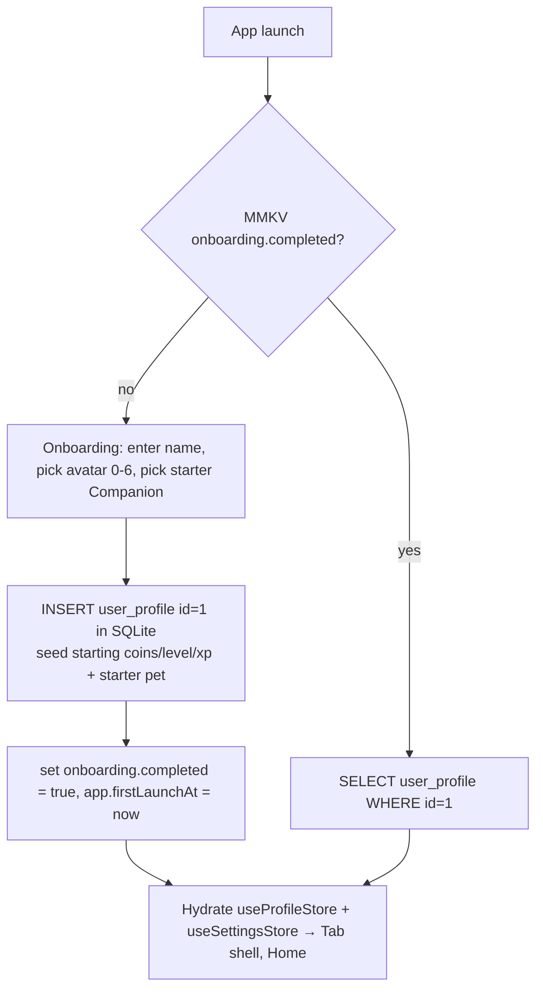
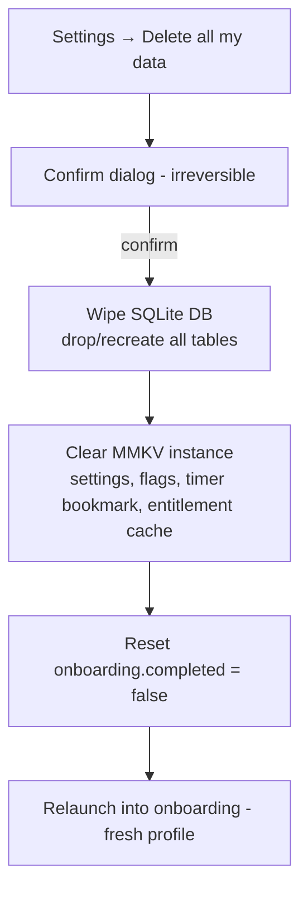

# Account & Profile

> How the legacy multi-user, server-authenticated **account** collapses into a single **local profile** on-device, and the profile/settings/data-management surface the rebuild must build [NEW] that the legacy app never had.

**Status vs legacy:** [DROP] the entire legacy identity stack — accounts, JWT sessions, AES-encrypted passwords, the 4-digit email-verification flow, password reset/change, and Google Sign-In. [CHANGE] "account" collapses to **one local profile**: a display name + an avatar `profile_index`, plus the single SQLite `user_profile` row that also holds coins/level/xp (those counters are owned by [coin-economy-and-shop](../coin-economy-and-shop/SKILL.md) and [gamification-xp-levels](../gamification-xp-levels/SKILL.md), not here). [NEW] build the profile-edit screen, a real Settings screen, notification preferences, and data reset / export / delete-all — none of which existed in legacy. Optional future cloud login is explicitly **out of scope** for the MVP [DECIDE].

## What it is

In legacy, **identity was mandatory and fully server-backed**. You could not use the app without an account: email/password register → 4-digit email-code verification → login (or Google Sign-In), all minting a JWT stored in `flutter_secure_storage`. Every gameplay entity (`task`, `pet`, `playerFood`, `wardrobe`, `membership`, `purchases`, XP/level) was keyed by `userid` on the Go/Postgres backend (legacy: `Pawductivity_BE/cmd/main.go:68-116`, `internal/controllers/auth.controller.go`).

The rebuild is **100% local-first and single-user**. There is no server, no login, and no `userid`. Identity is a **single `user_profile` row** (`id = 1`) in expo-sqlite, created instantly during onboarding, carrying a display name, an avatar `profile_index`, and the coins/level/xp counters. Everything the legacy auth stack did either **disappears** (JWT, passwords, email, tokens) or **collapses to a local row read** (get/update/delete "the" user).

Canonical vocabulary ([01-glossary.md](../../../context/01-glossary.md)): the tier label is **Membership class** (`basic`/`premium`) and what it grants is an **Entitlement** — both owned by [premium-and-monetization](../premium-and-monetization/SKILL.md), not this skill. This skill owns **the profile** (name + avatar) and **the settings/data-management surface**.

The legacy profile surface was almost entirely broken or absent:

- `ProfilePage` (bottom-nav tab 4) exposed `onEditProfile`, `onExplorePremium`, and `onReferAndEarn` as **empty `() {}` no-ops** — editing your profile, reaching Premium, and reaching Referral were all dead from Profile (legacy: `user/presentation/pages/profile.dart`, `.../widgets/profile_widget/profile_navigation.dart`).
- **The only working profile mutation was the avatar** — `PATCH /api/user/profile` (`updateProfileIndex`), choosing avatar `profile_index` 0–6 (legacy: `routes/users.route.go:139`, `widgets/profile_widget/profile_picture.dart:81-88`).
- There was **no Settings screen, no edit-name UI, and no delete-account UI anywhere**, despite the backend exposing `DELETE /api/user` and the website Privacy Policy promising a data-deletion right (legacy: `navigation-map.md §5`; `Pawductivity-Website/pages/privacy-policy/index.tsx:84-87`).
- "Logout" merely deleted the `auth_token` key (legacy: `profile.dart`).

So the rebuild both **deletes** a large surface and **builds a net-new** one.

## Core business rules

Legend — Tag per change-tags: [PRESERVE] / [CHANGE] / [NEW] / [DROP] / [DECIDE].

| # | Rule | Tag | Source |
|---|------|-----|--------|
| 1 | Identity = exactly **one** local profile: SQLite `user_profile` row, `id = 1` (`CHECK (id = 1)`). No `userid` on any other table; no multi-user, no account. | [CHANGE] | sqlite-schema.md §4; backend-to-local-first.md §2 |
| 2 | Profile fields owned here: `display_name` (default `'Me'`), `avatar` (default `'default.png'`, legacy `users.userimage`), `profile_index` (INTEGER, default `0`). | [CHANGE] | user.model.go:12,19; sqlite-schema.md §4 |
| 3 | The same `user_profile` row also **holds** `coins` (default 200 [DECIDE]), `level` (default 1), `current_xp` (default 0), `needed_xp` (default 160). This skill does not own their math — see coin-economy / gamification. | [CHANGE] | sqlite-schema.md §4 |
| 4 | Avatar selection: `profile_index` ∈ **0–6** (7 bundled avatars `assets/profile/0.png`…`6.png`, plus `default.png`). Legacy's single working profile write. | [PRESERVE] concept | profile_picture.dart:81-88; users.route.go:152 |
| 5 | Display name is **free-text, local, editable** (was write-once at register + read-only in-app; edit was a dead no-op). | [CHANGE] | navigation-map.md §5 |
| 6 | Profile row is **created during onboarding** on first launch (no network round-trip). Gate on MMKV `onboarding.completed`. | [NEW] | state-and-mmkv.md §3b; navigation-map.md §9 |
| 7 | JWT (HS256, hardcoded secret literal `"secret"`, claims `{id,email,exp}`, `exp = now+744h`) — **deleted**. No tokens, no auth gate. | [DROP] | jwtMiddleware.go; backend-api-catalog.md §1 |
| 8 | AES-CBC password transport + bcrypt storage — **deleted**. **Never store a password** (legacy persisted the plaintext password on-device under key `password` — a bug to never repeat). | [DROP] | decrypt.utils.go; state-and-mmkv.md §2 |
| 9 | Email-verification flow (4-digit code, 15-min TTL, Hostinger SMTP), `POST /verify` + `POST /register` — **deleted**. No email to prove ownership of locally. | [DROP] | users.controller.go; backend-api-catalog.md §1 |
| 10 | Password reset/change (`/reset-password`, `/change-password`) — **deleted** (no passwords). | [DROP] | auth.controller.go |
| 11 | Google Sign-In (`/google-sign-in`, upserts by email, empty-password accounts) — **deleted for MVP**; only revisit if cross-device sync becomes a confirmed requirement. | [DROP] MVP / [DECIDE] | goauth_api_service.dart; 02-open-decisions.md D2 |
| 12 | IDOR/bulk endpoints (`GET /api/users` lists ALL users; `/api/user/:id`, `/api/user/level/:id` trust the path id over identity; no admin role) — **gone**, collapse to a single local row read. | [DROP] | backend-api-catalog.md §2; known-bugs-and-antipatterns.md |
| 13 | A **Settings screen** exists (theme, sound, haptics, notification prefs, locale). Legacy had none. | [NEW] | navigation-map.md §5,§9; state-and-mmkv.md §3a |
| 14 | **Notification preferences** gate locally-scheduled notifications: `settings.notif.remindersEnabled`, `settings.notif.timerEnabled` (default `true`). | [NEW]/[CHANGE] | state-and-mmkv.md §3a |
| 15 | **Data reset / delete-all** wipes the MMKV instance **and** the SQLite DB, honoring the Privacy Policy's "delete your personal data … from within the Service" promise the legacy app never implemented. | [NEW] | state-and-mmkv.md §7; privacy-policy/index.tsx:84-87 |
| 16 | **Data export** (local JSON of all on-device data) so reinstall/device-change isn't total loss (no accounts, no cloud). | [NEW] | 02-open-decisions.md D31 |
| 17 | Optional device-level app lock via **expo-local-authentication** (biometric/passcode) is a UI gate, **not an account**. Off by default. | [DECIDE] | backend-to-local-first.md §2 |

### Legacy `users` row → local `user_profile` (field-by-field)

| Legacy `users` column | Legacy default | Rebuild | Tag | Owner |
|---|---|---|---|---|
| `id` | SERIAL | `id INTEGER PK CHECK (id = 1)` | [CHANGE] | this skill |
| `name` | — | `display_name TEXT NOT NULL DEFAULT 'Me'` — now editable | [CHANGE] | this skill |
| `email` | — | **dropped** (no accounts) | [DROP] | — |
| `password` | — | **dropped** (never store a password) | [DROP] | — |
| `userimage` | `'default.png'` | `avatar TEXT NOT NULL DEFAULT 'default.png'` | [CHANGE] | this skill |
| `profile_index` | `0` | `profile_index INTEGER NOT NULL DEFAULT 0` (avatars 0–6) | [PRESERVE] concept | this skill |
| `coins` | `0` (200 via signup grant) | `coins INTEGER … DEFAULT 200 CHECK (coins >= 0)` [DECIDE] | [CHANGE] | coin-economy |
| `level` | `1` | `level INTEGER … DEFAULT 1` | [PRESERVE] | gamification |
| `current_xp` | `0` | `current_xp INTEGER … DEFAULT 0` | [PRESERVE] | gamification |
| `needed_xp` | `150` (curve yields 160) | `needed_xp INTEGER … DEFAULT 160` (fixed) | [CHANGE] | gamification |
| — | — | `created_at` / `updated_at` epoch-ms | [NEW] | this skill |

> `coins`/`level`/`current_xp`/`needed_xp` physically **live in this row** but their rules, seed values, and reward math are decided in the coin-economy and gamification skills. This skill only reads/renders them and owns the row's lifecycle.

## Data & entities

Profile identity is split across two stores per the local-first layering ([state-and-mmkv.md](../../../context/data-model/state-and-mmkv.md)):

- **SQLite `user_profile`** (durable, authoritative for identity + counters). The full DDL lives in [sqlite-schema.md §4](../../../context/data-model/sqlite-schema.md).
- **MMKV `settings.*` + onboarding flags** (preferences and first-run state), hydrated into `useSettingsStore` / `useProfileStore` (Zustand).

Settings keys (MMKV, from state-and-mmkv.md §3a–§3b):

| Key | Type | Default | Tag |
|---|---|---|---|
| `settings.theme` | `'light' \| 'dark' \| 'system'` | `'system'` (legacy was light-only) | [NEW] |
| `settings.soundEnabled` | boolean | `true` | [NEW] |
| `settings.hapticsEnabled` | boolean | `true` | [NEW] |
| `settings.notif.remindersEnabled` | boolean | `true` — gates reminder notifications | [CHANGE] |
| `settings.notif.timerEnabled` | boolean | `true` — gates the ongoing focus-session notification | [CHANGE] |
| `settings.locale` | string | device | [DECIDE] |
| `onboarding.completed` | boolean | `false` — gates first-run profile+pet creation | [NEW] |
| `app.firstLaunchAt` | number (epoch ms) | set once | [NEW] |

Zustand slices ([state-and-mmkv.md §4](../../../context/data-model/state-and-mmkv.md)): `useProfileStore` (name, avatarIndex, coins, level, currentXp, neededXp, streak — source of truth **SQLite `user_profile`**) and `useSettingsStore` (theme/sound/haptics/notif/locale — source of truth **MMKV `settings.*`**).

Legacy `flutter_secure_storage` account keys and their fate ([state-and-mmkv.md §2](../../../context/data-model/state-and-mmkv.md)): `auth_token` → [DROP]; `email` → [DROP]; `password` (plaintext!) → [DROP]; `name` → [CHANGE] relocate to `user_profile.display_name`. **No `email`/`password`/`auth_token` keys exist in the rebuild — their absence is intentional.**

Deleted legacy backend tables tied to identity: `membership` → MMKV entitlement cache (premium skill); `verification` (email OTP) → [DROP]; `orders`/`subscription`/`archived_subscription` → [DROP]/IAP; `referral`/`referral_user` → [DECIDE] (referral skill). See [sqlite-schema.md §2](../../../context/data-model/sqlite-schema.md).

## Key flows

### 1. First launch → local profile (replaces the JWT auth gate)

Legacy cold start was an auth gate: the splash fetched `/api/user` with the stored JWT and routed to the tab shell on success or **RegisterPage** on failure (legacy: `main.dart`; navigation-map.md §1). The rebuild replaces this with a **local profile gate** — no splash round-trip, no login.

- No `GetUserInfo` network call, no `auth_token` read, no RegisterPage. [DROP] the whole gate.
- Onboarding (pet selection + notification priming) is [NEW] — legacy had no onboarding (`welcome.dart` was dead). See [navigation-and-app-shell](../navigation-and-app-shell/SKILL.md) and [notifications-and-permissions](../notifications-and-permissions/SKILL.md).

### 2. Edit profile (name + avatar) — [NEW] wiring of a [PRESERVE] concept

1. From Profile tab → Settings/Edit (the legacy `onEditProfile` no-op becomes a real screen).
2. Edit `display_name` (free text) → `UPDATE user_profile SET display_name = ?, updated_at = now WHERE id = 1`; re-read into `useProfileStore`.
3. Pick avatar from the 7-avatar grid (ids 0–6) → `UPDATE user_profile SET profile_index = ?, avatar = ? WHERE id = 1`. This is the local analogue of the only working legacy write (`PATCH /api/user/profile`).

### 3. Settings + notification preferences — [NEW]

- Settings screen writes straight to MMKV `settings.*` via `useSettingsStore`.
- `settings.notif.remindersEnabled` / `timerEnabled` are read before scheduling any local notification — a user who disables them suppresses reminder / focus-session notifications without an OS-permission change. See [notifications-and-permissions](../notifications-and-permissions/SKILL.md) and [reminders-and-calendar](../reminders-and-calendar/SKILL.md).

### 4. Data reset / delete-all — [NEW], honors the Privacy Policy

The website Privacy Policy states the user has "the right to delete … Personal Data" and that "Our Service may give You the ability to delete certain information about You from within the Service" (legacy: `privacy-policy/index.tsx:84-87`). Legacy shipped a `DELETE /api/user` endpoint but **no UI ever called it** — the promise was unmet. The rebuild must deliver it locally.

- Because there is no server copy, deleting locally **is** full deletion — the strongest possible fulfillment of the deletion right. See [state-and-mmkv.md §7 "Clear-on-reset"](../../../context/data-model/state-and-mmkv.md).
- Entitlement/IAP note: a wipe clears the cached premium flag but does **not** revoke a store subscription; a subsequent **Restore Purchases** re-establishes premium. See [premium-and-monetization](../premium-and-monetization/SKILL.md).

### 5. Data export — [NEW]

- "Export my data" serializes all SQLite tables + relevant MMKV settings to a local JSON file (via expo file-system / share sheet). Complements delete-all as the reinstall-survival path in a no-account, no-cloud app (02-open-decisions.md D31). Import/restore is the inverse. [DECIDE] exact format/versioning.

## Local-first rebuild guidance

| Legacy piece | Rebuild | Tag |
|---|---|---|
| JWT session (`"secret"` HS256), auth middleware, auth gate on cold start | Nothing — single local profile, no tokens, no gate | [DROP] |
| AES password transport + bcrypt + on-device plaintext `password` key | Nothing — never store a password | [DROP] |
| Email verification (4-digit OTP, SMTP), `/verify` + `/register` | Instant local profile creation in onboarding | [DROP] |
| Password reset / change | Nothing (no passwords) | [DROP] |
| Google Sign-In | Only if cloud sync is later adopted; not in MVP | [DROP] MVP / [DECIDE] |
| `GET /api/user` / `/api/user/:id` (IDOR) | `SELECT user_profile WHERE id = 1` | [CHANGE] |
| `PUT /api/user` (IDOR) | `UPDATE user_profile … WHERE id = 1` | [CHANGE] |
| `PATCH /api/user/profile` (avatar) | Local avatar update (`profile_index` 0–6) | [PRESERVE] concept |
| `DELETE /api/user` (existed, never called from UI) | Local **delete-all** (wipe SQLite + MMKV) — honors Privacy Policy | [NEW] |
| `GET /api/users` (list all), admin/bulk routes | Gone — single user | [DROP] |
| `GET /api/user/coins`, `/api/user/level` | Local reads of the `user_profile` row (owned by coin-economy / gamification) | [CHANGE] |
| Logout = delete `auth_token` | No session to end; there is no logout (only delete-all) | [DROP] |
| Profile no-ops (`onEditProfile`/`onExplorePremium`/`onReferAndEarn`) | Real edit-profile, Premium entry, and referral entry (per each skill) | [NEW] |
| (none — no settings/onboarding existed) | Settings screen, notification prefs, onboarding, data export | [NEW] |

## New-app enhancements

- **Real Settings screen** [NEW]: theme (incl. the dark mode legacy lacked), sound, haptics, notification toggles, locale — all MMKV-backed and instant.
- **Delete-all + export** [NEW]: turns the previously-unmet Privacy Policy deletion right into a first-class, one-tap feature, and gives a no-account app a reinstall-survival story.
- **Streak on the profile** [NEW]: `useProfileStore` carries a `streak` counter (glossary §5, no legacy equivalent) surfaced on the profile/home header.
- **Optional biometric app-lock** [DECIDE] via expo-local-authentication — a privacy nicety, explicitly not an account.

## Open decisions

- **[DECIDE] Accounts at all (D1).** Recommended: local anonymous profile by default; any account is optional and only for future cloud backup/sync. Ship single-device first.
- **[DECIDE] Cloud sync / backup (D4).** Optional, off by default. Determines whether **any** identity concept (and thus Google/Apple sign-in, D2) ever returns. If adopted, it must be a deliberately-designed new auth model — **never** the legacy `"secret"` JWT stack. Out of scope for MVP.
- **[DECIDE] Social sign-in (D2/D3).** Only relevant if D4 = yes. Note App Store requires Sign in with Apple if any third-party social login ships. Email/password + OTP reset stay dropped regardless (D3).
- **[DECIDE] Starting profile state.** `coins` default 200 (legacy `buy_coins`-misuse grant) + a free starter Companion — intended? Confirm the deliberate starting inventory (owned by coin-economy; rolls up to 02-open-decisions D12).
- **[DECIDE] Avatar set.** Preserve the 7 legacy avatars (0–6) as-is, or refresh/expand the art? Keep `profile_index` as the stable key either way.
- **[DECIDE] Device app-lock.** Ship optional biometric/passcode lock, or omit for v1?
- **[DECIDE] Export/import format** (D31): JSON shape, schema-version stamping, and whether import merges or replaces.
- **[DECIDE] Analytics on the profile surface** (D30): drop Amplitude entirely vs strictly opt-in — affects what, if anything, the profile/settings screen exposes about tracking.

## Legacy references

- App (profile UI + the only working write): `Pawductivity_App/lib/features/user/presentation/pages/profile.dart`, `.../pages/profile_old.dart` (dead dup — [DROP]), `.../widgets/profile_widget/profile_navigation.dart`, `.../widgets/profile_widget/profile_picture.dart` (avatars 0–6)
- App (auth cluster — all [DROP]): `.../pages/auth/{login,register,verification,forgot_password,welcome}.dart`, `.../request_code.dart`, `.../data/data_sources/remote/goauth_api_service.dart`, `.../domain/usecases/{register_user,login_user,verification_user,forgot_password,change_password,google_oauth}.dart`
- App (identity state on device): `.../bloc/user/remote/remote_auth_bloc.dart` (persisted `auth_token`/`email`/`password`/`name`), `lib/main.dart` (JWT auth gate)
- App (profile model / avatar write): `.../data/model/user.dart`, `.../data/repository/user_repository_impl.dart:236-245` (`updateProfilePicture`)
- Backend (identity/profile — all [DROP]/[CHANGE]): `Pawductivity_BE/internal/middleware/jwtMiddleware.go` (secret `"secret"`), `internal/controllers/auth.controller.go`, `internal/controllers/users.controller.go`, `internal/repository/user.repository.go` (`GetUser`, `UpdateProfileIndex`, IDOR), `internal/utils/decrypt.utils.go` (AES), `routes/auth.route.go`, `routes/users.route.go`
- Backend (user schema): `database/migration/model/user.model.go` (`userimage` default `'default.png'`, `profile_index` default 0), `database/script/pawductivity.sql:4-11`
- Website (the deletion promise): `Pawductivity-Website/pages/privacy-policy/index.tsx:84-88` ("Delete Your Personal Data")

## Related

- [local-first-data-layer](../local-first-data-layer/SKILL.md) — the SQLite/MMKV/Zustand split the profile lives across; delete-all wipes both stores
- [premium-and-monetization](../premium-and-monetization/SKILL.md) — Membership class / Entitlement is device-scoped; there is no account to attach it to, and delete-all vs Restore Purchases interplay
- [navigation-and-app-shell](../navigation-and-app-shell/SKILL.md) — the local-profile gate replaces the JWT auth gate; Profile tab → Settings; onboarding
- [coin-economy-and-shop](../coin-economy-and-shop/SKILL.md) — owns `coins` (the profile row holds it) and the starting-balance decision
- [gamification-xp-levels](../gamification-xp-levels/SKILL.md) — owns `level`/`current_xp`/`needed_xp` and the streak
- [referral-system](../referral-system/SKILL.md) — the dead `onReferAndEarn` entry; referral needs identity, so it is [DECIDE]/deferred
- [notifications-and-permissions](../notifications-and-permissions/SKILL.md) — the notification-preference toggles gate scheduling
- [`context/data-model/sqlite-schema.md`](../../../context/data-model/sqlite-schema.md) — `user_profile` DDL
- [`context/data-model/state-and-mmkv.md`](../../../context/data-model/state-and-mmkv.md) — settings keys, secure-storage audit, clear-on-reset
- [`context/legacy/navigation-map.md`](../../../context/legacy/navigation-map.md) — dead profile actions, missing settings/delete UI
- [`context/migration/backend-to-local-first.md`](../../../context/migration/backend-to-local-first.md) — auth deletion rationale
- [`context/02-open-decisions.md`](../../../context/02-open-decisions.md) — identity/privacy decisions D1–D4, D30–D32 roll up here
