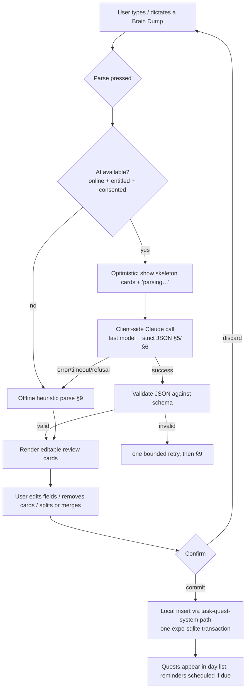
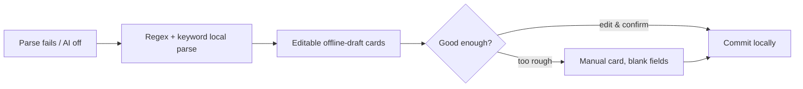

# Brain Dump Parser

> **⚠️ Scope — optional Phase-2, NOT in the FE-only MVP.** The MVP ships the Brain Dump **capture surface with a rules-based/heuristic parser** (on-device, no network, no API key). The **LLM (Claude) parser described below is the Phase-2 enhancement**, gated behind **BYO-key or a thin proxy** because a client can't safely hold an Anthropic key and the text leaves the device (see §7 and [`03-fe-only-gap-analysis §3.1`](../../../context/03-fe-only-gap-analysis.md), D22–D25). The capture UX and the output **schema are identical** for both paths — build the rules parser first behind an interface, drop the LLM in later. Everything must work fully with AI off.

> A **Brain Dump** is the app's single capture surface: free text (typed or dictated) that the **Parser** turns into one or more structured **Quests** via a client-side **Claude** call. It exists so the user never fills out a form — they dump a thought, review the AI's proposal, and confirm. The Quest data model, quest kinds, reward math, and the local insert path all belong to [task-quest-system](../task-quest-system/SKILL.md); this skill owns **the capture UX, the prompt, the model call, the output contract, and the offline/error fallbacks** that feed that model.

Canonical vocabulary only: **Brain Dump**, **Parser**, **Quest**, **Quest kind** (Target / Checklist / Focus), **Tag**, **Coins**, **Local-first** ([glossary §4](../../../context/01-glossary.md)). "Task" is a legacy-only noun; the user-facing unit is a **Quest**.

**Status vs legacy:** entirely **[NEW]**. The legacy app had **no NLP, no AI, and no parse feature anywhere** — a source scan of `old/` found zero LLM usage ([02-open-decisions §6](../../../context/02-open-decisions.md), D22–D25). The Brain Dump also **[NEW]-replaces** the legacy manual multi-field create form (`new_task_form.dart`), whose full behavior is documented in [task-quest-system Flow 1](../task-quest-system/SKILL.md). The Parser must reproduce that form's *output*, not its UX.

---

## 1. TL;DR — the rebuild rules

| # | Rule | Tag |
|---|---|---|
| R1 | **One capture box, no form.** Free text or voice → `[Parse]` → a **review sheet** of proposed Quests. The manual multi-field form is replaced, not offered as the default. | **[NEW]** |
| R2 | **The Parser emits strict JSON only** — validated against the schema in §5, which is a superset of the legacy `TaskTemplateEntity` shape the [task model](../task-quest-system/SKILL.md) consumes. Never free-form prose. | **[NEW]** |
| R3 | **Nothing commits without confirmation.** The AI output is a *proposal*; the user reviews/edits an editable card, then commits. Parsing and persisting are two separate steps. | **[NEW]** |
| R4 | **Optimistic UI, graceful OFFLINE fallback.** The call is client-side and can fail (offline, rate limit, refusal, timeout). On failure the app degrades to a **regex/heuristic local parse**, and finally to a **manual form** — never a dead end. | **[NEW]** |
| R5 | **Fast model, streaming, low effort.** Use a fast Claude model with `output_config.format` (structured outputs) — capture is latency-sensitive and the schema is small. See §6. | **[NEW]** |
| R6 | **The Parser proposes; the economy computes.** The Parser never invents a Coin reward — Coins/XP are computed on completion by [task-quest-system](../task-quest-system/SKILL.md)'s reward transaction. A `reward` field must never appear in the schema. | **[NEW]** |
| R7 | **Respect the task-model invariants.** `estimatedTime` in **seconds**; `repetition` a `bool[7]` mask **index0 = Sunday**; titles/descriptions ≤ **50 chars**; legacy DB floor was `estimatedTime > 600` (10 min) — carry or drop is **[DECIDE]** (see §8). | **[NEW]** / **[DECIDE]** |
| R8 | **Client-side key is a liability.** A raw Anthropic API key cannot ship in an app binary. The transport (proxy vs. BYO-key vs. deferred) is an open decision — see §7 and D24/D25. | **[DECIDE]** |

---

## 2. What the Brain Dump is (scope)

- A **persistent capture affordance** (a "＋ / dump" box, ideally reachable from anywhere — see [navigation-and-app-shell](../navigation-and-app-shell/SKILL.md)). The user types or dictates **one or many quests in one breath**.
- **Voice** is speech-to-text on device (Expo speech / OS dictation) that fills the same text box — the Parser only ever sees text. Mic permission is just-in-time ([notifications-and-permissions](../notifications-and-permissions/SKILL.md), D29).
- The Parser turns that text into **1..N proposed Quests**, each an editable card, which the user confirms into the local store.
- **In scope:** capture UX, the prompt design, the Claude call + model choice, the strict-JSON output contract, optimistic/offline fallback, error handling, confirm-before-commit.
- **Out of scope (owned elsewhere):** the Quest data model, quest kinds, completion, reward math → [task-quest-system](../task-quest-system/SKILL.md); the Focus timer → [focus-timer-and-background](../focus-timer-and-background/SKILL.md); reminder scheduling → [reminders-and-calendar](../reminders-and-calendar/SKILL.md); the local insert transaction → [local-first-data-layer](../local-first-data-layer/SKILL.md); the Claude SDK/model reference → [claude-api](#related).

> **[DECIDE] AI as a phase-2, opt-in, possibly Premium feature.** D22 recommends AI in a later phase, opt-in; D25 recommends gating cloud AI behind **Premium** ([premium-and-monetization](../premium-and-monetization/SKILL.md)). When AI is off/locked/unavailable, the capture box still works via the **offline heuristic parse** (§9) — the feature degrades, it never disappears.

---

## 3. End-to-end flow



**The two-step contract (R3):** *Parse* (text → proposal) and *Commit* (proposal → local store) are distinct. The Claude call happens only in the Parse step; the Commit step is pure local SQL and must succeed offline.

---

## 4. Capture UX & confirm-before-commit

| Stage | Behavior | Tag |
|---|---|---|
| **Capture** | Single multi-line text box + mic button. Placeholder shows an example dump. Submit on a `[Parse]` action, not on every keystroke. | [NEW] |
| **Optimistic parse** | Immediately render N greyed **skeleton cards** (N guessed from sentence/clause count) with a "parsing…" shimmer, so the UI feels instant while the call is in flight (R4). | [NEW] |
| **Review** | Each proposed Quest is an **editable card**: title, kind, target+unit (if any), category+icon, due date/time, priority, estimated time, recurrence. Every field is user-overridable — the AI is a first draft. | [NEW] |
| **Edit** | User can fix any field, **delete** a card, **split** one card into two, or **merge**. Low-confidence fields are visually flagged (see `_confidence` in §5). | [NEW] |
| **Confirm** | An explicit **Confirm / Add** commits all remaining cards in **one local transaction** ([local-first-data-layer](../local-first-data-layer/SKILL.md)). Nothing is written before this. | [NEW] |
| **Undo** | A short-lived **Undo** after commit (local delete of the just-inserted rows) covers a bad batch. | [NEW] |

> **Why confirm-before-commit is non-negotiable:** the model can mis-date ("Friday" → wrong week), mis-scope ("2h" → 7200 s vs a checklist), hallucinate a recurrence, or split one intent into several. A silent auto-commit would pollute the day list and the [analytics](../analytics-and-insights/SKILL.md) aggregates. Review is the correctness gate.

---

## 5. Output schema (the contract)

The Parser MUST return an object `{ "quests": [ Quest, … ] }` where each `Quest` validates against the JSON schema below. This is a **superset** of the legacy `TaskTemplateEntity` shape that [task-quest-system](../task-quest-system/SKILL.md) already mandates (`taskName, taskDescription, estimatedTime, dueDate, taskTag, repetition, isOnce`) — the extra fields (`kind`, `target`, `icon`, `dueTime`, `priority`) are the rebuild's [NEW] enrichments and each maps to an open decision.

```jsonc
// Parser output — strict JSON, enforced via output_config.format (§6)
{
  "quests": [
    {
      "title":        "Finish physics essay",   // string ≤50  → tasks.taskName [PRESERVE shape]
      "description":  "",                        // string ≤50, may be "" → tasks.taskDescription
      "kind":         "Focus",                   // "Target" | "Checklist" | "Focus" — glossary §4 [NEW]/[DECIDE]
      "target":       null,                      // { "value": number, "unit": string } | null — numeric goal, e.g. {value:5,unit:"km"} [NEW]/[DECIDE]
      "estimatedTime": 7200,                     // integer SECONDS. "~2h" → 7200. null if not a timed quest [PRESERVE unit]
      "category":     "School",                  // one of the known Tags, else inferred → tasks.taskTag [CHANGE/DECIDE]
      "icon":         "book",                    // suggested category icon token [NEW]
      "dueDate":      { "year": 2026, "month": 7, "day": 17 }, // or null; not in the past [PRESERVE]
      "dueTime":      "18:00",                    // "HH:MM" 24h | null — legacy had date only [NEW]
      "priority":     "normal",                   // "low" | "normal" | "high" | null — no legacy field [NEW]/[DECIDE]
      "repetition":   [false,false,false,false,false,true,false], // bool[7], INDEX0 = SUNDAY [PRESERVE, mind the off-by-one]
      "isOnce":       true,                       // = !repetition.contains(true); derivable [PRESERVE]
      "_confidence":  0.9                         // 0..1, parser self-rating; drives the "please check" flag, never persisted
    }
  ]
}
```

### Field → task-model mapping

| Schema field | Maps to | Rule / source |
|---|---|---|
| `title` | `tasks.taskName` | ≤50 chars, required. Truncate/flag if longer (`task.model.go:13-14`). |
| `description` | `tasks.taskDescription` | ≤50 chars, may be empty. |
| `kind` | Quest kind discriminator | Target / Checklist / Focus ([glossary §4](../../../context/01-glossary.md)). Legacy shipped only the timed kind; **Checklist is [NEW]** and its completion rule is **[DECIDE]** (see [task-quest-system](../task-quest-system/SKILL.md)). |
| `target` | numeric goal (`{value, unit}`) | **[NEW]** — no legacy field. For "jog 5 km" / "read 30 pages". [DECIDE] whether targets are first-class or folded into `estimatedTime`. |
| `estimatedTime` | `tasks.estimatedTime` | **Seconds.** Parse durations ("~2h" → 7200, "45 min" → 2700). Legacy DB floor `CHECK (estimatedTime > 600)` = 10 min (`task.model.go:15`, `pawductivity.sql:36`) — **[DECIDE]** keep the floor (§8). |
| `category` | `tasks.taskTag` | Legacy known set `["Work","School","Personal","Project A","Sport"]`, default **School** (`new_task_tags.dart:17`, `new_task_form.dart:36`). **[CHANGE/DECIDE]** whether the AI may invent new tags (D-tags). |
| `icon` | (new) category icon | **[NEW]** — a display token so AI-inferred categories render with a glyph. |
| `dueDate` | `tasks.dueDate` | `{year,month,day}` or epoch. **Not in the past** (legacy form rule). Recurring quests: this is the recurrence *range end* — legacy semantics, [DECIDE] (see [task-quest-system](../task-quest-system/SKILL.md)). |
| `dueTime` | reminder time | **[NEW]** — legacy tasks had date only; time drives [reminders-and-calendar](../reminders-and-calendar/SKILL.md) scheduling. |
| `priority` | (new) ordering | **[NEW]/[DECIDE]** — legacy had no priority (D-priority; task-quest-system rule 16). |
| `repetition` | `tasks.repetition` | `bool[7]` weekday mask, **index0 = Sunday**. From phrases ("every weekday" → Mon–Fri true; "MWF"). Index by JS `Date.getDay()` to avoid the Postgres `DOW+1` off-by-one (task-quest-system rule 9). |
| `isOnce` | derived | `= !repetition.contains(true)`. Recompute locally; don't trust the model. |
| `_confidence` | — | Parser self-rating; UI-only, **never persisted**. Low values flag the card "please check". |
| ~~`reward`~~ | **forbidden** | R6 — the economy computes Coins on completion. The schema must have **no reward field** (legacy `reward`/`isNoLimit` were vestigial anyway). |

> **[DECIDE] Schema scope.** The strict output surface should be exactly what the local insert path consumes plus review affordances. Every [NEW] field above (`kind` beyond timed, `target`, `icon`, `dueTime`, `priority`) is gated on an open decision in [task-quest-system](../task-quest-system/SKILL.md) / [02-open-decisions](../../../context/02-open-decisions.md); ship the schema incrementally as those land, but keep the legacy-shape core (`title/estimatedTime/dueDate/category/repetition/isOnce`) stable so the [task model](../task-quest-system/SKILL.md) always receives a valid Quest.

---

## 6. The Claude call

The Parser is a **single-LLM-call, structured-extraction** task — the simplest tier ([claude-api](#related)). Use the Anthropic SDK (or a thin proxy that fronts it), not raw prompt-string parsing.

**Model choice — a fast Claude model.** Capture is latency-sensitive, the schema is small, and the task (NL → structured JSON) is well within a fast model's ability:

| Model | Model ID | When | Notes |
|---|---|---|---|
| **Claude Haiku 4.5** | `claude-haiku-4-5` | **Default.** Fast, cheap ($1/$5 per 1M), supports **structured outputs** (`output_config.format`). | Best latency/cost for the common case (a one- or two-quest dump). |
| Claude Sonnet 5 | `claude-sonnet-5` | Escalation for long/ambiguous multi-quest dumps or when Haiku's `_confidence` is low. | Higher quality at higher cost/latency; opt-in, not the default. |

> Confirm the exact current model IDs, pricing, and structured-output support against the **claude-api** reference at build time (model lineup drifts). Do **not** hardcode a model string from memory.

**Request shape (conceptual — Python-flavored):**

```jsonc
// client.messages.create(...)  — fast model, strict JSON, low effort, streamed
{
  "model": "claude-haiku-4-5",
  "max_tokens": 1500,                 // small: N quests × a compact object
  "system": "<parser system prompt — §6 outline>",
  "output_config": {
    "format": { "type": "json_schema", "schema": { /* the §5 schema */ } }
  },
  "messages": [
    { "role": "user", "content": "<the raw brain-dump text> (today is 2026-07-14, Tuesday, tz Asia/Jakarta)" }
  ]
}
```

- **Strict JSON via `output_config.format`** (json_schema) guarantees a parseable, schema-shaped response — no prose, no code fences. Set `additionalProperties:false` and `required` on the schema. (`output_format` top-level is deprecated; use `output_config.format`.)
- **Stream** the response and take the final message — a small structured payload rarely needs it, but streaming keeps the call under SDK timeout defaults if `max_tokens` is ever raised.
- **Effort/thinking:** this is a fast, shallow extraction — keep effort low (or default); heavy reasoning is wasted latency here.
- **Inject the local clock + timezone** in the user turn (or system) so "Friday", "tomorrow", "every weekday" resolve correctly on device — the model has no ambient clock, and getting the date wrong is the top correctness risk.
- **Prompt caching:** the system prompt + schema are a stable prefix across every dump — cache them so repeated captures pay near-zero for the fixed part.

### Prompt-design outline (system prompt)

The system prompt is a stable, cacheable spec. It should:

1. **Role:** "You convert a user's free-text brain dump into structured Quests for a productivity app."
2. **Output rule:** emit **only** JSON matching the provided schema; one object per distinct intent; `{ "quests": [] }` if nothing actionable.
3. **Splitting:** one dump may contain several quests ("essay by Friday **and** jog every weekday" → two). Split on distinct intents, not on every clause.
4. **Duration → seconds:** map "2h"→7200, "half an hour"→1800, "45 min"→2700. If no duration and the quest isn't timed, `estimatedTime: null`.
5. **Kind inference:** timed/focus language ("study 2h", "focus", "pomodoro") → `Focus`; measurable count ("5 km", "30 pages") → `Target` with a `target`; a list of sub-items ("buy milk, eggs, bread") → `Checklist`. Default `Focus` when a duration is present, else `Target`.
6. **Dates relative to the injected clock:** resolve "Friday/tomorrow/next week"; **never emit a past date**; recurring → set `repetition` (index0=Sunday) and treat `dueDate` as the range end.
7. **Category:** prefer the known set `[Work, School, Personal, Project A, Sport]`; infer a sensible one otherwise (subject to the D-tags decision); default `School`.
8. **Priority:** infer from urgency words ("urgent", "ASAP" → high); else `normal`/`null`.
9. **Never invent a reward** (R6). **Never exceed 50 chars** on title/description. Set `_confidence` honestly.
10. **Few-shot examples** covering: single timed quest, a recurring quest, a multi-quest dump, a checklist, and an empty/non-actionable input.

---

## 7. Transport & key handling (client-side reality)

A React-Native/Expo binary **cannot safely embed a raw Anthropic API key** — it is extractable from the bundle. "Client-side call" therefore means one of:

| Option | Shape | Trade-off | Tag |
|---|---|---|---|
| **Thin proxy** | App → your minimal endpoint → Anthropic; key stays server-side; per-user rate limiting there. | Contradicts the strict "no backend / nothing leaves the device" stance ([00-product-vision](../../../context/00-product-vision.md)); needs the one server the rebuild otherwise avoids. | **[DECIDE]** |
| **BYO API key** | User pastes their own Anthropic key (stored in secure storage); calls go direct. | Truly local, zero backend, but high friction; niche. Matches D24 option (c). | **[DECIDE]** |
| **Premium-gated managed** | AI enabled only for Premium; billing/quota enforced via the store + a light entitlement check. | Ties AI cost to revenue (D25) but reintroduces a control surface. | **[DECIDE]** |

> **[DECIDE] (D24/D25).** The recommended defaults are cloud Claude behind an explicit per-feature **consent gate**, **Premium-gated** for cost. The exact transport (proxy vs BYO-key vs deferred to phase 2) is unresolved — surface it prominently; the schema, prompt, and fallback below are transport-agnostic. Whatever the choice, the brain-dump **text may leave the device only after explicit consent**, and the capture box must remain useful with AI off (§9).

---

## 8. Error handling

Every failure path lands the user on a usable review sheet or manual form — **never a spinner that never resolves** (R4).

| Failure | Detection | Handling |
|---|---|---|
| **Offline / no network** | Connectivity check before/around the call, or connection error. | Skip the call entirely → **offline heuristic parse** (§9). Badge the cards "offline draft — check details". |
| **AI disabled / not entitled** | Feature flag / Premium entitlement / consent not granted. | Same as offline: heuristic parse, with a one-line "enable AI parsing" affordance. |
| **Timeout** | Client deadline (~a few seconds — capture must feel snappy). | Cancel the request, fall back to §9; offer a "try AI again" button. |
| **Rate limit (429) / overloaded (529)** | SDK typed error / status. | One bounded backoff retry; if still failing → §9. Never spin indefinitely. |
| **Refusal** (`stop_reason: "refusal"`) | Check `stop_reason` **before** reading content. | Treat as "AI couldn't help" → §9; do not surface a scary error. (A brain dump is almost never policy-triggering, but guard the field access.) |
| **Invalid / non-conforming JSON** | Schema validation of the response fails. | One bounded re-ask (same input), then §9. `output_config.format` makes this rare but not impossible. |
| **Empty result** (`{"quests":[]}`) | Valid but zero quests. | Show "couldn't find a quest in that — edit below", drop into a single manual card pre-filled with the raw text as the title. |
| **Partial / low confidence** | Any `_confidence` below a threshold, or missing required field post-validation. | Render the card but **flag the weak fields** for review; require the user to confirm them. |

Use the SDK's **typed exceptions** (rate-limit vs auth vs connection vs 5xx), not string matching, and always inspect `stop_reason` before touching `content`.

---

## 9. Offline / heuristic fallback (the safety net)

When the AI path is unavailable or fails, a **local regex/keyword parser** produces a best-effort proposal so capture never blocks. It is deliberately simple and always followed by the same review sheet (§4).

**Heuristic rules (illustrative, local-only):**

| Signal | Extraction |
|---|---|
| Whole line | `title` = the line, trimmed to 50 chars; `description` = "". |
| Duration regex | `\b(\d+)\s?(h|hr|hour|m|min|minute)s?\b` → `estimatedTime` in seconds (else `null`). |
| Weekday words | "every weekday" → Mon–Fri; "MWF"; day names → set the `repetition` bool[7] (index0=Sunday). |
| Relative dates | "today / tomorrow / Friday / next week" → `dueDate` via local date math against the device clock. |
| Time regex | `\b(\d{1,2}):(\d{2})\b` or "6pm" → `dueTime`. |
| Category keywords | map obvious words ("gym/run"→Sport, "essay/class"→School, "meeting"→Work) → `category`, else default **School**. |
| Urgency words | "urgent/asap" → `priority: "high"`, else `normal`. |
| Kind | duration present → `Focus`; comma-separated list → `Checklist`; else `Target`. |

- The heuristic parser produces **one card per line** by default (it can't reason about multi-intent sentences as well as the model) — the user splits/merges in review.
- Its cards are visually marked as **offline drafts** so the user knows to check them.
- **Final fallback:** a "fill it in myself" affordance opens a **manual card** with all fields blank/defaulted — the legacy form's fields, minus the vestigial reward chip — so the user is never stuck. This manual card is also the accessibility path for anyone who prefers structured entry.



---

## 10. Rebuild checklist

- [ ] Single capture box (text + mic) reachable from the app shell; mic permission just-in-time.
- [ ] `[Parse]` triggers: optimistic skeleton cards → client-side Claude call (fast model, `output_config.format`, injected clock+tz, cached system prefix).
- [ ] Response validated against the §5 schema; `reward` field absent (R6); `isOnce` recomputed locally; `repetition` treated index0=Sunday.
- [ ] Review sheet: per-quest editable cards with split/merge/delete and low-confidence flags.
- [ ] **Confirm** commits all cards in **one** expo-sqlite transaction via the [task-quest-system](../task-quest-system/SKILL.md) insert path; short-lived Undo.
- [ ] Error matrix (§8) handled with typed SDK exceptions; `stop_reason` checked before reading content; bounded retries only.
- [ ] Offline/heuristic parser (§9) + manual-card final fallback — capture works with AI fully off.
- [ ] Transport/key decision (§7, D24/D25) resolved before shipping; consent gate before any text leaves the device.
- [ ] Exactly one capture surface; the legacy multi-field form is not the default entry point.

---

## Related

- [task-quest-system](../task-quest-system/SKILL.md) — **primary cross-link.** Owns the Quest data model, quest kinds, the output-schema contract the Parser must satisfy, the local insert path, and the reward math the Parser must not touch (R6).
- **claude-api usage** (the Anthropic SDK / Messages API reference skill) — model IDs & pricing, `output_config.format` (structured outputs), streaming, `stop_reason`/refusal handling, prompt caching, typed errors. **Consult it at build time for exact model strings and structured-output support** — do not answer from memory.
- [focus-timer-and-background](../focus-timer-and-background/SKILL.md) — a parsed `Focus` quest runs here.
- [reminders-and-calendar](../reminders-and-calendar/SKILL.md) — `dueDate`/`dueTime`/`repetition` drive local notification scheduling.
- [notifications-and-permissions](../notifications-and-permissions/SKILL.md) — just-in-time mic permission for voice capture.
- [local-first-data-layer](../local-first-data-layer/SKILL.md) — the single-transaction commit path for confirmed quests.
- [premium-and-monetization](../premium-and-monetization/SKILL.md) — Premium/entitlement gating for cloud AI (D25).
- [navigation-and-app-shell](../navigation-and-app-shell/SKILL.md) — where the capture affordance lives.
- [analytics-and-insights](../analytics-and-insights/SKILL.md) — why a bad auto-commit would corrupt aggregates (justifies R3).
- Naming authority: [glossary §4](../../../context/01-glossary.md) — Brain Dump, Parser, Quest, Quest kind, Tag.
- Open decisions roll-up: [02-open-decisions §6](../../../context/02-open-decisions.md) — D22 (add AI), D23 (use cases), D24 (on-device vs cloud/provider), D25 (cost gating).
