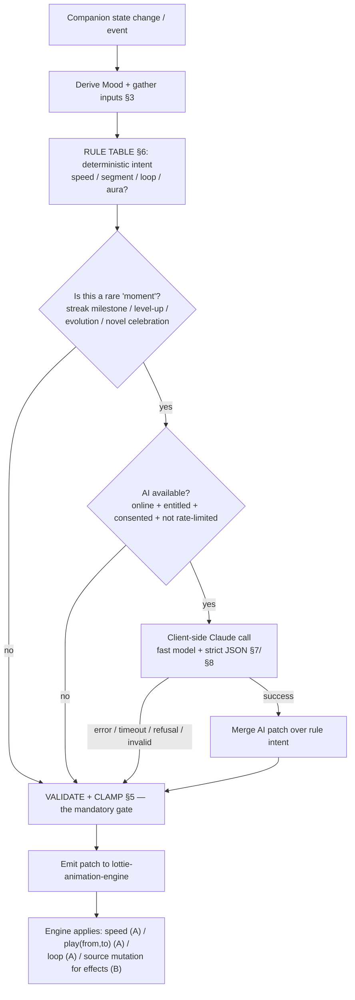

# AI Lottie Director

> **⚠️ Scope — the LLM layer is optional Phase-2, NOT in the FE-only MVP.** The MVP ships the **rules-based, deterministic director** (state → animation patch, on-device, no network) — which this skill already treats as the default path. The **client-side Claude call is the optional Phase-2 enhancement** for discrete "moments," gated behind BYO-key or a thin proxy (see [`03-fe-only-gap-analysis §3.1`](../../../context/03-fe-only-gap-analysis.md), D22–D25). Everything must work fully with AI off.

> The **AI Lottie Director** is the **decision layer** for the Companion's animation. It answers *"given the pet's current state and what just happened, what should the animation do?"* and emits a **small, strictly-validated JSON patch** — never a whole Lottie file. The **mechanism** that renders/recolors/segments the animation (props, `colorFilters`, `ref.play(from,to)`, source-JSON mutation, raster-vs-vector limits) is owned entirely by [lottie-animation-engine](../lottie-animation-engine/SKILL.md). The Companion domain — Health, Mood derivation, Evolution stage, Species — is owned by [pet-companion-system](../pet-companion-system/SKILL.md). The director sits **between** them: state in, animation intent out.

Canonical vocabulary only: **Companion**, **Species**, **Evolution stage**, **Health**, **Mood**, **Streak**, **Quest**, **Focus Session**, **XP/Level**, **Coins**, **Lottie**, **Local-first**, **Premium/Entitlement** ([glossary](../../../context/01-glossary.md)). Note: a Companion has an **Evolution stage**, never a "level" — Level is a *user* concept.

**Status vs legacy:** entirely **[NEW]**. The legacy app has **no AI, no NLP, and no state-driven animation whatsoever** — a source scan of `old/` found zero LLM usage, and the pet renderer was `Lottie.asset(path, fit: BoxFit.contain)` with autoplay + infinite loop, blind to Health/Mood/stage (legacy: `features/pet/presentation/widget/pet_list.dart:329`; [lottie-animation-engine R2](../lottie-animation-engine/SKILL.md)). Both the *decision layer* (this skill) and the *state-driven engine* it drives are net-new. Per [CLAUDE.md rule 3](../../../CLAUDE.md), the **rules-based director ships in the MVP**; the **LLM (Claude) layer is optional Phase-2** (BYO-key or thin proxy, no inference server we operate), never required for the app to function.

---

## 1. TL;DR — the rebuild rules

| # | Rule | Tag |
|---|---|---|
| R1 | **Rules-first, AI-optional.** A deterministic rule table maps state → animation intent and runs on **every** render, offline, for free. The Claude call is an **enhancement** layered on top for discrete "moments" — it is **never a dependency**. If AI is off/unreachable/errors, the pet still animates correctly. | **[NEW]** |
| R2 | **The director emits a small strict-JSON patch, never a Lottie file.** Output is a handful of validated fields (target layer + color, `speed`, `segment {from,to}`, `loop`, `aura`) that the engine applies via prop-channel A or a bounded source mutation (channel B). It must **never** return, or ask Claude to synthesize, a whole `.json` animation. | **[NEW]** |
| R3 | **Validate every field before it touches the engine.** Layer names checked against an allowlist, numeric values clamped to safe ranges, colors coerced to `[r,g,b,a]` 0–1, segments to `0..480`. An out-of-range or unknown field is dropped and the rule-based value is used instead. | **[NEW]** |
| R4 | **Prefer deterministic rules over an API call for anything high-frequency.** Health→speed and Mood→segment change many times per session; those are pure local math. Reserve the AI call for **rare, meaningful events** (Streak milestone, level-up, Evolution, a novel celebration) where variety is worth the latency/cost. | **[NEW]** / **[DECIDE]** |
| R5 | **The current bundled assets cannot be recolored.** Every pet layer is an embedded raster PNG — zero vector fills — so `colorFilters` / `c.k` mutation has nothing to act on ([lottie-animation-engine R1](../lottie-animation-engine/SKILL.md)). Any `color`/`aura` the director emits is inert until the effect is authored as a **vector** layer (or delivered by a non-Lottie tint overlay). Emit it, but gate it on the asset decision. | **[NEW]** / **[DECIDE]** |
| R6 | **No markers → address frames, not names.** Files carry `markers:[]`; a "segment" is a raw frame window against `fr:30, ip:0, op:480` (a 16 s clip). The director's `segment` output is `{from,to}` frame numbers, resolved from a code-owned named-window map ([lottie-animation-engine R7](../lottie-animation-engine/SKILL.md)). | **[NEW]** |
| R7 | **Client-side key is a liability, and the text/state that leaves the device needs consent.** A raw Anthropic key can't ship in the binary; the transport (proxy / BYO-key / Premium-gated) is unresolved and shared with the Brain Dump parser (D24/D25). Until resolved, the director runs **rules-only**. | **[DECIDE]** |
| R8 | **One director module.** A single `useCompanionDirector` (Zustand) resolves intent from state; it is the only producer of the patch the one `<CompanionAnimation>` component consumes. No per-screen ad-hoc animation logic. | **[NEW]** |

---

## 2. What the director is (scope)

- A **pure decision function** (plus an optional AI enhancer): `state + event → animation patch`. It **decides**; it does not render. Rendering is [lottie-animation-engine](../lottie-animation-engine/SKILL.md).
- **In scope:** the input contract (what state/events feed it), the rule table (deterministic state→intent), the output JSON schema, the guardrails/validation, the (optional) Claude call + model choice, when to prefer rules over AI, error handling, and the offline/rule-based fallback.
- **Out of scope (owned elsewhere):** how a Lottie is loaded/recolored/segmented and what `lottie-react-native` can actually do → [lottie-animation-engine](../lottie-animation-engine/SKILL.md); Health decay, Mood derivation, Evolution driver, Species roster → [pet-companion-system](../pet-companion-system/SKILL.md); the Quest-completion reward transaction that fires events → [task-quest-system](../task-quest-system/SKILL.md); the Focus Session lifecycle → [focus-timer-and-background](../focus-timer-and-background/SKILL.md); the palette hexes the effects use → [design-system-and-theming](../design-system-and-theming/SKILL.md); the Anthropic SDK / model reference → [claude-api](#related).

> The director is the **twin** of the [ai-braindump-parser](../ai-braindump-parser/SKILL.md): both are [NEW] client-side Claude capabilities that emit strict JSON and degrade to a local fallback. Reuse that skill's transport/key/consent decisions (§7 there) verbatim — they are the same decisions (D24/D25).

---

## 3. Inputs — the state & events the director reads

All inputs are **local**, read from the Companion store / event bus — no network. The director is invoked on state change or on an event.

| Input | Source | Type / range | Role in the decision |
|---|---|---|---|
| **Species** | `pet.species_id` (1=Dog, 2=Cat, 3=Rabbit) | enum | Which asset directory; **not** a mood driver. Owned by [pet-companion-system](../pet-companion-system/SKILL.md). |
| **Evolution stage** | `pet.evolution_stage` (`default`+1..5) | enum | Which base clip / frame windows may differ per stage. `[DECIDE]` driver (Level vs Focus vs Health). |
| **Health** | `pet.health` | int 0–100 | Drives **speed** (lethargic when low) and biases idle **Mood**. |
| **Mood** (derived) | computed from Health band + activity ([pet-companion-system](../pet-companion-system/SKILL.md)) | `Happy` \| `Content` \| `Tired` \| `Sad` (+ transient `Eating` / `Celebrating` / `Focusing`) | Selects the idle **segment** and whether it **loops**. Mood is **not stored** — recomputed each render. |
| **Streak** | Streak counter (consecutive engaged days) — [NEW], no legacy equivalent ([glossary §5](../../../context/01-glossary.md)) | int ≥ 0 | Milestones (7/30/…) unlock a **gold aura** + one-shot celebration. |
| **Task-completion event** | reward transaction in [task-quest-system](../task-quest-system/SKILL.md) → `{ questCompleted, xpGained, coinsGained, leveledUp, newLevel }` | event | Triggers a one-shot **Celebrating** reaction; `leveledUp` / evolution escalate it. |
| **Focus Session state** | [focus-timer-and-background](../focus-timer-and-background/SKILL.md) `timer.active` | running / paused / idle | While running → transient **Focusing** Mood (calmer, steady loop); locked pet is the one rendered. |
| **Time of day** | device local clock | hour 0–23 | Optional bias: e.g. **Sleepy** idle late at night, brighter by day. `[DECIDE]` whether to use. |

**Derivation order (recommended):** transient event Mood (Eating/Celebrating/Focusing) **overrides** the Health-band idle Mood; Streak/level-up/evolution layer a one-shot celebration + effect on top; time-of-day is a low-priority bias. Concrete Health→Mood bands live in [pet-companion-system](../pet-companion-system/SKILL.md#mood-new) (`[DECIDE]` thresholds).

---

## 4. End-to-end flow



**The two-tier contract (R1/R4):** the **rule table always produces a complete, valid intent**. The Claude call is an optional *overlay* that can enrich it (a fancier celebration, a themed aura) for rare moments. Whatever the source, **everything passes through the same validation gate (§5)** before reaching the engine — the engine never receives an unvalidated field.

---

## 5. Guardrails — the validation gate (mandatory)

Every patch — rule-produced **or** AI-produced — is validated before it reaches the engine. This is the single most important part of the skill: **the AI is untrusted output; the engine only ever sees clamped, allow-listed values.**

| Guardrail | Rule | On violation |
|---|---|---|
| **Known layer names** | `targetLayer` must be in an allowlist of the pet's actual layer names (Indonesian: `kepala`=head, `badan`=body, `mata putih`=eye, `mulut`=mouth, `kuping kiri/kanan`=ears, `ekor`=tail, `baju badan`=shirt, `kuning kanna/kiri`=cheeks, plus an authored `aura`) — see [lottie-animation-engine §4](../lottie-animation-engine/SKILL.md). | Drop the recolor op; keep the rest. Never mutate an unknown keypath. |
| **Recolor only what's recolorable** | A `color`/`aura` op is a no-op unless the target is a **vector shape** layer. The shipped assets have **none** (R5). | Emit but flag inert; require the [DECIDE] vector-asset / tint-overlay path before promising visible recolor. |
| **Speed clamp** | `speed ∈ [0.4, 2.0]`; `<1` lethargic, `1` normal, `>1` excited. Never `0`, never negative unless a deliberate reverse. | Clamp to the range. |
| **Segment clamp** | `from`/`to` are integers in `0..480` (`op`), `from < to`. Resolve names via the code-owned window map, not model-supplied frames blindly (R6). | Clamp to `[0,480]`; if invalid, fall back to the idle window. |
| **Color format** | `[r,g,b,a]` each `0.0–1.0` (not 0–255). Coerce hex → normalized; reject out-of-range channels. | Coerce or drop; pull canonical hues from [design-system-and-theming](../design-system-and-theming/SKILL.md). |
| **Loop sanity** | `loop:true` only for calm/idle moods; one-shot expressive/celebration segments set `loop:false` and return to idle in `onAnimationFinish`. | Force `loop:false` for known one-shot segments. |
| **No whole-file output** | The patch is a fixed set of scalar fields (R2). Reject any output containing `layers`, `assets`, or a base64 blob. | Discard the entire AI patch; use the rule intent. |
| **Schema conformance** | Strict-JSON via `output_config.format` (§8) with `additionalProperties:false` + `required`. | One bounded re-ask, then rule intent. |
| **Throttle source swaps (channel B)** | Effect/aura changes remount `<LottieView>` ([lottie-animation-engine §5B](../lottie-animation-engine/SKILL.md)) — debounce; don't swap the source on every tick. | Coalesce to discrete moments only. |

> **Failure philosophy (R1):** the validation gate can strip *every* AI-supplied field and the pet still animates — because the rule intent underneath is already complete and valid. AI can only ever *improve* the frame, never break it.

---

## 6. Deterministic rule table (the always-on baseline)

Runs locally on every render; no API call. This is the fallback **and** the default. Values are examples — confirm ranges with [design-system-and-theming](../design-system-and-theming/SKILL.md) and the Mood thresholds in [pet-companion-system](../pet-companion-system/SKILL.md).

| State / event | Deterministic intent | Engine channel |
|---|---|---|
| **Health 80–100** (Happy) | `speed ≈ 1.0`, lively idle segment, `loop:true` | A: `speed`, `play(idle)`, `loop` |
| **Health 40–79** (Content) | `speed ≈ 0.8`, normal idle, `loop:true` | A |
| **Health 15–39** (Tired) | `speed ≈ 0.55`, droopy idle, `loop:true` | A |
| **Health 0–14** (Sad/Hungry) | `speed ≈ 0.4`, lowest-energy idle, `loop:true`; prompt to feed | A |
| **Health → speed (continuous)** | `speed = clamp(0.4 + 0.6·(health/100), 0.4, 1.0)` | A: `speed` |
| **Quest completed** | one-shot `Celebrating` segment then return to idle; brief `speed>1` spike | A: `play(celebrate)`, `onAnimationFinish` → idle |
| **Level-up** | bigger `Celebrating` one-shot | A (+ B if a themed effect exists) |
| **Streak milestone (7/30/…)** | gold `aura` on + celebration one-shot | B (aura) + A (segment) — inert until vector aura authored (R5) |
| **Feed (Eating)** | ~2 s `Eating` segment, then idle | A: `play(eat)` |
| **Focus Session running (Focusing)** | calmer steady idle, neutral `speed` | A |
| **Evolution stage change** | switch base clip / stage window; optional celebration | file (`source`) + A |
| **Late night (time-of-day)** | slower, sleepy idle bias `[DECIDE]` | A |

Gold `#FFD700` → `[1, 0.843, 0, 1]`; sad blue `#4F86C6` → `[0.31, 0.525, 0.776, 1]` — but pull the canonical hex from [design-system-and-theming](../design-system-and-theming/SKILL.md); do not hard-code palette here.

---

## 7. When to prefer deterministic rules over an AI call

The pet re-renders **constantly** (every Health tick, Mood change, screen focus). Calling Claude on each is unaffordable in latency and cost, and unnecessary — the mapping is well-defined. **Default to rules.** Reach for the AI call only when its value (variety, surprise, thematic flourish) justifies the round-trip.

| Situation | Use | Why |
|---|---|---|
| Idle Mood, Health→speed, feed/focus reactions | **Rules** | High-frequency, deterministic, must work offline; an API call adds latency the user feels and cost that scales with playtime. |
| Every-frame / per-tick animation | **Rules** | Never per-tick network I/O; the render loop is local. |
| Quest completion (ordinary) | **Rules** | Frequent; a fixed celebration is fine. |
| **Streak milestone** (7/30/100 days) | **AI (optional)** | Rare + emotionally significant → a bespoke, varied celebration is worth one call; result is **cached** per milestone. |
| **Level-up / Evolution** | **AI (optional)** | Rare, momentous; a themed one-shot + effect adds delight. |
| A "novel reaction" / seasonal flavor | **AI (optional)** | Discretionary polish; strictly gated on entitlement + consent. |
| Offline, rate-limited, refused, AI disabled/unentitled | **Rules** | The fallback *is* the baseline — no user-visible degradation. |

**Cost/latency discipline:** batch nothing on the render path; **debounce**; **cache** an AI patch keyed by `(species, stage, event, milestone)` so a repeated milestone pays zero; keep `max_tokens` tiny (the schema is a few scalars); use **prompt caching** for the stable system prefix. Per [CLAUDE.md rule 3](../../../CLAUDE.md) + [ai-braindump-parser §7](../ai-braindump-parser/SKILL.md), cloud AI is likely **Premium-gated + consent-gated** (D25) — so for most users the director is rules-only, and that must look and feel complete.

---

## 8. The Claude call (optional enhancer)

A **single-LLM-call, structured-extraction** task — the simplest tier ([claude-api](#related)). Use the Anthropic SDK (or a thin proxy fronting it), not raw prompt-string parsing.

**Model choice — a fast Claude model.** This is a tiny, latency-sensitive, well-scoped mapping (state → a few animation scalars); a fast model is the right tool and heavy reasoning is wasted here:

| Model | Model ID | When | Notes |
|---|---|---|---|
| **Claude Haiku 4.5** | `claude-haiku-4-5` | **Default.** Fast, cheap ($1/$5 per 1M), supports **structured outputs** (`output_config.format`). | Best latency/cost for a one-shot moment patch; the whole point is to stay cheap and rare. |
| Claude Sonnet 5 | `claude-sonnet-5` | Only if a richer, multi-step "scene" is ever wanted (unlikely for this schema). | Higher cost/latency; opt-in, not the default. |

> Confirm the exact current model IDs, pricing, and structured-output support against the **claude-api** reference at build time — do **not** hardcode a model string from memory; the lineup drifts. Haiku 4.5 does not use adaptive thinking/effort; keep the call minimal.

**Request shape (conceptual):**

```jsonc
// client.messages.create(...) — fast model, strict JSON, tiny output
{
  "model": "claude-haiku-4-5",
  "max_tokens": 300,                     // a handful of scalar fields
  "system": "<director system prompt — outline below>",   // cache this stable prefix
  "output_config": {
    "format": { "type": "json_schema", "schema": { /* the §9 schema */ } }
  },
  "messages": [
    { "role": "user", "content": "<compact state+event JSON: species, stage, health, mood, streak, event, timeOfDay>" }
  ]
}
```

- **Strict JSON via `output_config.format`** (json_schema) with `additionalProperties:false` + `required` guarantees a parseable, schema-shaped patch — no prose, no code fences. (`output_format` top-level is deprecated; use `output_config.format`.)
- **Check `stop_reason` before reading `content`** — handle `refusal` (a benign pet event is essentially never policy-triggering, but guard the field access) and `max_tokens` (raise the tiny budget or fall back).
- **Prompt caching:** the system prompt + schema + the layer/segment allowlist are a stable prefix — cache them so each moment pays near-zero for the fixed part.
- **Never ask for a Lottie file.** The system prompt states the model returns **only** the small patch (R2); the schema enforces it.

### System-prompt outline (stable, cacheable)

1. **Role:** "You are the animation director for a virtual pet. Given the pet's state and a triggering event, choose a small set of animation adjustments."
2. **Hard output rule:** emit **only** JSON matching the provided schema — a patch, never a whole animation, never prose.
3. **Allowed vocabulary:** the enumerated layer names, mood segments (by *name*, which code maps to frames), speed range `0.4–2.0`, colors as `[r,g,b,a]` 0–1.
4. **Intent:** map the event to a tasteful reaction (celebration on milestones, calm on focus, low energy on low Health); prefer subtlety.
5. **Never invent** a layer name, a frame outside `0..480`, or a whole file. Set fields you're unsure about to `null` and let the deterministic rules fill them.
6. **Few-shot:** streak-7 celebration, level-up, low-Health idle, focus-session calm, and an empty/no-op input.

---

## 9. Output schema (the contract)

The director's patch — validated against this before it reaches the engine. Every field is optional (`null` = "use the deterministic rule value"), so a sparse AI patch simply overlays a few fields on the complete rule intent.

```jsonc
// Director output — strict JSON, enforced via output_config.format (§8), then re-validated (§5)
{
  "speed":       1.15,                    // number | null. clamp [0.4, 2.0]. >1 excited, <1 lethargic → engine prop A
  "segment":     { "from": 120, "to": 200 }, // {from,to} frames in 0..480 | null. resolved from named window map (R6) → A: play(from,to)
  "loop":        false,                   // bool | null. false for one-shot celebrations; true for idle moods → A: loop
  "recolor": [                            // array | null. [] if nothing to recolor. INERT on raster assets (R5)
    { "targetLayer": "aura", "color": [1, 0.843, 0, 1] }  // layer name from allowlist §5; [r,g,b,a] 0–1
  ],
  "aura":        "streak_gold",           // string token | null. maps to an effect the engine composites (vector layer or tint overlay)
  "returnTo":    "idle",                  // "idle" | null. segment to loop after a one-shot finishes (onAnimationFinish)
  "reason":      "streak milestone 7"     // string | null. debug/telemetry only, NEVER rendered, never persisted
}
```

### Field → engine mapping

| Field | Engine channel | Rule / source |
|---|---|---|
| `speed` | A (`<LottieView speed>`) | Clamp `[0.4,2.0]`. Health→speed is the deterministic default ([lottie-animation-engine §5A](../lottie-animation-engine/SKILL.md)). |
| `segment` | A (`ref.play(from,to)`) | Frame-addressed (no markers, R6). Names resolved in code, not by the model. |
| `loop` | A (`<LottieView loop>`) | One-shot celebrations `false`; idle moods `true`. |
| `recolor[]` | B (source `c.k` mutation) **only on vector layers** | **Inert on shipped raster assets (R5)** — gate on the vector-authoring / tint-overlay [DECIDE]. `[r,g,b,a]` 0–1. |
| `aura` | B (opacity/effect on an authored `aura` layer) or a non-Lottie tint overlay | [NEW] effect token; needs the same authored-effect decision as `recolor`. |
| `returnTo` | A (`onAnimationFinish` → `play(idle)`, re-loop) | Composes a one-shot + return-to-idle. |
| `reason` | — | Debug/telemetry; **UI-only, never persisted, never rendered**. |
| ~~`layers` / `assets` / base64~~ | **forbidden** | R2 — reject the whole patch if present. |

> **[DECIDE] Effect delivery.** `recolor`/`aura` are the fields that the current all-raster assets can't satisfy. To make them visible, either (a) author the aura/effect as **vector shape** layers so `c.k` mutation / `colorFilters` work, or (b) composite a **non-Lottie tint/glow overlay** (RN view) above the raster pet. Same open decision as [lottie-animation-engine §6](../lottie-animation-engine/SKILL.md) and [pet-companion-system](../pet-companion-system/SKILL.md#evolution-stage-new-concept--decide-driver--assets). Until it lands, ship `speed`/`segment`/`loop` (which work on the raster assets today) and treat `recolor`/`aura` as inert-but-emitted.

---

## 10. Error handling

Every failure path lands on the **deterministic rule intent** — there is no user-visible error, because the fallback is the baseline (R1).

| Failure | Detection | Handling |
|---|---|---|
| **AI disabled / not entitled / no consent** | feature flag / Premium entitlement / consent gate | Skip the call — rule intent stands. No badge, no prompt (the animation is already correct). |
| **Offline / no network** | connectivity check or connection error | Skip the call — rule intent stands. |
| **Timeout** | short client deadline (animation must feel instant) | Cancel; rule intent stands. Optionally retry the *next* eligible moment, never block the frame. |
| **Rate limit (429) / overloaded (529)** | SDK typed error / status | One bounded backoff; if still failing, rule intent stands. Never spin. |
| **Refusal** (`stop_reason: "refusal"`) | check `stop_reason` **before** reading content | Treat as "no enhancement" → rule intent. (Effectively never triggers on pet events, but guard the access.) |
| **Invalid / non-conforming JSON** | schema validation fails | One bounded re-ask, then rule intent. |
| **Out-of-range / unknown fields** | the §5 validation gate | Drop the offending field, keep the valid ones, fill gaps from the rule intent. |
| **Whole-file / oversized output** | `layers`/`assets`/base64 present (R2) | Discard the entire AI patch; rule intent stands. |

Use the SDK's **typed exceptions** (rate-limit vs auth vs connection vs 5xx), not string matching, and always inspect `stop_reason` before touching `content`.

---

## 11. Rebuild checklist

- [ ] One `useCompanionDirector` (Zustand) that maps `state + event → intent` via the deterministic rule table (§6); runs on every render, offline, no network.
- [ ] The rule table always yields a **complete, valid** intent (speed / segment / loop) that works on the **current raster assets** today.
- [ ] Named frame-window map in code (idle / happy / tired / sad / eat / celebrate) against `fr:30, op:480` — since `markers:[]` (R6).
- [ ] Validation gate (§5): layer-name allowlist, `speed` clamp `[0.4,2.0]`, `segment` clamp `0..480`, `[r,g,b,a]` 0–1 coercion, one-shot `loop:false`, whole-file rejection — applied to **every** patch, rule or AI.
- [ ] Optional Claude enhancer, gated on **rare moments only** (streak milestone / level-up / evolution / novel reaction), Premium + consent (D24/D25): fast model (`claude-haiku-4-5`), `output_config.format`, cached system prefix, tiny `max_tokens`, `stop_reason` checked.
- [ ] AI patch **merged over** the rule intent, then re-validated; failures silently keep the rule intent.
- [ ] Debounce/throttle source-swap (channel B) effects; **cache** AI patches by `(species, stage, event, milestone)`.
- [ ] `recolor`/`aura` emitted but treated **inert** until the vector-effect / tint-overlay decision lands (R5, §9 [DECIDE]); `speed`/`segment`/`loop` ship first.
- [ ] The director is the **only** producer of the patch the single `<CompanionAnimation>` component consumes (R8).
- [ ] Palette hues pulled from design tokens; no hard-coded hex here.

---

## Related

- [lottie-animation-engine](../lottie-animation-engine/SKILL.md) — **primary partner.** The mechanism this director drives: how a patch is applied (prop channel A: `speed`/`loop`/`play(from,to)`/`colorFilters`; source-JSON channel B: `ip/op`, `ks.o`, `c.k`), the raster-vs-vector limits (R1/R5), the `[r,g,b,a]` format, and the no-markers frame model (R6/R7). Read it to know what the engine can actually execute.
- [pet-companion-system](../pet-companion-system/SKILL.md) — **primary input.** Health (0–100 + decay), Mood derivation and bands, Evolution stage + its `[DECIDE]` driver, Species roster, feeding/focus transient moods — the state this director consumes.
- [ai-braindump-parser](../ai-braindump-parser/SKILL.md) — the **twin** client-side Claude capability; reuse its transport / key / consent / Premium-gating decisions (D24/D25) verbatim.
- [task-quest-system](../task-quest-system/SKILL.md) — the reward transaction that emits `quest completed → XP/coins/level-up` events driving the Celebrating reaction.
- [focus-timer-and-background](../focus-timer-and-background/SKILL.md) — the Focus Session (`timer.active`, `lockedPetId`) that puts the rendered pet into the Focusing mood.
- [gamification-xp-levels](../gamification-xp-levels/SKILL.md) — Level (the likely Evolution driver) and level-up events.
- [design-system-and-theming](../design-system-and-theming/SKILL.md) — canonical hues (streak gold, mood colors) consumed as hex (`colorFilters`) / `[r,g,b,a]` (JSON), and the tint-overlay approach if recolor stays non-vector.
- [claude-api](../../../CLAUDE.md) usage — the Anthropic SDK / Messages API reference: model IDs & pricing, `output_config.format` (structured outputs), `stop_reason`/refusal handling, prompt caching, typed errors. **Consult it at build time for exact model strings** — do not answer from memory.
- Naming authority: [glossary](../../../context/01-glossary.md) — Companion, Species, Evolution stage, Health, Mood, Streak, Lottie (§3, §5, §6).
- Open decisions roll-up: [context/02-open-decisions.md](../../../context/02-open-decisions.md) — Evolution driver/assets, recolor strategy (vector vs tint overlay), on-device vs cloud AI + cost gating (D24/D25).
- Data model: [state-and-mmkv](../../../context/data-model/state-and-mmkv.md) — where derived animation state (current Mood, active patch, selected pet) lives (MMKV/Zustand) vs durable pet state (expo-sqlite).
