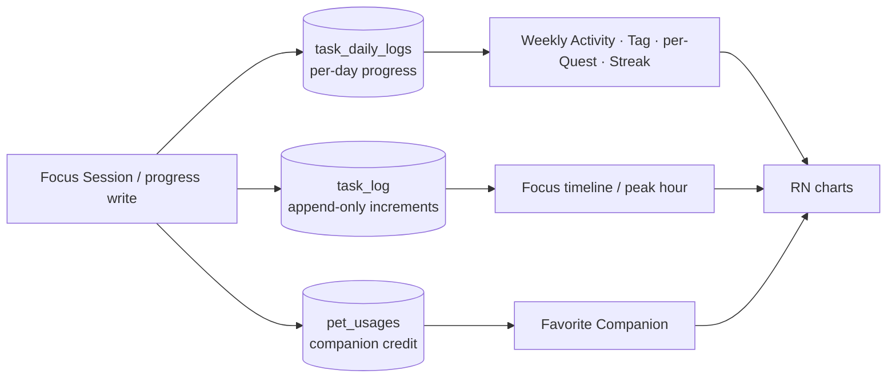

# Analytics & Insights

> The **insights** surface turns the user's completed Quest time into skimmable feedback — how much they focused this week, which **Tags** dominate, what hours of the day they concentrate, which **Companion** they focus with most, and per-Quest progress. It is the "look how productive you were" payoff loop of the app. This skill owns **the computed statistics and their charts**. The raw data it aggregates is produced by [task-quest-system](../task-quest-system/SKILL.md) (the reward/progress writes) and [focus-timer-and-background](../focus-timer-and-background/SKILL.md) (Focus Sessions).

**Status vs legacy:** [PRESERVE] the set of insights and the exact aggregation semantics (7-day windows, 2-hour timeline buckets, tag %, per-pet hours). [CHANGE] every stat moves from a **server SQL endpoint (Go/Gin + Postgres, `generate_series`/CTEs)** to an **on-device `expo-sqlite` aggregate query** over the local `task_log` / `task_daily_logs` / `pet_usages` tables — no network. [CHANGE] the four legacy `fl_chart` widgets are re-implemented in a React Native charting library **[DECIDE]**. [DROP] the legacy **Amplitude** product telemetry (a hardcoded API key firing ~120 technical events, one of which leaks the JWT) — a privacy-first local app should ship no third-party analytics; keep at most an opt-in **local** event log. [NEW] **Streaks** are a rebuild insight with no legacy equivalent.

Canonical vocabulary only: **Quest**, **Focus Session**, **Companion**, **Tag**, **Coins**, **XP/Level**, **Streak**, **Analytics**, **Local-first** ([glossary](../../../context/01-glossary.md)). Note the glossary distinction: **Analytics** = the usage/insight charts (this skill); the legacy provider (Amplitude) is **[DECIDE]/[DROP]** per glossary §6.

---

## 1. TL;DR — the rebuild rules

| # | Rule | Tag |
|---|---|---|
| R1 | **All insights are derived, never stored.** Every stat is a live aggregate over `task_daily_logs` (progress), `task_log` (audit timeline) and `pet_usages` (companion credit). No materialized stats table. | **[PRESERVE]** |
| R2 | **Server → SQLite.** Each legacy analytics endpoint becomes one `expo-sqlite` query. Postgres `generate_series` date/bucket ranges are **built in JS** (a day-array / interval-array) then LEFT-JOINed against grouped logs — SQLite has no `generate_series`. | **[CHANGE]** |
| R3 | **fl_chart → one RN chart lib.** Legacy used `fl_chart ^0.69.0` (BarChart, LineChart, PieChart) + a hand-rolled podium. Pick **one** RN library and render bar / line / pie / podium from it. | **[CHANGE]** / **[DECIDE]** |
| R4 | **Drop Amplitude.** Remove `amplitude_flutter`, the hardcoded API key, and the ~120 `<action>_started/success/failed` events. For a local-first, privacy-first app, ship **no** external telemetry. If product wants funnels, keep an **opt-in, on-device-only** event log in SQLite. | **[DROP]** / **[DECIDE]** |
| R5 | **Kill the fake fallback data.** Every legacy chart widget hard-codes example data when passed empty — so an empty account shows *invented* stats. New charts must render an explicit **empty state**, never placeholder numbers. | **[CHANGE]** |
| R6 | **Fix the integer-division precision loss** in the legacy aggregates (tag %, pet hours divide bigints before rounding). Compute in float / seconds and format at the edge. | **[CHANGE]** |
| R7 | **Insights are not premium-gated by default.** Legacy blurred the whole statistics panel behind `PremiumFeatureLock` (premium-only). Re-decide the paywall line for a local app. | **[DECIDE]** |
| R8 | **Units:** progress/time is stored in **seconds** everywhere; convert to minutes/hours only for display. `pet_usages.hoursUsed` is misnamed — it **stores seconds** (rename `secondsUsed`). | **[PRESERVE]** value / **[CHANGE]** name |

---

## 2. What "analytics" means here — two separate things

Legacy lumped two unrelated concerns under "analytics." Keep them apart in the rebuild:

| | User-facing **Insights** (this skill's core) | Product **telemetry** (Amplitude) |
|---|---|---|
| Purpose | Show the *user* their productivity | Show the *developer* usage funnels |
| Legacy impl | `features/summary/*`, `home_widget/*_chart.dart`, Go analytics endpoints over Postgres | `core/amplitude/service.dart` → Amplitude cloud |
| Data | `task_daily_logs`, `task_log`, `pet_usages` | ~120 `<action>_started/success/failed` events |
| Rebuild | **[PRESERVE]/[CHANGE]** → on-device SQLite aggregates + RN charts | **[DROP]** (or opt-in local-only) |
| Network | none (was server SQL; now local) | left the device to a 3rd party — **privacy problem** |

The rest of this doc covers Insights first (§3–§7), then telemetry (§8).

---

## 3. The insights catalog (user-facing)

Six insights ship in legacy. Home screen shows the **Weekly Activity** bar chart to everyone; the **Statistics** panel (tag / focus / favorite-pet) is wrapped in `PremiumFeatureLock` for basic users (legacy: `home_screen.dart:235-259`). Period selector offers **Day / Week / Month / Year** (legacy: `statistics_container.dart:34`, though only day/week/month map to a `SummaryType`).

| Insight | What it answers | Chart (legacy) | Premium? | Source table | Legacy endpoint |
|---|---|---|---|---|---|
| **Weekly Activity** | "How many minutes did I focus each of the last 7 days?" | **Bar** | free | `task_daily_logs` | `GET /api/task/activity` |
| **Tag Distribution** | "What share of my time went to each Tag?" | **Pie** (donut, logo in center) | premium | `task_daily_logs` + `tasks.taskTag` | `GET /api/task/tag-summary` |
| **Focus Distribution (timeline)** | "Which 2-hour block of the day is my peak focus?" | **Line** (peak-hour callout) | premium | `task_log` | `GET /api/task/timeline` |
| **Favorite Companion** | "Which Companion did I focus with most?" | **Podium** (top-3, custom layout) | premium | `pet_usages` | `GET /api/task/pet-usage` |
| **Per-Quest 7-day summary** | "How did progress on *this* quest trend over the week?" | small line/spark | — | `task_daily_logs` | `GET /api/task/:id/summary` |
| **Streak** *(rebuild)* | "How many consecutive days have I stayed active?" | stat tile | — | `task_daily_logs` | *(none — [NEW])* |

> **Overview vs Summary.** Legacy had two blocs: `remote_overview_bloc` (home header: weekly activity + a per-quest `progressMap`) and `remote_summary_bloc` (the premium statistics panel: tag / timeline / pet-usage). The rebuild can collapse both into one `useInsightsStore` reading local SQLite.

### 3.1 Weekly Activity — bar (free)

- **Window:** last 7 calendar days inclusive of today (`generate_series(now()-6d, now(), 1 day)`).
- **Value:** `SUM(task_daily_logs.timeCompleted)` per day, in **seconds**; charted as **minutes** (`seconds ~/ 60`).
- **Y-scale is dynamic** (legacy `weekly_activity_chart.dart:70-104`): buckets to `2h / 1h / 3h / 6h / 12h` bands based on the max day; default cap **720 min (12h)**. [PRESERVE] the banding or replace with an auto-scaling axis — **[DECIDE]**.
- Legacy fed this from `/api/task/activity` (`GetUserActivity`), which sums `daily_logs` (the deprecated variant summed `task_log` instead — commented out at `task.repository.go:623-659`). Use `task_daily_logs`.

### 3.2 Tag Distribution — pie (premium)

- **Value per tag:** `SUM(dl.timeCompleted)` grouped by `tasks.taskTag`, plus `percentage = tagDuration / totalDuration * 100`.
- **Window:** `day` or `month` (`EXTRACT(year/month …)` filter) — legacy `GetTagSummary`.
- Fixed 5-color palette in legacy (`tag_distribution_chart.dart:29-35`): `#F5D98F #98D7C2 #5A9D8F #EE8572 #DF5E88`. In the rebuild pull chart colors from the design tokens, not hardcodes — see [design-system-and-theming](../design-system-and-theming/SKILL.md) and the `dataviz` skill for categorical-palette rules.
- **Bug [CHANGE]:** `(SUM(dl.timecompleted) / (SELECT SUM …)) * 100` is **integer division of bigints** → the percentage truncates toward 0 before `*100`. Compute the ratio in float. (legacy `task.repository.go:728,735`)

### 3.3 Focus Distribution / Timeline — line (premium)

- **Fixed buckets:** twelve **2-hour** intervals from **00:00 to 22:00** (`generate_series('2023-01-01 00:00','2023-01-01 22:00', interval '2 hours')`; each interval `end = start + 2h - 1min`). (legacy `task.repository.go:767-792`)
- **Value per bucket:** `SUM(task_log.timeCompleted)` for rows whose `task_timestamp` hour falls in `[startHour, endHour]` on the selected date; the chart also derives a **peak hour** and an AM/PM label (`focus_distribution_chart.dart:37-69`).
- Reads the append-only **`task_log`** (per-increment audit), *not* `task_daily_logs` — this is the only insight that needs intra-day timestamps, which is exactly why `task_log` is preserved (see [task-quest-system §data](../task-quest-system/SKILL.md)).
- **Note:** legacy matches on `EXTRACT(hour …) BETWEEN` hour boundaries; the SQLite rewrite should bucket on the timestamp directly (`(strftime('%H', task_timestamp)/2)*2`) to avoid boundary ambiguity.

### 3.4 Favorite Companion — podium (premium)

- **Value per Companion:** `COUNT(pet_usages) AS totalUsage` and `SUM(pet_usages.hoursUsed)/3600 AS totalHours`, grouped per pet, filtered to `day` or `month` on `usageDate` (legacy `GetPetUsage`).
- Rendered as a **top-3 podium** (1st center, 2nd left, 3rd right) with a "others" remainder, not an fl_chart chart type — it's a custom `Column`/`Row` layout (`favorite_pet_chart.dart:24-64`). Reproduce as a layout, not a chart.
- Legacy also joined `petClothes`/`wardrobe` to build a `clothesAsset` path server-side — that path derivation moves client-side ([pet-companion-system](../pet-companion-system/SKILL.md)).
- **Bugs [CHANGE]:** (1) `SUM("hoursUsed")/3600` divides a bigint by 3600 (integer) *before* `ROUND(…,3)` → precision lost; divide as float. (2) `hoursUsed` **stores seconds** — rename `secondsUsed` (rule R8; also [known-bugs](../../../context/legacy/known-bugs-and-antipatterns.md)).

### 3.5 Per-Quest 7-day summary

- **Value per day:** `ROUND(dl.timeCompleted / NULLIF(estimatedTime,0), 2)` — a **0..1 progress ratio** for that quest over `generate_series(date-6d, date, 1 day)` (legacy `TaskSummary`, `GET /api/task/:id/summary`).
- Surfaced on the quest-details screen; a small sparkline/mini-line. `NULLIF(...,0)` guard against a zero-target divide is worth keeping.

### 3.6 Streak — [NEW]

- No legacy equivalent (glossary §5 marks Streak **[NEW]**). Define as **consecutive local days with ≥1 completed occurrence** (or ≥1 second logged — **[DECIDE]** the qualifying condition). Computable from `task_daily_logs` day-by-day; cache the current count + `lastActiveDate` in MMKV to avoid a full scan each open. Cross-reference the lazy-on-open pattern used for health decay ([backend-api-catalog server-routines](../../../context/legacy/backend-api-catalog.md)).

---

## 4. Chart types — legacy fl_chart → React Native

Legacy `pubspec.yaml:70`: **`fl_chart: ^0.69.0`**.

| Insight | fl_chart widget | RN equivalent needed |
|---|---|---|
| Weekly Activity | `BarChart` | grouped/single bar chart, categorical x (weekdays), dynamic y |
| Tag Distribution | `PieChart` (donut, `centerSpaceRadius: 40`, center logo) | donut/pie with center slot + legend |
| Focus Distribution | `LineChart` | line with markers + peak annotation |
| Per-Quest summary | `LineChart` | small line / sparkline |
| Favorite Companion | *(no chart — custom podium layout)* | flex layout, not a chart primitive |

### [DECIDE] Which RN charting library

All candidates are **bundled, offline libraries** — none phone home, so all satisfy local-first/privacy. Pick on rendering tech + chart coverage:

| Library | Tech | Covers bar/line/pie? | Notes |
|---|---|---|---|
| **victory-native (XL)** | Skia + Reanimated (`@shopify/react-native-skia`) | yes (+area, scatter) | Best performance/animation; heavier setup; strong for the timeline/line work. **Recommended default.** |
| **react-native-gifted-charts** | RN + `react-native-svg` | yes (bar, line, pie/donut) | Simplest API, quickest to match the legacy look; good enough for these 4 charts. Strong alternative if you want minimal deps. |
| react-native-chart-kit | `react-native-svg` | yes | Older, less flexible, weaker theming. |
| Recharts / visx / D3 | web/SVG (DOM) | — | **Web-only** — do not use in RN (Expo native). |

> Recommendation: **victory-native XL** if the app already pulls in Skia (it likely will for [lottie-animation-engine](../lottie-animation-engine/SKILL.md) / rich rendering); otherwise **react-native-gifted-charts** for the fastest port. Whichever is chosen, source **all chart colors from design tokens** ([design-system-and-theming](../design-system-and-theming/SKILL.md)) and follow the `dataviz` skill for categorical palettes, empty states, and light/dark. The podium (§3.4) is a plain layout in either case. Rolled up in [02-open-decisions](../../../context/02-open-decisions.md).

---

## 5. Server aggregation → on-device SQLite

Every insight was a Postgres query behind an authed endpoint. The rebuild runs the **same aggregation locally**. The one structural change: **SQLite has no `generate_series`**, so build the date/bucket skeleton in JS and LEFT JOIN it (or emit it as a `VALUES`/recursive CTE).

| Legacy endpoint (fn) | Postgres shape | Local expo-sqlite rebuild | Tag |
|---|---|---|---|
| `/api/task/activity` (`GetUserActivity`) | CTE: `SUM(timecompleted) GROUP BY DATE` ⟕ `generate_series(now-6d..now)` | JS builds `[today-6 … today]`; `SELECT date, SUM(timeCompleted) FROM task_daily_logs WHERE date BETWEEN ? AND ? GROUP BY date`; zero-fill missing days in JS. | **[CHANGE]** |
| `/api/task/tag-summary` (`GetTagSummary`) | `SUM GROUP BY tasktag` + `duration/totalx100` | `SELECT taskTag, SUM(timeCompleted) FROM task_daily_logs JOIN tasks USING(taskId) WHERE date in window GROUP BY taskTag`; compute `%` in JS as **float**. | **[CHANGE]** |
| `/api/task/timeline` (`GetTaskTimeline`) | 2-hour `generate_series` ⟕ `task_log` by hour | `SELECT (strftime('%H', task_timestamp)/2)*2 AS bucket, SUM(timeCompleted) FROM task_log WHERE date(task_timestamp)=? GROUP BY bucket`; map 12 fixed buckets in JS; derive peak. | **[CHANGE]** |
| `/api/task/pet-usage` (`GetPetUsage`) | `COUNT`, `SUM(hoursUsed)/3600 GROUP BY pet` | `SELECT petId, COUNT(*), SUM(secondsUsed) FROM pet_usages WHERE usageDate in window GROUP BY petId`; hours = `sum/3600.0` in JS; join catalog for name/asset. | **[CHANGE]** |
| `/api/task/:id/summary` (`TaskSummary`) | per-day `timecompleted/estimatedtime` ⟕ `generate_series(date-6d..date)` | JS day-array; `SELECT date, timeCompleted FROM task_daily_logs WHERE taskId=? AND date BETWEEN ? AND ?`; ratio = `time/estimatedTime` (guard 0) in JS. | **[CHANGE]** |
| `/api/task/year/:y/month/:m/checklist` (`GetChecklist`) | tasks where `completed=true` in month | derive from `task_daily_logs` (a day is complete if its due occurrences are complete) — do **not** trust the stale `tasks.completed` column. See [reminders-and-calendar](../reminders-and-calendar/SKILL.md). | **[CHANGE]** |

**Window helper.** Centralize the day/month/year → `[startEpoch, endEpoch]` conversion (and the zero-fill day array) in one TS util so every insight uses identical boundaries; the period selector (§3) picks the window. This replaces the scattered Postgres `EXTRACT`/`DATE()`/`generate_series` logic.

> The write side of B/C/D is owned by the reward transaction in [task-quest-system §Work-on-a-quest](../task-quest-system/SKILL.md); this skill only **reads**.

---

## 6. Data sources (read-only for this skill)

| Table (rebuild) | Legacy | Grain | Feeds |
|---|---|---|---|
| `task_daily_logs` | `daily_logs` | one row per `(taskId, version, date)`, `timeCompleted` capped at `estimatedTime` | weekly activity, tag %, per-quest summary, streak, checklist |
| `task_log` | `task_log` | append-only `(taskId, increment, task_timestamp)` | focus timeline / peak-hour |
| `pet_usages` | `pet_usages` | `(petId, taskId, date, secondsUsed)` — legacy col `hoursUsed` stored **seconds** | favorite companion |
| `tasks.taskTag` | `task.tasktag` | the Tag label joined for tag distribution | tag % |

Full schema: [sqlite-schema](../../../context/data-model/sqlite-schema.md) · [entity-relationship](../../../context/data-model/entity-relationship.md). Tag catalog & `[DECIDE]` on user-editable tags: [task-quest-system rule 10](../task-quest-system/SKILL.md).

> **Reminders are excluded from time analytics.** Legacy insights aggregate only tasks (`daily_logs`/`task_log`), never Reminders (Reminders carry no accrued time). Keep that boundary — see [reminders-and-calendar](../reminders-and-calendar/SKILL.md).

---

## 7. Local-first rebuild guidance

| Legacy piece | New local implementation | Tag |
|---|---|---|
| `remote_overview_bloc` / `remote_summary_bloc` | one `useInsightsStore` (Zustand) reading SQLite aggregates on demand | **[CHANGE]** |
| `summary_api_service.dart` (retrofit) + all analytics endpoints | direct `expo-sqlite` queries (§5); no HTTP | **[CHANGE]** |
| Postgres `generate_series` skeletons | JS-built day/bucket arrays LEFT-JOINed / zero-filled | **[CHANGE]** |
| Integer-division `%`/hours | float ratios computed at the edge | **[CHANGE]** |
| fl_chart widgets | one RN chart lib (§4) + podium layout | **[CHANGE]/[DECIDE]** |
| Hardcoded chart palettes | design tokens ([design-system-and-theming](../design-system-and-theming/SKILL.md)) | **[CHANGE]** |
| Fake fallback/example data in every chart | explicit empty state | **[CHANGE]** |
| `PremiumFeatureLock` on the stats panel | re-decide paywall for a local app | **[DECIDE]** |
| Amplitude telemetry | drop / opt-in local event log (§8) | **[DROP]/[DECIDE]** |
| `Streak` | new insight from `task_daily_logs` + MMKV cache | **[NEW]** |

---

## 8. Product telemetry — legacy Amplitude → DROP

Legacy wired **`amplitude_flutter: ^4.0.0`** (`pubspec.yaml:85`) with a **hardcoded API key** in source: `apiKey: "a5fb1271ebd90048f2327ab933f394e7"` (legacy: `core/amplitude/setup.dart`). A thin `AnalyticsService.trackEvent(name, properties)` (legacy: `core/amplitude/service.dart`) is injected into **every bloc** and fires `<action>_started / _success / _failed` on essentially every operation — **~120 event names**. They are **developer instrumentation**, not user insight.

Event families found (by `trackEvent` call sites across `lib/features/**`):

| Domain | Representative events |
|---|---|
| Auth/session | `login_user_{started,success,failed}`, `register_user_*`, `verify_email_*`, `forgot_password_*`, `change_password_*`, `store_credential_*`, `fetch_credential_*` |
| User/profile | `get_user_info_*`, `fetch_user_level_*`, `update_profile_picture_*` |
| Task/quest | `add_task_*`, `update_task_*`, `delete_task_*`, `update_task_progress_*`, `get_scheduled_entries_*`, `get_task_template_*`, `get_weekly_activity_*` |
| Reminders/calendar | `add_reminder_*`, `update_reminder_*`, `delete_reminder_*`, `complete_reminder_*`, `fetch_calendar_data_*`, `get_all_activity_*` |
| Overview/summary | `fetch_overview_data_*`, `fetch_progress_data_*`, `get_tag_summary_*`, `get_task_timeline_*`, `get_pet_usage_*` |
| Economy/shop | `get_coin_*`, `purchase_food_*`, `get_users_food_*`, `purchase_clothes_*`, `get_user_clothes_*`, `purchase_pet_*`, `get_all_user_pets_*`, `rename_pet_*` |
| Premium | `premium_1month_*`, `premium_6month_*`, `premium_1year_*`, `purchase_subscription_*`, `verify_subscription_*` |
| Referral | `create_referral_*`, `use_referral_code_*`, `get_referral_users_*` |

**Why DROP (recommended):**
- **Privacy conflict.** The app is being rebuilt **local-first / privacy-first** (glossary §6). Shipping a 3rd-party telemetry SDK that exfiltrates behavior to Amplitude contradicts that promise.
- **PII/secret leak.** `login_user_success` sends `{"token": token}` — the **JWT is uploaded to Amplitude** (legacy: `remote_user_bloc.dart:75`). Several `*_failed` events attach raw error strings. This is a real data-handling defect, not just noise.
- **Dead weight.** With no server round-trips to instrument, `<action>_started/success/failed` around local SQLite calls carries almost no signal.
- The auth/referral/premium(Midtrans)/credential events track flows that are themselves **[DROP]** in the rebuild ([backend-api-catalog](../../../context/legacy/backend-api-catalog.md)).

**[DECIDE] if any telemetry is wanted:** keep it **on-device and opt-in** — a local `analytics_events` table (or a debug-only console logger like the legacy `debugPrint`) with an explicit user toggle and **no PII, no tokens**, never leaving the device. If cloud product analytics is ever a real requirement, choose a privacy-respecting, consent-gated provider and document it in [02-open-decisions](../../../context/02-open-decisions.md) — do **not** silently reintroduce Amplitude with a hardcoded key.

---

## 9. Open decisions

- **[DECIDE] RN chart library** — victory-native XL vs react-native-gifted-charts (§4).
- **[DECIDE] Telemetry** — drop entirely vs opt-in local-only event log; if ever cloud, which consent-gated provider (§8).
- **[DECIDE] Paywall** — are Tag/Focus/Favorite-Companion insights still premium-gated on a local app, or free (§3, R7)?
- **[DECIDE] Streak definition** — qualifying condition (≥1 completed occurrence vs ≥1 second logged), and whether missed days reset or grace-period (§3.6).
- **[DECIDE] Weekly-activity y-scale** — keep the fixed 2/3/6/12h bands or auto-scale (§3.1).
- **[DECIDE] Period set** — legacy exposes Day/Week/Month/Year but only day/week/month have real queries; define Year (and confirm Week window: last-7-days vs Sun-start; legacy mixes both — `statistics_container.dart:31,335`).
- **[DECIDE] Tag source** — analytics groups by `taskTag`; depends on the tags decision in [task-quest-system](../task-quest-system/SKILL.md).

---

## 10. Legacy references

- `Pawductivity_App/lib/features/summary/**` — the summary feature (models: `pet_usage`, `tag_summary`, `timeline_interval`; blocs `remote_summary_bloc.*`; usecases `get_pet_usage`, `get_tag_summary`, `get_task_timeline`).
- `Pawductivity_App/lib/features/user/presentation/widgets/home_widget/{weekly_activity_chart,tag_distribution_chart,focus_distribution_chart,favorite_pet_chart,statistics_container,premium_feature_lock}.dart` — the charts + period selector + paywall blur.
- `Pawductivity_App/lib/features/task/presentation/bloc/{remote_overview_bloc,remote_activity_bloc}.dart` — home weekly-activity + per-quest progress.
- `Pawductivity_App/lib/core/amplitude/{setup,service}.dart` — the Amplitude key + `trackEvent`.
- `Pawductivity_App/pubspec.yaml:70,85` — `fl_chart ^0.69.0`, `amplitude_flutter ^4.0.0`.
- `Pawductivity_BE/internal/repository/task.repository.go:517-820` — `GetUserActivity`, `TaskSummary`, `GetPetUsage`, `GetTagSummary`, `GetTaskTimeline` (the exact SQL these insights internalize).
- `Pawductivity_BE/internal/models/*` — `UserActivity`, `TaskSummary`, `TagSummaryResponse`, `PetUsageSummaryResponse`, `TaskTimeline` DTOs.

---

## Related

- [task-quest-system](../task-quest-system/SKILL.md) — **produces** the aggregated data (reward/progress writes to `task_daily_logs`/`task_log`/`pet_usages`); Tags; per-quest summary. **(primary cross-link)**
- [focus-timer-and-background](../focus-timer-and-background/SKILL.md) — Focus Sessions are what generate the focus-timeline data.
- [reminders-and-calendar](../reminders-and-calendar/SKILL.md) — the calendar/checklist day-status insight; Reminders are excluded from time analytics. **(cross-link)**
- [pet-companion-system](../pet-companion-system/SKILL.md) — Companion identity/asset for the Favorite-Companion podium; `pet_usages` credit.
- [gamification-xp-levels](../gamification-xp-levels/SKILL.md) — Level/XP progress stats that may join the insights surface.
- [coin-economy-and-shop](../coin-economy-and-shop/SKILL.md) — coin-earn history if surfaced as a stat.
- [premium-and-monetization](../premium-and-monetization/SKILL.md) — the `PremiumFeatureLock` paywall gating the stats panel (§3, [DECIDE]).
- [design-system-and-theming](../design-system-and-theming/SKILL.md) — chart color tokens, light/dark; use with the `dataviz` skill.
- [local-first-data-layer](../local-first-data-layer/SKILL.md) — the read-side query patterns for these aggregates.
- Data model: [sqlite-schema](../../../context/data-model/sqlite-schema.md) · [entity-relationship](../../../context/data-model/entity-relationship.md) · [state-and-mmkv](../../../context/data-model/state-and-mmkv.md)
- Legacy record: [backend-api-catalog](../../../context/legacy/backend-api-catalog.md) (§3 analytics endpoints) · [known-bugs-and-antipatterns](../../../context/legacy/known-bugs-and-antipatterns.md) · [glossary §6 Analytics](../../../context/01-glossary.md)
- Open decisions roll-up: [context/02-open-decisions.md](../../../context/02-open-decisions.md)
