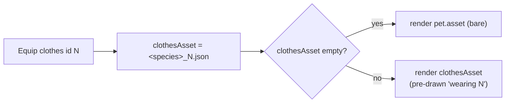
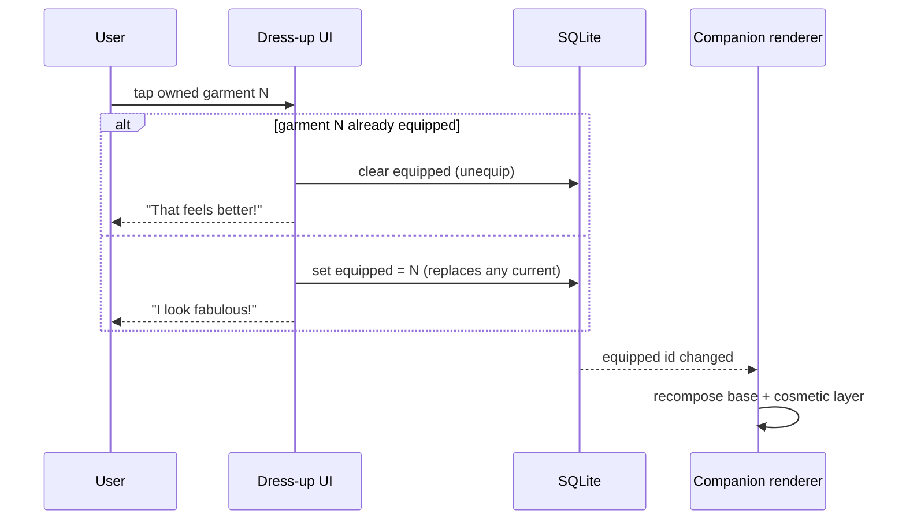

# Clothes & Wardrobe (Cosmetics)

> **Subsystem spec.** Canonical nouns come from [context/01-glossary.md](../../../context/01-glossary.md) §3
> (**Clothes/Cosmetic**, **Wardrobe**, **Equipping**, **Inventory**). Legacy paths are relative to `old/`.
> Every rule is tagged `[PRESERVE]` / `[CHANGE]` / `[NEW]` / `[DROP]` / `[DECIDE]`.

## TL;DR (what this subsystem is)

- Clothes are **purely cosmetic** items you put on your **Companion**. They give **no Health, no XP, no stat** — appearance only. `[PRESERVE]`
- The legacy catalog is **exactly 5 garments**, all typed `shirt`, three of them **premium-only**. `[PRESERVE]`
- You **buy** a garment with **Coins** into your **Wardrobe** (ownership), then **Equip** it to **dress** the Companion. Equipping is a **toggle** (equip again to take it off), and a Companion wears **at most one** garment at a time. `[PRESERVE]`
- **Critical rendering fact:** legacy does **not** layer a garment over the pet. It **swaps the entire Companion Lottie file** to a pre-drawn "wearing that outfit" variant (`<species>_<clothesId>.json`). The shop PNG (`shirt.png`, `dress.png`, …) is shown **only on the shop card/dialog**, never composited onto the animation. `[CHANGE]` — the rebuild should move to **layered** cosmetics; see [§4](#4-rendering-full-lottie-swap-vs-layering-the-important-part).
- **Asset collision to resolve:** the 5 "clothed" Lottie files per species are the **same** `<species>_1.json … _5.json` files the glossary earmarks for **Evolution stage**. You cannot have both an Evolution stage *and* a garment with the legacy art. `[DECIDE]`

## Scope & neighbours

| This skill owns | Defer to |
| --- | --- |
| Clothing catalog, Wardrobe ownership, Equip/unequip, dressing render, premium cosmetics | — |
| The Companion entity, `equipped`/`clothesAsset` field, Evolution stage, Mood | [pet-companion-system](../pet-companion-system/SKILL.md) |
| Coins balance, purchase/spend ledger, the Wardrobe **shop tab** as a shop surface | [coin-economy-and-shop](../coin-economy-and-shop/SKILL.md) |
| How the Companion Lottie is chosen, layered, and mutated at runtime | [lottie-animation-engine](../lottie-animation-engine/SKILL.md), [ai-lottie-director](../ai-lottie-director/SKILL.md) |
| Premium entitlement evaluation & gating | [premium-and-monetization](../premium-and-monetization/SKILL.md) |
| Table DDL & seed rows | [context/data-model/sqlite-schema.md](../../../context/data-model/sqlite-schema.md), [seed-catalogs.md](../../../context/data-model/seed-catalogs.md) |

---

## 1. The clothing catalog (verified)

Five garments. There are **two legacy sources** that disagree on one price — both are quoted so the rebuild picks deliberately.

- **Flutter client constant** — `clothesItems` in `Pawductivity_App/lib/config/constant/clothes.dart`. This is the array the shop grid renders and the price the shop dialog *shows the user*.
- **Backend seed** — `INSERT INTO clothes …` at `Pawductivity_BE/database/script/pawductivity.sql:296-335`. This is the price the **server actually charges** (purchase deducts from the server `clothes.price`, `Pawductivity_BE/internal/repository/purchase.repository.go:203`).

| id | Name | Price (client) | Price (server seed) | Premium | Shop PNG (`assets/clothes/`) | `type` | Server description |
|----|------|:--------------:|:-------------------:|:-------:|------------------------------|--------|--------------------|
| 1 | **Cyan t-shirt** | 15 | 15 | No | `shirt.png` | `shirt` | "A cyan t-shirt for your pet" |
| 2 | **Green shirt** | 10 | 10 | No | `polo_shirt.png` | `shirt` | "A green polo shirt for your pet" |
| 3 | **Tuxedo** | 20 | 20 | **Yes** | `suit.png` | `shirt` | "A stylish tuxedo for your pet" |
| 4 | **Star Shirt** | 15 | 15 | **Yes** | `emo_shirt.png` | `shirt` | "A pair of shoes for your pet" ⚠️ |
| 5 | **Pink Dress** | **15** ⚠️ | **20** ⚠️ | **Yes** | `dress.png` | `shirt` | "A pink dress for your pet" |

`[PRESERVE]` the catalog shape and the 5 items. Two real legacy defects surface here — **do not** copy them forward blindly:

- ⚠️ **Pink Dress price mismatch.** Client shows **15**, server charges **20**. The user could tap "Buy" believing it costs 15 and be debited 20 server-side. `context/data-model/sqlite-schema.md:276` already normalized this to **20**; `context/01-glossary.md` still says 15. **[DECIDE]** the single canonical price (recommend **20**, the server-authoritative value) and delete the other. Record it once in [seed-catalogs.md](../../../context/data-model/seed-catalogs.md).
- ⚠️ **Star Shirt description bug.** Server description is copy-pasted "A pair of shoes for your pet" — wrong garment. `[CHANGE]` fix the seed copy in the rebuild.

Other catalog notes:

- **`type` is `shirt` for all five**, including the dress. The Go enum `ClothesType` defines `hat | shirt | pants | shoes` (`Pawductivity_BE/database/migration/model/clothes.model.go:5-10`) but **only `shirt` was ever seeded**. Whether hat/pants/shoes cosmetic **slots** are ever used is a `[DECIDE]` (see [sqlite-schema.md:279](../../../context/data-model/sqlite-schema.md)). The rebuild renames `type` → **`slot`**.
- **Premium split:** 2 free (Cyan, Green), 3 premium (Tuxedo, Star Shirt, Pink Dress). `[PRESERVE]`
- **Prices are in Coins** (soft currency), not real money. Buying a garment is a **Purchase**, never an **IAP** (see glossary §5).
- The `asset` string in the catalog (`shirt`, `polo_shirt`, `suit`, `emo_shirt`, `dress`) is the **shop thumbnail** name, resolved to `assets/clothes/<asset>.png` on the client. It is **not** the on-pet animation (that is derived separately — [§4](#4-rendering-full-lottie-swap-vs-layering-the-important-part)).

`ClothesEntity` fields (`Pawductivity_App/lib/features/clothes/domain/entities/clothes.dart`): `id, name, description, type, price?, asset, premium, quantity?`. The `quantity` (`count` on the wire, `ClothesModel.fromJson` `.../data/model/clothes.dart:28`) is the **owned-not-equipped count**, discussed next.

---

## 2. Wardrobe — ownership `[PRESERVE]` concept / `[CHANGE]` shape

**Wardrobe** = the set of garments the user owns. Legacy stored ownership server-side across three tables:

| Legacy table | Purpose | Source |
|--------------|---------|--------|
| `clothes` | Global catalog (the 5 rows above) | `clothes.model.go` |
| `wardrobe` | **Ownership** — one row per owned copy: `{id, clothesId, userId}` | `wardrobe.model.go` |
| `petClothes` | **Equipped state** — links an owned `wardrobe` copy to a pet: `{wardrobeId, petId, userId}` | `petClothes.model.go` |

Legacy semantics:

- **Buying** inserts a `wardrobe(userId, clothesId)` row (`purchase.repository.go:203`). Buying the same garment twice creates **two** `wardrobe` rows → the user can own multiple **copies**.
- The API returns each catalog garment with a **`count`** = number of owned copies **not currently on a pet** (`internal/models/wardrobe.go` `Count`). The client mirrors this as `quantity`, decrementing it by 1 on equip and incrementing by 1 on unequip (`equip_clothes_listener.dart:117,167`).
- The client repo's local persistence was **never built** — `ClothesRepositoryImpl.addClothes` has a literal `// TODO : add logic here to add into clothes local db` and only round-trips the server (`clothes_repository_impl.dart:22`). So legacy ownership lived **only** on the server. `[DROP]` the server; the rebuild must own this table for real.

### Rebuild ownership model `[CHANGE]`

Cosmetics are **owned once** in the rebuild — there is no reason to stock duplicate copies of a purely cosmetic shirt. The schema (`context/data-model/sqlite-schema.md:245-249`) already collapses `wardrobe` to a one-row-per-garment set:

```sql
-- Owned cosmetics (legacy `wardrobe`). Cosmetics owned once → PK is clothes_id.
CREATE TABLE clothes_inventory (
  clothes_id  INTEGER PRIMARY KEY REFERENCES clothes(id) ON DELETE CASCADE,
  acquired_at INTEGER NOT NULL
);
```

- Presence of a row = "owned". No `quantity`/`count`. `[CHANGE]` (legacy allowed N copies; rebuild owns-once).
- `userid` FK is **dropped** — single local user (id=1). `[CHANGE]`
- Re-buying an owned garment must be blocked at the shop (owned → button becomes "Equip", not "Buy"). This is a `[NEW]` guard the legacy shop lacked (it happily let you buy duplicates).

---

## 3. Equipping / dressing the Companion `[PRESERVE]`

**Equipping** = putting an owned garment on the Companion. Legacy flow (`equip_clothes_pet` usecase → `ClothePet` server op `clothing.repository.go:90-149` → `equip_clothes_listener.dart`):

Rules verified from source:

1. **One garment per Companion.** Equipping is modeled as a single `petClothes` row per pet. Equipping garment B while A is on removes A first. Legacy render only ever reads one `clothesAsset`. `[PRESERVE]`
2. **Equip is a toggle.** Server `ClothePet`: if the requested `clothesId` is already the equipped one, it **deletes** the `petClothes` row (takes it off) rather than re-applying (`clothing.repository.go:140-149`). `[PRESERVE]`
3. **Explicit unequip** uses the sentinel **`clothesId == -1`** → deletes the `petClothes` row → Companion reverts to bare (`clothing.repository.go:99-108`; client path `equip_clothes_listener.dart:91`). `[PRESERVE]`
4. **Equip consumes a wardrobe copy.** In the legacy multi-copy model, equipping moves one copy from "available" (`count`) into `petClothes`; unequipping returns it (`equip_clothes_listener.dart:117,167`). In the rebuild owned-once model this bookkeeping disappears — equip/unequip just flips a pointer, ownership is unchanged.
5. **Feedback:** on success the Companion shows a speech bubble — **"I look fabulous!"** when a garment is put on, **"That feels better!"** when taken off (`equip_clothes_listener.dart:32,42`). `[PRESERVE]` (nice-to-have; speech bubbles are otherwise a legacy cosmetic — Mood-driven bubbles are `[NEW]`, see pet-companion-system).
6. **Equipped-state detection** was string-sniffed from the pet's `clothesAsset`: `clothesAsset.contains('_${clothesId}.json')` (`pet_inventory.dart:701,796`). Fragile — the rebuild should store the equipped id explicitly (below), not parse a filename.

### Rebuild equipped-state persistence `[CHANGE]` / `[DECIDE]`

Equipped state is **durable Companion state**, so its source of truth is **SQLite**, not MMKV. Two viable shapes:

| Option | Shape | Notes |
|--------|-------|-------|
| **A. Join table** (schema default) | `pet_clothes(pet_id, slot, clothes_id)`, PK `(pet_id, slot)` — `sqlite-schema.md:251-257` | One garment per **slot**; future-proofs hat/pants/shoes. Matches ERD `COMPANION ─wears─ CLOTHES`. |
| **B. Single column** | `equipped_clothes_id` (nullable FK) on the `companion` row | Simplest; mirrors legacy's single `clothesAsset` on `PetEntity`. Only supports one garment total. |

**[DECIDE]** A vs B — it hinges on whether multiple cosmetic **slots** ship (see [§1](#1-the-clothing-catalog-verified) `type`/`slot` decision). If shirt-only forever, B is enough; if hat/pants/shoes ever arrive, A. Recommend **A** to avoid a later migration.

**MMKV/Zustand role:** the equipped garment id is read on nearly every Companion render, so cache it in the **Zustand** companion store (writing through to SQLite on change). MMKV is **not** the store of record for equipped state — only for hot ephemeral scalars. See [context/data-model/state-and-mmkv.md](../../../context/data-model/state-and-mmkv.md) and [local-first-data-layer](../local-first-data-layer/SKILL.md).

---

## 4. Rendering: full Lottie-swap vs layering (the important part)

### How legacy renders a dressed Companion

Legacy stores a derived string `clothesAsset` on the pet and picks the animation like this **everywhere** the Companion is drawn:

```dart
// pet_display_widget.dart:100, task_timer_pet_display.dart:35, profile_pet_item.dart:34, pet_list.dart:317
Lottie.asset( pet.clothesAsset.isEmpty ? pet.asset : pet.clothesAsset );
```

`clothesAsset` is built by `_generateLottieAssetPath(animalId, clothesId)` (`equip_clothes_listener.dart:197-219`):

```
clothesId <= 0  →  assets/pet/<species>/<species>_default.json     (bare)
clothesId  1..5 →  assets/pet/<species>/<species>_<clothesId>.json  (wearing outfit N)
```

So **the garment is baked into a whole separate Lottie file**. Wearing "Cyan t-shirt" (id 1) on a dog literally means *render `dog_1.json`* — a version of the dog the artist pre-drew already wearing a cyan shirt. **Nothing is composited.** The shop PNGs (`shirt.png`, etc.) are shown only in the shop card/dialog (`wardrobe_item_dialog.dart:41`), never on the animation.



### Why this is a problem for the rebuild `[CHANGE]` / `[DECIDE]`

1. **Asset collision with Evolution stage.** There are exactly **5** non-default staged Lottie files per species (`<species>_1.json … _5.json`) and exactly **5** garments. Legacy reuses **the same 5 files** to mean "wearing garment N". But the glossary (§3) and [pet-companion-system](../pet-companion-system/SKILL.md) also want those files to be **Evolution stages**. **Both meanings cannot coexist** on the legacy art. **[DECIDE]** what `<species>_1..5.json` actually represent — outfits, evolution stages, or neither — and re-author assets accordingly. This is the single biggest decision this skill hands off.
2. **No composition = combinatorial art.** Full-swap means one baked file per (species × outfit × evolution-stage × mood). That is unmanageable and is exactly what the rebuild's `[NEW]` capabilities need to avoid.
3. **It fights the AI Lottie Director.** [ai-lottie-director](../ai-lottie-director/SKILL.md) mutates **one base** Companion Lottie from Health/Mood on-device. If a garment is a different whole file, the Director would have to know and mutate all clothed variants too. Layering keeps the Director operating on a single base.

### Recommended rebuild approach — layered cosmetics `[CHANGE]`

Render the Companion as **base animation + separate cosmetic overlay**, composited at runtime:

- **Base layer:** the bare Companion Lottie for the current **Species** + **Evolution stage** + **Mood** — the layer the AI Lottie Director owns.
- **Cosmetic layer:** the equipped garment drawn **on top**, anchored to the base. Two implementation options, **[DECIDE]**:
  - *Overlay a garment Lottie/PNG* positioned over the base (e.g. absolutely-positioned `LottieView` / `Image` in the same container). Simple; needs per-species anchor tuning.
  - *Inject the garment into the base Lottie JSON* as an extra layer before handing it to `lottie-react-native`. More seamless (moves with the rig) but requires garment art authored as Lottie layers.
- **New assets required:** legacy ships only full-swap art + flat shop PNGs — **no isolated garment layers exist**. Producing cosmetic-only layers is net-new art work. `[NEW]` Flag for the product owner/designer.
- Coordinate the exact contract (anchor points, z-order, how equipped id reaches the renderer) with [lottie-animation-engine](../lottie-animation-engine/SKILL.md).

If the product chooses to **keep full-swap** for v1 (cheapest, ships legacy art as-is): accept that Evolution stage and clothing are **mutually exclusive**, cap cosmetics at the 5 pre-drawn outfits, and document that the AI Lottie Director only drives the **bare** base. Record whichever path in [context/02-open-decisions.md](../../../context/02-open-decisions.md).

---

## 5. Premium-only cosmetics `[PRESERVE]` concept / `[CHANGE]` gate

Three garments (Tuxedo, Star Shirt, Pink Dress) carry `premium: true`. Legacy gate (`wardrobe_shop.dart:60-73`): tapping a premium item as a non-premium user shows a **"This item requires premium access"** snackbar with an **Upgrade** CTA to the Premium page; the buy dialog never opens.

Rebuild `[CHANGE]`:

- Gate on the locally-evaluated **Entitlement**, not a server `premium` string. Resolve entitlement from cached store-purchase status (MMKV), degrade to `basic` offline. See [premium-and-monetization](../premium-and-monetization/SKILL.md).
- The check is **client-side and local** — no server call. A premium garment is: *visible in the catalog, marked with a premium badge, purchasable only if entitled.* `[PRESERVE]` the "visible-but-locked" UX (do not hide premium items).
- Premium gating is **on top of** the Coin price — an entitled user still pays Coins to buy the garment. `[PRESERVE]`
- **[DECIDE]** what happens to a premium garment already owned/equipped if the subscription lapses (keep wearing, or auto-unequip?). Recommend **keep owned & equipped** (cosmetic grace) to avoid punishing churned users; confirm with product owner.

---

## 6. Local-first data model (mapping summary)

| Concern | Legacy | Rebuild (local-first) | Tag |
|---------|--------|-----------------------|-----|
| Catalog (5 garments) | `clothes` table + Flutter `clothesItems` const | Seeded `clothes` table (`sqlite-schema.md:233-243`), also mirrored in [seed-catalogs.md](../../../context/data-model/seed-catalogs.md); `type`→`slot` | `[PRESERVE]`/`[CHANGE]` |
| Ownership | `wardrobe` (N copies, per-user) | `clothes_inventory` (owned-once, PK `clothes_id`, no `userid`) | `[CHANGE]` |
| Equipped state | `petClothes` join + derived `clothesAsset` string on pet | `pet_clothes(pet_id, slot, clothes_id)` **or** `equipped_clothes_id` column ([§3](#3-equipping--dressing-the-companion-preserve) **[DECIDE]**) | `[CHANGE]` |
| Equipped hot cache | — | Zustand companion store (writes through to SQLite) | `[NEW]` |
| Buy (spend Coins) | Server `purchase.repository.go` deducts `clothes.price` | Local Coins ledger + insert `clothes_inventory` row, in one SQLite tx | `[CHANGE]` |
| Premium gate | Server `premium` string + client snackbar | Local Entitlement check | `[CHANGE]` |
| On-pet render | Full Lottie file swap (`<species>_<id>.json`) | Layered base + cosmetic overlay ([§4](#4-rendering-full-lottie-swap-vs-layering-the-important-part) **[DECIDE]**) | `[CHANGE]` |
| Server tables/API/JWT | `clothes/wardrobe/petClothes` + retrofit + `auth_token` | — deleted — | `[DROP]` |

---

## 7. Rebuild flows

### Purchase a garment

```mermaid
sequenceDiagram
  participant U as User
  participant Shop as Wardrobe shop
  participant Ent as Entitlement (local)
  participant DB as SQLite (tx)
  U->>Shop: tap garment
  Shop->>Ent: premium item?
  alt premium & not entitled
    Ent-->>Shop: locked
    Shop-->>U: "requires premium" + Upgrade CTA
  else allowed
    Shop-->>U: Buy dialog (price in Coins)
    U->>Shop: confirm Buy
    Shop->>DB: BEGIN
    DB->>DB: coins >= price? deduct, ledger row (type=purchase_clothes)
    DB->>DB: INSERT clothes_inventory(clothes_id, acquired_at)
    DB->>DB: COMMIT
    Shop-->>U: success; item now "Owned / Equip"
  end
```

Guards `[NEW]`: block if already owned; block if `coins < price` (legacy relied on the server to reject — do it locally). Write the spend to the Coins ledger (`ledger.type = 'purchase_clothes'`, `ref_id = clothes_id`) per [coin-economy-and-shop](../coin-economy-and-shop/SKILL.md).

### Equip / unequip (toggle)



No network, no auth token, no bloc round-trip. Equip is a single local write + a render recompose.

---

## 8. Legacy discrepancies, bugs & dead code (do not port)

| Item | What | Source | Action |
|------|------|--------|--------|
| Pink Dress price | Client 15 vs server 20 | `clothes.dart:6` vs `pawductivity.sql:331` | `[DECIDE]` one value (recommend 20); fix in seed-catalogs |
| Star Shirt description | "A pair of shoes for your pet" (wrong) | `pawductivity.sql:322` | `[CHANGE]` rewrite copy |
| Local persistence never built | `// TODO : add logic here to add into clothes local db` | `clothes_repository_impl.dart:22` | `[DROP]` (rebuild owns it properly) |
| Equipped-state string-sniffing | `clothesAsset.contains('_${id}.json')` | `pet_inventory.dart:701,796` | `[CHANGE]` store explicit equipped id |
| Filename-encoded garment id | garment id parsed back out of `clothesAsset` | `equip_clothes_listener.dart:77-88` | `[DROP]` the encoding; keep id as data |
| `hat/pants/shoes` slots unused | enum has 4 slots, only `shirt` seeded | `clothes.model.go:5-10` | `[DECIDE]` slots in scope? |
| Server/JWT/dio path | retrofit `clothes_api_service`, `auth_token` | `clothes_api_service.dart`, `wardrobe_shop.dart:44` | `[DROP]` |

---

## 9. Open decisions ([DECIDE] roll-up)

Add/track these in [context/02-open-decisions.md](../../../context/02-open-decisions.md):

1. **Asset meaning** — do `<species>_1..5.json` represent **outfits**, **Evolution stages**, or neither? (drives all art work) — [§4](#4-rendering-full-lottie-swap-vs-layering-the-important-part)
2. **Rendering model** — layered cosmetics (recommended) vs keep legacy full-swap for v1. — [§4](#4-rendering-full-lottie-swap-vs-layering-the-important-part)
3. **Canonical Pink Dress price** — 15 or 20. — [§1](#1-the-clothing-catalog-verified)
4. **Equipped persistence shape** — `pet_clothes` join table vs single `equipped_clothes_id` column. — [§3](#3-equipping--dressing-the-companion-preserve)
5. **Cosmetic slots** — shirt-only, or introduce hat/pants/shoes? — [§1](#1-the-clothing-catalog-verified)
6. **Premium lapse behavior** — keep or auto-unequip premium garments when the subscription ends. — [§5](#5-premium-only-cosmetics-preserve-concept--change-gate)

---

## Related

- [context/01-glossary.md](../../../context/01-glossary.md) — canonical nouns (Clothes, Wardrobe, Equipping, Inventory).
- [pet-companion-system](../pet-companion-system/SKILL.md) — the Companion, its `equipped` field, Evolution stage, Mood.
- [coin-economy-and-shop](../coin-economy-and-shop/SKILL.md) — Coins, purchase ledger, the Wardrobe shop tab.
- [lottie-animation-engine](../lottie-animation-engine/SKILL.md) / [ai-lottie-director](../ai-lottie-director/SKILL.md) — how the dressed Companion is actually rendered/mutated.
- [premium-and-monetization](../premium-and-monetization/SKILL.md) — Entitlement gating for premium garments.
- [food-and-feeding](../food-and-feeding/SKILL.md) — sibling consumable-shop pattern (Feeding vs Equipping).
- [context/data-model/sqlite-schema.md](../../../context/data-model/sqlite-schema.md) · [entity-relationship.md](../../../context/data-model/entity-relationship.md) · [state-and-mmkv.md](../../../context/data-model/state-and-mmkv.md) · [seed-catalogs.md](../../../context/data-model/seed-catalogs.md)
