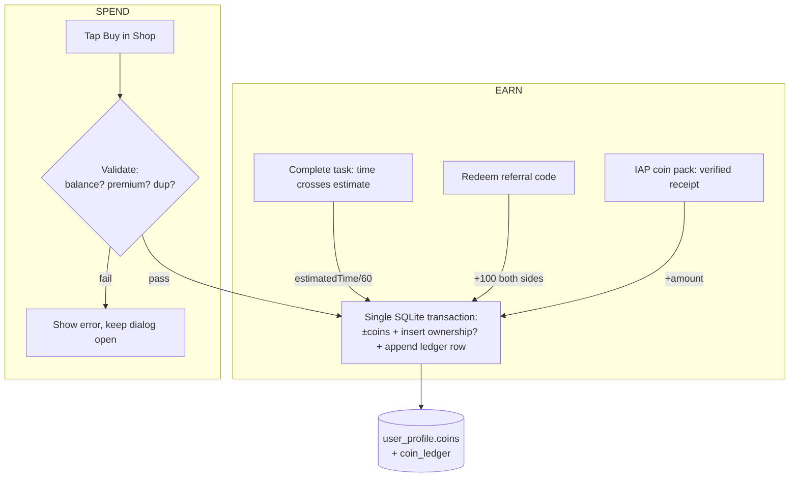

# Coin Economy & Shop

> How Coins — the soft in-app currency — are earned through productivity and spent in the Shop on food, pets, and clothes, backed by a single local ledger.

**Status vs legacy:** [PRESERVE] the earn/spend rules and exact catalog prices; [CHANGE] the server-authoritative balance + Postgres `buy_coins`/`buy_item` procedures into local expo-sqlite transactions with a synchronous, cached balance; [DROP] the unverified `/purchase/coin` free-coin endpoint and server round-trips; [NEW] client-side balance/premium/duplicate validation that runs *before* mutating (fixing several legacy bugs), plus an optional IAP coin-pack path with real receipt verification.

## What it is

Pawductivity has **two distinct currencies** that must never be conflated:

- **Coins** — the *soft* currency. Earned by gameplay (finishing tasks, referrals), spent in the Shop on food, pets, and clothes. NOT real money. This skill owns them.
- **Premium** — a *real-money* subscription (Google Play IAP `pawductivity_premium`). It never grants Coins; it flips membership class `basic → premium`, which unlocks premium-flagged catalog items. See [premium-and-monetization](../premium-and-monetization/SKILL.md).

In the legacy app the coin balance was a single server-authoritative integer (`users.coins`, guarded by a DB `CHECK (coins >= 0)`), read over the network on every Shop open with no offline cache. Every earn/spend went through the backend. In the rebuild the whole economy collapses into **local SQLite transactions** over a seeded catalog, with the balance cached for instant, offline reads.

## Core business rules

### EARN paths

| # | Source | Amount (legacy formula) | Tag | Legacy citation |
|---|--------|------------------------|-----|-----------------|
| E1 | **Onboarding grant** | **+200 Coins** on new account | [CHANGE] | `buy_coins(newUserId, catPrice)` where catPrice = `SELECT price FROM animal WHERE id=2` = 200 (user.repository.go:152-164) |
| E2 | **Task completion** | `estimatedTime / 60` Coins (integer division; `estimatedTime` in **seconds**, so = whole minutes of the *estimate*). Min ~10 (estimate must exceed 600s). Granted once, in the same transaction as the equal XP grant. | [PRESERVE] formula, [CHANGE] execution | `CALL buy_coins(userId, estimatedTime/60)` (task.repository.go:470) |
| E3 | **Referral redemption** | **+100 to BOTH** referrer and referee, once per (code, user); self-redemption blocked | [DECIDE] (needs cross-user settlement) | `UPDATE users SET coins = coins + 100` ×2 (referral.repository.go:55-56) |
| E4 | **Coin-pack IAP** | arbitrary `amount` via `POST /purchase/coin` | [DROP] legacy path / [NEW] verified IAP | `CALL buy_coins(userId, amount)`, **no payment verification** (purchase.repository.go:159-162) |

Notes / flags:
- **[DROP] Dead `level_up` formula.** The task prompt and CONVENTIONS §5 mention a level-up grant of `floor(task_time/600)*3` Coins. **This is dead code.** `PROCEDURE level_up` exists (pawductivity.sql:183-195) but its `complete_task` trigger is **commented out** (pawductivity.sql:197-219) and it is never called. The live task reward is `estimatedTime/60` in Go — do NOT implement `floor(task_time/600)*3`. Level-up in the rebuild grants **no separate coins**; only XP thresholds advance the user Level (see [gamification-xp-levels](../gamification-xp-levels/SKILL.md)).
- **[DROP] No streak economy.** There is no streak-based coin reward anywhere in legacy code. If the rebuild wants one it is [NEW] and must be designed. [DECIDE]
- **[DROP] Unverified coin-pack exploit.** `/purchase/coin` had zero receipt validation and no amount cap — any authenticated client could mint unlimited Coins. No Flutter UI ever called it. Never reproduce an "add arbitrary coins" path.

#### The earn/display discrepancy (FLAG — carry into the rebuild decision)

The amount **granted** on task completion and the amount **shown** as the reward are two different formulas:

| Surface | Formula | 1-hour task (3600s) | Source |
|---------|---------|--------------------|--------|
| **Actual grant** | `estimatedTime / 60` | **60 Coins** | task.repository.go:435,470 |
| **Displayed reward** (task list) | `FLOOR(estimatedTime / 60 / 3)` | **20 Coins** | task.repository.go:234 (`AS rewardCoins`) |
| **Hardcoded UI chip** | literal `100` | **100 Coins** | new_task_rewards.dart (never sent to backend) |

Three inconsistent numbers for the same task. **[DECIDE]** the rebuild must pick ONE canonical reward formula and show exactly what it grants. Recommended: display == grant. Also cross-referenced in [task-quest-system](../task-quest-system/SKILL.md) and `context/legacy/known-bugs-and-antipatterns.md`.

### SPEND paths & catalog prices

All spends deduct Coins and append a ledger row via `buy_item` (below). Prices are in **Coins** and are the verified seed values (pawductivity.sql:233-335).

**Pets** (see [pet-companion-system](../pet-companion-system/SKILL.md)):

| Pet | animalId | Price | Premium? |
|-----|----------|-------|----------|
| Dog | 1 | 100 | no |
| Cat | 2 | 200 | no |
| Rabbit | 3 | 200 | **yes** |

**Food** — `stats` = pet Health restored on feeding (see [food-and-feeding](../food-and-feeding/SKILL.md)):

| Food | Price | stats (Health) | Premium? |
|------|-------|----------------|----------|
| Apple | 3 | +10 | no |
| Chicken | 3 | +10 | no |
| Pizza | 4 | +20 | **yes** |
| Watermelon | 4 | +10 | no |
| Carrot | 5 | +15 | no |

**Clothes** — all seeded as type `shirt` (see [clothes-and-wardrobe](../clothes-and-wardrobe/SKILL.md)):

| Clothes | Price | Premium? |
|---------|-------|----------|
| Cyan t-shirt | 15 | no |
| Green shirt | 10 | no |
| Tuxedo | 20 | **yes** |
| Star Shirt | 15 | **yes** |
| Pink Dress | 20 | **yes** |

> [PRESERVE] the numbers above verbatim — they are the single source of truth shared with the catalog docs. The canonical seed lives in [seed-catalogs](../../../context/data-model/seed-catalogs.md); if these ever diverge, the SQL seed wins.
>
> **[CHANGE] Known legacy price bug:** the Flutter shop constant `clothes.dart` displayed **Pink Dress = 15** while the DB charged **20** — the UI lied about the cost. The rebuild has one catalog table shared by UI and checkout, so this class of bug disappears. (Also flagged in clothes-and-wardrobe.)

### Purchase validation (identical for food / pet / wardrobe)

Legacy ran this **server-side only** (purchase.repository.go). The rebuild MUST run it **client-side before mutating**:

1. Read balance + membership class (`SELECT u.coins, m.class ...`).
2. Read item `price` + `premium` flag.
3. If `balance < price` → error **"insufficient coins"**. [PRESERVE]
4. If `item.premium AND class == 'basic'` → error **"premium content"** (hard gate — a basic user with enough Coins is still blocked). [PRESERVE]
5. (Pet only) if user already owns that `animalId` → error **"user already have this pet"** (max 1 per species). [PRESERVE]
6. Insert ownership row (food_inventory / pet / clothes_inventory).
7. `buy_item`: `coins -= price` + append ledger row.

### The ledger (`coin_ledger`)

The rebuild collapses both economy primitives into one append-only-ish **`coin_ledger`** table (canonical schema in [sqlite-schema](../../../context/data-model/sqlite-schema.md) §7). Where the legacy Postgres `purchases` table stored a **positive** `price` for both spends *and* credits with direction implied by a `type` enum, the rebuild uses a **signed `delta`** so the balance reconstructs as `SUM(delta)` (drift #8):

- **Spend** (food/pet/clothes) → `UPDATE user_profile SET coins = coins - price` + `INSERT coin_ledger(delta = -price, reason, ref_id)`.
- **Credit** — legacy `buy_coins` was used by E1/E2/E4 (signup grant, task reward, coin-pack) → `INSERT coin_ledger(delta = +amount, reason, ref_id)` + `UPDATE user_profile SET coins = coins + amount`.

> **[CHANGE] E3 (referral) is the ledger exception.** Legacy referral did NOT go through `buy_coins`; it credited via a direct `UPDATE users SET coins = coins + 100` (×2) with **no `purchases` row** (`referral.repository.go:55-56`). So if referral survives the rebuild ([DECIDE]), its +100 grants **must still write a signed `coin_ledger` delta** or the `SUM(delta)` balance invariant breaks.

`reason` is the enum `'task_reward' | 'level_up' | 'purchase_pet' | 'purchase_food' | 'purchase_clothes' | 'referral' | 'iap_topup' | 'other'`; `ref_id` optionally points at the task/animal/food/clothes row. The **only** hard overspend guard is the `CHECK (coins >= 0)` on `user_profile.coins`.

> **[CHANGE] Legacy sign ambiguity (fixed here):** the legacy positive-only `price`+`type` scheme made a naïve `SUM(price)` meaningless — you had to special-case credit rows. The signed `delta` above removes that trap entirely.

## Data & entities

Local expo-sqlite tables this system owns / touches (schema in [sqlite-schema](../../../context/data-model/sqlite-schema.md)):

| Table | Key coin fields | Notes |
|-------|-----------------|-------|
| `user_profile` (single local user) | `coins INTEGER NOT NULL DEFAULT 0 CHECK (coins >= 0)` | The balance. Legacy had it on `users.coins`; there is no separate wallet table. Mirror into an MMKV/Zustand counter for synchronous reads. |
| `coin_ledger` (ledger) | `id`, **signed `delta INTEGER`**, `reason TEXT CHECK (reason IN ('task_reward','level_up','purchase_pet','purchase_food','purchase_clothes','referral','iap_topup','other'))`, `ref_id`, `created_at` | Every economy event; signed `delta` (− spend / + credit) makes balance `SUM(delta)`. |
| `animal` / `food` / `clothes` (catalogs) | `price`, `premium`, plus `stats` (food) / `asset` | Seeded once at first launch; shared with the pet & Lottie layers. |
| `pet` / `food_inventory` / `clothes_inventory` (ownership) | — | food_inventory has a real `quantity` column (buy +1 / feed −1, fixes drift #7); clothes_inventory is owned-once (PK `clothes_id`, no quantity). |

Balance read: legacy `GET /user/coins` → in the rebuild this is a **synchronous local read** of `user_profile.coins` (or the Zustand counter). The legacy "infinite shimmer on network error" path is deleted — there is no network, so no offline degradation.

## Key flows



1. **Earn on task completion.** When accumulated `timeCompleted` first crosses `estimatedTime`, in the *same* transaction that marks the task complete: `coins += estimatedTime/60`, `current_xp += estimatedTime/60`, append ledger row (`reason='task_reward'`, `delta = +reward`). Guard so it fires exactly once. (task.repository.go:430-475)
2. **Earn via referral.** Validate code exists and owner ≠ redeemer; record redemption; credit. See [referral-system](../referral-system/SKILL.md) — cross-user settlement is impossible offline, so this is [DECIDE].
3. **Buy food / pet / clothes.** Run the 7-step validation above inside `db.withTransactionAsync(...)`. **Do NOT dismiss the dialog until the transaction succeeds** (fixes the legacy bug where food/wardrobe dialogs popped immediately and swallowed failures).
4. **Insufficient coins.** Show an "insufficient coins" state *before* any write; optionally deep-link to the coin-pack IAP or the earn-more hint. Never let the balance go negative (app guard + SQLite `CHECK`).
5. **Coin-pack IAP.** Only credit after a **validated** store receipt (react-native-iap / RevenueCat), as a CONSUMABLE product; then run the local credit transaction. No unverified grant path.
6. **Display balance.** Read `user_profile.coins` synchronously; the header CoinWidget re-renders from the Zustand store on every mutation.

## Local-first rebuild guidance

Map every legacy server piece to local (cheatsheet in CONVENTIONS §9, schema in [sqlite-schema](../../../context/data-model/sqlite-schema.md)):

- **`users.coins` balance** → `user_profile.coins INTEGER CHECK (coins >= 0)` in expo-sqlite, mirrored into a Zustand/MMKV counter for instant reads. Keep the `CHECK` **and** an app-level guard.
- **`buy_coins` procedure → a TS helper** wrapping one transaction:
  ```ts
  // credit(amount, reason): E1 onboarding / E2 task / E3 referral / E4 IAP pack
  async function buyCoins(db, amount: number, reason: LedgerReason = 'other', refId?: number) {
    await db.withTransactionAsync(async () => {
      await db.runAsync(
        `INSERT INTO coin_ledger(delta, reason, ref_id, created_at) VALUES (?, ?, ?, unixepoch() * 1000)`,
        [amount, reason, refId ?? null],
      );
      await db.runAsync(`UPDATE user_profile SET coins = coins + ?`, [amount]);
    });
  }
  ```
- **`buy_item` procedure → a TS helper** that does the full validated spend atomically:
  ```ts
  // purchaseItem('food'|'pet'|'clothes', itemId): validate THEN mutate, all in one tx
  async function purchaseItem(db, type, itemId) {
    const { coins, class: tier } = await getBalanceAndTier(db);
    const { price, premium } = await getCatalogRow(db, type, itemId);
    if (coins < price)                 throw new Error('insufficient coins');
    if (premium && tier === 'basic')   throw new Error('premium content');
    if (type === 'pet' && await ownsPet(db, itemId))
                                        throw new Error('user already have this pet');
    // insertOwnership: pet / food_inventory (quantity +1) / clothes_inventory (owned-once)
    await db.withTransactionAsync(async () => {
      await insertOwnership(db, type, itemId);          // pet / food_inventory / clothes_inventory
      await db.runAsync(`UPDATE user_profile SET coins = coins - ?`, [price]);
      await db.runAsync(
        `INSERT INTO coin_ledger(delta, reason, ref_id, created_at) VALUES (?, ?, ?, unixepoch() * 1000)`,
        [-price, `purchase_${type}`, itemId],
      );
    });
  }
  ```
- **Validation must run client-side before mutating** (legacy did it server-side only). Show "insufficient coins" / "premium content" UI up front; keep the dialog open until the tx commits.
- **Add wardrobe/food dedup or make it idempotent.** Legacy only deduped pets; users could re-buy the same cosmetic and waste Coins. Either `SELECT COUNT(*)` before insert or add `UNIQUE(userId, clothesId)` for clothes. [CHANGE] — pick one. [DECIDE] whether re-buying food (a consumable stack) is intended.
- **Catalog** → ship `animal`/`food`/`clothes` as a seeded SQLite table or bundled JSON at first launch (no network). Preserve exact seed values above. This same table is the single source of truth for the Lottie/animation layer's asset paths.
- **Premium gating** → read the locally-cached membership tier (MMKV) written by the IAP layer; hard-gate premium items regardless of Coin balance. [PRESERVE] the behavior, [CHANGE] the source of truth.
- **Real-money paths** (coin packs + `pawductivity_premium` subscription) → react-native-iap or RevenueCat with proper receipt validation; the one thing that legitimately wants a backend is server-side receipt verification — document honestly, don't fake it. See [premium-and-monetization](../premium-and-monetization/SKILL.md).

## New-app enhancements

- **[NEW] AI-estimate ↔ coin-reward coupling.** The Brain Dump Parser (Claude) will set task durations. Since the legacy reward = `estimatedTime/60` is driven by the *user-set estimate*, letting the AI set estimates means the AI indirectly controls payouts — trivial to farm by inflating estimates. **[DECIDE]** reward on *actual focus time* instead of the estimate, and/or cap/normalize AI-suggested estimates, and/or add a daily earning cap. Cross-link [ai-braindump-parser](../ai-braindump-parser/SKILL.md).
- **[NEW] Shared catalog as single source of truth.** The dynamic-Lottie engine consumes the same `animal.asset` / clothes assets the Shop sells, so the local catalog table feeds both the Shop and the animation layer — no duplicated price/asset lists (which caused the legacy Pink Dress mismatch).
- **[NEW] Signed ledger** enables an in-app "coin history" view and reconstructable balance for free.

## Open decisions

- **[DECIDE] Task reward formula.** Resolve the grant-vs-display-vs-hardcoded discrepancy; pick one number and reward on estimate vs. actual focus time.
- **[DECIDE] Starting balance.** New users effectively got **200 Coins** (an artifact of reusing the Cat price) plus a free Cat. Confirm 200 is the intended onboarding grant.
- **[DECIDE] Referral rewards offline.** Crediting the code *owner* needs cross-device settlement. Drop referrals, make them single-sided (+100 redeemer only), or add an optional sync service?
- **[DECIDE] Coin packs.** Sell Coins for real money via IAP? No coin-pack SKUs or prices exist anywhere in the legacy repo — needs product + pricing decision.
- **[DECIDE] Premium hard-gate vs affordability.** Confirm premium items (Rabbit, Pizza, Tuxedo, Star Shirt, Pink Dress) stay blocked for basic users even when they can afford the Coin price.
- **[DECIDE] Duplicate purchase policy.** Re-buying the same cosmetic (waste) — fix with uniqueness; food restacking — intended?
- **[DECIDE] Anti-abuse.** Daily earning cap or diminishing returns, given rewards scale with a self-set estimate?
- **[DECIDE] Ledger `delta`.** Confirm the rebuild adopts a signed delta so balance reconstructs from the ledger.

## Legacy references

- `old/Pawductivity_BE/internal/repository/purchase.repository.go` — `buy_item`, PurchaseFood/Pet/Wardrobe/Coin, all validation.
- `old/Pawductivity_BE/internal/repository/task.repository.go:234,430-475` — display reward `FLOOR(estimatedTime/60/3)` vs actual grant `estimatedTime/60` + XP.
- `old/Pawductivity_BE/internal/repository/user.repository.go:152-164,316-330` — onboarding 200-coin grant (both email + Google paths).
- `old/Pawductivity_BE/internal/repository/referral.repository.go:45-56` — +100/+100 referral.
- `old/Pawductivity_BE/database/script/pawductivity.sql:183-335` — `level_up` (dead), `buy_coins`, and the animal/food/clothes seeds (verified prices above).
- `old/Pawductivity_BE/internal/controllers/users.controller.go:423-441` — `GetUserCoins`.
- `old/Pawductivity_App/lib/features/coin/…`, `lib/features/user/presentation/widgets/shop/*` — thin Flutter shop dialogs (no client validation; food/wardrobe dialogs pop immediately).
- `old/Pawductivity_App/lib/config/constant/clothes.dart` — Pink Dress price-display bug (15 vs DB 20).

## Related

- [seed-catalogs](../../../context/data-model/seed-catalogs.md) — authoritative catalog seed values.
- [sqlite-schema](../../../context/data-model/sqlite-schema.md) · [entity-relationship](../../../context/data-model/entity-relationship.md) — local schema for `user_profile`, `coin_ledger`, catalogs.
- [food-and-feeding](../food-and-feeding/SKILL.md) — food `stats` and feeding.
- [clothes-and-wardrobe](../clothes-and-wardrobe/SKILL.md) — cosmetics, equip, price-display bug.
- [pet-companion-system](../pet-companion-system/SKILL.md) — pet purchase & uniqueness.
- [premium-and-monetization](../premium-and-monetization/SKILL.md) — real-money subscription & premium gating.
- [gamification-xp-levels](../gamification-xp-levels/SKILL.md) — XP granted alongside coins; level curve.
- [referral-system](../referral-system/SKILL.md) — referral earn path and offline settlement decision.
- [task-quest-system](../task-quest-system/SKILL.md) — where the completion reward originates.
- [ai-braindump-parser](../ai-braindump-parser/SKILL.md) — AI estimates that feed the reward formula.
- [local-first-data-layer](../local-first-data-layer/SKILL.md) — transactions, MMKV/Zustand patterns.
- `context/legacy/known-bugs-and-antipatterns.md` — reward discrepancy, coin-pack exploit, dialog-pop bug, price mismatch.
- `context/02-open-decisions.md` — rolled-up [DECIDE] items.
