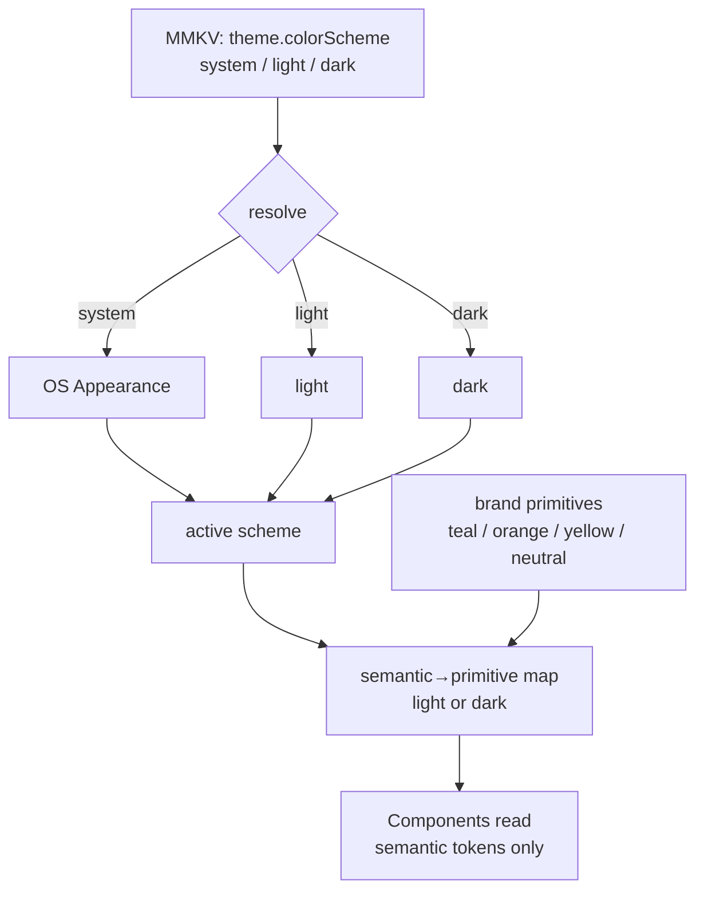

# Design System & Theming

> One tokenized source of truth for color, spacing, radius, and typography — light + dark — so no component ever hardcodes a hex, and so the pet's Lottie recoloring draws from the exact same brand palette.

**Status vs legacy:** `[CHANGE]` the delivery of the brand palette — the legacy had **no token system at all** (`config/theme/theme.dart` defined only a white scaffold, the `Poppins` family, and one AppBar theme; every other color was an inline `Color(0x…)` literal copy-pasted across dozens of widgets). `[PRESERVE]` the brand *identity*: teal `#0C4C60`, orange `#E28A4B`, health-yellow `#FFDA7C`, splash `#00688b`, and the `Poppins` typeface — these hues are the brand and carry over verbatim. `[NEW]` three things the legacy never had: a **token layer** (NativeWind/Tailwind), a **dark theme**, and a **shared palette contract** so AI-driven Lottie tint and the UI never drift apart.

> This skill is the **implementer**. The full, verified token table (every primitive, every semantic alias, every light/dark value, usage counts, and the near-duplicate-teal evidence) lives in **[context/design/brand-and-tokens.md](../../../context/design/brand-and-tokens.md)** — treat that as the data, this file as the how-to and the rules.

## What it is

Pawductivity's visual system is a small, opinionated set of brand tokens rendered through **NativeWind** (Tailwind for React Native). Components style themselves by referencing **semantic** token names (`bg`, `surface`, `ink`, `primary`, `accent`, `health`) — never raw hex and never primitive shade names. Switching between light and dark, or nudging a brand hue, is a **one-file change** in `tailwind.config.js` plus a `colorScheme` flip; nothing in a component changes.

The legacy delivered the same brand identity with none of this discipline: `#0C4C60` appeared as a raw literal **106** times, `#E28A4B` **83** times, and the app accumulated a *swarm* of near-duplicate dark teals (`#204165`, `#004A59`, `#0D3B66`, `#2C4C60`, …) that a designer clearly meant to be "the primary color" but which drifted because there was no token to point at (legacy: `context/design/brand-and-tokens.md §2`). It was **light-only** (`scaffoldBackgroundColor: Colors.white`), and one dead screen even mistyped the font family as `'Poppin'` and silently rendered in the system font. The rebuild collapses all of that into one ramp.

This skill owns **color/spacing/radius/typography tokens, the light + dark theme mechanism, font loading, and component styling conventions**. It does not own screen layout or the tab shell (see [navigation-and-app-shell](../navigation-and-app-shell/SKILL.md)) or how a Lottie is rendered/mutated (see [lottie-animation-engine](../lottie-animation-engine/SKILL.md)) — but it **supplies the palette** both consume.

## Core business rules

### Brand palette (the four intentional colors) `[PRESERVE]` hues · `[CHANGE]` delivery

Every hex below is the exact literal quoted from legacy source. `[PRESERVE]` the hue; `[CHANGE]` literals → tokens.

| Token | Hex | Legacy literal | Legacy usages | Role |
|---|---|---|---|---|
| **primary** (teal) | `#0C4C60` | `0xFF0C4C60` | 106 | Brand color: AppBar icons + title, primary buttons, headings, progress fills, selected tabs (legacy: `config/theme/theme.dart:16-17`). |
| **accent** (orange) | `#E28A4B` | `0xFFE28A4B` | 83 | Warm counterpoint: alternating list-card fills (`index % 2` with primary), secondary CTAs, "add task" button. |
| **health / pet-yellow** | `#FFDA7C` | `0xFFFFDA7C` | 8 | Pet Health bar fill + reward/premium accent (legacy: `features/pet/presentation/widget/pet_list.dart:266`). **Constant across light & dark** — it is a fixed signal color. |
| **teal-accent / progress** | `#4EA59A` | `0xFF4EA59A` | 11 | Lighter teal for progress bars / positive-success; doubles as dark-mode `primary`. |
| **splash-bg** | `#00688b` | native splash config | — | Native launch-screen background — a **brighter, separate teal** from `primary`, set in `flutter_native_splash` (legacy: `pubspec.yaml:117,119`). Even the `values-night-v31` bucket reused the same hex, so the "night" hook was a no-op. |

### The tokenized mandate `[NEW]`

The single most important rule for the rebuild — a hard constraint, not a suggestion:

- **No component ever hardcodes a hex, spacing number, radius, or font size.** All styling goes through tokens. (This directly reverses the legacy's `Color(0x…)`-everywhere anti-pattern; logged as a smell in `context/legacy/known-bugs-and-antipatterns.md §6.5`.)
- **Components reference semantic tokens, never primitives.** Use `bg-primary`, `text-ink`, `bg-surface` — not `bg-teal-500`. Only the semantic→primitive map (in the config) names primitives. This is what makes dark mode one file.
- **All near-duplicate teals collapse into `primary`.** The eight drifting dark teals from `context/design/brand-and-tokens.md §2` are not brand decisions; they were symptoms of the missing token. One `primary` (+ a defined shade ramp) replaces all of them.
- **One `fontFamily` token** (`sans: ['Poppins', 'System']`) — this alone kills the entire `'Poppin'`-typo class of bug.

### Token groups the config must define `[NEW]`

| Group | What it holds | Anchor / legacy origin |
|---|---|---|
| **color** (primitives) | `teal{50…900}`, `orange{50…700}`, `yellow{300…700}`, `neutral{0…900}`, `splash` | Anchors are verified legacy hexes: `teal.500=#0C4C60`, `teal.300=#4EA59A`, `orange.500=#E28A4B`, `yellow.500=#FFDA7C`, `neutral.900=#2D2F41`, `splash=#00688b`. 50/700/900 steps are **proposed** derivations (`[DECIDE]`). |
| **color** (semantic) | `primary`, `primary-fg`, `accent`, `health`, `bg`, `surface`, `border`, `ink`, `muted`, `success`, `danger` | Each maps to a primitive per scheme — see the full light/dark table in `context/design/brand-and-tokens.md §4.2`. |
| **spacing** | `0,1,2,3,4,5,6,8,10,12` on a **4pt base** (`1=4px … 12=48px`) | Replaces ad-hoc `EdgeInsets` numbers. |
| **borderRadius** | `sm 8` · `md 12` · `lg 16` · `xl 24` · `full 9999` | Legacy used scattered 8/12/16/999 radii inline. |
| **fontFamily** | `sans: ['Poppins','System']` | Legacy `Poppins` (legacy: `config/theme/theme.dart:6`). |
| **fontSize** | `xs 12 · sm 14 · base 16 · lg 18 · xl 22 · 2xl 28 · 3xl 34` | `lg=18px` matches the legacy AppBar title (`theme.dart:17`); rest is a proposed scale. |
| **fontWeight** | `normal 400 · medium 500 · semibold 600 · bold 700` | Legacy bundled **only 400 & 700** — `[CHANGE]` bundle 500/600 too (see Typography). |

### Typography `[PRESERVE]` family · `[CHANGE]` weights

- **Family = Poppins** `[PRESERVE]` (legacy: `config/theme/theme.dart:6`).
- Legacy bundled **only `Poppins-Regular` (400)** and **`Poppins-Bold` (700)** (legacy: `pubspec.yaml:211-216`); any request for medium/semibold silently fell back to a synthetic weight. `[CHANGE]` bundle the weights the scale references (400/500/600/700) via `expo-font` or `@expo-google-fonts/poppins`.
- The dead `'Poppin'` typo (legacy: `features/user/presentation/pages/health_shop.dart:39`) rendered one screen in the system font. `[DROP]` — the single `fontFamily` token removes the whole class.

### Dark theme `[NEW]`

- The legacy was **light-only**; dark mode is net-new (listed under `[NEW]` in `CONVENTIONS §3`).
- Mechanism: NativeWind's `dark:` variant driven by a `colorScheme` value, exposed as an app setting **System / Light / Dark** (default **System**), persisted in MMKV.
- Only the semantic→primitive map swaps between schemes; components (which read semantic names only) are untouched.
- **Contrast rule:** `primary` teal `#0C4C60` passes WCAG AA as text on white but **fails as text on a dark background** — so dark mode maps `primary` to the lighter `teal.300 #4EA59A`. Verify every final pair against AA (4.5:1 body / 3:1 large) before ship.
- `health #FFDA7C` stays identical in both schemes (fixed signal color — coordinate with pet + Lottie skills below).

## Data & entities

This skill owns essentially **no SQLite rows** — tokens are compile-time constants in `tailwind.config.js`, not runtime data. The one persisted value is the theme preference:

| Key | Store | Values | Notes |
|---|---|---|---|
| `theme.colorScheme` | **MMKV** (settings) | `system` \| `light` \| `dark` | Default `system`. Read once on boot into a Zustand settings store; drives NativeWind's `colorScheme`. See [state-and-mmkv](../../../context/data-model/state-and-mmkv.md). |

No expo-sqlite table. No server. (Contrast: the legacy had no persisted theme at all — it was hardcoded light.)

## Key flows

### 1. Resolve the active theme (on boot & on setting change)

1. On boot, read `theme.colorScheme` from MMKV into the settings store (default `system`).
2. If `system`, subscribe to OS `Appearance` changes; otherwise use the explicit value.
3. Feed the resolved scheme to NativeWind (`colorScheme`); the `dark:` variants and semantic map switch automatically.
4. Changing the in-app setting writes MMKV and updates the store — the whole UI re-themes with no per-component work.

### 2. Style a component (the convention)

1. Reach for a **semantic** class first: `className="bg-surface border border-border rounded-md p-4"`.
2. Text uses `text-ink` (body) / `text-muted` (secondary) / `text-primary-fg` (on a primary fill).
3. Brand emphasis uses `bg-primary` / `text-primary` / `bg-accent`; never a raw hex, never `teal-500`.
4. Spacing/radius/size come from tokens (`p-4`, `rounded-lg`, `text-lg`), never magic numbers.
5. If a needed color/size isn't a token, **add a token** — do not inline a literal. A new literal is a bug.

### 3. Feed the shared palette into Lottie recoloring

The pet's dynamic recoloring must draw from the **same** token values, so a "gold aura on streak" or a health tint matches the UI exactly. See [lottie-animation-engine](../lottie-animation-engine/SKILL.md) for the mechanism; this skill guarantees the source of truth.

- Export the brand primitives/semantics as a **plain JS palette object** (a `tokens.ts` generated from / mirroring the Tailwind config) so non-className consumers (Lottie `colorFilters`, `<LottieView>` tint, Reanimated) read the identical hexes.
- The Health bar keeps the legacy visual verbatim: fill width ∝ `health`, color = `health` token `#FFDA7C`, ~300ms ease (legacy: `pet_list.dart:266`). It reads `color.health`, not a literal.
- Constraint from the Lottie analysis: the shipped 18 pet assets are **raster PNG layers with zero vector fill/stroke color arrays**, so classic `[r,g,b,a]` hex-patching is not possible on them — recolor is done via `colorFilters` keypath tint or a re-authored vector "aura" layer. Whichever route, the **input hex comes from these tokens** (e.g. gold aura from a `yellow`/reward token, not an ad-hoc `#FFD700`). Keep `health` identical in light & dark so the pet reads the same on both.

## Local-first rebuild guidance

- **Tokens are static config, not data** — nothing to migrate off a server. Define once in `tailwind.config.js` `theme.extend`; expose a mirrored `tokens.ts` for JS consumers (Lottie, charts, Reanimated). `[NEW]`
- **Theme preference lives in MMKV** (`theme.colorScheme`) alongside other settings; resolve on boot, no network. `[CHANGE]` (legacy had no preference — it was compiled light-only).
- **Fonts bundle locally** via `expo-font` / `@expo-google-fonts/poppins`; load 400/500/600/700 before hiding the splash so no synthetic-weight flash. `[CHANGE]`
- **Splash color** `#00688b` is set in the Expo splash config (app.json / `expo-splash-screen`), the native analog of `flutter_native_splash`. `[PRESERVE]` the hex (or fold into `primary` — see Open decisions).
- **The site already had token discipline** (shadcn/ui CSS variables + `darkMode:["class"]`, legacy: `Pawductivity-Website/tailwind.config.ts`); the rebuild makes the **app** match what the web side already did — confirmation the identity is teal + warm orange, not a reason to import the site's exact hexes.

## New-app enhancements

- **Dark mode** — full System/Light/Dark support, the biggest visible upgrade; the legacy's only "night" resource was a no-op that reused the light splash color.
- **A real type scale** — the legacy had only ad-hoc `fontSize:` numbers; the rebuild ships a named scale (`xs…3xl`).
- **Shared palette contract** — one exported token set consumed by UI *and* AI-driven Lottie tint, so brand color can never drift between them.
- **Canonical semantic aliases** (`bg/surface/border/ink/muted/success/danger`) — the legacy had no `danger`/error color at all; each snackbar picked its own (`[DECIDE]` below).

## Open decisions

- `[DECIDE]` Sign off the **derived shades** — the 50/700/900 teal/orange/yellow steps and all proposed dark-mode `bg`/`surface`/`border` values in `context/design/brand-and-tokens.md §4.1–4.2`. Only the anchor hexes are legacy-verified; the ramp is a proposal.
- `[DECIDE]` Is `splash-bg #00688b` an intentional launch accent to keep, or should it fold into the `primary` teal family?
- `[DECIDE]` Introduce a canonical **danger/error** color — the legacy never had one consistent error color.
- `[DECIDE]` Dark-mode default: ship **System** in v1, or ship light-only for v1 and add dark later?
- `[DECIDE]` Which Poppins weights to bundle (400/700 as legacy, vs 400/500/600/700 the new scale wants) — affects app size.

These roll up to [context/02-open-decisions.md](../../../context/02-open-decisions.md).

## Legacy references

- `old/Pawductivity_App/lib/config/theme/theme.dart` — the entire legacy theme (19 lines): white scaffold, `Poppins`, one AppBar theme; primary `0XFF0C4C60`, title size 18. **Verified.**
- `old/Pawductivity_App/lib/features/task/presentation/styles/` & `.../user/presentation/styles/` — per-feature style files where brand literals were re-declared.
- `old/Pawductivity_App/lib/features/pet/presentation/widget/pet_list.dart:266` — health-bar `#FFDA7C` fill.
- `old/Pawductivity_App/lib/features/user/presentation/pages/health_shop.dart:39` — the dead `'Poppin'` typo screen.
- `old/Pawductivity_App/pubspec.yaml:117,119` (splash `#00688b`), `:211-216` (only Poppins 400/700 bundled).
- `old/Pawductivity_App/android/app/src/main/res/values-v31/styles.xml` & `values-night-v31/styles.xml` — the no-op "night" splash bucket.
- `old/Pawductivity-Website/tailwind.config.ts` — the site's existing token + `darkMode:["class"]` system.

## Related

- [context/design/brand-and-tokens.md](../../../context/design/brand-and-tokens.md) — **the full token table** (all primitives, semantic light/dark values, usage counts, near-dupe-teal evidence). This skill implements it.
- [lottie-animation-engine](../lottie-animation-engine/SKILL.md) — consumes the shared palette for `colorFilters`/aura tint and the `health` color; recolor mechanism + the raster-asset constraint live there.
- [pet-companion-system](../pet-companion-system/SKILL.md) — Mood/Health that drive which color the pet's animation is tinted with.
- [navigation-and-app-shell](../navigation-and-app-shell/SKILL.md) — the AppBar/tab shell that uses `primary` for icons + title.
- [context/data-model/state-and-mmkv.md](../../../context/data-model/state-and-mmkv.md) — where `theme.colorScheme` is persisted.
- [context/legacy/known-bugs-and-antipatterns.md](../../../context/legacy/known-bugs-and-antipatterns.md) — the "no dark mode, hardcoded literals, `'Poppin'` typo" smells.
- [context/legacy/dead-and-incomplete-features.md](../../../context/legacy/dead-and-incomplete-features.md) — the placeholder screens where color drift lived.
- [context/02-open-decisions.md](../../../context/02-open-decisions.md) — where the `[DECIDE]` items roll up.
