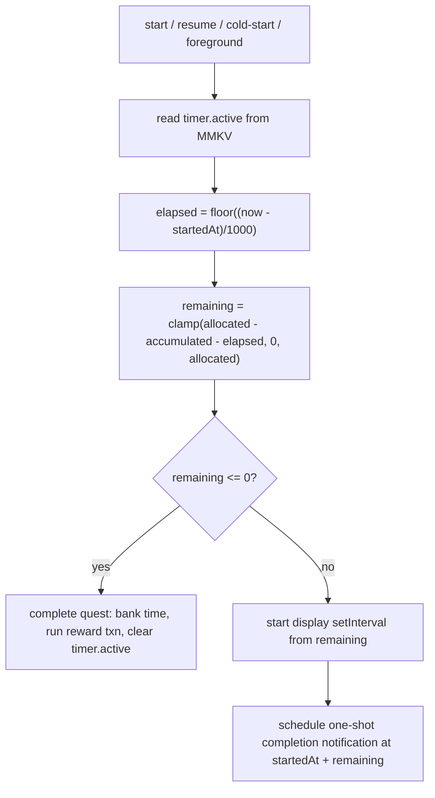

# Focus Timer & Background Execution

> A **Focus Session** is one run of the live countdown on a **Focus quest** — the user picks a task, locks a Companion to it, hits play, and works while a timer counts down toward the task's estimated duration; completing the allocated time completes the quest and pays out XP + Coins. This skill owns **how the timer runs, persists, and survives backgrounding/kill/reboot**, and how background execution is done correctly in Expo. The quest model, reward math, and completion side effects live in [task-quest-system](../task-quest-system/SKILL.md) and [gamification-xp-levels](../gamification-xp-levels/SKILL.md). Notification channels, permissions, and scheduling primitives live in [notifications-and-permissions](../notifications-and-permissions/SKILL.md).

Canonical vocabulary only: **Focus Session**, **Quest**, **Companion**, **Coins**, **XP/Level**, **Local-first** ([glossary](../../../context/01-glossary.md)).

---

## 1. TL;DR — the rebuild rules

| # | Rule | Tag |
|---|---|---|
| R1 | **Never trust a tick counter across backgrounding.** The elapsed time of a session is always `floor((now − startedAt)/1000)` from a persisted wall-clock timestamp — the on-screen 1-second interval is *display only*. | **[CHANGE]** |
| R2 | Persist **one atomic bookmark** `timer.active` in MMKV (`startedAt`, `allocatedSeconds`, `accumulatedSeconds`, `isRunning`, ids, names). **Never persist a decrementing `remaining_time` counter.** | **[CHANGE]** / **[DROP]** (the counter) |
| R3 | **Reboot & kill recovery is free**: on cold start, read `timer.active` and recompute remaining from `startedAt`. Re-register the completion notification because Android drops scheduled alarms on reboot. | **[CHANGE]** |
| R4 | Model the live session as an **ongoing (`sticky`, non-dismissable) `expo-notifications` notification + a one-shot completion trigger**, not a mistyped foreground service. | **[CHANGE]** |
| R5 | **Do not port** `flutter_background_service`, the duplicated `onStart` handlers, the `foregroundServiceType="location"` service, or the ghost `flutter_foreground_task` service. | **[DROP]** |
| R6 | Use `expo-keep-awake` only while the timer screen is **foreground and visible**; do not fight Android background limits with a wake-lock. | **[NEW]** |
| R7 | Ship **one** timer implementation. The legacy had two `CountdownManager`s, two `onStart` foreground entry points sharing notification id `888`, and three timer screens. | **[CHANGE]** |

---

## 2. What a Focus Session is (scope)

- The user opens a **Focus quest** (a task with an `estimatedTime` in seconds), selects/locks a Companion, and starts the timer.
- The timer counts **down** from `remaining = estimatedTime − timeCompleted` toward `0`. Legacy seeds the initial remaining as `estimatedTime − timeCompleted`, clamped at `0` (legacy: `task_management_screen.dart:136-139`).
- **Pausing** banks the elapsed segment into the task's completed-time; **resuming** continues; reaching `0` **completes** the quest and triggers the reward transaction (see [task-quest-system](../task-quest-system/SKILL.md)).
- Only **one** Focus Session runs at a time. Starting a new one while another runs **pauses/banks the previous one first** (legacy: `countdown_manager.dart:33-36`, `task_management_screen.dart:329-337`).
- A minimum focus duration existed as a hidden DB constraint `CHECK(estimatedTime > 600)` (10 min) that the form did not enforce — a real legacy bug. The real minimum belongs in the create-quest UI, not the timer. **[DECIDE]** (see [known-bugs §5.7](../../../context/legacy/known-bugs-and-antipatterns.md)).

> Non-Focus quest types (Target, Checklist) do not use this timer — see [task-quest-system](../task-quest-system/SKILL.md).

---

## 3. Persisted timer state (legacy → MMKV `timer.active`)

The legacy app persisted the running-session state as loose keys in `flutter_secure_storage` (misused as a general K/V bag). The rebuild collapses these into **one JSON blob** written/cleared atomically in MMKV, so partial/torn state is impossible.

| Legacy key (secure storage) | Legacy meaning & source | Rebuild field (`timer.active.*`) | Tag |
|---|---|---|---|
| `current_task_id` | Id of the running task (legacy: `countdown_manager.dart:39`) | `taskId` | **[CHANGE]** |
| `task_name` | Name shown in the ongoing notification (legacy: `background_service_handler.dart:28`, `task_management_screen.dart:140`) | `taskName` (cache; else read from SQLite by id) | **[CHANGE]** |
| `start_time` | **ISO8601** wall-clock when the segment began (legacy: `countdown_manager.dart:40`) | `startedAt` — store as **epoch ms**, not ISO | **[CHANGE]** |
| `locked_pet_id` | Companion locked to the session (legacy: `countdown_manager.dart:41`) | `lockedPetId` | **[PRESERVE]** concept, relocate |
| `locked_pet_index` | Carousel page to restore the pet picker (legacy: `task_timer_page.dart:63`, `task_timer_handler.dart:53`) | `lockedPetIndex` | **[PRESERVE]** |
| `is_running` | `'true'` flag; author admits *"I don't find a case when this should be false"* (legacy: `task_management_screen.dart:208`) | `isRunning` (real boolean) | **[CHANGE]** |
| `remaining_time` | Seconds counter the foreground service **decremented and rewrote every tick** (legacy: `background_service.dart:72`, `task_management_screen.dart:299`) | **dropped as a stored field** — recomputed from `startedAt` | **[DROP]** field / **[CHANGE]** behavior |

```jsonc
// MMKV key: timer.active  (or null when idle)
{
  "taskId": 1234,
  "taskName": "Write report",   // notification cache
  "lockedPetId": 7,
  "lockedPetIndex": 2,
  "startedAt": 1720900000000,    // epoch ms — the ONLY clock the timer trusts
  "allocatedSeconds": 1500,      // task estimatedTime for this run
  "accumulatedSeconds": 300,     // banked from prior segments (== legacy timeCompleted)
  "isRunning": true,
  "completionNotifId": "abc123"  // handle to cancel the one-shot alarm
}
// remaining is NEVER stored — always computed (§4)
```

> Full MMKV schema, encryption stance, and Zustand `useTimerStore` slice: [state-and-mmkv §3e / §4 / §5](../../../context/data-model/state-and-mmkv.md). Nothing here is a secret after accounts are dropped, so plain (unencrypted) MMKV is fine.

---

## 4. The timestamp-authoritative model (the core rule)

The visible countdown is a JS `setInterval(1s)` **for display only**. The **truth** is always recomputed from the wall clock:

```
elapsedSeconds  = floor((Date.now() − startedAt) / 1000)
remainingSeconds = clamp(allocatedSeconds − accumulatedSeconds − elapsedSeconds, 0, allocatedSeconds)
if (remainingSeconds <= 0) → complete now
```

This is verified against the legacy's own resume math: `elapsed = DateTime.now().difference(startTime).inSeconds; remaining -= elapsed` (legacy: `countdown_manager.dart:81-83`) and `increment = currentTime.difference(_startTime).inSeconds; elapsedTime = increment + timeCompleted` (legacy: `task_management_screen.dart:222-231`). The legacy computed elapsed correctly **on resume** but then relied on a live decrementing tick while running — the two disagreed under backgrounding.

**Recompute on every one of these events:**

- foreground / `AppState` → `active`
- cold start / app launch (read `timer.active`, rehydrate)
- device reboot (recovered on next launch)
- returning to the timer screen



**On pause / switch task**, bank the segment (never leave time only in a tick):
```
accumulatedSeconds += floor((now − startedAt)/1000)   // capped at allocatedSeconds
write SQLite time-log row; update task.timeCompleted
isRunning = false;  clear startedAt;  cancel completion notification
```
Reward/time-log write-through goes through a **single SQLite transaction** (see [state-and-mmkv §4](../../../context/data-model/state-and-mmkv.md), [task-quest-system](../task-quest-system/SKILL.md)).

### Completion alarm (legacy TODO, never built)
On start/resume, schedule a **one-shot `expo-notifications` trigger at `startedAt + remaining` seconds**; cancel it on pause/complete/edit. This is what actually fires "your Focus Session is done" even if the app is killed — no live process required. The legacy left this as literal `// TODO: Alarm to notify the user that the task is done` (legacy: `task_management_screen.dart:91`) and `// TODO: Uncomment kalau dah mau notifikasi` (legacy: `countdown_manager.dart:53,58`).

> **[DECIDE] Clock-tampering guard.** Elapsed trusts the device wall clock, so a clock change/DST jump can add a huge increment or snap a task to complete. The legacy had **no** client clamp (an old backend comment even worried about *"increment ketinggian"* / too-high increment). Decide whether to clamp per-reconciliation increments to a sane max, or accept wall-clock truth. Rolled up in [02-open-decisions](../../../context/02-open-decisions.md).

---

## 5. Surviving app kill & reboot

Because the only durable state is a **timestamp** (not a counter or a live service), recovery is arithmetic:

| Event | What survives | Recovery on next foreground/launch |
|---|---|---|
| App backgrounded | `timer.active` in MMKV; JS interval frozen/killed | Recompute remaining from `startedAt`; the ongoing notification stayed sticky; the one-shot alarm still fires |
| App force-killed | `timer.active` in MMKV; the one-shot completion notification (OS-scheduled) | Cold start reads `timer.active`, recomputes, re-renders. Alarm already scheduled with the OS still fires. |
| **Device reboot** | `timer.active` in MMKV | Cold start recomputes remaining. **Android clears scheduled alarms on reboot** → **re-register** the completion notification from `timer.active` on launch. (Legacy had *no* reboot recovery at all — `autoStart=false`, no boot receiver: [known-bugs §3.4](../../../context/legacy/known-bugs-and-antipatterns.md).) |

Requires `RECEIVE_BOOT_COMPLETED` (via Expo config) so the app can reschedule on boot, and exact-alarm permission for precise completion timing — see [notifications-and-permissions](../notifications-and-permissions/SKILL.md).

---

## 6. Background execution: legacy vs. Expo

### 6a. What the legacy did (and why not to port it)

The legacy attempted an Android **foreground service** via `flutter_background_service: ^5.1.0` + `flutter_local_notifications: ^18.0.1` that ran a `Timer.periodic(1s)` in a background isolate, decrementing `remaining_time` and re-`show()`ing an ongoing `BigPictureStyleInformation` notification every second (legacy: `background_service.dart:45-78`; `setup_background_service.dart` with `isForegroundMode:true, autoStart:false, foregroundServiceNotificationId:888`). Problems, all **[DROP]** or **[CHANGE]**:

- **The foreground service was disabled in the shipping build.** The calls that actually start/stop it are **commented out** (`// BackgroundServiceHandler.startForegroundService(...)`, legacy: `countdown_manager.dart:53,58-62`). So in practice **backgrounding/killing the app stopped the visible countdown entirely** — only `start_time` survived ([known-bugs §5.6](../../../context/legacy/known-bugs-and-antipatterns.md)).
- **Two duplicate `onStart` entry points share notification id `888`** — one in `background/background_service.dart:24`, a second copy inlined in `task_management_screen.dart:42-105` — risking conflicting service definitions ([known-bugs §4.2](../../../context/legacy/known-bugs-and-antipatterns.md)).
- **Two `CountdownManager` implementations** (`countdown_manager.dart` used by `task_timer_page`, a divergent one used by `task_management_screen`) plus three timer screens (`task_screen_old`, `task_management_screen`, `task_timer_page`). Mid-migration debt — pick one.
- **A per-tick decrementer that also rewrote `remaining_time` to storage every second** — redundant with the timestamp and prone to double-counting if two decrementers ran.

### 6b. The wrong foreground-service type (Play-policy hazard — flag loudly)

The legacy `AndroidManifest.xml` declared the timer's service as a **`location`** foreground service, and a second **ghost** service:

```xml
<!-- legacy: android/app/src/main/AndroidManifest.xml:8-17 -->
<service android:name="id.flutter.flutter_background_service.BackgroundService"
         android:foregroundServiceType="location" .../>            <!-- a TIMER typed as location -->
<service android:name="com.pravera.flutter_foreground_task.service.ForegroundService"
         android:foregroundServiceType="specialUse">
  <property android:name="android.app.PROPERTY_SPECIAL_USE_FGS_SUBTYPE"
            android:value="Whatever idk"/>                          <!-- junk subtype; plugin not even in pubspec -->
</service>
```

- `foregroundServiceType="location"` on a productivity timer is a **Play policy violation** on Android 14+ (the app must genuinely use location) → **store rejection / runtime kill**. **[CHANGE]**
- The `specialUse` service with subtype `"Whatever idk"` references a plugin **not in `pubspec.yaml`** — stale, and a second rejection risk. **[DROP]**
- The manifest declared **only** `INTERNET` + `FOREGROUND_SERVICE` — missing `POST_NOTIFICATIONS`, `SCHEDULE_EXACT_ALARM`/`USE_EXACT_ALARM`, `RECEIVE_BOOT_COMPLETED`, `WAKE_LOCK` ([known-bugs §3.1–3.3](../../../context/legacy/known-bugs-and-antipatterns.md)).

### 6c. The correct Expo approach

A countdown does **not need a background process at all** — it needs a persisted timestamp + a scheduled completion notification. Model it as:

| Concern | Expo mechanism | Notes |
|---|---|---|
| Live "still running" chrome | **`expo-notifications`** ongoing notification (`sticky: true`, non-dismissable, low importance) | Replaces the FGS notification. Optionally refresh its body when the app is foregrounded; **do not** try to tick it every second from a background isolate. |
| "Session finished" alert | **`expo-notifications`** one-shot trigger at `startedAt + remaining` | The real completion signal; survives app kill; cancel on pause/edit/complete. Needs exact-alarm on Android for precision. |
| Periodic catch-up / pre-warm | **`expo-task-manager` + `expo-background-task`** (successor to `expo-background-fetch`) | OS-scheduled, **best-effort, minimum ~15 min**, not guaranteed. Use it to reconcile/refresh, **never** as the timer's clock. Lazy recompute-on-foreground is the robust baseline. |
| Keep screen on while visible | **`expo-keep-awake`** (`useKeepAwake()` / `activateKeepAwakeAsync`) | Only while the timer screen is **foreground**. It is a screen wake-lock, not a background-execution grant. Release on unmount/pause. |
| If a true foreground service is ever required | Expo config plugin declaring the **correct** FGS type (e.g. `shortService` / a justified type) + real justification string | Only if product needs second-accurate live chrome while backgrounded. Default: don't — the ongoing + one-shot notifications cover the UX. **[DECIDE]** |

**Android background-execution limits to respect** (these are why R1 exists): background JS is frozen/killed under Doze and App Standby; `setInterval` does not run reliably (or at all) in the background; OEM battery managers kill background work aggressively; `expo-background-task` wakes are throttled to best-effort ~15-min-minimum and can be skipped entirely. **Conclusion: compute from timestamps on foreground; let the OS-scheduled notification handle "done"; never depend on background ticks.**

Permission wiring (POST_NOTIFICATIONS on Android 13+, exact-alarm, boot, notification channels) and priming them in onboarding are owned by [notifications-and-permissions](../notifications-and-permissions/SKILL.md).

---

## 7. Session lifecycle (end-to-end)

```mermaid
sequenceDiagram
  participant U as User
  participant S as Zustand useTimerStore
  participant M as MMKV timer.active
  participant N as expo-notifications
  participant DB as expo-sqlite

  U->>S: Start Focus (taskId, petId)
  S->>S: if another session running → pause+bank it
  S->>M: write {startedAt:now, allocated, accumulated, isRunning:true, ...}
  S->>N: show ongoing notification (sticky)
  S->>N: schedule one-shot completion @ now+remaining → completionNotifId
  Note over S: display setInterval ticks (UI only)
  U-->>S: (app backgrounded / killed / reboots)
  U->>S: reopen / foreground
  S->>M: read bookmark
  S->>S: remaining = clamp(allocated-accumulated-elapsed,0,allocated)
  alt remaining <= 0
    S->>DB: bank time-log, apply reward txn (one transaction)
    S->>M: clear timer.active
    S->>N: cancel ongoing; completion notif already/also fired
  else remaining > 0
    S->>N: re-register completion notif (esp. after reboot)
    S->>S: resume display interval
  end
  U->>S: Pause
  S->>S: accumulated += elapsed (cap allocated)
  S->>DB: write time-log; update task.timeCompleted
  S->>M: isRunning=false, clear startedAt
  S->>N: cancel completion notif + ongoing
```

---

## 8. Legacy pitfalls → rebuild guardrails

| Legacy pitfall | Legacy source | Guardrail |
|---|---|---|
| Backgrounding stops the visible countdown (FGS calls commented out) | `countdown_manager.dart:53,58-62` | Timestamp math + OS-scheduled completion notification; UI recomputes on foreground. **[CHANGE]** |
| `remaining_time` persisted as a per-second-mutated counter | `background_service.dart:72`; `task_management_screen.dart:299` | Never store a decrementing counter; store `startedAt` + `allocated` + `accumulated`. **[DROP]** |
| Two `onStart` handlers sharing notification id `888` | `background_service.dart:13,24`; `task_management_screen.dart:31,42` | One timer module; one notification identity. **[CHANGE]** |
| Two `CountdownManager`s + three timer screens | `countdown_manager.dart`, `countdown_manager_old.dart`, `task_management_screen.dart`, `task_timer_page.dart`, `task_screen_old` | Ship exactly one. **[CHANGE]** |
| `is_running` flag that is never set false meaningfully | `task_management_screen.dart:208` | Derive running-state from `timer.active.isRunning`; clear the whole bookmark on stop. **[CHANGE]** |
| FGS typed `location`; ghost `specialUse` service; missing permissions | `AndroidManifest.xml:8-17,45-46` | Correct FGS type (or none); declare only used permissions via Expo config plugins. **[CHANGE]/[DROP]** |
| No reboot recovery (`autoStart=false`, no boot receiver) | manifest + `setup_background_service.dart:11` | `RECEIVE_BOOT_COMPLETED`; re-register alarm from `timer.active` on launch. **[CHANGE]** |
| ISO8601 `start_time` string | `countdown_manager.dart:40` | Store `startedAt` as epoch ms. **[CHANGE]** |
| No clock-tampering clamp | `countdown_manager.dart:82` | Consider clamping increments. **[DECIDE]** |
| Min focus duration hidden in `CHECK(estimatedTime > 600)` | task schema; [known-bugs §5.7](../../../context/legacy/known-bugs-and-antipatterns.md) | Enforce/choose minimum in create-quest UI. **[DECIDE]** |

---

## 9. Rebuild checklist

- [ ] `useTimerStore` (Zustand) with actions `start / pause / resume / tickDisplay / reconcile / complete`, hydrating from MMKV `timer.active`.
- [ ] `timer.active` written/cleared atomically as one JSON blob; `startedAt` in epoch ms; **no `remaining_time`**.
- [ ] `reconcile()` recomputes from wall clock on: foreground, cold start, screen focus, post-reboot launch.
- [ ] One-shot `expo-notifications` completion trigger scheduled on start/resume; cancelled on pause/edit/complete; **re-registered on boot**.
- [ ] Ongoing `sticky` notification while running; cancelled on pause/complete.
- [ ] `expo-keep-awake` active only while the timer screen is foreground.
- [ ] Completion runs the time-log + reward as **one SQLite transaction** (see task-quest / gamification skills).
- [ ] Permissions & channels declared via Expo config plugins and primed in onboarding ([notifications-and-permissions](../notifications-and-permissions/SKILL.md)).
- [ ] Exactly **one** timer implementation; no ported `flutter_background_service`, no `location` FGS, no `888`.

---

## 10. Open decisions

Timer-specific; the app-wide roll-up is in [context/02-open-decisions.md](../../../context/02-open-decisions.md).

- **[DECIDE] Clock-tampering clamp** — trust the device wall clock, or clamp per-reconciliation elapsed increments to a sane max so a clock/DST jump can't snap a session to complete (§4, legacy had no clamp).
- **[DECIDE] Minimum focus duration** — pick and enforce a real minimum in the create-quest UI, replacing the unenforced legacy `CHECK(estimatedTime > 600)` (§2, [known-bugs §5.7](../../../context/legacy/known-bugs-and-antipatterns.md)).
- **[DECIDE] Optional true foreground service** — default to ongoing + one-shot notifications (no background process); only add a correctly-typed FGS if product needs second-accurate live chrome while backgrounded (§6c).

---

## Related

- [notifications-and-permissions](../notifications-and-permissions/SKILL.md) — the ongoing + one-shot notification, channels, POST_NOTIFICATIONS / exact-alarm / boot permissions the timer depends on. **(primary cross-link)**
- [task-quest-system](../task-quest-system/SKILL.md) — Focus quests, `estimatedTime`/`timeCompleted`, completion → reward.
- [gamification-xp-levels](../gamification-xp-levels/SKILL.md) — XP/Coin payout on session completion.
- [pet-companion-system](../pet-companion-system/SKILL.md) — the Companion locked to a session (`lockedPetId`).
- [local-first-data-layer](../local-first-data-layer/SKILL.md) — write-through transaction pattern.
- [context/data-model/state-and-mmkv.md](../../../context/data-model/state-and-mmkv.md) — `timer.active` schema (§3e), `useTimerStore` (§4/§5), the timestamp-authoritative model (§5).
- [context/legacy/known-bugs-and-antipatterns.md](../../../context/legacy/known-bugs-and-antipatterns.md) — §3.1–3.4 native config, §5.6 wall-clock drift, §4.2 dual stacks.
- [context/02-open-decisions.md](../../../context/02-open-decisions.md) — clock-tampering clamp, minimum focus duration, optional true-FGS.
