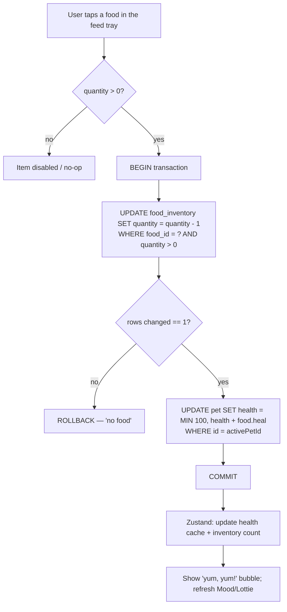

# Food & Feeding

> The **Feeding** loop: the user spends **Coins** in the **Shop** to buy **Food**, food lands in the **Inventory**, and consuming a food item raises the **Companion**'s **Health** (integer 0–100). This skill owns the food *catalog*, the *ownership/inventory* model, and the *feeding effect*. It deliberately does **not** own Health *decay* or Mood (those live in [pet-companion-system](../pet-companion-system/SKILL.md)) or the coin *balance/ledger* mechanics (those live in [coin-economy-and-shop](../coin-economy-and-shop/SKILL.md)).

**Canonical vocabulary** (see [context/01-glossary.md](../../../context/01-glossary.md)): Companion, Health, Feeding, Food, Inventory, Shop, Coins, Premium/Entitlement. Legacy called the heal amount `stats`; the rebuild renames it **`heal`**. Legacy called the owned-food join `playerFood`; the rebuild names it **`food_inventory`**.

---

## 1. Food catalog (verified seed)

There are exactly **five** foods. Values below are verified against the Postgres seed script (the authoritative heal/description source) and the Flutter hardcoded shop list (the authoritative price/premium source the shop UI actually reads).

| id | Name | Price (coins) | `heal` (legacy `stats`) | Premium | Legacy description |
|---:|------|---:|---:|:---:|--------------------|
| 1 | Apple | 3 | **10** | no | `An Apple` |
| 2 | Chicken | 3 | **10** | no | `A delicious meal for your pet` |
| 3 | Pizza | 4 | **20** | **yes** | `A tasty pizza for your pet` |
| 4 | Watermelon | 4 | **10** | no | `A tasty pizza for your pet` ⚠️ |
| 5 | Carrot | 5 | **15** | no | `A delicious meal for your pet` |

Sources: seed rows `Pawductivity_BE/database/script/pawductivity.sql:255-294` (price + heal + premium + description); Flutter shop list `Pawductivity_App/lib/config/constant/food.dart` (price + premium, per-item `image`); catalog shape `Pawductivity_BE/database/migration/model/food.model.go` and `internal/models/food.go`.

- **[PRESERVE]** The five items, their prices, heal values, and the single premium flag (Pizza only). Best value per coin: Pizza (20 heal / 4 = 5.0), then Apple/Chicken (10/3 ≈ 3.33 — the best non-premium ratio), then Carrot (15/5 = 3.0), then Watermelon (10/4 = 2.5). Pizza is the only premium food and the only 20-heal food.
- **[CHANGE]** Rename `stats` → `heal` in the schema (already reflected in [sqlite-schema.md §7](../../../context/data-model/sqlite-schema.md)); it is Health-points-restored, nothing else.
- **[CHANGE]** Fix the **Watermelon description copy-paste bug** — it is seeded as `"A tasty pizza for your pet"` (`pawductivity.sql:281`), a verbatim copy of Pizza's. Give it its own copy in the seed.
- **[CHANGE]** Collapse the **dual source of truth**. Legacy defined the catalog twice and inconsistently: the Flutter shop grid rendered a **hardcoded** `foodItems` list (`config/constant/food.dart`) that carries only `id/name/image/price/premium` and **omits `heal`**, while heal/description lived only in the server DB. The rebuild has **one** seed table (`food`) that carries every field; the shop and the inventory both read it. See [seed-catalogs.md](../../../context/data-model/seed-catalogs.md).
- **Asset paths** (bundled images): `assets/food/apel.png`, `ayam.png`, `pizza.png`, `semangka.png`, `wortel.png` (Indonesian filenames; keep the files, the display names are English).

> **Observation (not a rule):** in legacy the shop's food dialog shows only the **price**, never the heal amount — the `+N` heart badge appears only in the inventory feed tray (`pet_inventory.dart:395`). A shopper cannot compare heal-per-coin before buying. Consider surfacing `heal` in the shop card. **[DECIDE]**

---

## 2. Ownership & inventory model

### Legacy (server, ground truth of behavior)

- Ownership lived in a join table **`playerFood(userId, foodId)`** with **one row per owned unit** — no quantity column. Buying Apple twice inserted two `playerFood` rows.
- "Quantity" was **derived at read time** by `COUNT(f.id) ... GROUP BY f.id` (`food.repository.go:59` `GetInventoryFood`, `:83` `GetInventoryFoodById`). The `InventoryFood` DTO carries a computed `Quantity` (`internal/models/inventoryFood.go`).
- The Flutter app never persisted inventory locally: `FoodRepositoryImpl.addFood` had a literal `// TODO: add logic here to add into local db` and returned success without writing anything (`food_repository_impl.dart:17`); a Floor `FoodDao` (`findAllFoods`, `findFoodById`) existed but was effectively dead/online-first. Inventory was refetched from the server each open.

### Rebuild (local-first)

- **[CHANGE]** Replace one-row-per-item with a real quantity column: **`food_inventory(food_id PRIMARY KEY, quantity)`** (`sqlite-schema.md §7`). This fixes legacy **drift #7** (fragile `COUNT(*)` derivation) and makes buy/feed a `quantity ± 1` update instead of insert/delete of rows.
- **[CHANGE]** Drop `userid` entirely — single local user (id=1), per HARD RULE 2. Inventory is just "what this device owns."
- **[PRESERVE]** Inventory is **per-food-type with a count**; the feed tray lists owned foods with a quantity badge and disables an item at quantity 0.

| Concern | Legacy | Rebuild | Tag |
|---|---|---|---|
| Owned-food store | `playerFood(userId, foodId)`, one row per unit | `food_inventory(food_id PK, quantity)` | [CHANGE] |
| Quantity | `COUNT(*) GROUP BY food` at read | real `quantity` column | [CHANGE] |
| Persistence | server round-trip; local TODO never done | SQLite on device | [CHANGE] |
| Keying | `userId` FK | none (single user) | [CHANGE] |

---

## 3. Buying food (Shop → Inventory)

Full purchase economics (coin deduction, ledger, insufficient-funds) belong to [coin-economy-and-shop](../coin-economy-and-shop/SKILL.md); summarized here only where food-specific.

Legacy `PurchaseFood` ran one server transaction (`purchase.repository.go:44`):

1. Read user `coins` and membership `class` (basic/premium).
2. Read food `price` and `premium` flag.
3. **Reject** if `coins < price` → error `"insufficient Coins"`. **[PRESERVE]**
4. **Reject** if food is `premium` and user is `basic` → error `"premium content"`. **[PRESERVE]** (see §5)
5. `INSERT INTO playerFood(userId, foodId)` — grants **one** unit.
6. `buy_item`: `UPDATE users SET coins = coins - price`, then `INSERT INTO purchases(userId, price, type='food')`.

There was **also a client-side premium pre-gate**: the food shop blocks opening the Buy dialog for a premium item when the user isn't premium, showing a `PremiumSnackbar` "This item requires premium access" and an Upgrade CTA (`food_shop.dart:64-83`).

**Rebuild mapping:**
- **[CHANGE]** One local SQLite transaction: verify entitlement (MMKV) + `coins >= price` (`user_profile`), then `food_inventory.quantity += 1` (upsert) and record a **signed** `coin_ledger` row `delta = -price, reason = 'purchase_food', ref_id = food_id` (replaces positive-only `purchases`, drift #8).
- **[PRESERVE]** Same two rejections: insufficient coins, and premium-gated food when not entitled.
- Each Buy grants exactly **1** unit (legacy had no bulk-buy / quantity selector). Adding a quantity stepper is optional **[DECIDE]**.

---

## 4. The Feeding action (exact effect)

This is the core rule of this skill. Feeding consumes **one** unit of a food and adds its `heal` to the Companion's Health, **capped at 100**.

### Exact legacy effect (authoritative: `animal.repository.go:121` `FeedPet`, one transaction)

```
1. SELECT COUNT(*), MIN(pf.id) AS del_id, f.stats
     FROM playerfood pf JOIN food f ON pf.foodId=f.id
     WHERE userId=? AND foodid=? GROUP BY f.stats;
   → if no rows: error "user does not have food"   (guards quantity > 0)
2. SELECT health FROM pet WHERE id=?;
3. if (pet_health + food_stats) > 100:  food_stats = 100 - pet_health   ← CAP
4. UPDATE pet SET health = pet_health + food_stats WHERE id=? AND userId=?;
5. DELETE FROM playerfood WHERE id = del_id   ← consumes exactly ONE unit
```

The client applied the **same** rule optimistically: `newHealth = (pet.health + food.stats).clamp(0, 100)` and `quantity - 1` (`feed_pet_listener.dart:110`, `:66`), plus an eager `PetList.updatePetHealth(...)` before the request (`pet_inventory.dart:295`). On success it shows a `"yum, yum!"` speech bubble.

### Rules (tagged)

- **[PRESERVE]** Effect: `health = min(100, health + food.heal)`. Health never exceeds **100**.
- **[PRESERVE]** Consumes **exactly one** unit per feed (`quantity -= 1`; legacy deleted the single `MIN(id)` row).
- **[PRESERVE]** Feeding with an empty stock is rejected — legacy `"user does not have food"`; UI also blocks it: item is disabled and `onTap` early-returns when `quantity <= 0` (`pet_inventory.dart:284`, `:319`).
- **[PRESERVE]** **No cooldown, no daily limit, no minimum-health requirement.** The only gate is stock > 0. You may feed repeatedly until Health hits 100 or the item runs out.
- **Overfeed waste — [PRESERVE] as-is / [DECIDE]:** feeding at (or near) 100 still consumes a full unit and the overflow heal is discarded (the cap truncates it). Legacy neither warned nor refunded. Decide whether to (a) keep silent waste, (b) warn/confirm at high Health, or (c) block feeding at Health 100.
- **[PRESERVE]** The floor at 0 is a clamp only; **Feeding cannot lower Health** (heal ≥ 0 for all foods), so the lower bound is never exercised by feeding. Whatever *reduces* Health (decay) is defined in [pet-companion-system](../pet-companion-system/SKILL.md).
- **[NEW]** The rebuild should treat the feed as an **atomic local transaction** (decrement stock AND raise health together, or neither) — legacy split this across an optimistic client update + a server transaction, which could desync on network failure.

### Feeding flow



---

## 5. Premium items

- **[PRESERVE]** Exactly **one** premium food: **Pizza** (id 3, premium `true`; every other food `false`). Verified in both `food.dart` and `pawductivity.sql:277`.
- **[PRESERVE]** Premium gating applies to **buying**, not feeding. Once a premium food is owned, feeding it has no entitlement check — the FeedPet path never inspects `premium`. Gating happens twice on the buy path: the client blocks the Buy dialog (`food_shop.dart:68`) and the server rejects with `"premium content"` (`purchase.repository.go:79`).
- **[CHANGE]** Entitlement resolution moves local: read the cached `basic|premium` status from **MMKV** (validated by the IAP SDK, degrades to `basic` offline — HARD RULE 6). No `membership` table, no server class lookup. See [premium-and-monetization](../premium-and-monetization/SKILL.md).
- **[DECIDE]** Is a single premium food worth a paywall at all, or should Pizza become a normal purchase (premium reserved for Species/Clothes/features)? This rolls into the premium-scope decision in [context/02-open-decisions.md](../../../context/02-open-decisions.md).

---

## 6. Local-first rebuild mapping (summary)

| Domain piece | Legacy | Rebuild target | Tag |
|---|---|---|---|
| Food catalog | Postgres `food` + duplicate Flutter constant | one SQLite `food` seed table (id, name, description, price, `heal`, asset, premium) | [CHANGE] |
| Seed data | `pawductivity.sql:255-294` | `INSERT OR IGNORE` in v1 migration → [seed-catalogs.md](../../../context/data-model/seed-catalogs.md) | [CHANGE] |
| Ownership | `playerFood` one-row-per-unit | `food_inventory(food_id PK, quantity)` | [CHANGE] |
| Read inventory | `GET /inventory/food` (server COUNT) | local `SELECT` join `food ⋈ food_inventory WHERE quantity > 0` | [CHANGE] |
| Buy food | `POST` purchase → server tx (`PurchaseFood`) | local tx: coins check + `coin_ledger` delta + `quantity += 1` | [CHANGE] |
| Feed | `POST` feed → server tx (`FeedPet`) + optimistic client | single local tx: `quantity -= 1` (guarded) + `health = min(100, health+heal)` | [CHANGE] |
| Entitlement | `membership.class` server lookup | MMKV entitlement cache | [CHANGE] |
| Reactive state | BLoC + `RemoteFood*` states | Zustand store writing through to SQLite | [CHANGE] |

**Legacy endpoints to [DROP]** (all become on-device reads/writes; do not port the retrofit/dio layer, HARD RULE 4): `GET /foods`, `GET /food/:id`, `GET /inventory/food`, `GET /inventory/food/:id` (`routes/food.route.go`), the food purchase route, and the feed route (`animalPet` controller). See [context/legacy/backend-api-catalog.md](../../../context/legacy/backend-api-catalog.md).

### Reference DDL (owned here, canonical in sqlite-schema.md §7)

```sql
CREATE TABLE food (                       -- catalog, seeded, shared/global
  id          INTEGER PRIMARY KEY AUTOINCREMENT,
  name        TEXT    NOT NULL,
  description TEXT    NOT NULL,
  price       INTEGER NOT NULL CHECK (price >= 0),   -- coins
  heal        INTEGER NOT NULL CHECK (heal  >= 0),   -- legacy food.stats
  asset       TEXT    NOT NULL,
  premium     INTEGER NOT NULL DEFAULT 0 CHECK (premium IN (0,1))
);

CREATE TABLE food_inventory (             -- owned, single user, real quantity
  food_id  INTEGER PRIMARY KEY REFERENCES food(id) ON DELETE CASCADE,
  quantity INTEGER NOT NULL DEFAULT 0 CHECK (quantity >= 0)
);
```

Feeding writes `pet.health` (`CHECK (health BETWEEN 0 AND 100)` — the upper bound makes the cap a schema invariant too) in `pet` — see [pet-companion-system](../pet-companion-system/SKILL.md) for that table.

---

## 7. Edge cases & invariants

- **Empty stock:** feeding blocked (UI disable + guarded UPDATE). Never let a feed drive `quantity` negative — guard with `WHERE quantity > 0` and check `changes()`.
- **Health at/near 100:** feed still succeeds and still consumes a unit; the extra heal is truncated by the cap (overfeed waste — §4 [DECIDE]).
- **Cap is enforced twice** in the rebuild for safety: `MIN(100, …)` in the UPDATE **and** the `health <= 100` CHECK constraint.
- **Atomicity:** stock decrement and health increase must commit together. If you keep an optimistic Zustand update for snappy UI, reconcile/rollback it if the SQLite transaction fails (legacy's optimistic client update could drift from the server).
- **Which pet gets fed:** legacy fed a specific `petId` (`FeedPetParams`); locally, feed the **active/selected pet** (its id lives in MMKV, not a table — see [state-and-mmkv.md](../../../context/data-model/state-and-mmkv.md)).
- **No rate limiting:** intentional in legacy; adding a cooldown or per-day cap is a design change **[DECIDE]**.

---

## 8. Open decisions ([DECIDE])

Food-specific; the app-wide ones are consolidated in [context/02-open-decisions.md](../../../context/02-open-decisions.md).

1. **Overfeed behavior** — silent waste (legacy), warn/confirm at high Health, or block at 100?
2. **Show `heal` in the shop** — surface heal-per-coin before purchase, or keep it inventory-only?
3. **Pizza's premium flag** — keep the single premium food gated, or make it a normal buy (premium reserved for other categories)? Ties into overall premium scope.
4. **Bulk buy** — add a quantity stepper, or keep one-unit-per-purchase?
5. **Feeding cooldown / daily cap** — add one, or preserve legacy's unlimited feeding?
6. **Watermelon description** — confirm the corrected copy when re-seeding (legacy is a copy-paste of Pizza's).

---

## Related

- [pet-companion-system](../pet-companion-system/SKILL.md) — the Companion, its Health field, Health **decay**, Mood, and evolution. Feeding is the only thing this skill uses from there: it *raises* `pet.health`.
- [coin-economy-and-shop](../coin-economy-and-shop/SKILL.md) — Coins balance, the shop hub, purchase transaction, and the coin ledger that food purchases write to.
- [premium-and-monetization](../premium-and-monetization/SKILL.md) — how `basic`/`premium` entitlement is resolved locally (MMKV) to gate Pizza.
- [clothes-and-wardrobe](../clothes-and-wardrobe/SKILL.md) — the sibling shop/inventory feature (cosmetics; owned-once, no consumption).
- [context/data-model/sqlite-schema.md](../../../context/data-model/sqlite-schema.md) §7 — canonical `food` / `food_inventory` DDL.
- [context/data-model/seed-catalogs.md](../../../context/data-model/seed-catalogs.md) — the five seed food rows.
- [context/01-glossary.md](../../../context/01-glossary.md) — Food, Feeding, Health, Inventory definitions.
- [context/legacy/backend-api-catalog.md](../../../context/legacy/backend-api-catalog.md) — the dropped food/feed endpoints.
