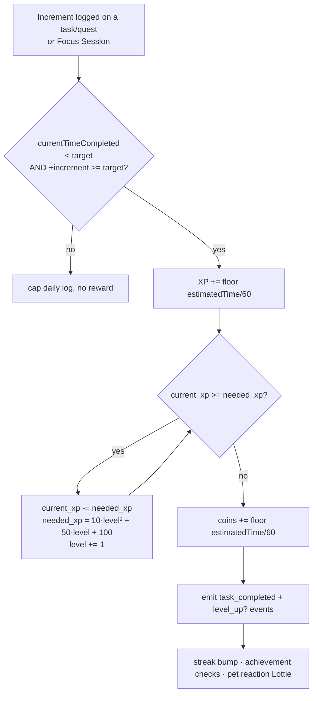
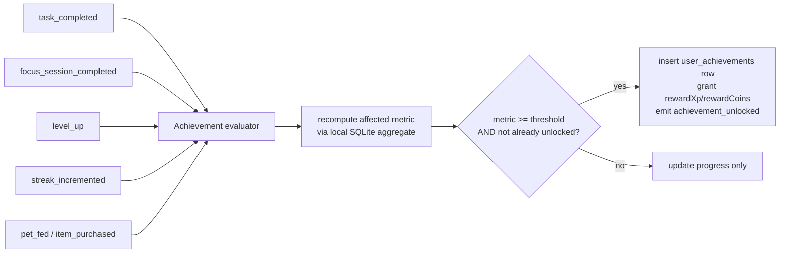

# Gamification: XP, Levels, Streaks & Achievements

> The user-progression layer: completing a task/quest earns **XP**, XP rolls up into a **Level** via a fixed threshold curve, and (proposed) **Streaks** and **Achievements** reward consistency — all separate from the companion's **Evolution stage**.

**Status vs legacy:** XP and Level are **[PRESERVE]** in concept but move **server→local** ([CHANGE]) — the whole reward engine ran inside one Postgres transaction (`task.repository.go` `UpdateTaskProgress`) and must be reimplemented as a local expo-sqlite/Zustand transaction. **Streaks** existed only as a monthly `checklists` habit grid, never as a coin/XP mechanic — the rebuild formalizes them **[NEW]/[DECIDE]**. **Achievements** are **greenfield [NEW]**: legacy migrated `achievement` + `userachievement` tables but shipped **zero** controller/route/repository/UI and no seed rows (a defined-but-dead feature). The legacy XP curve carries a real inconsistency (default `needed_xp = 150` vs formula value `160`) that must be resolved here.

## What it is

Pawductivity gamifies productivity on two independent axes that are easy to conflate:

- **User Level** (this skill) — the *person's* progression. Driven by **XP** earned by finishing work. Global to the account; never resets. Owns fields `level`, `current_xp`, `needed_xp` on the single user/profile row.
- **Companion Evolution stage** (see [pet-companion-system](../pet-companion-system/SKILL.md)) — the *pet's* growth **1–5**. In the rebuild this is a separate, pet-scoped mechanic. **Important legacy reality:** evolution did **not** exist in the old app at all — the numbered Lottie files `dog_1.json … dog_5.json` are the pet wearing each of the 5 purchasable **clothes**, NOT growth stages (legacy: `Pawductivity_App/lib/features/pet/.../pet_list.dart`). So "Evolution" is itself a [NEW]/[DECIDE] rebuild concept, and the only thing this skill asserts is that **Level and Evolution are distinct** and must not be wired to the same counter.

The reward loop is small and self-contained. On the exact increment where a task/quest's accumulated time first crosses its target, the engine: (1) adds XP, (2) runs a level-up carry loop, (3) grants coins. That single event is the integration point for the whole gamification surface (level-up celebration, streak bump, achievement checks, pet reaction Lottie).

## Core business rules

All formulas verified against `old/Pawductivity_BE/internal/repository/task.repository.go:430-476` and `database/migration/model/user.model.go:8-9`.

| # | Rule | Tag | Legacy source |
|---|------|-----|---------------|
| G1 | **XP source** = `estimatedTime / 60` (integer division; `estimatedTime` is **seconds**, so XP = whole minutes of the task's *estimate*). Awarded **once**, only on the crossing increment. | [PRESERVE] | `task.repository.go:434-435` |
| G2 | **Completion guard**: reward fires iff `currentTimeCompleted + increment >= estimatedTime && currentTimeCompleted < estimatedTime` — i.e. the increment that first reaches the target. No double-award on overshoot. | [PRESERVE] | `task.repository.go:431-432` |
| G3 | **Level-up carry loop**: `while (current_xp >= needed_xp) { current_xp -= needed_xp; needed_xp = 10*level² + 50*level + 100; level += 1; }`. Note the formula uses the **pre-increment** `level`. | [PRESERVE] | `task.repository.go:451-454` |
| G4 | **Threshold curve**: `needed_xp = 10·level² + 50·level + 100`. L1→2 = **160**, L2→3 = **240**, L3→4 = **340**, L4→5 = **460**, L5→6 = **600**. | [PRESERVE] | `task.repository.go:453` |
| G5 | **Seed defaults**: `level = 1`, `current_xp = 0`, `needed_xp = **150**`. The `150` **disagrees** with the L1 formula value **160** — the first threshold is inconsistent with every later one. **Resolve to 160** for consistency. | [CHANGE]/[DECIDE] | `user.model.go:8-9` |
| G6 | **Coins on completion** = `estimatedTime / 60` (same value as XP), granted via `buy_coins` in the *same* transaction as the XP/level-up. This is a **task-completion** grant, not strictly a level-up grant. | [PRESERVE] | `task.repository.go:470` |
| G7 | **No live coin grant *specifically* on level-up.** A SQL proc `level_up(user_id, task_time)` that would add `floor(task_time/600)*3` coins per level exists but is **commented out / never called** (dead code). | [DROP] | `pawductivity.sql:183-197` |
| G8 | **Minimum reward floor**: DB `CHECK (estimatedTime > 600)` (>10 min) ⇒ minimum XP/coins per task ≈ **10** (`611/60 = 10`). | [PRESERVE]/[DECIDE] | `pawductivity.sql:35` |
| G9 | **Reward is tied to the user-set *estimate***, not actual focus time (completion still requires logging that much time). With AI-set estimates this becomes exploitable — see New-app enhancements. | [DECIDE] | `task.repository.go:435` |
| G10 | **Streaks**: no XP/coin streak mechanic exists in legacy. The `checklists` table is a per-month `date int[]` grid of "completed" days (feeds calendar rendering only). Rebuild defines a real streak — see below. | [NEW] | `pawductivity.sql` (`checklists`), `daily_log.model.go` |
| G11 | **Achievements**: `achievement(name, requirements varchar[])` + `userachievement(achievementId, userId)` tables were migrated but have **no endpoints, no repository, no UI, and no seed rows**. `profile.dart` even carries a commented-out `// ProfileBadges(...)`. Treat as greenfield. | [NEW] | `achievement.model.go`, `user_achievement.model.go` |

### Worked example (verify the curve)

A user at `level=1, current_xp=0, needed_xp=160` completes a **1-hour** task (`estimatedTime=3600s`): XP `+= 3600/60 = 60` ⇒ `current_xp=60`. `60 < 160` ⇒ no level-up. Coins `+= 60`. Completing enough 1h tasks to reach 160 XP triggers one level-up to L2 with the new threshold 240. A **24h** task (`86400s`) grants **1440** XP and **1440** coins in one shot (rule G9 — confirm this is desired balance).

## Data & entities

Gamification state lives on the **single local profile/user row** plus two small tables. See [context/data-model/sqlite-schema.md](../../../context/data-model/sqlite-schema.md) and [entity-relationship.md](../../../context/data-model/entity-relationship.md).

| Field / table | Type | Notes | Tag |
|---|---|---|---|
| `users.level` | INTEGER default **1** | user Level, never resets | [PRESERVE] |
| `users.current_xp` | INTEGER default **0** | XP carried toward next level | [PRESERVE] |
| `users.needed_xp` | INTEGER default **160** | threshold to next level; **fix from 150** | [CHANGE] |
| `users.coins` | INTEGER default 0, `CHECK(coins>=0)` | owned by [coin-economy-and-shop](../coin-economy-and-shop/SKILL.md); mutated by G6 | [PRESERVE] |
| `streak` (MMKV/Zustand slice) | `{ current:int, longest:int, lastActiveDate:ISO }` | derived, recomputed on app open | [NEW] |
| `achievements` (SQLite, seeded catalog) | `id, key TEXT, name, description, metric TEXT, threshold INT, rewardCoins INT, rewardXp INT, hidden BOOL` | local definition table | [NEW] |
| `user_achievements` (SQLite) | `achievementId, unlockedAt INTEGER, progress INT` | one row per unlocked (or in-progress) achievement | [NEW] |

> Schema note: the legacy raw `pawductivity.sql` `users` table **omitted** `current_xp`/`needed_xp` (only the GORM AutoMigrate added them) — a legacy schema drift. Define these columns **once** in the new schema and be done with it. See [known-bugs-and-antipatterns](../../../context/legacy/known-bugs-and-antipatterns.md).

## Key flows

### Flow 1 — Earn XP & level up on task/quest completion (the core loop)

Steps (single local transaction — mirror the legacy one-transaction guarantee):
1. Upsert the per-day progress log, capped at target (owned by [task-quest-system](../task-quest-system/SKILL.md)).
2. Evaluate guard **G2** using the *pre-cap* accumulated time (the legacy code does this; keep boundary math identical to avoid the exact-equal off-by-one).
3. `current_xp += floor(estimatedTime/60)` (**G1**).
4. Run the carry loop **G3/G4** until `current_xp < needed_xp`. Each iteration may emit a `level_up` event.
5. `coins += floor(estimatedTime/60)` (**G6**), append a `purchases`/ledger row (see coin-economy).
6. Emit domain events for streak + achievements + pet reaction.

### Flow 2 — Streak update [NEW]/[DECIDE]

1. On the **first** completion of any task/quest or Focus Session in a local calendar day, read `streak.lastActiveDate`.
2. If `lastActiveDate == yesterday` ⇒ `current += 1`. If `== today` ⇒ no-op (already counted). Else (gap ≥ 1 full day) ⇒ `current = 1`.
3. `longest = max(longest, current)`; `lastActiveDate = today`.
4. On app open with no completion, recompute lazily: if `today - lastActiveDate > 1 day`, the streak is *at risk / broken* for display (do not silently zero until the day actually lapses — [DECIDE] grace rules).

### Flow 3 — Achievement engine [NEW]

Event-driven, fully local. A lightweight evaluator subscribes to the domain events emitted in Flow 1/2 and by other subsystems.

1. Each achievement declares a `metric` (a named counter/aggregate) and a `threshold`.
2. On a relevant event, recompute only the affected metric from local SQLite (e.g. `SELECT COUNT(*) FROM task_daily_logs WHERE timeCompleted>=estimatedTime`).
3. If `metric >= threshold` and no `user_achievements` row exists, unlock: insert row with `unlockedAt`, optionally grant `rewardCoins`/`rewardXp` (feeding back into Flow 1's economy), and emit `achievement_unlocked` (drives a badge toast + optional pet celebration Lottie).
4. Idempotent by construction (the "not already unlocked" guard). Re-running the evaluator never double-grants.

## Local-first rebuild guidance

| Legacy (server) | New app (local) | Tag |
|---|---|---|
| XP/level-up inside `UpdateTaskProgress` Postgres tx | TypeScript reward service in one `db.withTransactionAsync` / Zustand action; run the carry loop in JS | [CHANGE] |
| `users.current_xp/needed_xp/level` columns | Same columns on the single local `users` row (MMKV+Zustand mirror for instant reads) | [CHANGE] |
| `buy_coins` proc grants coins on completion | Local coin credit + ledger append in the *same* tx (see [coin-economy-and-shop](../coin-economy-and-shop/SKILL.md)) | [CHANGE] |
| `checklists` monthly grid (calendar only) | Derive streak from `task_daily_logs` completion dates; cache `{current,longest,lastActiveDate}` in MMKV | [NEW] |
| `achievement`/`userachievement` empty tables | Seeded local `achievements` catalog + `user_achievements`; event-driven evaluator | [NEW] |
| JWT `userId` scoping on every write | Single local profile; drop `userId` filtering | [DROP] |

Concurrency: rapid completions (e.g. background timer flushes) must not race the XP/coins update. Keep the whole reward mutation transaction-safe / serialized in the store action, exactly as the legacy single-transaction guaranteed.

## New-app enhancements

- **Resolve the reward source (G9).** Because the [ai-braindump-parser](../ai-braindump-parser/SKILL.md) (and AI estimation) can now set `estimatedTime`, letting Claude choose estimates means the AI indirectly controls XP/coin payout — trivially farmable. Options to [DECIDE]: (a) reward on **actual focus time** rather than the estimate; (b) **cap/normalize** AI estimates; (c) keep estimate-based but add a **daily earning cap** / diminishing returns.
- **Level-up celebration + pet reaction.** The `level_up` and `achievement_unlocked` events are natural triggers for the [ai-lottie-director](../ai-lottie-director/SKILL.md) / [lottie-animation-engine](../lottie-animation-engine/SKILL.md) to play a celebratory companion animation — keeping user Level *visible* on the pet without coupling it to Evolution stage.
- **Suggested starter achievement set** (all [NEW]/[DECIDE] — values illustrative, product to confirm): First Quest (1 task done), Focused (1 Focus Session), Consistent (3-day streak), Dedicated (7-day streak), Level 5, Level 10, Big Spender (spend 200 coins), Best Dressed (own 3 clothes), Well-Fed (feed the companion 10×). Reward small coin/XP bumps to keep the loop self-reinforcing.
- **Level ≠ Evolution.** User Level and Companion **Evolution stage** are distinct concepts (a Companion never has a "level"). The Evolution-stage *driver* is a `[DECIDE]` (see [pet-companion-system](../pet-companion-system/SKILL.md) §Evolution / D20): the **recommended default maps stages to user-Level bands** (one shared progression curve), with a **pet-scoped signal** (cumulative care/feeding or Focus time) as the alternative if pet growth should be able to diverge from user Level.

## Open decisions

- **[DECIDE]** First-level threshold: adopt formula-consistent **160** (drop legacy `150`)? (Recommended: yes.)
- **[DECIDE]** Reward basis: user-set **estimate** vs **actual focus time**; add earning cap / anti-farming? (G9)
- **[DECIDE]** Keep the **>10-min minimum** task duration (which set the ~10-coin reward floor), or drop it? (G8)
- **[DECIDE]** Grant **bonus coins on level-up** (revive the dead `level_up` `floor(task_time/600)*3` idea) or keep coins strictly = XP on completion? (G6/G7)
- **[DECIDE]** Streak definition: what counts as an "active day" (any completion? a Focus Session only?), grace/freeze rules, and whether streaks grant XP/coins. (G10)
- **[DECIDE]** Achievement catalog: exact list, thresholds, whether unlocks grant XP/coins, and whether any are hidden. (G11)
- **[DECIDE]** Does the rebuild even retain coins/level/XP gamification, or reframe entirely around the AI brain-dump + dynamic-Lottie pet? (Raised in auth finding — affects whether this whole subsystem survives.)
- **[DECIDE]** Adopt companion **Evolution stage** as a real mechanic, and if so what drives it (kept distinct from user Level).

These roll up into [context/02-open-decisions.md](../../../context/02-open-decisions.md).

## Legacy references

- `old/Pawductivity_BE/internal/repository/task.repository.go:430-476` — the live XP + level-up carry loop + coin grant (single Postgres tx).
- `old/Pawductivity_BE/database/migration/model/user.model.go:8-9` — `CurrentXP default 0`, `NeededXP default 150` (the 150-vs-160 drift).
- `old/Pawductivity_BE/database/script/pawductivity.sql:183-219` — dead `level_up` proc (`floor(task_time/600)*3`) and commented-out `complete_task` trigger.
- `old/Pawductivity_BE/database/migration/model/achievement.model.go`, `user_achievement.model.go` — migrated-but-dead achievement schema (`achievement.requirements varchar[]`).
- `old/Pawductivity_BE/database/script/pawductivity.sql:55-60` — `achievement` table DDL (no INSERT seeds found).
- `old/Pawductivity_App/lib/features/user/presentation/pages/profile.dart` — commented `// ProfileBadges(...)` stub.

## Related

- [task-quest-system](../task-quest-system/SKILL.md) — owns the completion event / progress logs that feed XP (G1/G2).
- [coin-economy-and-shop](../coin-economy-and-shop/SKILL.md) — coin grant (G6), ledger, spending.
- [pet-companion-system](../pet-companion-system/SKILL.md) — companion **Evolution stage** (distinct from user Level), health, feeding.
- [account-and-profile](../account-and-profile/SKILL.md) — owns the single user/profile row that stores `level/current_xp/needed_xp`.
- [ai-braindump-parser](../ai-braindump-parser/SKILL.md) / [ai-lottie-director](../ai-lottie-director/SKILL.md) — AI estimate source (reward-balance risk) and level-up/achievement celebration animations.
- [context/data-model/sqlite-schema.md](../../../context/data-model/sqlite-schema.md), [entity-relationship.md](../../../context/data-model/entity-relationship.md), [context/02-open-decisions.md](../../../context/02-open-decisions.md), [context/legacy/known-bugs-and-antipatterns.md](../../../context/legacy/known-bugs-and-antipatterns.md).
