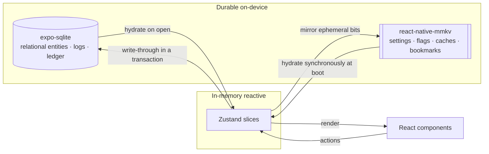
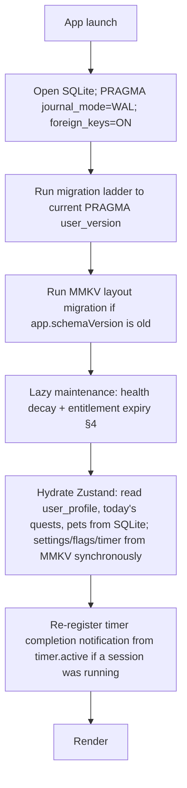
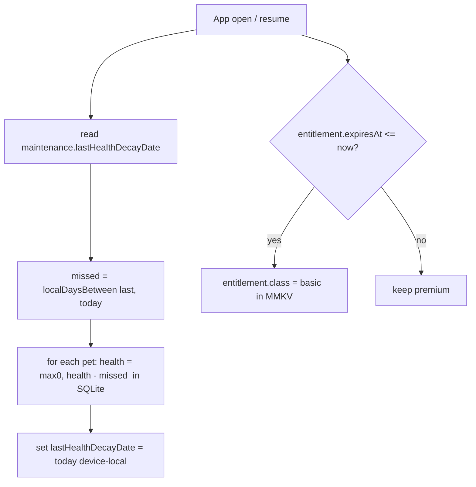

# Local-First Data Layer

> The backbone reference for all persistence in the rebuild. Pawductivity is **100% local-first**: there is no backend server. Every byte of durable state lives on the device across three cooperating stores — **expo-sqlite** (relational), **react-native-mmkv** (fast key/value), and **Zustand** (reactive in-memory). This skill defines *which store owns what*, *how mutations are transacted*, and *how the app stays correct offline*. The concrete DDL, MMKV key schema, and seed rows live in the `context/data-model/*` docs; this skill is the strategy and the rules that bind them.

Canonical vocabulary only: **Companion**, **Quest** (task/quest), **Focus Session**, **Coins**, **XP/Level**, **Entitlement**, **Inventory**, **Wardrobe**, **Local-first** ([glossary](../../../context/01-glossary.md)).

---

## Status vs legacy

**[CHANGE]** at the deepest level. The legacy stack was **online-first**: the authoritative data model lived entirely in a **Go/Postgres backend** (GORM `AutoMigrate` was the effective runtime schema, with a stale hand-written `pawductivity.sql` DDL alongside it), reached over a Gin REST API via retrofit/dio. The Flutter app's own on-device store (a Floor/SQLite DB, `app_database.dart` v1) was **vestigial** — only 4 lossy entities registered (Task, Food, Pet, User), with `CoinModel`/`ClothesModel`/`ActivityModel` annotated but tableless (dead code) — and the app's *real* client state sat in `flutter_secure_storage` used as an ad-hoc string bag (including a plaintext password — a security defect we delete).

The rebuild **inverts this**: the device is the source of truth. All the Postgres tables collapse into **one single-user expo-sqlite database** (no `userid`), server cron routines become **lazy on-open computations from timestamps**, and auth/JWT/AES/email/Midtrans are **dropped** (see [`../../../context/migration/backend-to-local-first.md`](../../../context/migration/backend-to-local-first.md)). This three-layer split is **[NEW]** — the legacy had no equivalent structure.

---

## What it is

Three stores, each with a distinct job. Choosing the wrong one is the most common and most damaging data mistake, so the decision rule below is non-negotiable.

| Store | Role | Holds | Access shape |
|---|---|---|---|
| **expo-sqlite** | Durable **relational** truth | user profile (coins/level/xp), tasks/quests, time logs, daily logs, pets, food/clothes inventory, equipped clothes, coin ledger, catalogs, reminders, pet usage | SQL, transactional, queryable/historical |
| **react-native-mmkv** | Durable **fast K/V** — settings, flags, caches, bookmarks | settings, onboarding flags, selected companion id, active-timer bookmark, entitlement cache, maintenance timestamps, pet-mood cache | synchronous scalar/JSON get/set at boot |
| **Zustand** | **Reactive** in-memory UI state | live coin balance, today's quests, live timer value, selected pet + equipped clothes, current mood | React hooks; hydrated from the two durable stores |



The full MMKV key schema and Zustand slice design live in [`../../../context/data-model/state-and-mmkv.md`](../../../context/data-model/state-and-mmkv.md); the full SQLite DDL lives in [`../../../context/data-model/sqlite-schema.md`](../../../context/data-model/sqlite-schema.md). This skill does **not** restate them — it governs how they are used together.

---

## Core business rules

### The store-selection decision rule (memorize this)

| Put it in… | When the value is… | Examples |
|---|---|---|
| **expo-sqlite** | Relational, queried, historical, or an entity the user **owns / earns / spends** | user row (coins/level/xp), quests, time & daily logs, pets, wardrobe, food inventory, coin ledger, catalogs, reminders |
| **react-native-mmkv** | Small, scalar-ish, needs a **synchronous read at startup**, ephemeral, or a **bookmark/cache** that can be recomputed | settings, onboarding flag, selected companion id, active-timer bookmark, entitlement cache, `last_health_decay` date, pet-mood cache |
| **Zustand** | Reactive UI state **derived** from the two durable stores; never the sole source of truth | live coin balance, today's quest list, live ticking timer, selected pet + equipped clothes, current mood |

**Golden rule — [PRESERVE] this invariant forever:** MMKV and Zustand hold only **derived, ephemeral, or bookmark** state. **If losing it would lose real user history or money, it belongs in SQLite.** Coins, XP, level, owned items, and completed-time logs are **authoritative in SQLite**; MMKV/Zustand only cache or mirror them. The one deliberate money-adjacent exception is `entitlement.*` in MMKV — a *cache* of a billing-resolved status, not a ledger.

### Offline-first principles

| # | Principle | Tag |
|---|---|---|
| 1 | **No network on the critical path.** Every read/write the user triggers is a local SQLite query or MMKV get/set. There is no server round-trip to fail, retry, or time out. | [CHANGE] |
| 2 | **Timestamps, not daemons.** Legacy nightly cron jobs (health decay, membership expiry) become **lazy computation on app open/resume** from stored timestamps — idempotent and catch-up-correct. See [Key flows §4](#4-lazy-maintenance-on-app-open). | [CHANGE] |
| 3 | **Never trust tick counts across suspension.** The live timer reconciles from the wall clock (`startedAt`), never from a decrementing counter. See [focus-timer-and-background](../focus-timer-and-background/SKILL.md). | [CHANGE] |
| 4 | **Money/XP mutate only inside a SQLite transaction**, invoked by a Zustand action, then the store re-reads the row. They never live only in memory or a KV blob. | [CHANGE] |
| 5 | **Device clock is the only clock.** All maintenance uses **device-local** time (fixes the legacy shared-server-timezone bug). | [CHANGE] |
| 6 | **The single remote touchpoint is billing.** IAP receipt validation is the one thing that legitimately wants a remote (store SDK), and its result is cached in MMKV so the app degrades to `basic` offline. | [CHANGE]/[DECIDE] |

### Ground-truth economy constants (verified against `old/` — restate consistently)

These are the numbers any data-mutation code must honor. Verified in `Pawductivity_BE/internal/repository/task.repository.go` and `database/script/pawductivity.sql`.

| Rule | Value | Source | Tag |
|---|---|---|---|
| XP granted on quest completion | `estimatedTime / 60` (whole minutes) | `task.repository.go:434` | [PRESERVE] |
| Level-up curve | `needed_xp = 10·level² + 50·level + 100` | `task.repository.go:451` | [PRESERVE] |
| `needed_xp` seed **bug** | seeded `150` but formula yields `160` at L1 → seed **160** | `user.model.go` vs `:451` | [CHANGE] |
| Coins granted on completion (actual) | `estimatedTime / 60` via `buy_coins` | `task.repository.go:470` | [PRESERVE]/[DECIDE] |
| Coin reward **preview** (display, disagrees) | `FLOOR(estimatedTime / 60 / 3)` | `task.repository.go:234` | [DECIDE] |
| Quest min length | `estimatedTime > 600` seconds (10 min) | `pawductivity.sql:36` | [DECIDE] |
| Pet health decay | `-1 / day` at local midnight, floored at 0 | `decreasePetHealth.routine.go` | [CHANGE] |
| Health cap on feeding | `min(health + food.heal, 100)` | `animal.repository.go` FeedPet | [PRESERVE] |
| Referral reward | `+100` coins to **both** parties | `referral.repository.go:55` | [DECIDE] |
| DB CHECK invariants | `coins >= 0`, `price >= 0`, `health >= 0` | `pawductivity.sql` | [PRESERVE] |

> **[DECIDE] — resolve once, app-wide:** the actual grant (`estimatedTime/60`) and the list preview (`FLOOR(estimatedTime/60/3)`) contradict each other. Pick ONE and make ledger + display use the same value. Tracked in [`../../../context/02-open-decisions.md`](../../../context/02-open-decisions.md) and owned by [gamification-xp-levels](../gamification-xp-levels/SKILL.md).

---

## Data & entities

This skill owns the **layer boundaries**, not the columns. The authoritative definitions:

| What | Where | Doc |
|---|---|---|
| All relational tables (CREATE TABLE DDL, indices, migrations) | expo-sqlite | [`sqlite-schema.md`](../../../context/data-model/sqlite-schema.md) |
| Narrative entity graph / ERD | — | [`entity-relationship.md`](../../../context/data-model/entity-relationship.md) |
| MMKV key schema + Zustand slice design | mmkv + Zustand | [`state-and-mmkv.md`](../../../context/data-model/state-and-mmkv.md) |
| Seed rows for `animal`/`food`/`clothes` catalogs | expo-sqlite | [`seed-catalogs.md`](../../../context/data-model/seed-catalogs.md) |

### What lives in each store (summary)

**expo-sqlite** (single-user; `userid` dropped everywhere):
`user_profile` (one row, `id=1`) · `task` + `checklist_item` · `daily_log` · `time_log` · `reminder` · `animal` (catalog) · `pet` · `food` (catalog) · `food_inventory` · `clothes` (catalog) · `clothes_inventory` · `pet_clothes` · `coin_ledger` · `pet_usage` · optional `achievement`/`user_achievement`.

**react-native-mmkv** (single instance id `pawductivity`, dotted-namespace flat keys):
`settings.*` · `onboarding.*` / `app.*` · `companion.selectedPetId/Index` · `pet.moodCache` · `timer.active` (JSON bookmark) · `entitlement.*` · `maintenance.lastHealthDecayDate` / `maintenance.lastMembershipCheckAt` · `app.schemaVersion`.

**Zustand** slices: `useSettingsStore` · `useProfileStore` · `useTaskStore` · `useCompanionStore` · `useTimerStore` · `useEntitlementStore`. Each hydrates from a durable store and writes through to it.

### What must NOT go in MMKV/Zustand (SQLite-only)

- **Coins, level, current_xp, needed_xp** — authoritative in `user_profile`; MMKV/Zustand only cache for display.
- **Owned entities** — pets, wardrobe garments, food inventory, equipped clothes.
- **History/logs** — `time_log`, `daily_log`, `coin_ledger` (drive summary/heatmap; must be queryable).
- **Quests, reminders, catalogs** — relational and queried.

---

## Key flows

### 1. Boot & hydration



- **`PRAGMA foreign_keys = ON` must be asserted on every opened connection** — expo-sqlite does not enable FK enforcement by default, and it is not a stored setting.
- MMKV reads are **synchronous**, so settings/theme/timer bookmark are available before the first paint (no flash of default theme).

### 2. Write-through mutation (the transaction pattern) — porting `buy_coins` + `level_up`

The legacy reward path was a Postgres transaction calling the `buy_coins` stored procedure and running an inline XP loop (the SQL `level_up()` proc was **dead/divergent** — do not port it). In the rebuild this is a **single expo-sqlite transaction** invoked by a Zustand action; after commit, the store re-reads `user_profile` so the UI re-renders. Coins and XP **never** live only in Zustand.

```ts
// applyTaskReward — Zustand action; ONE SQLite transaction; mirrors the legacy
// task.repository.go:434-470 reward logic, with the two legacy bugs fixed.
// Verified constants: XP/coins = floor(estimatedTime/60); needed_xp = 10L²+50L+100.
function applyTaskReward(db: SQLiteDatabase, taskId: number, estimatedTimeSec: number) {
  const minutes = Math.floor(estimatedTimeSec / 60);      // XP and coins both = minutes
  db.withTransactionSync(() => {
    const u = db.getFirstSync<Profile>('SELECT coins, level, current_xp, needed_xp FROM user_profile WHERE id = 1')!;

    // --- XP + level-up loop (was task.repository.go:451-454) ---
    let { level, current_xp, needed_xp } = u;
    current_xp += minutes;
    while (current_xp >= needed_xp) {
      current_xp -= needed_xp;
      level += 1;
      needed_xp = 10 * level * level + 50 * level + 100;   // seed also 160 at L1 (drift #5 fixed)
    }

    // --- coins grant (was CALL buy_coins) ---
    const coins = u.coins + minutes;                        // CHECK coins >= 0 still enforced

    db.runSync(
      'UPDATE user_profile SET coins=?, level=?, current_xp=?, needed_xp=?, updated_at=unixepoch()*1000 WHERE id=1',
      [coins, level, current_xp, needed_xp],
    );
    // --- signed ledger row (replaces positive-only purchases(type='coins')) ---
    db.runSync(
      "INSERT INTO coin_ledger(delta, reason, ref_id, balance_after) VALUES (?, 'task_reward', ?, ?)",
      [minutes, taskId, coins],
    );
  });
  // re-read so useProfileStore re-renders
  return db.getFirstSync<Profile>('SELECT * FROM user_profile WHERE id = 1');
}
```

Rules this pattern enforces, applied to **every** money/XP/ownership mutation:

- **One transaction per user action.** Purchase = deduct coins + insert inventory row + write ledger, all atomic (legacy `buy_item`, `purchase.repository.go`). Never partial.
- **Signed ledger.** `coin_ledger.delta` is `+grant / -spend` (fixes the legacy `purchases` bug where grants and spends were both stored as positive `price`, direction implied only by `type`).
- **Real quantity columns.** `food_inventory.quantity` and `clothes_inventory` replace the legacy fragile one-row-per-item + `COUNT(*)` pattern.
- **Purchase gates preserved:** reject if `coins < price` ("insufficient coins"), reject premium item when not entitled ("premium content"), reject buying an already-owned species — all inside the transaction.
- **Fix the referral double-grant bug** if referral is kept: legacy swallowed the second `err` and had no redemption cap ([DECIDE], see [referral-system](../referral-system/SKILL.md)).

### 3. Stats & analytics query patterns

Legacy analytics were server SQL (`generate_series` windows, `GROUP BY tag`, 2-hour `time_log` buckets, month calendars). They **port directly** to expo-sqlite as **on-device aggregate queries** — no Amplitude, no server ([DROP] remote analytics). Key translations:

| Legacy (Postgres) | Local (expo-sqlite) |
|---|---|
| `generate_series(now-6d, now)` 7-day window | recursive CTE, or build the day array in TS and bind it |
| `EXTRACT(DOW)` weekday math | `strftime('%w', date)` |
| `TO_DATE` / `DATE` columns | `TEXT 'YYYY-MM-DD'` compared/grouped via `strftime` |
| tag summary `GROUP BY tasktag` | `SELECT tag, SUM(time_completed) FROM daily_log JOIN task … GROUP BY tag` |
| 2-hour timeline buckets over `task_log` | bucket `time_log.logged_at` by `strftime('%H', …)/2` |
| month-completion calendar (legacy `checklist` int[]) | **derived** from `daily_log` on demand — the legacy monthly `checklist` table is [DROP] |
| `pet_usage` totalHours = `SUM(hoursUsed)/3600` | `SUM(seconds_used)/3600` (column renamed — legacy `hoursUsed` actually stored **seconds**) |

Index support for these lives in [`sqlite-schema.md` §9](../../../context/data-model/sqlite-schema.md). Full analytics spec: [analytics-and-insights](../analytics-and-insights/SKILL.md).

### 4. Lazy maintenance on app open

Replaces both legacy server goroutines (`decreasePetHealth`, `checkMembership`) with pure on-device computation — no daemon, and it correctly **catches up days missed** while the app was closed (fixing the legacy stateless-cron missed-midnight bug).



- Health decay reads `pet.last_health_decay_at` (SQLite) / `maintenance.lastHealthDecayDate` (MMKV), applies `health = max(0, health − missedMidnights)`, then stamps today. **Device** timezone.
- Entitlement expiry: premium iff `entitlement.expiresAt > now`; else downgrade the cached class to `basic`. No cron.
- An optional `expo-background-task` daily wake can pre-warm this, but **lazy-on-open is the robust baseline**. Detail: [`state-and-mmkv.md` §6](../../../context/data-model/state-and-mmkv.md).

### 5. Schema migrations

expo-sqlite has **no built-in migration framework**. Use `PRAGMA user_version` as the schema version and run an idempotent, ordered, **forward-only** migration ladder inside a transaction on app start (drizzle-orm wraps the same mechanism if chosen — pick one and stay consistent).

- **v1** = every `CREATE TABLE`/`CREATE INDEX` + catalog seed inserts (`INSERT OR IGNORE`) + `INSERT INTO user_profile(id) VALUES (1)`.
- Migrations are **append-only** — never edit a shipped migration; add a new one. No down-migrations on device.
- SQLite `ALTER TABLE` is add-column/rename only; for a table rebuild use the 12-step create-copy-drop-rename pattern in one transaction.
- Re-assert `PRAGMA foreign_keys = ON` per connection.
- **MMKV has its own layout guard:** `app.schemaVersion`. On boot, if the stored version is older, run a small key rename/backfill before hydrating Zustand.

Full runner pseudocode: [`sqlite-schema.md` §10](../../../context/data-model/sqlite-schema.md).

---

## Local-first rebuild guidance

How each legacy server/remote piece becomes local (the cheatsheet; full mapping in [`../../../context/migration/backend-to-local-first.md`](../../../context/migration/backend-to-local-first.md)):

| Legacy (server) | Local-first replacement | Tag |
|---|---|---|
| Postgres (GORM + `pawductivity.sql`) | **one** expo-sqlite schema + migration ladder; drop `userid`; resolve the GORM-vs-SQL drift by including drifted columns from day one | [CHANGE] |
| REST + retrofit/dio | direct expo-sqlite queries via a repository/DAO layer (raw expo-sqlite or drizzle) | [CHANGE] |
| Stored procs `buy_coins` / `level_up` | TS Zustand action inside one SQLite transaction (see Key flows §2); pick ONE reward formula | [CHANGE]/[DECIDE] |
| Postgres ENUMs | TS string-literal unions + `CHECK (col IN (…))` | [CHANGE] |
| `boolean[]` / `int[]` arrays | bitmask INTEGER (weekday `repetition` 0–127) or child rows | [CHANGE] |
| Server midnight cron (decay, expiry) | lazy on-open computation from timestamps (Key flows §4) | [CHANGE] |
| `flutter_secure_storage` string bag | MMKV keys (nothing is secret after auth is dropped); plaintext password **deleted** | [CHANGE]/[DROP] |
| Auth: JWT/AES/bcrypt/email OTP | single local profile row; **no** accounts/tokens for MVP | [DROP]/[DECIDE] |
| Google Play receipt verification | IAP SDK (react-native-iap / RevenueCat); resolved entitlement cached in MMKV | [CHANGE]/[DECIDE] |
| Midtrans orders, referral coin-grant | dropped or deferred (meaningless without a shared backend) | [DROP]/[DECIDE] |
| Amplitude analytics | on-device SQLite aggregate queries; remote analytics dropped | [DROP] |

**Legacy defects this layer fixes** (see [`../../../context/legacy/known-bugs-and-antipatterns.md`](../../../context/legacy/known-bugs-and-antipatterns.md)):
GORM/SQL schema drift; `needed_xp` 150-vs-160 seed mismatch; reward display-vs-grant contradiction; inventory `COUNT(*)`-of-rows fragility; positive-only coin ledger; `pet_usage.hoursUsed` misnamed (stored seconds); missed-midnight cron + shared server timezone; plaintext password in secure storage; timer `remaining_time` decrementing counter.

---

## New-app enhancements

- **[NEW] Brain Dump → rows.** The client-side [ai-braindump-parser](../ai-braindump-parser/SKILL.md) turns free text into `task` rows (`name`, `estimated_time` seconds, `due_date`, `tag`, `repetition` bitmask, `kind`) inserted via the same local task-creation path. `task.created_by_ai` flags provenance.
- **[NEW] Signed coin ledger with `reason`** enables honest, queryable earn/spend history the legacy positive-only `purchases` table could not express.
- **[NEW] Reset-all / delete-my-data** — a single action that wipes the MMKV instance **and** the SQLite DB, satisfying the data-deletion right the legacy privacy policy promised but never implemented. See [account-and-profile](../account-and-profile/SKILL.md).
- **[NEW] WAL + partial indices** (`WHERE completed = 0`) for fast "today's open quests" reads.

---

## Open decisions

- **[DECIDE]** Reward formula: actual grant `estimatedTime/60` vs display `FLOOR(estimatedTime/60/3)` — pick one for ledger **and** display.
- **[DECIDE]** Keep the `estimated_time > 600` (10-minute) quest floor, or allow short AI-parsed quests?
- **[DECIDE]** Starting inventory: is `200 coins + a free Cat` intended, or an artifact of the legacy signup `buy_coins` misuse?
- **[DECIDE]** Drop task **versioning** for good (mutate in place), or keep an edit-history requirement? (No multi-device sync ⇒ no obvious need.)
- **[DECIDE]** Single-device only, or is eventual **cloud sync** expected? Sync would reintroduce an identity/version concept and change every "drop userid" call above.
- **[DECIDE]** Are `achievement`/`user_achievement` in scope (stubbed in legacy)?
- **[DECIDE]** Referral without a backend: drop, cosmetic share-a-code, or defer to future sync?
- **[DECIDE]** MMKV encryption: none needed for MVP (nothing is secret); revisit only if accounts/sync return.

All roll up into [`../../../context/02-open-decisions.md`](../../../context/02-open-decisions.md).

---

## Legacy references

- `old/Pawductivity_BE/database/script/pawductivity.sql` — hand-written DDL, `buy_coins`/dead `level_up` procs, ENUM types, seed data (partially **stale**).
- `old/Pawductivity_BE/database/migration/migration.go` + `database/migration/model/*.go` — GORM `AutoMigrate` (effective runtime schema).
- `old/Pawductivity_BE/internal/repository/task.repository.go` — XP curve (`:451`), coin grant (`:470`), reward preview (`:234`), daily-log upsert cap (`:416`).
- `old/Pawductivity_BE/internal/repository/purchase.repository.go` — `buy_item`/`buy_coins`, purchase gating.
- `old/Pawductivity_BE/internal/repository/food.repository.go` — `COUNT(*)`-based inventory quantity (the anti-pattern we replace).
- `old/Pawductivity_BE/internal/routines/decreasePetHealth.routine.go`, `checkMembership.routine.go` — the midnight crons → lazy on-open.
- `old/Pawductivity_App/lib/database/app_database.dart` — vestigial Floor DB (4 registered entities).
- `old/Pawductivity_App/lib/features/*/data/model/*.dart` — lossy local models superseded by the new schema.

---

## Related

- [`../../../context/data-model/sqlite-schema.md`](../../../context/data-model/sqlite-schema.md) — the canonical relational DDL, indices, migrations.
- [`../../../context/data-model/state-and-mmkv.md`](../../../context/data-model/state-and-mmkv.md) — MMKV key schema + Zustand slice design.
- [`../../../context/data-model/entity-relationship.md`](../../../context/data-model/entity-relationship.md) — narrative ERD.
- [`../../../context/data-model/seed-catalogs.md`](../../../context/data-model/seed-catalogs.md) — seed rows for animal/food/clothes.
- [`../../../context/migration/backend-to-local-first.md`](../../../context/migration/backend-to-local-first.md) — server → on-device mapping strategy.
- [`../../../context/migration/flutter-to-react-native.md`](../../../context/migration/flutter-to-react-native.md) — Flutter/Floor → RN/Expo state layer.
- [`../../../context/legacy/known-bugs-and-antipatterns.md`](../../../context/legacy/known-bugs-and-antipatterns.md) — the legacy data defects this layer fixes.
- [`../../../context/02-open-decisions.md`](../../../context/02-open-decisions.md) — the `[DECIDE]` items above.
- Skills: [gamification-xp-levels](../gamification-xp-levels/SKILL.md) · [task-quest-system](../task-quest-system/SKILL.md) · [coin-economy-and-shop](../coin-economy-and-shop/SKILL.md) · [food-and-feeding](../food-and-feeding/SKILL.md) · [clothes-and-wardrobe](../clothes-and-wardrobe/SKILL.md) · [pet-companion-system](../pet-companion-system/SKILL.md) · [focus-timer-and-background](../focus-timer-and-background/SKILL.md) · [premium-and-monetization](../premium-and-monetization/SKILL.md) · [analytics-and-insights](../analytics-and-insights/SKILL.md) · [account-and-profile](../account-and-profile/SKILL.md) · [ai-braindump-parser](../ai-braindump-parser/SKILL.md).
