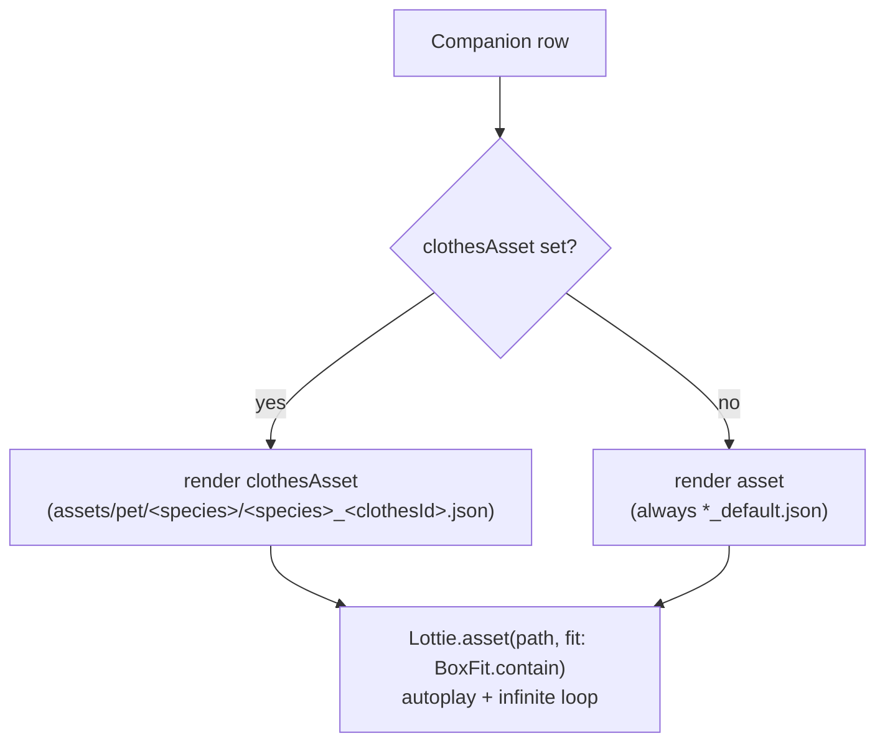

# Lottie Animation Engine

> This skill owns the **mechanism**: how a Companion Lottie file is chosen, rendered, recolored, sped, and segmented on-device via `lottie-react-native`. It is the low-level engine the **AI director drives** — the director *decides* ("streak hit 7, glow gold, play a happy bounce"); this engine *executes* (swap file / apply `colorFilters` / `play(from,to)` / set `speed`). The decision policy, prompt, and Health/Mood→intent mapping live in [ai-lottie-director](../ai-lottie-director/SKILL.md). The Companion domain model (Health, Mood, Species, Evolution stage, Feeding, Equipping) lives in [pet-companion-system](../pet-companion-system/SKILL.md). Palette tokens and the gold/effect colors this engine applies come from [design-system-and-theming](../design-system-and-theming/SKILL.md).

Canonical vocabulary only: **Companion**, **Species**, **Evolution stage**, **Health**, **Mood**, **Clothes/Cosmetic**, **Equipping**, **Lottie** ([glossary](../../../context/01-glossary.md)). Note "Level" is a *user* concept — a Companion never has a level, only an **Evolution stage**.

---

## 1. TL;DR — the rebuild rules

| # | Rule | Tag |
|---|---|---|
| R1 | **The bundled assets are 100% embedded raster PNGs — zero vector shapes.** Every pet layer is an image (`ty:2`) referencing a base64 PNG asset; there is not a single fill/stroke (`ty:'fl'`/`'st'`) in any file. **`colorFilters`/dynamic recolor has NOTHING to recolor on these assets.** Dynamic tinting (aura→gold on streak) requires **new vector-authored** Lottie assets, or a non-Lottie tint overlay. | **[NEW]** / **[DECIDE]** |
| R2 | Legacy rendering is **dead-simple and state-blind**: `Lottie.asset(path, fit: BoxFit.contain)` — autoplay, infinite loop, **no controller, no speed, no segments, no recolor**. Health/Mood/stage never touched the animation. The whole "state-driven" layer is **[NEW]**. | **[PRESERVE]** (the raw render) / **[NEW]** (the driving) |
| R3 | **File selection today = `Species` + `clothesId`**, not stage or mood. `clothesAsset || asset`; `asset` is always `*_default`. The numbered `*_1..*_5` files are **clothing variants**, not evolution stages. | **[PRESERVE]** (mechanism) |
| R4 | The rebuild **reinterprets** `*_default, *_1..*_5` as first-class **Evolution stages** (glossary §3). What *advances* a stage (XP / Focus time / Health) is unresolved, and clothing then needs a **new** representation (overlay layer or recolor, not a whole file). | **[CHANGE]** / **[DECIDE]** |
| R5 | Two manipulation channels: **(A) runtime props** on `<LottieView>` (`speed`, `progress`, `loop`, `colorFilters`, ref `.play(from,to)`) — cheap, no remount; **(B) source-JSON mutation** — deep-edit the parsed Lottie object and pass it as a new `source` (remounts). The **AI director emits (B)**; moment-to-moment reactions use (A). | **[NEW]** |
| R6 | Lottie color is **`[r,g,b,a]` normalized 0–1**, not 0–255 (gold `#FFD700` → `[1, 0.843, 0, 1]`). All JSON color mutation and any authored fill must use this form. | **[PRESERVE]** (format) |
| R7 | Files carry **no markers** (`markers: []`) → there are **no named segments**. Segment/loop control must address **raw frame numbers** against `fr:30, ip:0, op:480` (a 16 s clip). Author markers into new assets if you want named segments. | **[PRESERVE]** / **[NEW]** |
| R8 | Ship **one** pet-renderer component. Legacy had ≥5 copy-pasted `Lottie.asset` call sites (`pet_list`, `task_timer_pet_display`, `pet_display_widget`, `favorite_pet_chart`, `profile_pet_item`), each re-deriving `clothesAsset || asset`. | **[CHANGE]** |

---

## 2. The bundled Companion asset set

Location: `old/Pawductivity_App/assets/pet/<species>/`. Three species, six files each.

| Species | `animalId` / `speciesId` | Directory | Files | Premium |
|---|---|---|---|---|
| **Dog** | 1 | `assets/pet/dog/` | `dog_default.json`, `dog_1.json` … `dog_5.json` | no (100¢) |
| **Cat** | 2 | `assets/pet/cat/` | `cat_default.json`, `cat_1.json` … `cat_5.json` | no (200¢) |
| **Rabbit** | 3 | `assets/pet/rabbit/` | `rabbit_default.json`, `rabbit_1.json` … `rabbit_5.json` | yes (200¢) |

Also `assets/pet/{dog,cat,rabbit}.png` (static shop thumbnails) and `assets/pet/pet_home.png` (room background). (Species catalog: `config/constant/pet.dart:1-5`; glossary §3 line 64.)

**What the numbered files actually are.** `cat_default` has **13 layers**; `cat_1` has **16** — the extra three are `baju badan` (a body shirt) plus `lengan kanna` / `lengan kiri` (clothed/sleeved arms). So `*_1..*_5` are the **base body wearing successive clothing outfits**, selected by `clothesId`, **not** growth stages. The rebuild glossary promotes them to "Evolution stage" as a *reinterpretation* (§3 R4) — do not assume the art depicts growth; it depicts outfits.

Uniform envelope across every file (verified):

| Prop | Value | Meaning |
|---|---|---|
| `v` | `5.12.2` | Bodymovin/Lottie schema version |
| `fr` | `30` | frame rate (fps) |
| `ip` / `op` | `0` / `480` | in/out point → **16.0 s** clip (`(op-ip)/fr`) |
| `w` × `h` | **species-dependent (NOT uniform)** — dog `1500`×`1500` (square, 1.0); cat/rabbit `1080`×`1500` (~0.72) | canvas aspect differs by species |
| `nm` | `kucing` / `anjing` / `kelinci` | comp name (cat/dog/rabbit, Indonesian) |
| `markers` | `[]` | **no named segments** (see R7) |
| `assets` | 16–22 entries | **all embedded base64 PNGs** (`e:1`, `p:"data:image/png;base64,…"`) + 1 precomp |

> **Aspect-ratio caveat (verified):** dog files are **square 1500×1500** while cat/rabbit are **portrait 1080×1500**. The single `<CompanionAnimation>` component (checklist §8) must **not** assume one aspect ratio across species when sizing/aligning with `resizeMode="contain"` — size from each file's own `w`/`h`, or the dog will letterbox/misalign against a portrait-tuned frame.

---

## 3. How state selects a file **today** (the current mechanism)

Legacy has **no** mood/stage/health influence on animation. Selection is purely Species + equipped clothing:



- `PetEntity{ id, animalId, name, health(0–100), asset, premium, clothesAsset }` — **no `mood`, no `stage`, no `level`** (`features/pet/domain/entities/pet.dart`). Health exists but never feeds the renderer.
- Path builder: `_generateLottieAssetPath(animalId, clothesId)` → `clothesId <= 0 ? '<species>_default.json' : '<species>_<clothesId>.json'` (`features/pet/presentation/widget/equip_clothes_listener.dart:197-219`).
- Every render site collapses to `clothesAsset.isEmpty ? asset : clothesAsset` then `Lottie.asset(path, fit: BoxFit.contain)` (e.g. `.../task_timer/task_timer_pet_display.dart:38`, `pet_list.dart:329`, `old_widget/pet_display_widget.dart:100`).
- Health changes only mutate a number + a bar (`newHealth = (health + food.stats).clamp(0,100)` at `feed_pet_listener.dart:110`). **The pet looks identical at Health 5 and Health 100.**

**Rebuild target state → file/manipulation split** (the model this engine must implement; drivers are [DECIDE], owned by [pet-companion-system](../pet-companion-system/SKILL.md) / [ai-lottie-director](../ai-lottie-director/SKILL.md)):

| State input | Selects / drives | Channel |
|---|---|---|
| **Species** | which directory (`dog`/`cat`/`rabbit`) | file (`source`) |
| **Evolution stage** | which file `*_default / *_1..*_5` (reinterpreted, R4) | file (`source`) |
| **Clothes** | overlay / recolor — *new* representation once files are stages (R4) | ideally a layer/`colorFilters`, not a whole file **[DECIDE]** |
| **Mood** (happy/sad/sleepy…) | which **frame segment** to `play(from,to)` and whether/how to loop | prop A: `ref.play` + `loop` |
| **Health** (0–100) | animation **speed** (lethargic when low) and mood bias | prop A: `speed` |
| **Streak / completion event** | one-shot celebration segment, then return to idle; effect tint | props A + source B |

---

## 4. Relevant Lottie JSON structure (what you actually manipulate)

A Lottie file is one JSON document. The fields this engine reads or mutates:

```jsonc
{
  "v": "5.12.2", "fr": 30, "ip": 0, "op": 480,   // schema, fps, in/out frames
  "w": 1080, "h": 1500, "nm": "kucing",
  "assets": [                                     // reusable images + precomps
    { "id":"image_0", "w":330, "h":56, "e":1,
      "p":"data:image/png;base64,iVBORw0K…" },    // EMBEDDED raster sprite (a body part)
    { "id":"comp_0", "nm":"kucing motion (1)", "layers":[ /* precomp layers */ ] }
  ],
  "layers": [                                     // z-ordered, back→front by array order
    { "ty":2, "ind":23, "nm":"badan",  "refId":"image_5",  "ks":{ /* transform */ } },
    { "ty":0, "ind":5,  "nm":"kuning kanna", "refId":"comp_0" }
  ],
  "markers": []                                   // named segments — EMPTY in every pet file
}
```

**Layer types (`ty`) seen in the pet files** — every pet layer is one of:

| `ty` | Kind | In these assets | Recolorable via `colorFilters`? |
|---|---|---|---|
| `2` | **Image layer** (references an `assets` PNG via `refId`) | the vast majority (body, head, ears, arms, tail, legs, clothing, eyes, mouth) | **No** — raster |
| `0` | **Precomp layer** (references a nested comp of more image layers) | 1 per file (e.g. `kuning kanna` → `comp_0 "kucing motion"`, itself 4 image layers) | **No** — still raster inside |
| `4` | **Shape layer** (vector: `it[]` groups containing `fl`/`st` fills/strokes) | **absent** — the recolorable kind | Yes (if present) |

**Layer names are Indonesian** and stable across stages, so keypaths are predictable if you author shape versions. Cheat-sheet: `kepala`=head, `badan`=body, `mulut`=mouth, `kumis/kumiis`=whiskers, `kuping kiri/kanan`=ears, `tangan`=hand, `lengan`=arm, `kaki`=leg, `ekor`=tail, `mata putih`=white eye, `hidung orange`=orange nose, `eyes merem`=closed/blink eyes, `baju badan`=body shirt, `kuning kanna/kiri`=yellow cheeks.

### Color arrays — the `[r,g,b,a]` 0–1 format
In a *vector* Lottie, a solid fill is a shape item `{"ty":"fl","nm":"gold fill","c":{"a":0,"k":[r,g,b,a]}}` where **each channel is normalized 0.0–1.0**, not 0–255. Conversion: `channel/255`. Examples the effects layer would use:

| Intent | Hex | Lottie `c.k` = `[r,g,b,a]` |
|---|---|---|
| Streak gold aura | `#FFD700` | `[1, 0.843, 0, 1]` |
| Sad/low-Health blue | `#4F86C6` | `[0.31, 0.525, 0.776, 1]` |
| Happy warm | `#FF9F45` | `[1, 0.624, 0.271, 1]` |

`c.a:0` = static color; `c.a:1` = animated (keyframed `k` array). To recolor by JSON mutation you overwrite `c.k`. **Reminder (R1): the bundled files contain zero such fills**, so this only applies to newly authored vector assets or an added effects layer. Pull the exact gold/mood hex from [design-system-and-theming](../design-system-and-theming/SKILL.md); do not hard-code palette here.

---

## 5. Dynamic manipulation with `lottie-react-native`

`<LottieView>` exposes two channels. Use **A** for live reactions; the **AI director produces B**.

### 5A. Runtime props & ref methods (cheap — no remount)

```tsx
import LottieView from 'lottie-react-native';
const ref = useRef<LottieView>(null);

<LottieView
  ref={ref}
  source={require('assets/pet/cat/cat_default.json')} // or a mutated JS object (5B)
  autoPlay={false}
  loop={mood === 'idle'}          // loop idle; one-shot celebrations set loop=false
  speed={healthSpeed(health)}      // <1 lethargic, 1 normal, >1 excited; negative = reverse
  resizeMode="contain"             // 'cover' | 'contain' | 'center'  (legacy used contain)
  progress={controlledProgress}    // OPTIONAL: drive frames yourself (Animated/Reanimated 0..1)
  colorFilters={[                  // recolors matching SHAPE layers only (see limits)
    { keypath: 'aura', color: '#FFD700' },
  ]}
  onAnimationFinish={onFinish}     // fires when a non-looping play/segment ends
/>
```

Imperative segment / playback control via the ref (frame-addressed, since there are no markers):

| Goal | Call | Notes |
|---|---|---|
| Play whole clip | `ref.current.play()` | 0→`op` (480), then loop if `loop` |
| **Play a segment** (mood pose) | `ref.current.play(startFrame, endFrame)` | e.g. a "happy bounce" authored at frames `120–200` → `play(120,200)` |
| Reverse | `speed={-1}` or `play(end,start)` | negative speed supported on both platforms |
| Pause / resume | `ref.current.pause()` / `.resume()` | |
| Restart | `ref.current.reset()` | back to first frame |
| Idle after celebration | in `onAnimationFinish`, `play(idleFrom,idleTo)` with `loop` re-enabled | compose a one-shot + return-to-loop |

**Mapping recipes (mechanics only; the director picks the inputs):**

- **Mood → segment + loop.** Define frame windows per mood in new assets (or per-file for stage art), `play(from,to)`; loop only calm/idle moods, one-shot expressive ones then fall back to idle in `onAnimationFinish`.
- **Health → speed.** `healthSpeed(h) = clamp(0.4 + 0.6*(h/100), 0.4, 1.0)` (example): near-0 Health drags to 0.4×; full Health plays at 1.0×. Excited spikes (task complete) can momentarily push `speed>1`.
- **Streak/completion → recolor + celebrate.** Apply a gold `colorFilters` entry (needs an `aura` **shape** layer) *or* JSON-mutate an effects fill's `c.k` to `[1,0.843,0,1]` (5B), and `play(celebrateFrom,celebrateTo)` once.

### 5B. Source-JSON mutation (the AI-director channel — remounts)

`lottie-react-native` does **not** expose lottie-web's arbitrary per-keypath property API (no `updateDocumentData`, no runtime keypath value injection beyond color/text filters). For anything richer, **mutate the parsed Lottie object and pass it as a new `source`** — React re-mounts `<LottieView>` with the new document. This is exactly CLAUDE.md rule 3: *"the AI Lottie Director mutates bundled Lottie JSON on-device."*

```ts
// director output → engine: a shallow-cloned, mutated Lottie doc
const doc = structuredClone(baseCatDefault);
doc.op = 200;                                   // trim to a 6.7s loop segment
for (const layer of doc.layers) {               // recolor an authored effects fill
  if (layer.nm === 'aura') setFillColor(layer, [1, 0.843, 0, 1]); // [r,g,b,a] 0–1
  if (layer.nm === 'baju badan') layer.ks.o = { a:0, k:0 };       // hide clothing (opacity 0)
}
setSource(doc); // triggers remount
```

Common safe mutations: `ip`/`op` (segment/trim), per-layer opacity `ks.o` (show/hide clothing or effects), fill `c.k` on **shape** layers (recolor), swapping an `assets[i].p` base64 (reskin a sprite). Keep mutations **structure-preserving** and validate before mount — a malformed doc renders blank. Prefer channel **A** for high-frequency changes; reserve **B** for discrete director-driven restyles, because each source swap unmounts/reloads.

---

## 6. Capabilities & limits of `lottie-react-native` (know before you promise)

| Capability | Supported? | Caveat |
|---|---|---|
| Autoplay / infinite loop / `speed` / `resizeMode` | ✅ | `speed` may be negative (reverse). |
| Controlled `progress` (drive frames yourself) | ✅ | Pair with `Animated`/Reanimated; do **not** also set `autoPlay`. |
| Imperative `play(from,to)` / `reset` / `pause` / `resume` | ✅ | Frame-addressed; **no marker-name API** in RN. |
| `onAnimationFinish` / `onAnimationLoaded` | ✅ | `onAnimationFinish` only fires when not looping. |
| `colorFilters` (`{keypath,color}`) | ✅ **but** | Recolors **fill/stroke of vector shape layers only**. **No effect on image (`ty:2`) or precomp layers** → useless on the current pet assets (R1). `keypath` matches layer name; nested-path support is partial/flaky across platforms. |
| Text replacement (`textFiltersAndroid`/`textFiltersIOS`) | ✅ | Not relevant to pets (no text layers). |
| Arbitrary runtime keypath property injection (position, scale, opacity, gradient at runtime) | ❌ | Not available in RN (unlike lottie-web). Achieve via **source-JSON mutation** (5B) instead. |
| Named segments / markers by name | ❌ | Use frame numbers; author `markers` if you need names, and read them in JS. |
| Recoloring embedded raster images | ❌ | `colorFilters` can't touch PNGs. Use vector art, or a separate RN tint overlay (`tintColor`/blend view) composited above the animation. |
| Rendering perf with big base64 PNGs | ⚠️ | Each pet embeds 16–22 PNGs inline (large JSON). Prefer optimizing/externalizing images and mounting one instance; avoid many simultaneous `<LottieView>`s. |
| Platform parity | ⚠️ | Android (Lottie-Android) vs iOS (lottie-ios) differ subtly on `colorFilters` keypath depth, `renderMode`, and some effects. Test both; keep effects simple. |

**Consequence for the "aura → gold on streak" requirement:** it is a **[NEW]** capability that the current assets cannot satisfy. To deliver it, either (a) author/redraw the effect (and any recolorable body part) as **vector shape layers** so `colorFilters`/`c.k` mutation works, or (b) composite a **non-Lottie tint/glow overlay** (RN view with `tintColor`/gradient/blur) above the raster pet. Flag as **[DECIDE]** with the design system.

---

## 7. Legacy pitfalls → rebuild guardrails

| Legacy pitfall | Source | Guardrail |
|---|---|---|
| Renderer ignores Health/Mood/stage — pet looks identical at any state | all `Lottie.asset` sites | Introduce the state→file/props/source model (§3). **[NEW]** |
| ≥5 duplicated `clothesAsset ?? asset` + `Lottie.asset` call sites | `pet_list.dart:329`, `task_timer_pet_display.dart:38`, `pet_display_widget.dart:100`, `favorite_pet_chart.dart:169/254`, `profile_pet_item.dart:33` | One `<CompanionAnimation>` component; selection logic in one place. **[CHANGE]** |
| `*_1..*_5` are clothing yet glossary calls them Evolution stages | `equip_clothes_listener.dart:197-219`; glossary §3 | Decide clothing-vs-stage semantics before building; if stages, clothing needs a new overlay/recolor representation. **[DECIDE]** |
| Assets are all-raster → no dynamic recolor possible | every `assets/pet/**/*.json` (0 vector fills) | Author vector assets or a tint overlay for aura/mood color. **[DECIDE]/[NEW]** |
| No markers → "play the happy part" has nothing to name | `markers:[]` in every file | Address frames (`play(from,to)`), or author markers into new art. **[NEW]** |
| Huge inline base64 PNGs bloat each JSON | image assets with `p:"data:image/png;base64,…"` | Optimize/externalize sprites; mount a single instance. **[CHANGE]** |
| `BoxFit.contain` + manual `Positioned`/`bottomCenter` floor alignment scattered per screen | `pet_list.dart:322-333` | Centralize sizing/alignment in the one component; `resizeMode="contain"`. **[CHANGE]** |

---

## 8. Rebuild checklist

- [ ] One `<CompanionAnimation>` component: inputs `{ species, stage, clothes, mood, health, event? }` → resolves `source` + props; replaces all legacy `Lottie.asset` sites.
- [ ] File resolver: `species→dir`, `stage→(_default|_1..5)`; keep the `animalId` map (1=dog,2=cat,3=rabbit) but rename to `speciesId`.
- [ ] Runtime channel (A): `speed = healthSpeed(health)`, `loop` per mood, `ref.play(from,to)` for mood/celebration segments, `onAnimationFinish` → return to idle loop.
- [ ] Director channel (B): accept a mutated Lottie **object** as `source`; a small `mutateLottie(doc, ops)` helper for `ip/op`, layer `ks.o`, fill `c.k` ([r,g,b,a] 0–1); validate before mount; throttle source swaps.
- [ ] Effects/recolor: **[DECIDE]** vector-authored `aura`/mood layer (then `colorFilters`) vs. RN tint overlay — because raster assets can't be recolored (R1).
- [ ] Segment map: since `markers:[]`, define named frame windows (idle/happy/sad/celebrate) in code against `fr:30, op:480`; author `markers` into any new art.
- [ ] Perf: single mounted instance where possible; optimize the embedded PNGs; test Android + iOS `colorFilters`/`renderMode` parity.
- [ ] Colors always pulled from design tokens, expressed as `[r,g,b,a]` 0–1 for JSON, hex for `colorFilters`.

---

## 9. Open decisions ([DECIDE])

Engine-specific; the app-wide ones are consolidated in [context/02-open-decisions.md](../../../context/02-open-decisions.md).

1. **Recolor/aura strategy (R1)** — the bundled assets are 100% raster, so `colorFilters`/`c.k` mutation has nothing to recolor. Deliver dynamic tint/aura (streak gold, mood hue) by **(a)** re-authoring effect/body parts as vector shape layers, or **(b)** compositing a non-Lottie RN tint/glow overlay above the raster pet. Owned jointly with [design-system-and-theming](../design-system-and-theming/SKILL.md).
2. **Clothing-vs-stage semantics (R4)** — legacy `*_1..*_5` are **clothing outfits** selected by `clothesId`, but the glossary reinterprets them as Evolution stages. If they become stages, clothing needs a **new** overlay/recolor representation, not a whole-file swap. Ties to D21 (wardrobe scope).
3. **Evolution driver** — what *advances* a stage (user level / cumulative Focus time / Health / feeds / days owned) is unresolved. Rolls up to D20 (recommended default: tie stages to level milestones).

---

## Related

- [ai-lottie-director](../ai-lottie-director/SKILL.md) — **primary consumer.** Decides *what* to render/recolor/segment from Health+Mood+events and emits the mutated Lottie source (channel B) + prop intents this engine executes.
- [pet-companion-system](../pet-companion-system/SKILL.md) — the Companion domain: `PetEntity` (Health, Species, clothes), Evolution-stage and Mood definitions, feeding/equipping that change what this engine renders.
- [design-system-and-theming](../design-system-and-theming/SKILL.md) — palette tokens (streak gold, mood hues) consumed as hex (`colorFilters`) / `[r,g,b,a]` (JSON), and the tint-overlay approach if recolor stays non-vector.
- [focus-timer-and-background](../focus-timer-and-background/SKILL.md) — the Companion locked to a Focus Session (`lockedPetId`) is rendered by this engine; completion events drive reactions.
- [task-quest-system](../task-quest-system/SKILL.md) — quest-completion / streak / level-up events that the director turns into animations.
- [context/01-glossary.md](../../../context/01-glossary.md) — Companion, Species, Evolution stage, Health, Mood, Lottie (§3, §6).
- [context/02-open-decisions.md](../../../context/02-open-decisions.md) — Evolution driver, Health decay, clothing-vs-stage, recolor strategy.
- Legacy sources: `Pawductivity_App/assets/pet/{dog,cat,rabbit}/*.json`; `lib/config/constant/pet.dart`; `lib/features/pet/presentation/widget/equip_clothes_listener.dart:197-219`; `lib/features/pet/domain/entities/pet.dart`; render sites `pet_list.dart:329`, `features/task/presentation/widgets/task_timer/task_timer_pet_display.dart:38`.
