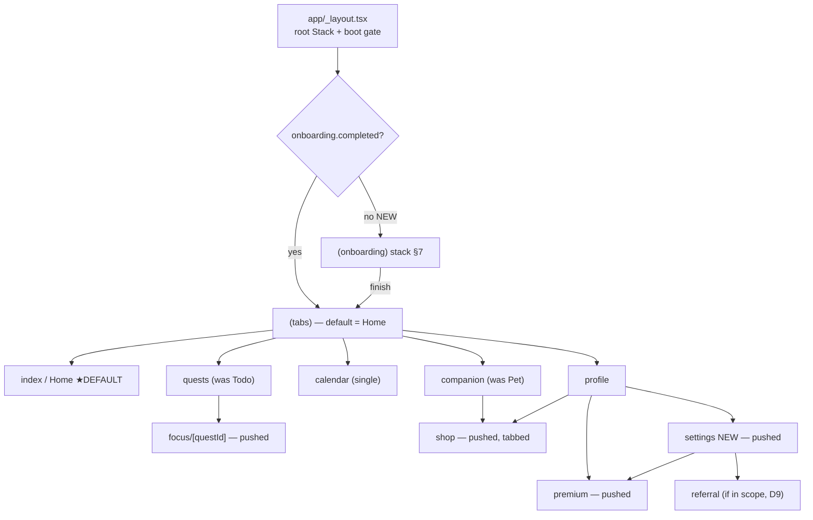
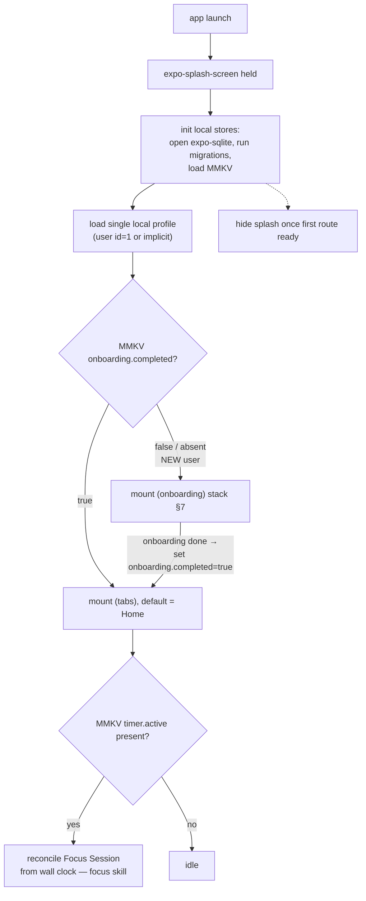
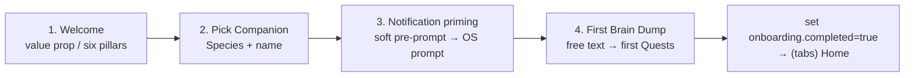

# Navigation & App Shell

> This skill owns the **top-level UX skeleton**: the boot sequence, the root navigator, the tab set, and how every screen hangs off it. It is the forward-looking counterpart to the verified legacy graph in [context/legacy/navigation-map.md](../../../context/legacy/navigation-map.md) — read that first for the exact legacy route table and dead-screen inventory; this skill proposes what replaces it. Per-screen business logic lives in the subsystem skills (Quests, Companion, Shop, Focus, etc.); this skill only decides **which screens exist and how you get between them**.

Canonical vocabulary only: **Companion**, **Quest**, **Focus Session**, **Brain Dump**, **Coins**, **Shop**, **Wardrobe**, **Premium/Entitlement**, **Membership class**, **Local-first** ([glossary](../../../context/01-glossary.md)). Never write "pet", "task", "todo", or "login" as user-facing nouns.

---

## 1. TL;DR — the rebuild rules

| # | Rule | Tag |
|---|---|---|
| R1 | **One navigator, one route tree.** Collapse the legacy dual system (a `PageView` shell **and** a `onGenerateRoute` named-route table **and** scattered `Navigator.push`) into a single `expo-router` file tree. No screen has two divergent instances. | **[CHANGE]** |
| R2 | **No auth gate at cold start.** There is no splash → JWT round-trip → RegisterPage/AppNavbar branch. Boot loads the single **local profile** and branches only on **"has onboarding run?"**. | **[DROP]** (auth gate) / **[CHANGE]** |
| R3 | **Keep a bottom-tab shell, default to Home.** Preserve the 5-tab feel and the Home-as-landing default, re-named to canonical vocabulary. The exact tab list is a **[DECIDE]** (see §5). | **[PRESERVE]** (in spirit) / **[DECIDE]** |
| R4 | **One Calendar, one Shop, one Focus screen.** Every legacy duplicate (two calendars, four standalone shops vs. the tabbed shop, three timer screens) reconciles to a single screen. | **[CHANGE]** |
| R5 | **Drop every dead surface.** `welcome.dart`, `profile_old.dart`, `/shop-health` (HealthShop placeholder), the Midtrans payment WebView, and the entire auth-pages cluster are not ported. | **[DROP]** |
| R6 | **Add a real first-run onboarding.** Legacy onboarding was dead (an abandoned `smooth_page_indicator` dep + an unreachable `welcome.dart`). Ship a genuine flow: welcome → pick Companion → notification priming → first Brain Dump. | **[NEW]** |
| R7 | **Add Settings.** No Settings/edit-profile/delete-account screen ever existed. Profile's edit / premium / refer buttons were empty `() {}` no-ops. Build them for real. | **[NEW]** |
| R8 | **Focus Session and Shop are pushed screens, not tabs** (recommended). They open on top of the tab shell and dismiss back to it. Whether either earns a dedicated tab is a **[DECIDE]**. | **[CHANGE]** / **[DECIDE]** |

---

## 2. Legacy recap (what we are replacing)

The legacy Flutter app ran **two parallel navigation mechanisms at once** (legacy: `Pawductivity_App/lib/main.dart`, `lib/theme/app_navbar.dart`, `lib/config/routes/routes.dart`). Full verified detail in [navigation-map.md](../../../context/legacy/navigation-map.md); the essentials:

### 2a. The 5-tab shell (`AppNavbar`)

A `PageView` with `PageController(initialPage: 2)` and a custom 5-button bottom bar (verified legacy: `lib/theme/app_navbar.dart:16`, `36-50`, `71-75`). Tapping a tab `jumpToPage`s the single `PageView` — **there is no per-tab navigation stack**.

| Idx | Legacy tab | Widget / file | Nav icon | Canonical rename |
|-----|-----------|---------------|----------|------------------|
| 0 | Todo | `TodoPage` (`todo_page.dart`) | `assets/nav/todo.png` | **Quests** |
| 1 | Calendar | `CalendarPage` (`calendar_page.dart`) | `assets/nav/calender.png` | **Calendar** |
| 2 | **Home ★default** | `HomeScreen` (`home_screen.dart`) | `assets/nav/home.png` | **Home** |
| 3 | Pet | `Pet` (`pet_home.dart`) | `assets/nav/paw.png` | **Companion** |
| 4 | Profile | `ProfilePage` (`profile.dart`) | `assets/nav/profil.png` | **Profile** |

`initialPage: 2` → **Home is the default landing tab** (verified). Home also fired a runtime notification-permission request (`Permission.notification.request()`, legacy: `home_screen.dart:81-82`) — and note the call site is **commented out** (`// _requestNotificationPermissions();`, `home_screen.dart:49`), with no manifest `POST_NOTIFICATIONS` behind it. The rebuild moves that prompt into onboarding priming (§7) — see [notifications-and-permissions](../notifications-and-permissions/SKILL.md).

### 2b. The vestigial named-route table

`AppRoutes.onGenerateRoutes` registered `/`, `/register`, `/home`, `/todo`, `/calendar`, `/profile`, `/shop`, `/shop-pet`, `/shop-food`, `/shop-wardrobe`, `/shop-health` (legacy: `lib/config/routes/routes.dart`). Crucially, **the shell and the route table are disjoint instances** — the running app almost never pushes `/home`/`/todo`/`/calendar`/`/profile`; those named routes are dead weight next to the `PageView`. The default `switch` branch returned `LoginPage` for any unknown name.

### 2c. Cold start = an auth gate

`main()` → native splash → `runApp(MultiBlocProvider[~20 blocs])` → `UnifiedSplashScreen` calls `GetUserInfo` with the stored JWT and branches: `RemoteUserInfo` → `AppNavbar`; `RemoteUserError` → **RegisterPage** (legacy: `lib/main.dart`, verified in [navigation-map §1](../../../context/legacy/navigation-map.md)). First launch dropped the user straight into sign-up. All of this is **[DROP]** — see [account-and-profile](../account-and-profile/SKILL.md).

### 2d. Dead / duplicate screens (do NOT port)

| Screen(s) | Problem | Action |
|-----------|---------|--------|
| `welcome.dart` (WelcomePage) | ☠️ Referenced only by itself; boot bypassed it entirely. | **[DROP]** → replace with real onboarding (§7). |
| `profile.dart` vs `profile_old.dart` | Old profile impl left in tree. | **[DROP]** `_old`; keep one Profile. |
| `calendar_page.dart` (tab 1) vs `calendar_screen.dart` (`/calendar`) | Two divergent calendar screens. | **[CHANGE]** → one Calendar. See [reminders-and-calendar](../reminders-and-calendar/SKILL.md). |
| `/shop-health` → `HealthShop` | ☠️ Pure placeholder: a grid of cards labelled "Item 0..19", typo'd font `"Poppin"`, no data/purchase. | **[DROP]**; whether a consumable "potion/health" category exists is a **[DECIDE]** ([coin-economy-and-shop](../coin-economy-and-shop/SKILL.md)). |
| `pet_shop` / `food_shop` / `wardrobe_shop` standalone routes vs `shop.dart` (unified tabbed) | Four per-category shops coexist with the tabbed shop. | **[CHANGE]** → one tabbed Shop (§6). |
| `task_timer_page` / `task_management_screen` / `task_screen_old` | Three parallel timer screens. | **[CHANGE]** → one Focus Session screen. See [focus-timer-and-background](../focus-timer-and-background/SKILL.md). |
| Auth cluster (`login`, `register`, `verification`, `forgot_password`, `request_code`) | Whole account system. | **[DROP]** — no accounts in v1. |
| `payment.dart` / `payment_web_view.dart` (Midtrans Snap) | Shipped, off the live flow, never detects payment success. | **[DROP]** → native IAP only ([premium-and-monetization](../premium-and-monetization/SKILL.md)). |

---

## 3. Proposed expo-router tree

One coherent file tree — no dual routing, no dead screens. Recommended layout:

```
app/
├── _layout.tsx              # root Stack + boot gate (§4). Renders (onboarding) or (tabs).
├── index.tsx                # tiny boot/redirect screen: run gate, then redirect
├── (onboarding)/            # [NEW] first-run only (§7); skipped once completed
│   ├── _layout.tsx          #   Stack (headerless, swipe-locked, page-indicator)
│   ├── welcome.tsx          #   value prop / six pillars
│   ├── companion.tsx        #   pick Species + name (first Companion)
│   ├── notifications.tsx    #   priming → OS permission prompt
│   └── braindump.tsx        #   first Brain Dump → first Quests
├── (tabs)/                  # the bottom-tab shell (§5); default = index (Home)
│   ├── _layout.tsx          #   <Tabs>, default route = index
│   ├── index.tsx            #   Home ★DEFAULT (dashboard: Companion snapshot, stats, today)
│   ├── quests.tsx           #   Quests list (legacy Todo)
│   ├── calendar.tsx         #   single Calendar (reconciles the two legacy screens)
│   ├── companion.tsx        #   Companion home (legacy Pet)
│   └── profile.tsx          #   Profile → entry to Settings / Shop / Premium
├── focus/[questId].tsx      # Focus Session screen — pushed, full-screen (§6, R8)
├── shop/                    # single tabbed Shop — pushed (§6)
│   └── index.tsx            #   segmented: Companions / Food / Wardrobe
├── settings/                # [NEW] pushed from Profile (§6, R7)
│   ├── index.tsx            #   edit name/avatar, notifications, data, about/legal
│   └── data.tsx             #   export / reset / delete-all (local-first)
├── premium.tsx              # paywall — pushed from Profile/Settings + premium locks
├── quest/[id].tsx           # Quest detail (replaces legacy detail dialogs)
└── +not-found.tsx           # replaces the legacy "unknown route → LoginPage" default
```

Notes:
- **`(onboarding)` and `(tabs)` are sibling route groups** under the root Stack; the boot gate (§4) picks which one is mounted. This is the expo-router equivalent of the legacy splash branch, minus the network round-trip.
- **`focus`, `shop`, `settings`, `premium`, `quest/[id]` are pushed over the tabs**, so the bottom bar can stay (or be hidden per screen). This is the single biggest structural change from legacy, where these were either standalone `Navigator.pushNamed` routes or ad-hoc `MaterialPageRoute` pushes with weak/broken entry points.



---

## 4. Cold-start flow (NO auth gate)

The rebuild boot is a **local read + one flag check**. There is no JWT, no `/api/user` call, no RegisterPage landing.



Verified contrasts with legacy (legacy: `lib/main.dart`, [navigation-map §1](../../../context/legacy/navigation-map.md)):

| Legacy boot step | Rebuild | Tag |
|---|---|---|
| `FlutterNativeSplash.preserve()` + `UnifiedSplashScreen` as the auth gate | `expo-splash-screen` held only until SQLite/MMKV are ready — **UI gate, not auth gate** | **[CHANGE]** |
| `initializeDependencies()` wiring a `get_it` container of retrofit/dio network services | No DI container of network services; open local DB + MMKV | **[DROP]** / **[CHANGE]** |
| `setupBackgroundService()` at boot (foreground service) | No background service at boot. Focus recovery is lazy timestamp math on the Focus screen | **[DROP]** — see [focus-timer-and-background](../focus-timer-and-background/SKILL.md) |
| `GetUserInfo` (JWT) → `RemoteUserInfo`/`RemoteUserError` branch | Load local profile; **always succeeds** (single on-device identity) | **[DROP]** (JWT) / **[CHANGE]** |
| `RemoteUserError` → **RegisterPage** | New user → **onboarding**, not sign-up | **[CHANGE]** |
| `AutoVerifySubscriptionEvent` + `fetchProducts()` on **every** cold start | Read cached entitlement from MMKV; re-verify lazily/only when needed | **[CHANGE]** — see [premium-and-monetization](../premium-and-monetization/SKILL.md) |

**Boot gate rule:** the *only* branch is `onboarding.completed`. Everything else (profile, entitlement, active timer) is loaded, not gated on. Keep the gate synchronous and cheap so the splash hides fast; do heavier work (entitlement re-check, Focus reconcile) after the first route paints.

> **[DECIDE] D1 — account model.** Recommended default: a **local anonymous profile**, with an *optional* account purely for cloud backup (never required to use the app). If/when an optional account ships, it is a **screen inside Settings**, never a boot gate. Rolled up as D1/D2/D3 in [02-open-decisions](../../../context/02-open-decisions.md).

---

## 5. The tab set (reconciling the 5 legacy tabs)

**Recommended: keep 5 bottom tabs, Home default**, renamed to canonical vocabulary:

| Idx | Tab | Route | Was (legacy) | Notes |
|-----|-----|-------|--------------|-------|
| 0 | **Home** ★default | `(tabs)/index` | HomeScreen | Dashboard: Companion snapshot + Health/Mood, today's Quests, streak, stats card. |
| 1 | **Quests** | `(tabs)/quests` | TodoPage | The Quest list; entry to create via **Brain Dump** and to start a **Focus Session**. |
| 2 | **Calendar** | `(tabs)/calendar` | CalendarPage / CalendarScreen | The single reconciled calendar. |
| 3 | **Companion** | `(tabs)/companion` | Pet (`pet_home`) | Companion home; entry to Feeding / Wardrobe / Shop. |
| 4 | **Profile** | `(tabs)/profile` | ProfilePage | Entry to Settings, Shop, Premium, Referral. |

### 5a. [DECIDE] Should Home and Quests (Todo) merge?

Legacy Home (stats + weekly activity) and Todo (the task list) are **distinct surfaces**. Two defensible directions — this is a genuine **[DECIDE]** (raise as a new item alongside D34/D35 in [02-open-decisions](../../../context/02-open-decisions.md)):

- **Option A — keep both (recommended).** Home = a *dashboard* (Companion + stats + today at a glance); Quests = the full list/creation surface. Preserves the legacy 5-tab muscle memory and gives Home a clear "glanceable" role distinct from the working list.
- **Option B — merge into one "Today/Home" tab.** Home becomes the Quest list *with* the Companion + stats header, freeing a 5th slot for **Shop** or **Focus** as a tab. Fewer tabs, but conflates "review my day" with "grind my list", and loses the calm landing screen.

**Recommendation:** Option A. Keep them separate; do **not** promote Focus or Shop to a tab by default (§6, R8). If playtest shows Home and Quests feel redundant, collapse to Option B rather than shipping a 6th tab.

### 5b. Shell mechanics [CHANGE]

- Each tab gets its **own navigation stack** (expo-router does this per-group automatically), fixing the legacy "single `PageView`, no per-tab stack" limitation where every tab shared one back-history.
- Default route is Home via the `(tabs)/index` file — the expo-router equivalent of `initialPage: 2`. **[PRESERVE]**.
- Nav icons: reuse the legacy asset intents (todo/calendar/home/paw/profile) re-drawn to the new design tokens ([design-system-and-theming](../design-system-and-theming/SKILL.md)); do not port the raw legacy PNGs 1:1.
- An **active Focus Session** surfaces as a persistent mini-bar above the tab bar (tap → `focus/[questId]`), so the running timer is reachable from any tab. **[NEW]**.

---

## 6. Where Shop / Premium / Settings / Focus live

| Surface | Placement | Reached from | Rationale | Tag |
|---|---|---|---|---|
| **Focus Session** | Full-screen pushed route `focus/[questId]` (recommended; **[DECIDE]** whether it earns a tab) | Start a Focus quest from Quests/Home; persistent mini-bar re-enters it | It is *one run of one Quest*, not a top-level destination. Legacy had 3 competing timer screens — ship exactly one. | **[CHANGE]** / **[DECIDE]** |
| **Shop** (single, tabbed) | Pushed route `shop/index` with segments **Companions / Food / Wardrobe** | Companion tab (buy Food/Wardrobe for it) **and** Profile; Coins balance tap | Reconciles the four standalone legacy shop routes + the unified tabbed shop into one. `/shop-health` placeholder is dropped. | **[CHANGE]** / **[DROP]** (`/shop-health`) |
| **Premium (paywall)** | Pushed route `premium.tsx` | Profile, Settings, and every premium **feature-lock** in-context | Legacy's only Premium entry (`onExplorePremium`) was a dead `() {}` no-op — genuinely wire it, plus contextual paywalls. Native IAP only; no Midtrans WebView. | **[NEW]** entry / **[CHANGE]** rail |
| **Settings** | Pushed route group `settings/` | Profile | No Settings screen ever existed. Houses: edit name/avatar, notification toggles, **data export / reset / delete-all** (the data-deletion right the legacy Privacy Policy promised but never built), about/legal, and the optional-account entry (D1). | **[NEW]** |
| **Referral** | Pushed from Profile/Settings (only if kept) | Profile/Settings | Legacy `onReferAndEarn` was a dead no-op; referral needs a server, so it is deferred. | **[DECIDE]** (D9) / **[NEW]** entry |

Legacy references: Profile's `onEditProfile` / `onExplorePremium` / `onReferAndEarn` are all empty `() {}` (legacy: `.../profile_widget/profile_navigation.dart`, [navigation-map §5](../../../context/legacy/navigation-map.md)); the only working profile mutation was the avatar `profile_index` (0–6) via `PATCH /user/profile` — becomes a local write. Details in [account-and-profile](../account-and-profile/SKILL.md). Shop/Premium economics in [coin-economy-and-shop](../coin-economy-and-shop/SKILL.md) and [premium-and-monetization](../premium-and-monetization/SKILL.md).

> **[DECIDE] Does Focus and/or Shop deserve a tab?** Default: **no** — both are pushed. Promote to a tab only if playtest shows they are visited constantly, and only by adopting Home+Quests merge (§5a Option B) to avoid a 6th tab. Raise alongside §5a in [02-open-decisions](../../../context/02-open-decisions.md).

---

## 7. First-run onboarding [NEW]

Legacy onboarding was **dead**: `welcome.dart` was referenced only by itself and the boot flow bypassed it, and the `smooth_page_indicator: ^1.2.1` dependency (verified: `pubspec.yaml:74`) is a fossil of an intended-but-unbuilt onboarding carousel. The rebuild ships a real, four-step flow — the app's activation funnel — as the `(onboarding)` stack, shown once when `MMKV onboarding.completed` is false.



| # | Step | What happens | Cross-link | Notes |
|---|------|--------------|-----------|-------|
| 1 | **Welcome** | Logo, tagline, and the product's six marketed pillars (Virtual Pet, Calendar, Coins, Shop, Level, Timer) as a short value-prop carousel. Replaces the dead `welcome.dart`. | — | Uses a page indicator (the role `smooth_page_indicator` was meant to fill). Skippable to step 2. |
| 2 | **Pick Companion** | Choose a **Species** (Dog / Cat / Rabbit) and **name** it; this creates the user's first Companion row. | [pet-companion-system](../pet-companion-system/SKILL.md) | The first Companion is **granted free** regardless of legacy price/premium gating — do **not** paywall the very first Companion. Whether Rabbit (premium) is offered as the *first* pick is a **[DECIDE]** tied to D19; recommended default: offer Dog/Cat free at first-run, Rabbit unlockable later. |
| 3 | **Notification priming** | A **soft pre-prompt** explaining *why* (Focus completion alerts + Reminders), then trigger the OS permission request. Do not fire the OS dialog cold. | [notifications-and-permissions](../notifications-and-permissions/SKILL.md) | Fixes the legacy bug where the runtime prompt was commented out and had no `POST_NOTIFICATIONS` manifest entry (`home_screen.dart:49,81-82`). Declining is fine — re-prompt just-in-time later (D29). |
| 4 | **First Brain Dump** | Invite the user to dump a few thoughts; the **Parser** turns them into the first **Quests**, seeding a non-empty Quests tab. | [ai-braindump-parser](../ai-braindump-parser/SKILL.md) | The activation moment — the user lands on a populated app, not an empty list. Skippable. If AI is deferred (D22), fall back to a plain "add your first quest" form. |

On completion: set `MMKV onboarding.completed = true`, then replace the stack with `(tabs)` (Home). Never show onboarding again unless the user does a full data reset (Settings → data). Onboarding must be **fully offline** — no step may block on a network call (step 4's parser degrades to manual entry if AI is unavailable).

Legacy contrast: legacy first-launch dropped users into **RegisterPage** (an account wall). The rebuild's first-launch is **product value**, no account required. **[NEW]**.

---

## 8. Legacy pitfalls → rebuild guardrails

| Legacy pitfall | Legacy source | Guardrail |
|---|---|---|
| Two navigation systems (PageView shell + named routes) with disjoint instances | `app_navbar.dart` + `routes.dart` | One expo-router tree; every screen has exactly one instance. **[CHANGE]** |
| Unknown route → silently returns `LoginPage` | `routes.dart` default `switch` branch | `+not-found.tsx`; no auth fallback. **[CHANGE]** |
| Cold start is a JWT auth gate; first launch = RegisterPage | `main.dart`, `UnifiedSplashScreen` | Boot loads local profile; branch only on onboarding flag. **[DROP]**/**[CHANGE]** |
| Notification prompt commented out, no `POST_NOTIFICATIONS` manifest | `home_screen.dart:49,81-82` | Prime in onboarding step 3 with a soft pre-prompt; declare permissions via Expo config. **[NEW]** |
| Dead `welcome.dart` + abandoned `smooth_page_indicator` | self-referential; `pubspec.yaml:74` | Real 4-step onboarding (§7). **[NEW]** |
| Profile edit/premium/refer buttons are empty `() {}` | `profile_navigation.dart` | Wire real Settings, Premium, Referral entries. **[NEW]** |
| No Settings / delete-account UI despite promised data-deletion right | absent in legacy | `settings/` with export / reset / delete-all. **[NEW]** |
| Four standalone shops + tabbed shop; `/shop-health` placeholder | `pet_shop`/`food_shop`/`wardrobe_shop`/`shop`/`health_shop` | One tabbed Shop; drop `/shop-health`. **[CHANGE]**/**[DROP]** |
| Two calendar screens; three timer screens | `calendar_page` vs `calendar_screen`; `task_*_screen`/`task_timer_page` | One Calendar, one Focus Session. **[CHANGE]** |
| Midtrans payment WebView that never detects success | `payment_web_view.dart` | Native IAP paywall only. **[DROP]** |
| No per-tab back stack (single `PageView`) | `app_navbar.dart:36` | expo-router gives each tab its own stack. **[CHANGE]** |

---

## 9. Rebuild checklist

- [ ] `app/_layout.tsx` root Stack renders `(onboarding)` or `(tabs)` off the single `onboarding.completed` gate — **no JWT, no `/api/user`, no RegisterPage landing**.
- [ ] Boot: open expo-sqlite (+ migrations), load MMKV, load the single local profile; hold `expo-splash-screen` only until the first route is ready.
- [ ] `(tabs)/_layout.tsx` with default route = `index` (Home); 5 tabs: Home, Quests, Calendar, Companion, Profile — canonical names, no "todo"/"pet"/"login".
- [ ] Each tab has its own stack; active Focus Session shows a persistent mini-bar → `focus/[questId]`.
- [ ] `focus/[questId]`, `shop/index` (tabbed), `settings/`, `premium.tsx`, `quest/[id]` are pushed over the tabs — exactly one instance of each; no duplicate screens.
- [ ] `(onboarding)` 4-step flow (welcome → Companion → notification priming → first Brain Dump); sets `onboarding.completed`; fully offline; first Companion granted free.
- [ ] Settings houses edit name/avatar (local `profile_index`), notification toggles, and data export/reset/delete-all.
- [ ] `+not-found.tsx` replaces the legacy "unknown route → LoginPage" default.
- [ ] No ported auth pages, Midtrans WebView, `/shop-health`, `profile_old`, `welcome.dart`, or `smooth_page_indicator`.
- [ ] Tab set / Home-Quests merge / Focus-or-Shop-as-tab decisions recorded in [02-open-decisions](../../../context/02-open-decisions.md) before finalizing.

---

## Related

- [context/legacy/navigation-map.md](../../../context/legacy/navigation-map.md) — the verified legacy route graph, dead-screen inventory, and the mapping this skill implements. **(primary cross-link — read first)**
- [account-and-profile](../account-and-profile/SKILL.md) — the single local profile the boot gate loads; Profile screen, Settings, edit name/avatar, delete/reset; why the auth gate is dropped.
- [focus-timer-and-background](../focus-timer-and-background/SKILL.md) — the Focus Session screen (`focus/[questId]`), the persistent mini-bar, and lazy timer reconcile on foreground/cold-start.
- [notifications-and-permissions](../notifications-and-permissions/SKILL.md) — onboarding step 3 priming, `POST_NOTIFICATIONS`/exact-alarm/boot permissions, just-in-time re-prompts.
- [ai-braindump-parser](../ai-braindump-parser/SKILL.md) — onboarding step 4 (first Brain Dump → first Quests) and the create-Quest entry from the Quests tab.
- [coin-economy-and-shop](../coin-economy-and-shop/SKILL.md) — the single tabbed Shop (Companions/Food/Wardrobe) and the dropped `/shop-health`.
- [premium-and-monetization](../premium-and-monetization/SKILL.md) — the `premium.tsx` paywall, native IAP rail, and cached entitlement (replaces the boot-time subscription re-verify).
- [reminders-and-calendar](../reminders-and-calendar/SKILL.md) — the single reconciled Calendar tab.
- [design-system-and-theming](../design-system-and-theming/SKILL.md) — tab-bar icons, theming, and the onboarding page indicator.
- [context/01-glossary.md](../../../context/01-glossary.md) — canonical vocabulary (Companion, Quest, Focus Session, Shop, Premium…).
- [context/02-open-decisions.md](../../../context/02-open-decisions.md) — D1–D4 (identity/accounts), D5–D8 (monetization), D9–D11 (referral), plus the §5a/§6 tab-set decisions this skill raises.
