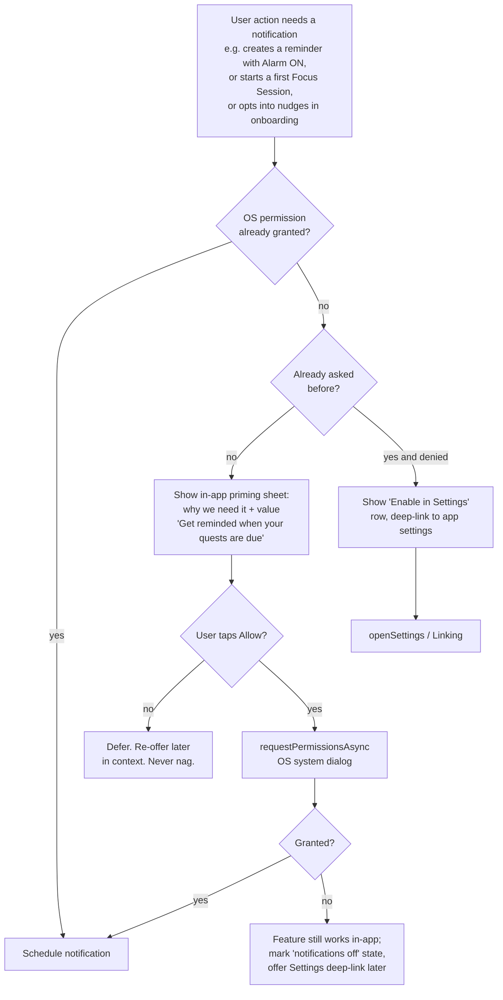

# Notifications & Permissions

> Every on-device alert Pawductivity fires (reminder alerts, the live Focus Session notification, the focus-completion alarm, optional pet-health/streak nudges) plus the Android permission plumbing the legacy app got badly wrong — rebuilt on `expo-notifications` with a proper channel plan and an Android-13+ permission-priming flow.

**Status vs legacy:** The legacy app scheduled **zero** reminder notifications despite shipping an "Alarm" toggle (the flag was dropped by the backend), used `flutter_local_notifications` **only** for a per-second Focus countdown notification that was itself **commented out** in the shipping build, defined but never invoked its runtime `POST_NOTIFICATIONS` request (the call site was commented out) **and** never declared `POST_NOTIFICATIONS` in the manifest — so it never actually prompted on Android 13+, and mislabeled its foreground service `foregroundServiceType="location"` (Play policy rejection risk). The rebuild does notifications **properly and locally**: reminders actually fire [CHANGE→real], the Focus notification becomes a chronometer/ongoing notification driven by a timestamp (no per-second background JS) [CHANGE], a one-shot completion alarm replaces "keep a process alive" [NEW], and the whole permission model is declared correctly with in-context priming [NEW].

## What it is

Pawductivity is **100% local-first** (expo-sqlite + react-native-mmkv + Zustand; no backend). Every notification is a **local scheduled notification** — there is no push server, no FCM, no remote payload. This skill owns three things:

1. **The notification catalog** — what we fire, on which channel, with what importance.
2. **The Android permission matrix** — exactly which `uses-permission` entries and service declarations the app must ship (the legacy manifest was missing almost all of them).
3. **The permission-priming UX** — when and how we ask for `POST_NOTIFICATIONS` on Android 13+ so we don't get silently denied like the legacy app.

All scheduling goes through `expo-notifications`. Scheduling logic lives with each feature: reminders in [reminders-and-calendar](../reminders-and-calendar/SKILL.md), the Focus notification + completion alarm in [focus-timer-and-background](../focus-timer-and-background/SKILL.md). This skill is the shared substrate they both build on.

## Notification catalog

| # | Notification | Trigger | Channel | Importance | Ongoing? | Tag |
|---|--------------|---------|---------|-----------|----------|-----|
| 1 | **Reminder alert** | A Reminder's scheduled time arrives (once/weekly/monthly/yearly) | `reminders` | HIGH (sound) | no | [CHANGE→real] |
| 2 | **Focus Session (live)** | A Focus quest timer is running / app backgrounded | `focus-session` | LOW (silent) | **yes** | [CHANGE] |
| 3 | **Focus complete alarm** | Focus timer reaches 0 (fires even if app killed) | `focus-complete` | HIGH (sound) | no | [NEW] |
| 4 | **Pet-health nudge** (optional) | Companion Health crossed a low threshold on app-open catch-up | `nudges` | DEFAULT | no | [NEW] [DECIDE] |
| 5 | **Streak nudge** (optional) | User has an active Streak and no activity logged today (e.g. evening) | `nudges` | DEFAULT | no | [NEW] [DECIDE] |

Notes:
- (1) is the single biggest legacy gap: reminders **never fired anything**. The `alarmStatus` toggle was captured client-side into `ReminderTemplateModel` but the backend `Reminder` model had no alarm column, so it was silently dropped and nothing was ever scheduled (legacy: `Pawductivity_BE/internal/repository/reminder.repository.go:78-91`). `flutter_local_notifications` was wired **only** to the timer countdown, never to reminders (legacy: `Pawductivity_App/lib/features/task/background/background_service.dart`).
- (2) legacy channel was `my_foreground`, notification id `888`, name `Task Countdown`, `importance: Importance.low`, `priority: Priority.low`, `ongoing: true` (legacy: `background_service.dart:12,13,52,58-62`, verified). Its BigPicture used a hard-coded `assets/background.png`, **never the actual pet** — cosmetic bug (legacy: same file). In the shipping build the start/stop calls were commented out (`countdown_manager.dart:53,58-62`), so it never appeared.
- (3) the completion "alarm when task is done" was an explicit **TODO** in legacy — never built.
- (4)/(5) have **no legacy equivalent** — they are new engagement surfaces. Keep them opt-in and rate-limited; see Open decisions.

## Core business rules

- **All notifications are local.** No push, no FCM, no remote server. Scheduling uses `expo-notifications` triggers only. [NEW baseline]
- **Reminder recurrence → OS triggers.** once = single `date` trigger; weekly = weekday+hour+minute repeating trigger; monthly/yearly = schedule next occurrence and re-schedule on fire (Expo has no native monthly/yearly repeat). Persist the OS notification id(s) next to each reminder row so edit/delete can cancel & reschedule. [CHANGE] See [reminders-and-calendar](../reminders-and-calendar/SKILL.md).
- **Reminder time semantics.** Legacy stored reminder time as **seconds from midnight** (`reminderTime = hours*3600 + minutes*60`) plus a redundant UTC-combined `time` timestamp (legacy: `Pawductivity_App/lib/features/task/presentation/widgets/new_reminder_widget/new_reminder_form.dart:181-198`). The rebuild must store **local wall-clock time** and schedule against device-local time (a reminder for 08:30 fires at 08:30 local, DST included). [CHANGE]
- **Honor the alarm toggle.** The reminder form's `alarm` flag (default **false**, legacy: `new_reminder_form.dart`) now actually controls sound/importance: alarm on → `reminders` channel (HIGH, sound); alarm off → silent delivery. [CHANGE→real]
- **Focus notification is timestamp-authoritative, not tick-driven.** Never run a per-second background JS timer (Android throttles/kills background JS). The live time comes from a persisted `startedAt` epoch in MMKV; the OS updates the visible seconds via a **chronometer-style** ongoing notification. Update the notification body at most every 15–30s if a chronometer isn't used. [CHANGE] See [focus-timer-and-background](../focus-timer-and-background/SKILL.md).
- **Focus completion is a scheduled one-shot.** On timer start, schedule a single completion notification at `startedAt + remainingSeconds` on the `focus-complete` channel; cancel it on pause/complete/switch. This removes any need to keep a process alive. [NEW]
- **Exact timing requires exact-alarm permission on Android 12+.** Reminder alerts and the Focus completion alarm must fire on time, so they need exact-alarm scheduling; inexact alarms can slip by many minutes and are unacceptable for a completion beep or a scheduled reminder. [CHANGE]
- **Reschedule on boot.** Android clears scheduled alarms on reboot. Because reminder + active-timer state is persisted (SQLite reminders, MMKV `timer.active`), the app must **re-register all pending notifications** — either via a `RECEIVE_BOOT_COMPLETED` receiver or, at minimum, on next app launch by reading persisted state. Legacy had **no** boot recovery at all. [NEW]
- **Never request permission cold.** Legacy DEFINED a runtime `Permission.notification.request()` handler (legacy: `Pawductivity_App/lib/features/task/presentation/pages/home_screen.dart:81-82`, verified) but its only call site is COMMENTED OUT (`home_screen.dart:49` `// _requestNotificationPermissions();`) AND the manifest never declared `POST_NOTIFICATIONS` — so on the shipping build the prompt never fired at all. The rebuild primes in-context (see permission-priming flow). [NEW]
- **Nudges are opt-in and capped.** Pet-health/streak nudges must default off (or be enabled during onboarding) and never fire more than once per day per type. [NEW] [DECIDE]

## Android permission matrix

This is the concrete `AndroidManifest` spec the rebuild must ship (via `app.json` / Expo config plugin for `expo-notifications`, plus `android.permissions`). The **Legacy** column is what actually shipped (verified against `old/Pawductivity_App/android/app/src/main/AndroidManifest.xml`).

| Permission / declaration | Legacy | Rebuild | Why |
|---|---|---|---|
| `INTERNET` | ✅ declared | ⚠️ only if a non-notif feature needs it (IAP) | Local-first app has no API calls. |
| `POST_NOTIFICATIONS` | ❌ **missing** (runtime request handler existed but its call site was commented out → never prompted) | ✅ **required** | Android 13+ runtime notification permission. This was the core legacy bug. [NEW] |
| `SCHEDULE_EXACT_ALARM` | ❌ missing | ✅ required (Android 12) | Exact reminder + completion alarms. [NEW] |
| `USE_EXACT_ALARM` | ❌ missing | ✅ (Android 13+, if the app's core value is alarms/reminders) | Auto-granted alternative to `SCHEDULE_EXACT_ALARM`'s user toggle; justify at review. [NEW] [DECIDE] |
| `RECEIVE_BOOT_COMPLETED` | ❌ missing | ✅ required | Reschedule reminders/timer notification after reboot. [NEW] |
| `WAKE_LOCK` | ❌ missing | ✅ required | Let a scheduled alarm/notification wake the device to fire on time. [NEW] |
| `FOREGROUND_SERVICE` | ✅ declared | ⚠️ only if a real FGS is used (see below) | The recommended timer design avoids a per-second FGS. [DECIDE] |
| `FOREGROUND_SERVICE_*` typed (e.g. `_SHORT_SERVICE`/`_DATA_SYNC`) | ❌ missing | ✅ **only if** an FGS is used (Android 14+ requires a typed permission matching the service type) | Android 14+ typed-FGS policy. [DECIDE] |
| `foregroundServiceType="location"` service | ❌ **WRONG** (a focus timer masquerading as location — Play rejection risk) | ❌ **do not ship**; if any FGS is used pick a valid non-location type | Policy compliance. [DROP] |
| Ghost `com.pravera.flutter_foreground_task.service.ForegroundService` (`specialUse`, property value `"Whatever idk"`, plugin not even in `pubspec`) | ❌ stale/broken | ❌ delete entirely | Dead declaration; plugin absent. [DROP] |

Legacy manifest reality (verified): the entire `<manifest>` declared only `INTERNET` and `FOREGROUND_SERVICE`, plus the two mis-typed service blocks above. Everything in the "required" rebuild rows was absent.

**Foreground-service decision.** The recommended rebuild does **not** need a per-second Android foreground service. The live Focus notification can be a **sticky/ongoing chronometer notification** (the OS ticks the seconds) and the completion is a **scheduled one-shot alarm** — neither requires hosting a long-running FGS. If product later wants a guaranteed-visible running-service (e.g. for very long sessions), pick a **valid** Android 14+ FGS type (e.g. `shortService` for short bounded work, or `dataSync`) and add the matching typed permission — **never** `location`. See Open decisions and [focus-timer-and-background](../focus-timer-and-background/SKILL.md).

## Channel plan (Android 8+)

Notification channels are created once at first run (idempotent). Importance is fixed per channel by Android and cannot be raised later, so pick correctly up front.

| Channel id | Name (user-visible) | Importance | Sound | Vibration | Used by |
|---|---|---|---|---|---|
| `reminders` | Reminders | HIGH | default (or per-alarm-flag) | yes | Reminder alerts (1) |
| `focus-session` | Focus Session | LOW | none | none | Live ongoing Focus notification (2) |
| `focus-complete` | Focus Complete | HIGH | default | yes | Completion alarm (3) |
| `nudges` | Pet & Streak Nudges | DEFAULT | default | optional | Pet-health / streak nudges (4,5) |

Guidance:
- Keep `focus-session` at LOW so the ongoing timer notification is silent and unobtrusive (matches legacy `importance/priority: low`, `ongoing: true`).
- Separate `focus-complete` from `focus-session` so the completion beep is audible even though the running notification is silent.
- Give `nudges` its own channel so users can mute engagement nudges without losing reminders/alarms (respects the opt-in principle).
- Do **not** reuse a single channel across importance levels (Android won't let you change importance after creation).

## Permission-priming flow (Android 13+) [NEW]

The legacy app had a `POST_NOTIFICATIONS` request wired to Home load with no manifest declaration and handling only the *permanently denied* branch (deep-link to settings) — but its call site was commented out (`home_screen.dart:49`), so it never even ran (legacy: `home_screen.dart:49,81-100`, verified). The rebuild asks **in context, once, with an explainer**:

Rules:
1. **Trigger points**, not cold start: first reminder-with-alarm creation, first Focus Session start, or an explicit onboarding opt-in step. Never request on tab load.
2. **Explain before the OS dialog.** Show a one-line value prop in an in-app sheet, then call `requestPermissionsAsync`. You only get one native prompt on Android 13+ before it becomes a settings-only affair.
3. **Graceful denial.** If denied, the feature still functions in-app (the reminder/timer still exists); we just surface a dismissible "notifications are off — enable in Settings" affordance and a deep-link. No blocking modals.
4. **Persist the ask state** in MMKV (`notifPermPrimed`, `notifPermAsked`) so we don't re-prompt or nag.
5. **Exact-alarm gate.** On Android 12, exact alarms require the user's `SCHEDULE_EXACT_ALARM` toggle; if unavailable, fall back to inexact and warn that reminders may be delayed, or deep-link the user to the exact-alarm settings screen. On Android 13+ prefer `USE_EXACT_ALARM` (auto-granted) if the app qualifies as an alarm/reminder app. [DECIDE]

## Data & entities

This skill owns almost no persistent data of its own; it stores scheduling handles and permission state alongside the features it serves.

**MMKV (settings/flags):**
- `notifPermPrimed: boolean`, `notifPermAsked: boolean` — permission-priming state.
- `notificationsEnabled: { reminders, nudges }` — user toggles (nudges default off).
- `lastNudge: { health?: epoch, streak?: epoch }` — per-type daily rate-limit.

**SQLite (owned by reminders):** each `reminders` row carries `os_notification_ids` (JSON/text) so edits/deletes can cancel and reschedule. See the reminders table in [reminders-and-calendar](../reminders-and-calendar/SKILL.md) and `context/data-model/sqlite-schema.md`.

**MMKV (owned by the timer):** the `timer.active` slice (`{taskId, startedAt, allocatedSeconds, accumulatedSeconds, lockedPetId, isRunning}`) plus the scheduled `completionNotifId`. See [focus-timer-and-background](../focus-timer-and-background/SKILL.md) and `context/data-model/state-and-mmkv.md`.

## Key flows

### 1. Schedule a reminder alert
1. User saves a Reminder (type once/weekly/monthly/yearly, date, time, alarm flag).
2. Ensure notification permission (priming flow above); if denied, save the reminder anyway, skip scheduling.
3. Build the trigger from recurrence: once → date trigger; weekly → weekday+time repeating; monthly/yearly → next-occurrence date trigger (re-scheduled on fire).
4. Schedule on the `reminders` channel; HIGH+sound if alarm flag on, silent otherwise.
5. Store returned OS id(s) in `reminders.os_notification_ids`.
6. On edit → cancel stored ids, reschedule. On complete/delete → cancel stored ids.

### 2. Live Focus Session notification
1. Timer starts → persist `timer.active` in MMKV with `startedAt`.
2. Post an **ongoing** notification on `focus-session` (LOW, silent). Prefer a chronometer (`when` = expected end / `usesChronometer`) so the OS renders the countdown without JS wakeups.
3. Schedule the completion one-shot (flow 3) at `startedAt + remainingSeconds`.
4. On pause/switch/complete → dismiss the ongoing notification, cancel the completion one-shot.
5. On resume/app-open → recompute remaining from `startedAt`; if already elapsed, treat as complete.

### 3. Focus completion alarm
1. At timer start, schedule a single notification on `focus-complete` (HIGH, sound) at the computed end time; save its id in MMKV.
2. If the user pauses/switches/completes early → cancel it.
3. It fires even if the app is killed (OS-scheduled), replacing the never-built legacy "alarm when done" TODO.

### 4. Reschedule on boot / cold start
1. On `BOOT_COMPLETED` (or, at minimum, on next app launch): read all future reminders from SQLite and re-register their triggers.
2. Read `timer.active` from MMKV; if a session is still notionally running, recompute remaining and re-post the ongoing notification + re-schedule the completion alarm (or mark complete if the end time already passed).

### 5. Optional nudges (opt-in)
1. On app-open catch-up, the pet subsystem computes Health decay (−1 per missed local midnight, floored at 0). If Health crossed a low threshold and nudges are enabled and `lastNudge.health` isn't today → post a pet-health nudge on `nudges`. See [pet-companion-system](../pet-companion-system/SKILL.md).
2. Similarly for streaks: if an active Streak has no activity logged today, optionally schedule an evening streak nudge. See [gamification-xp-levels](../gamification-xp-levels/SKILL.md).
3. Always respect the daily per-type cap and the user's `notificationsEnabled.nudges` toggle.

## Local-first rebuild guidance

| Legacy piece | Rebuild |
|---|---|
| `flutter_local_notifications ^18.0.1` (timer only) | `expo-notifications` for **all** notifications. [CHANGE] |
| `flutter_background_service ^5.1.0` per-second FGS | Timestamp-authoritative timer + ongoing chronometer notification + scheduled completion alarm; no per-second background JS. [CHANGE] |
| `permission_handler ^11.3.1` (`Permission.notification.request()`) | `expo-notifications` `getPermissionsAsync` / `requestPermissionsAsync`, gated by in-app priming. [CHANGE] |
| Reminder `alarmStatus` dropped by backend | `alarm_enabled` persisted in SQLite; actually drives channel/importance. [CHANGE→real] |
| No reminder notifications at all | Local scheduled triggers per recurrence. [CHANGE→real] |
| No completion alarm (TODO) | One-shot scheduled notification. [NEW] |
| No boot recovery (`autoStart=false`, no receiver) | Re-register from persisted state on boot / cold start. [NEW] |
| Manifest `INTERNET` + `FOREGROUND_SERVICE` only | Full permission matrix above via Expo config. [NEW] |
| `foregroundServiceType="location"` + ghost service | Deleted; valid FGS type only if truly needed. [DROP] |
| Amplitude notification-event tracking | Dropped (local-only app). [DROP] |

Relevant packages: `expo-notifications` (scheduling, channels, permissions), `expo-task-manager` / `expo-background-task` (optional periodic reconciliation), and `expo-keep-awake` (keep screen on while the timer is visible instead of a foreground service).

## New-app enhancements

- **Reminders that actually fire** — the single most valuable fix; the whole point of a reminder.
- **Permission-priming UX** — in-context ask + explainer, replacing the cold, silently-failing legacy request.
- **Completion alarm** — notify when a Focus Session ends even if the app is closed.
- **Chronometer Focus notification** — OS-ticked countdown, immune to background throttling.
- **Pet-health & streak nudges** — new engagement surfaces with a dedicated, mutable channel.
- **Brain Dump integration** — the client-side Claude parser can emit reminder items (with recurrence + alarm flag); those flow straight into the reminders table and get scheduled here. See [ai-braindump-parser](../ai-braindump-parser/SKILL.md).

## Open decisions

- **[DECIDE]** Ship a real Android foreground service for long Focus Sessions, or rely on ongoing notification + scheduled alarm only? If yes, which valid Android-14+ FGS type (`shortService` vs `dataSync`) and matching typed permission?
- **[DECIDE]** Use `USE_EXACT_ALARM` (auto-granted, app must qualify as an alarm/reminder app at review) or `SCHEDULE_EXACT_ALARM` (user toggle) for exact timing?
- **[DECIDE]** Are pet-health and streak nudges in MVP scope? If so, default on or off, and what thresholds/times (e.g. streak nudge at 8pm local)?
- **[DECIDE]** Per-occurrence completion for recurring reminders (legacy had a single global `iscompleted` flag) — how does completing one occurrence interact with the next scheduled notification?
- **[DECIDE]** iOS parity — legacy had no functional iOS background timer; define iOS notification behavior (iOS notification permission, no exact-alarm concept, no chronometer notification).
- **[DECIDE]** Snooze / dismiss actions on reminder notifications (legacy had none)?

## Legacy references

- `old/Pawductivity_App/android/app/src/main/AndroidManifest.xml` — the mis-configured manifest (only `INTERNET`+`FOREGROUND_SERVICE`; `foregroundServiceType="location"`; ghost `flutter_foreground_task` service `"Whatever idk"`). Verified.
- `old/Pawductivity_App/lib/features/task/presentation/pages/home_screen.dart:49,81-100` — `_requestNotificationPermissions()` (runtime `Permission.notification.request()`, handles only permanently-denied) defined at :81-100 but its sole call site at :49 is commented out (`// _requestNotificationPermissions();`); combined with no manifest declaration, the prompt never fired. Verified.
- `old/Pawductivity_App/lib/features/task/background/background_service.dart:12,13,52,58-62` — channel `my_foreground`, id `888`, name `Task Countdown`, LOW importance/priority, `ongoing: true`, hard-coded BigPicture. Verified.
- `old/Pawductivity_App/lib/features/task/presentation/managers/countdown_manager.dart:53,58-62` — foreground-service start/stop **commented out** in shipping build.
- `old/Pawductivity_App/lib/features/task/presentation/widgets/new_reminder_widget/new_reminder_form.dart:181-198` — reminder time as seconds-from-midnight; `alarm` default false.
- `old/Pawductivity_BE/internal/repository/reminder.repository.go:78-91` — backend inserts reminder without any alarm column; `alarmStatus` silently dropped.
- `old/Pawductivity_App/pubspec.yaml` — `flutter_local_notifications ^18.0.1`, `flutter_background_service ^5.1.0`, `permission_handler ^11.3.1`, `path_provider ^2.0.0`.

## Related

- [focus-timer-and-background](../focus-timer-and-background/SKILL.md) — owns the live Focus notification, chronometer, and completion alarm scheduling.
- [reminders-and-calendar](../reminders-and-calendar/SKILL.md) — owns reminder recurrence → notification-trigger mapping and per-reminder OS ids.
- [pet-companion-system](../pet-companion-system/SKILL.md) — Health-decay catch-up that can drive the pet-health nudge.
- [gamification-xp-levels](../gamification-xp-levels/SKILL.md) — Streaks that can drive the streak nudge.
- [ai-braindump-parser](../ai-braindump-parser/SKILL.md) — emits reminder items that get scheduled here.
- [navigation-and-app-shell](../navigation-and-app-shell/SKILL.md) — onboarding is a natural home for the notification-permission priming step.
- [local-first-data-layer](../local-first-data-layer/SKILL.md) — MMKV/SQLite where notification ids and permission flags live.
- `../../../context/legacy/known-bugs-and-antipatterns.md` — missing permissions, mis-typed FGS, dropped alarm flag.
- `../../../context/migration/flutter-to-react-native.md` — `flutter_local_notifications`/`flutter_background_service`/`permission_handler` → `expo-notifications`.
- `../../../context/02-open-decisions.md` — rolls up the [DECIDE] items above.
