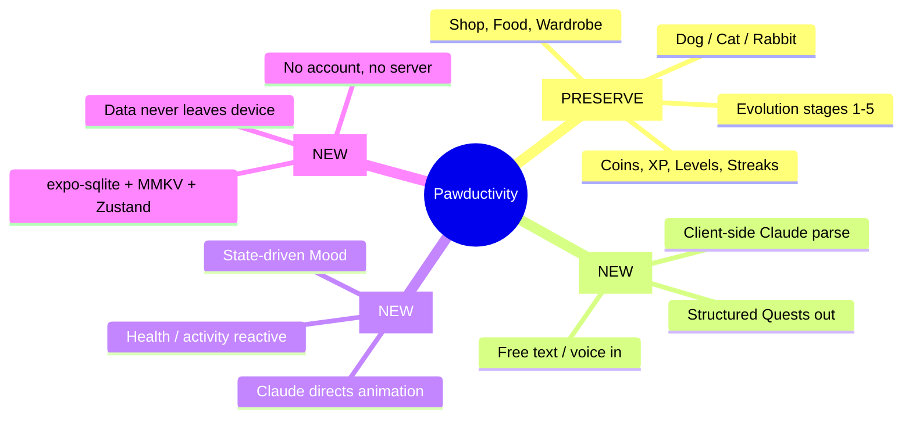
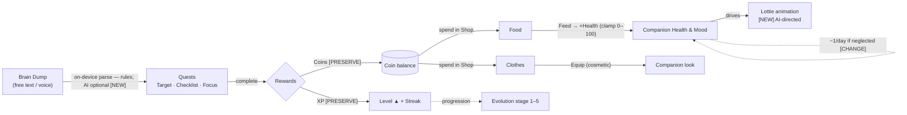
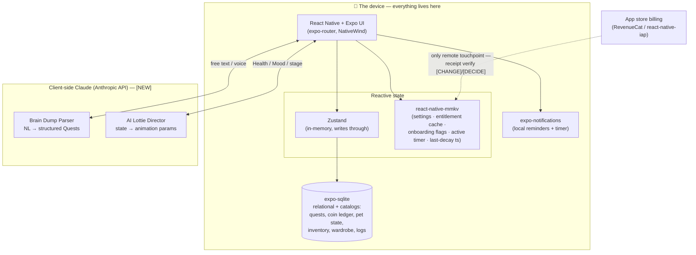

# Pawductivity — Overview & Knowledge-Base Map

> The first skill to open. It explains **what Pawductivity is**, **how the core loop works**,
> **how the local-first + AI architecture fits together**, and — most importantly — **where
> every other piece of the knowledge base lives** so you can jump straight to the right spec.

This repository is a **ground-up rebuild** of Pawductivity in **React Native + Expo**, currently
in the **business-process-definition phase** (specs, not app code yet). Every rule carries a
change-intent tag — **[PRESERVE]** / **[CHANGE]** / **[NEW]** / **[DROP]** / **[DECIDE]** — and,
when it restates legacy behavior, a citation back to `old/`. Canonical vocabulary is defined once
in [`context/01-glossary.md`](../../../context/01-glossary.md); use those terms only.

---

## 1. What Pawductivity is

**Pawductivity is a gamified, local-first productivity app built around a virtual pet Companion.**
You capture what you need to do, frame it as **Quests** for your Companion (a **Dog**, **Cat**, or
**Rabbit**), run timed **Focus Sessions**, and completing work earns **Coins** and **XP**. You
spend Coins in the **Shop** on **Food** (restores your Companion's **Health**) and **Clothes**
(cosmetics), level up, keep a **Streak**, and grow your Companion through **Evolution stages 1–5** —
while neglect lets its Health decay and its **Mood** drop.

Legacy tagline (still true): *"a task tracker and timer app with gamification, featuring virtual
pets and accessories to make your productivity journey fun and engaging"* (legacy:
`Pawductivity-Website/components/footer.tsx`).

**The bet:** people don't fail at productivity for lack of a to-do list — they fail because being
the *administrator* of their own life is exhausting ("tracker fatigue"). Pawductivity answers this
with **emotional motivation** (a living companion that thrives on your progress) plus **zero-friction
capture** (dump your thoughts in plain language; the AI structures them). Full rationale in
[`context/00-product-vision.md`](../../../context/00-product-vision.md).

---

## 2. The four pillars

| Pillar | Tag | One-liner | Primary skills |
|---|---|---|---|
| **A. Gamified quests + virtual pet** | `[PRESERVE]` | The whole earn/spend/nurture loop, carried over intact from legacy. | [pet-companion-system](../pet-companion-system/SKILL.md), [task-quest-system](../task-quest-system/SKILL.md), [coin-economy-and-shop](../coin-economy-and-shop/SKILL.md), [gamification-xp-levels](../gamification-xp-levels/SKILL.md) |
| **B. Brain Dump capture** | `[NEW]` | One free-text/voice box → structured Quests. MVP = **on-device rules-based parse** (no LLM); **AI (Claude) parsing is optional Phase-2** (BYO-key/proxy). Replaces the legacy manual add-task form. | [ai-braindump-parser](../ai-braindump-parser/SKILL.md), [task-quest-system](../task-quest-system/SKILL.md) |
| **C. Dynamic AI/state-driven Lottie** | `[NEW]` | Claude directs the Companion's animation from its live Health/Mood/stage on-device; layered over the preserved static per-stage clips. | [ai-lottie-director](../ai-lottie-director/SKILL.md), [lottie-animation-engine](../lottie-animation-engine/SKILL.md) |
| **D. 100% local-first privacy** | `[NEW]` guarantee / `[DROP]` server | All data on-device; no account, no login, no backend, no telemetry. A hard reversal of the legacy server-backed architecture. | [local-first-data-layer](../local-first-data-layer/SKILL.md), [account-and-profile](../account-and-profile/SKILL.md) |

The six features the legacy site marketed — **Virtual Pet, Calendar, Coins, Shop, Level, Timer** —
all map onto Pillar A and are `[PRESERVE]`d; the capture/animation pillars (B, C) and local-first (D) are the
net-new upgrades on top (legacy: `Pawductivity-Website/lib/data.ts`, `pages/features/index.tsx`).

---

## 3. The core loop

The single mechanic everything orbits: **do quests → earn coins & XP → spend on your companion →
keep it healthy → it grows.**

Step by step:

1. **Capture → Quests.** The user brain-dumps in natural language; the **Brain Dump Parser**
   (on-device rules parser in the MVP; optional Phase-2 Claude) emits structured **Quests**, each with
   a **kind**: **Target**, **Checklist**, or **Focus**. `[NEW]` capture; `[PRESERVE]` quest model.
   ([task-quest-system](../task-quest-system/SKILL.md), [ai-braindump-parser](../ai-braindump-parser/SKILL.md))
2. **Work → rewards.** Completing a Quest (and running its **Focus Session** timer) grants **Coins**
   and **XP**. `[PRESERVE]` (legacy: `Pawductivity_BE/internal/repository/task.repository.go`; note
   the real coin-grant discrepancy called out in
   [known-bugs-and-antipatterns](../../../context/legacy/known-bugs-and-antipatterns.md)).
   ([coin-economy-and-shop](../coin-economy-and-shop/SKILL.md), [gamification-xp-levels](../gamification-xp-levels/SKILL.md), [focus-timer-and-background](../focus-timer-and-background/SKILL.md))
3. **XP → Level & Streak.** XP raises the user's **Level**; consecutive-day engagement builds a
   **Streak** (`[NEW]`). Level is the *user's* progression and is distinct from the Companion's
   **Evolution stage**. ([gamification-xp-levels](../gamification-xp-levels/SKILL.md))
4. **Spend in the Shop.** Coins buy **Food** and **Clothes** in one unified Shop. `[PRESERVE]`
   ([coin-economy-and-shop](../coin-economy-and-shop/SKILL.md))
5. **Feed → Health.** **Feeding** consumes a Food item to raise **Health**, clamped to **0–100**
   (`newHealth = (health + food.stats).clamp(0,100)`, legacy: `feed_pet_listener.dart:110`).
   `[PRESERVE]` ([food-and-feeding](../food-and-feeding/SKILL.md))
6. **Dress → look.** **Equipping** a Clothes item overlays a cosmetic on the Companion's Lottie.
   `[PRESERVE]` ([clothes-and-wardrobe](../clothes-and-wardrobe/SKILL.md))
7. **Health decays if neglected.** Legacy ran a **server cron that subtracted −1 Health/day at local
   midnight** (`UPDATE pet SET health = health - 1 WHERE health > 0`, legacy:
   `Pawductivity_BE/internal/routines/decreasePetHealth.routine.go:34`). The rebuild has no server:
   it **recomputes decay from timestamps on app-open/resume**. `[CHANGE]`
   ([pet-companion-system](../pet-companion-system/SKILL.md), [local-first-data-layer](../local-first-data-layer/SKILL.md))
8. **Health & Mood → animation & growth.** The Companion's live state drives its **Mood** and its
   **AI-directed Lottie**; sustained progress advances **Evolution stage 1–5**. `[NEW]` direction /
   `[PRESERVE]` staged assets. ([pet-companion-system](../pet-companion-system/SKILL.md), [ai-lottie-director](../ai-lottie-director/SKILL.md))

---

## 4. Architecture at a glance

**One device, no server.** The legacy stack (Flutter app → Go/Postgres backend → Next.js site) is
replaced by a single local-first React Native + Expo app. The entire server — auth, JWT, sync, cron
routines, Midtrans, Amplitude — is **[DROP]**ped; server-driven behavior becomes **on-device
computation from timestamps**.

Key rules (full detail in [local-first-data-layer](../local-first-data-layer/SKILL.md) and
[`context/migration/backend-to-local-first.md`](../../../context/migration/backend-to-local-first.md)):

| Concern | Legacy | Rebuild | Tag |
|---|---|---|---|
| Relational data / catalogs | Go + Postgres, synced via retrofit/dio | **expo-sqlite** on device | `[CHANGE]` |
| Settings, entitlement, ephemeral timer state | `flutter_secure_storage` (incl. **plaintext password** — a security bug) | **react-native-mmkv + Zustand** (no secrets) | `[CHANGE]` / `[DROP]` |
| Identity | Accounts, JWT, Google Sign-In, email OTP | **single local profile** (id=1, or no `userid` at all) | `[DROP]` |
| Health decay, membership expiry | **server cron routines** | **recompute from timestamps** on app-open/resume | `[CHANGE]` |
| Task input | manual multi-field form (`add_task_form.dart`) | **Brain Dump** → on-device parse (rules; AI optional Phase-2) | `[NEW]` |
| Pet animation | static per-stage Lottie clips | **AI-directed dynamic Lottie** over the preserved static clips | `[NEW]` / `[PRESERVE]` |
| Analytics | Amplitude server telemetry | **on-device SQLite aggregate queries** only | `[DROP]` |
| Push | server push | **local `expo-notifications`** | `[CHANGE]` |
| Billing | Google Play IAP **and** Midtrans WebView (two surfaces) | **one** store-native SKU (RevenueCat / react-native-iap) | `[CHANGE]` / `[DECIDE]` |

**The one honest remote exception:** real-money receipt verification genuinely wants a server. Handle
it with a billing SDK, cache the resolved entitlement + expiry in MMKV, and degrade to `basic`
offline — do **not** silently build a backend. See [premium-and-monetization](../premium-and-monetization/SKILL.md).

Legacy hardcoded server (do **not** port): `SERVER_URI = "https://fcfcvrer.pawductivity.id"`
(legacy: `Pawductivity_App/lib/config/constant/constant.dart`).

---

## 5. Knowledge-base map — the skills

Each subsystem has one self-contained `.claude/skills/<name>/SKILL.md` with its business rules,
exact numbers, data model, flows, and local-first rebuild guidance. Read the matching skill before
writing any code for that subsystem.

### Core loop — Pillar A `[PRESERVE]`

| Skill | What it covers |
|---|---|
| [pet-companion-system](../pet-companion-system/SKILL.md) | The Companion: Species (Dog/Cat/Rabbit), Evolution stages 1–5, Health 0–100, Mood, daily health decay, and how pet state drives everything. |
| [task-quest-system](../task-quest-system/SKILL.md) | Tasks framed as Quests — Target, Checklist, and Focus kinds; creation, completion, coin/XP rewards, deadlines. |
| [focus-timer-and-background](../focus-timer-and-background/SKILL.md) | Focus Sessions (the timer) + background survival: timestamp-based elapsed time, ongoing notifications, app-resume recovery. |
| [coin-economy-and-shop](../coin-economy-and-shop/SKILL.md) | Coins as soft currency: how they're earned, the coin ledger, and the unified Shop where they're spent. |
| [food-and-feeding](../food-and-feeding/SKILL.md) | Food inventory and Feeding to restore Health (capped at 100); seed food catalog and heal values. |
| [clothes-and-wardrobe](../clothes-and-wardrobe/SKILL.md) | Cosmetic Clothes, the Wardrobe, Equipping onto the Companion, and the seed clothes catalog. |
| [gamification-xp-levels](../gamification-xp-levels/SKILL.md) | The *user's* XP and Level (distinct from Evolution stage), the level-up formula, Streaks, and reward-on-level-up rules. |
| [reminders-and-calendar](../reminders-and-calendar/SKILL.md) | Deadlines, reminders, and the calendar/activity view; local notification scheduling and recompute-on-boot. |

### Net-new AI & animation — Pillars B & C `[NEW]`

| Skill | What it covers |
|---|---|
| [ai-braindump-parser](../ai-braindump-parser/SKILL.md) | **[NEW]** Brain Dump capture → structured Quests; **rules-based in MVP**, optional Phase-2 Claude parsing. |
| [ai-lottie-director](../ai-lottie-director/SKILL.md) | **[NEW]** Client-side Claude that dynamically drives/composes Lottie animation on-device from pet state. |
| [lottie-animation-engine](../lottie-animation-engine/SKILL.md) | State-driven Lottie rendering: how Health/Mood/Evolution select the animation asset to play (the preserved fallback layer). |

### Local-first foundation & platform — Pillar D `[NEW]`/`[DROP]`

| Skill | What it covers |
|---|---|
| [local-first-data-layer](../local-first-data-layer/SKILL.md) | The persistence architecture: expo-sqlite for relational data, MMKV + Zustand for state/settings, no server. |
| [account-and-profile](../account-and-profile/SKILL.md) | Identity collapses to one local profile — edit name/avatar, settings, and data reset/delete (all net-new UI). |
| [navigation-and-app-shell](../navigation-and-app-shell/SKILL.md) | The app skeleton: the tab shell (legacy 5-tab PageView), startup/splash flow, one coherent navigator. |
| [design-system-and-theming](../design-system-and-theming/SKILL.md) | Brand palette, typography, tokens, and dark mode (net-new) — replacing scattered hardcoded color literals. |
| [notifications-and-permissions](../notifications-and-permissions/SKILL.md) | Local notifications and the Android/iOS permission model the timer + reminders depend on. |

### Monetization, growth & insights

| Skill | What it covers |
|---|---|
| [premium-and-monetization](../premium-and-monetization/SKILL.md) | The Premium tier, entitlement, store IAP, and honest options for billing without a backend. |
| [referral-system](../referral-system/SKILL.md) | Invite-a-friend codes (+100 Coins to both, legacy: `referral.repository.go:55-56`) and the challenge of referral in a no-backend app. |
| [analytics-and-insights](../analytics-and-insights/SKILL.md) | The summary/stats screens — rebuilt as on-device SQLite aggregate queries; third-party telemetry dropped. |

### Port plan

| Skill | What it covers |
|---|---|
| [legacy-migration-guide](../legacy-migration-guide/SKILL.md) | The overall port plan: Flutter→RN, backend→local-first, and what to drop vs. keep. |

---

## 6. Knowledge-base map — the context docs

Cross-cutting reference under `context/` that many skills link into. **Rule of thumb:** subsystem
logic → the matching skill; schema / entities / seed numbers → `context/data-model/`; "why did legacy
do X" → `context/legacy/`.

| Doc | What it covers |
|---|---|
| [00-product-vision](../../../context/00-product-vision.md) | The product, the audience, the four pillars, and the local-first rebuild direction. **Reviewer entry point.** |
| [01-glossary](../../../context/01-glossary.md) | Canonical vocabulary — the exact terms every file (and this skill) must use. Naming authority. |
| [02-open-decisions](../../../context/02-open-decisions.md) | Every `[DECIDE]` rolled up. **Where the product owner's input is needed.** |
| [data-model/entity-relationship](../../../context/data-model/entity-relationship.md) | The entities and how they relate (ERD) across the whole app. |
| [data-model/sqlite-schema](../../../context/data-model/sqlite-schema.md) | The proposed expo-sqlite table schema. |
| [data-model/state-and-mmkv](../../../context/data-model/state-and-mmkv.md) | What lives in MMKV + Zustand vs. SQLite (settings, entitlement, timer state). |
| [data-model/seed-catalogs](../../../context/data-model/seed-catalogs.md) | Seed pets, foods, and clothes — prices and stats to bundle locally. |
| [legacy/architecture-overview](../../../context/legacy/architecture-overview.md) | How the old Flutter + Go + Next.js system was wired together. |
| [legacy/backend-api-catalog](../../../context/legacy/backend-api-catalog.md) | The old Go API surface — every route, folded into local logic. |
| [legacy/navigation-map](../../../context/legacy/navigation-map.md) | The old app's screen graph, routes, and the duplicate/mid-migration screens. |
| [legacy/known-bugs-and-antipatterns](../../../context/legacy/known-bugs-and-antipatterns.md) | Real bugs *not* to carry over (coin discrepancy, plaintext password, wrong FGS type, …). |
| [legacy/dead-and-incomplete-features](../../../context/legacy/dead-and-incomplete-features.md) | Shipped-but-dead surfaces (achievements schema-only, HealthShop placeholder, dead onboarding, Midtrans WebView). |
| [migration/flutter-to-react-native](../../../context/migration/flutter-to-react-native.md) | Porting the Flutter app to React Native + Expo. |
| [migration/backend-to-local-first](../../../context/migration/backend-to-local-first.md) | Turning server behavior (cron, sync, auth) into on-device computation. |
| [migration/monetization-options](../../../context/migration/monetization-options.md) | Honest billing options when there's no backend to verify receipts. |
| [design/brand-and-tokens](../../../context/design/brand-and-tokens.md) | The extracted brand palette and design tokens. |

Root: [`README.md`](../../../README.md) (the human-facing map) and [`CLAUDE.md`](../../../CLAUDE.md)
(the auto-loaded operating guide + hard rules).

---

## 7. Open decisions that shape the whole product

These are cross-cutting `[DECIDE]`s the product owner must resolve; each is detailed in
[`context/02-open-decisions.md`](../../../context/02-open-decisions.md). Consult it before designing
anything that depends on one — do not invent behavior.

| `[DECIDE]` | Why it matters at the product level |
|---|---|
| **Monetization model** | One-time/per-item ~IDR 3,000 unlock (per site) vs recurring monthly subscription (per T&C) — legacy shipped **both**, mutually exclusive. Pick one SKU model. → [premium-and-monetization](../premium-and-monetization/SKILL.md), [migration/monetization-options](../../../context/migration/monetization-options.md). |
| **iOS in scope?** | Legacy was Android-only (`com.production.pawductivity`); Expo makes iOS feasible, but iOS has no Android-style background timer service — affects the Focus Timer. → [focus-timer-and-background](../focus-timer-and-background/SKILL.md). |
| **Legal / privacy rewrite** | The legacy Privacy Policy & Terms describe an account-based, server-backed, data-collecting, monthly-billed product that does not exist in a local-first app. New copy must state data stays on-device. |
| **Achievements/badges** | Marketed but never implemented (schema-only, dead). Build as new scope, or leave out of MVP? |
| **What drives Evolution stage** | XP/Level, cumulative Focus time, or sustained Health? Legacy shipped the staged assets but drove them only cosmetically. → [pet-companion-system](../pet-companion-system/SKILL.md). |
| **Whether Health decays in the rebuild** | Legacy decayed −1/day via server cron; whether the local rebuild keeps decay (and at what rate) is open. → [pet-companion-system](../pet-companion-system/SKILL.md). |
| **Referral without a backend** | Legacy referral (+100 Coins to both) was server-verified; local-first has no server to validate codes. → [referral-system](../referral-system/SKILL.md). |

---

## 8. Hard rules (never violate)

From [`CLAUDE.md`](../../../CLAUDE.md) — these govern every subsystem:

1. **No backend, no server code — ever.** If a task seems to need a server, stop and flag a
   `[DECIDE]`. The only honest remote touchpoint is store receipt verification via a billing SDK.
2. **100% local-first data.** expo-sqlite for relational/catalog data; MMKV + Zustand for
   settings/entitlement/ephemeral state. A single local profile — no accounts, no `userid` FKs.
3. **AI/LLM is optional Phase-2 — not in the FE-only MVP.** MVP Brain Dump parsing and Lottie
   direction are **rules-based/on-device**; any Claude layer is a later BYO-key/proxy enhancement,
   never a server we operate. Everything works with AI off.
4. **`old/` is READ-ONLY legacy reference.** Verify behavior/numbers/seed data there; **never copy**
   its server/auth/network code. Verify constants before restating them — the legacy has real
   discrepancies (e.g. coin-grant `estimatedTime/60` vs displayed `FLOOR(estimatedTime/60/3)`; seed
   `needed_xp=150` vs formula value 160).
5. **Use canonical vocabulary only** ([01-glossary](../../../context/01-glossary.md)); tag every rule
   `[PRESERVE]`/`[CHANGE]`/`[NEW]`/`[DROP]`/`[DECIDE]` and cite the legacy source.

---

## Related

- [`context/00-product-vision.md`](../../../context/00-product-vision.md) — the north star (read first).
- [`context/01-glossary.md`](../../../context/01-glossary.md) — canonical vocabulary / naming authority.
- [`context/02-open-decisions.md`](../../../context/02-open-decisions.md) — every open `[DECIDE]`.
- [`CLAUDE.md`](../../../CLAUDE.md) — hard rules + tech stack; [`README.md`](../../../README.md) — the human-facing map.
- Every subsystem skill is indexed in §5 above; every shared context doc in §6.
