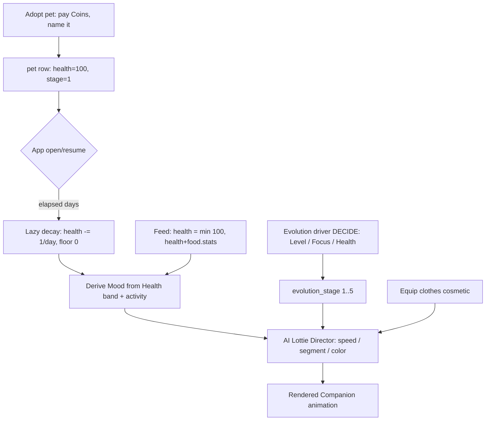

# Pet Companion System

> The Companion is Pawductivity's emotional core: a virtual pet the user adopts, names, feeds, dresses, and grows — and whose on-screen state (Health, Mood, Evolution stage, outfit) drives everything the Lottie animation shows.

**Status vs legacy:** `[PRESERVE]` the 3-species roster, Health 0–100, feeding-to-restore, clothing toggle, and one-pet-per-species ownership. `[CHANGE]` all server-authoritative logic (purchase, feed, health decay, equip) to local expo-sqlite transactions computed on-device. `[NEW]` two whole concepts the legacy never had: **Evolution stage** and **Mood** — and the state→animation mapping that uses them. **Read this carefully:** deep legacy analysis proves the legacy app had **no evolution, no leveling, and no mood** for the pet; the numbered Lottie files (`dog_1.json … dog_5.json`) are **clothing-outfit variants**, not growth stages, and Health/Mood **never** changed the animation (only equipped clothes did). The rebuild introduces Evolution and Mood from scratch, which forces an asset-authoring decision documented below.

## What it is

The Companion is a single virtual pet (the user may own several, one per species) rendered as a looping Lottie animation with a name label and a yellow Health bar. In the legacy app it lived on a dedicated pet screen (`pet_home.dart`) as a horizontal PageView, one pet per page, with a bottom drawer exposing **Clothes** and **Food** inventory tabs. The user buys a species with **Coins**, names it, feeds it Food to raise Health, and equips Clothes to change its look.

Legacy pet state was minimal and almost entirely cosmetic: Health is a 0–100 integer that ticked down 1/day and was refilled by feeding, but it **gated nothing** — no death, no penalty, no visual change at 0. The only "feedback" was a hard-coded `"yum, yum!"` speech bubble on a successful feed. There was **no** Mood enum, **no** happy/sad states, and **no** XP or evolution for the pet (XP/Level belong only to the *user*, see [gamification-xp-levels](../gamification-xp-levels/SKILL.md)).

The rebuild keeps the adopt→name→feed→dress loop verbatim but promotes the pet from decoration to a stateful character: a **Mood** derived from Health/activity, an **Evolution stage** 1–5 that represents growth, and a Claude-directed animation layer (the [ai-lottie-director](../ai-lottie-director/SKILL.md)) that makes appearance react to state. Because there is no legacy formula for evolution or mood, those curves and thresholds are **product decisions** collected under [Open decisions](#open-decisions).

This skill owns **species, evolution, health, mood, adoption/naming, and state→animation selection**. Sibling skills own the adjacent pieces: [food-and-feeding](../food-and-feeding/SKILL.md) (the feeding mechanic and food catalog), [clothes-and-wardrobe](../clothes-and-wardrobe/SKILL.md) (clothing purchase/equip), [lottie-animation-engine](../lottie-animation-engine/SKILL.md) (how a Lottie is rendered/mutated), and [ai-lottie-director](../ai-lottie-director/SKILL.md) (Claude choosing animation parameters).

## Core business rules

### Species roster `[PRESERVE]`

Fixed roster of **3 species**. Values verified against the seed (legacy: `Pawductivity_BE/database/script/pawductivity.sql:233`).

| Species | `speciesId` | Price (Coins) | Premium? | Base asset |
|---|---|---|---|---|
| Dog | 1 | **100** | No | `assets/pet/dog/dog_default.json` |
| Cat | 2 | **200** | No | `assets/pet/cat/cat_default.json` |
| Rabbit | 3 | **200** | **Yes** (premium-gated) | `assets/pet/rabbit/rabbit_default.json` |

- `[PRESERVE]` **Rabbit is premium-only**: purchase is rejected if the user's Membership class is `basic` (legacy: `purchase.repository.go` `PurchasePet` → `"premium content"`). Dog and Cat are free-tier. See [premium-and-monetization](../premium-and-monetization/SKILL.md).
- `[PRESERVE]` **One pet per species**: a second purchase of the same `speciesId` is rejected (`"user already have this pet"`). Practical maximum = **3 pets** (Dog + Cat + Rabbit). `[DECIDE]` whether the rebuild keeps this cap or allows duplicates/more species.
- `[CHANGE]` Species catalog was a server table + a mirrored hard-coded Dart list (`config/constant/pet.dart`). In the rebuild it is a bundled constant seeded into the expo-sqlite `animal` catalog table (canonical `species` column) on first launch — no network fetch.
- `[NEW]` Vocabulary change: the legacy `animalId` is renamed **Species / `speciesId`** (see [glossary](../../../context/01-glossary.md) §2). "Level" is reserved for the *user*; a Companion never has a "level" — it has an **Evolution stage**.

### Free starter Cat `[PRESERVE]`

`[PRESERVE]` A brand-new user legacy-started with a free **Cat** named **"My Pet"** and **200 Coins** (legacy default account bootstrap). The rebuild grants the same free starter Cat + starting Coins on first onboarding so the user always has a companion to interact with immediately. `[DECIDE]` confirm the starter species (Cat) and the exact starting Coin balance (legacy 200) for the new economy; see [coin-economy-and-shop](../coin-economy-and-shop/SKILL.md).

### Pet naming `[PRESERVE]`

- `[PRESERVE]` The user names the pet at adoption and can rename it any time (legacy: `PATCH /api/pet/{id}` → `SetPetName`).
- `[CHANGE]` Rename becomes a local `UPDATE pet SET pet_name = ?` transaction.
- `[NEW]` Legacy applied **no validation** (empty or arbitrarily long names accepted — a real gap). The rebuild should enforce a non-empty, trimmed name with a sane max length (e.g. 1–20 chars). `[DECIDE]` exact bounds and allowed characters (emoji?).

### Health `[PRESERVE]` (concept) / `[CHANGE]` (decay mechanism)

- `[PRESERVE]` Health is an integer **0–100**. New pets start at **100** (legacy DB: `Health int32 default:100 check:health >= 0`). Never negative; never above 100.
- `[PRESERVE]` **Feeding restores Health, hard-capped at 100.** Formula: `newHealth = min(100, health + food.stats)` (legacy: `animal.repository.go` `FeedPet`). Feeding is the only way Health goes up. Full detail (catalog, consumption, bugs) lives in [food-and-feeding](../food-and-feeding/SKILL.md).
- `[CHANGE]` **Decay: −1 Health per pet per calendar day, floored at 0.** Verified: the legacy backend ran an infinite goroutine that slept until local midnight then executed `UPDATE pet SET health = health - 1 WHERE health > 0` for **all** pets globally (legacy: `Pawductivity_BE/internal/routines/decreasePetHealth.routine.go:34`). It had **no per-pet timestamp and no catch-up** — if the server was down over midnight, that day's decay was silently skipped, and the `db.Begin()` error path could panic on a nil tx.
  - **Rebuild:** do **not** run a background loop. Store a `last_health_decay_at` timestamp (per pet or globally) in expo-sqlite/MMKV and compute decay **lazily on app open / resume**:

    ```
    elapsedDays = floor((startOfToday_local − last_health_decay_at) / 1 day)
    health      = max(0, health − DECAY_PER_DAY × elapsedDays)   // DECAY_PER_DAY default 1
    last_health_decay_at = startOfToday_local
    ```

    This fixes the "server-down = skipped decay" bug, works fully offline, and needs no daemon. Keep `DECAY_PER_DAY` configurable. See [local-first-data-layer](../local-first-data-layer/SKILL.md) and the on-app-open computation pattern in [state-and-mmkv](../../../context/data-model/state-and-mmkv.md).
  - ⚠️ **Discrepancy to flag:** [open-decisions](../../../context/02-open-decisions.md) §5/D17 still calls the decay rate "unknown" / server-managed. The source code proves otherwise (the routine above). Trust the source: **decay existed at −1/day.** Whether the rebuild *keeps* decay, and at what rate, is `[DECIDE]` D17 — but the legacy fact is that it decayed. (The [glossary](../../../context/01-glossary.md) §3 now documents this correctly.)
- `[PRESERVE]`/`[DECIDE]` At Health 0 the legacy did **nothing** (empty bar, no consequence). Define whether 0 Health should have stakes in the rebuild (sad Mood, blocked actions, slower Evolution) — `[DECIDE]`.
- Legacy Health-bar UI (for parity): a 200 px track, fill width = `health × 2` px, fill color `#FFDA7C`, with a lightning-bolt "energy" badge, animated ~300 ms ease (legacy: `pet_list.dart:264`). Reproduce as a pure RN component reading local Health.

### Mood `[NEW]`

- `[NEW]` **Mood does not exist in the legacy code** — no enum, no states, no mood-driven animation or messaging (verified across the pet widgets; the only feedback was the `"yum, yum!"` feed bubble). It is a net-new rebuild concept.
- **Mood is derived, not stored** — computed from Health band (and optionally recent activity such as a just-completed Quest, an active Focus Session, or a feed event). Proposed default derivation (`[DECIDE]` thresholds):

  | Health band | Derived Mood | Intent |
  |---|---|---|
  | 80–100 | **Happy** | Lively idle, faster/bouncier animation |
  | 40–79 | **Content** | Normal idle |
  | 15–39 | **Tired** | Slower, droopy idle |
  | 0–14 | **Sad / Hungry** | Lowest energy, prompts the user to feed |

- Transient Moods `[DECIDE]`: e.g. **Eating** for ~2 s after a feed, **Celebrating** after a Quest completion, **Focusing** during a live [Focus Session](../focus-timer-and-background/SKILL.md). These are event-driven overlays on top of the Health-band Mood.
- Mood is a primary input to the [ai-lottie-director](../ai-lottie-director/SKILL.md) (drives speed/segment/color/aura). It does **not** persist to SQLite; it is recomputed from Health + activity on each render.

### Evolution stage `[NEW]` (concept) / `[DECIDE]` (driver & assets)

- `[NEW]` **The legacy had no evolution, leveling, or XP for the pet.** The brief's "levels 1–5" assumption maps to **nothing** in legacy pet mechanics. The numbered files `<species>_1.json … <species>_5.json` are the pet **wearing clothing outfits 1–5** (`clothesId` 1–5); `<species>_default.json` is the un-clothed base pet. The rebuild introduces Evolution stage as a first-class progression (see [product vision](../../../context/00-product-vision.md) Pillar A and [glossary](../../../context/01-glossary.md) §2).
- **Stage range:** `_default` (base/hatchling) + stages **1–5**, distinct from the user's Level.
- `[DECIDE]` **What advances a stage?** No legacy formula exists — this must be designed. Candidate drivers (open decision #1 in [02-open-decisions](../../../context/02-open-decisions.md)):

  | Driver option | Advances Evolution when… | Notes |
  |---|---|---|
  | **User XP/Level** (recommended default) | the user's Level crosses stage thresholds | Simple, reuses existing progression from [gamification-xp-levels](../gamification-xp-levels/SKILL.md); ties pet growth to overall productivity. |
  | **Cumulative Focus time** | total Focus hours with this pet cross thresholds | Revives the legacy `pet_usages` link (focus-seconds per pet per task) so the previously-cosmetic pet gains real stakes. |
  | **Sustained Health / feeding streak** | Health stays high for N days | Makes daily care matter; risks stalling if the user lapses. |

  Recommended: map Evolution stage to **user Level bands** for the MVP (e.g. stage = clamp between 1–5 derived from Level), keeping one progression curve. Confirm with the product owner.
- ⚠️ `[DECIDE]` **Asset collision (must resolve before build):** the shipped 18 Lottie files (`3 species × [default + 1..5]`) are literally *outfit* renders, so relabeling `dog_3.json` as "Evolution stage 3" would show the pet **wearing outfit 3**, not a bigger/older pet. Evolution stage as *distinct base art* therefore needs **new/re-authored assets**, OR Evolution must be expressed by **transforming** the base `_default` art (size/aura/speed via the [ai-lottie-director](../ai-lottie-director/SKILL.md)) rather than by swapping to a numbered file. This also forces a decision on **how clothing coexists with evolution art** (overlay layer vs. re-authored per-stage outfits). Track under [clothes-and-wardrobe](../clothes-and-wardrobe/SKILL.md) and [lottie-animation-engine](../lottie-animation-engine/SKILL.md).

### Equipping clothes `[PRESERVE]` (cosmetic)

- `[PRESERVE]` Equipping is a **cosmetic toggle** with a single outfit slot: tap an owned outfit to equip, tap it again to remove; a "remove clothes" tile appears when dressed (legacy: `clothing.repository.go` `ClothePet`). `clothesId == -1` undresses.
- `[PRESERVE]` Clothes are purely visual — they do **not** affect Health, Mood, or Evolution.
- `[CHANGE]` Equip/unequip becomes a local `pet_clothes` upsert; the animation source swaps immediately from local state. Full clothing rules, catalog, and the legacy "outfit = numbered Lottie file" mechanism live in [clothes-and-wardrobe](../clothes-and-wardrobe/SKILL.md).

### State → Lottie selection

- `[PRESERVE]` (legacy behavior, documented for accuracy): the legacy chose the animation with **exactly one rule** — `path = clothesAsset.isNotEmpty ? clothesAsset : baseAsset`, where `clothesAsset = assets/pet/<species>/<species>_<clothesId>.json`. **Health, Mood, and (nonexistent) evolution had zero effect on the animation.** A dressed Dog wearing outfit 3 → `dog_3.json`; undressed → `dog_default.json` (legacy: `pet_list.dart`, `animal.repository.go`).
- `[NEW]` The rebuild selects and *parameterizes* the animation from full pet state. Recommended selection order:

  1. **Base clip** by `species` (+ Evolution stage and/or equipped outfit, per the asset decision above).
  2. **Mood** (derived from Health/activity) → animation **speed**, **loop segment**, and **color/aura** via the [ai-lottie-director](../ai-lottie-director/SKILL.md).
  3. **Transient event Mood** (Eating / Celebrating / Focusing) temporarily overrides the idle Mood.

  Concrete rendering/mutation mechanics (speed prop, frame segments, `colorFilters`, raster-vs-vector caveats) are owned by [lottie-animation-engine](../lottie-animation-engine/SKILL.md). Claude returns only a small validated JSON patch (speed / loopSegment / colorFilters / aura) — never a whole Lottie file.

## Data & entities

New local schema (drop `userId` everywhere — single local user). See [entity-relationship](../../../context/data-model/entity-relationship.md) and [sqlite-schema](../../../context/data-model/sqlite-schema.md); catalog values in [seed-catalogs](../../../context/data-model/seed-catalogs.md).

| Table | Purpose | Key fields (rebuild) | Tag |
|---|---|---|---|
| `animal` | Species catalog; the canonical `species` column lives on this table ([sqlite-schema](../../../context/data-model/sqlite-schema.md) §6) | `id`, `species`, `name`, `description`, `price`, `base_asset`, `premium` | `[CHANGE]` |
| `pet` | Owned Companion instance | `id`, `species_id`, `pet_name`, `health` (0–100, default 100), `evolution_stage` (1–5) `[NEW]`, `last_health_decay_at` `[NEW]` | `[CHANGE]`/`[NEW]` |
| `pet_clothes` | Equipped outfit (single slot) | `pet_id`, `wardrobe_id`/`clothes_id`; presence = dressed | `[CHANGE]` |
| `pet_usages` | Focus-seconds per pet per task (stats, **not** pet mechanics) | `pet_id`, `task_id`, `seconds_used`, `usage_date` | `[CHANGE]` |

Notes:
- `pet.health` clamps 0–100 by CHECK constraint. `evolution_stage` is `[NEW]`; if Evolution derives from Level it can be computed rather than stored — `[DECIDE]`.
- Legacy `pet.premium` was written but **never read back** (the `GetPets` query omitted it, so the app always saw `false`). Track premium at the **species** level only; drop the per-pet `premium` column. `[DROP]`
- `pet_usages.hoursUsed` was misleadingly stored in **seconds** and divided by 3600 on read — keep it in seconds and name the column honestly (`seconds_used`). It belongs to the tasks/stats subsystem ([task-quest-system](../task-quest-system/SKILL.md), [analytics-and-insights](../analytics-and-insights/SKILL.md)); it does **not** affect Health/Mood/Evolution today, though the rebuild may wire it into the Evolution driver.
- Food catalog (`food`, `player_food`) and clothing catalog (`clothes`, `wardrobe`) are owned by [food-and-feeding](../food-and-feeding/SKILL.md) and [clothes-and-wardrobe](../clothes-and-wardrobe/SKILL.md) respectively.

## Key flows

### 1. Adopt (buy + name) a pet `[CHANGE]` (local transaction)

1. User taps a species in the Shop, enters a name, confirms.
2. Local transaction: read Coin balance + Membership entitlement.
3. Reject if `coins < price` (insufficient Coins), or species is premium and entitlement is not active (premium content), or the user already owns that species (one-per-species).
4. `INSERT pet(species_id, pet_name, health=100, evolution_stage=1, last_health_decay_at=today)`.
5. Deduct `price` from Coins; append a `purchases` audit row (type `pet`). Commit atomically.
6. Pet list refreshes from local state; the new pet appears.

### 2. Daily health decay `[CHANGE]` (lazy compute)

1. On app open/resume, read `last_health_decay_at` and today's local date.
2. `elapsedDays = floor(days between them)`; `health = max(0, health − DECAY_PER_DAY × elapsedDays)`.
3. Persist new `health` and set `last_health_decay_at = today`. No background daemon.

### 3. Feed the pet `[PRESERVE]` (local, single transaction)

1. Guard: the food's quantity > 0 (and, recommended `[NEW]`, block feeding when Health == 100 to avoid wasting food — legacy allowed the waste).
2. In one transaction: `gained = min(food.stats, 100 − health)`; `health += gained`; decrement that food's quantity by 1.
3. Update UI **after** commit (kills the legacy optimistic-update-with-no-rollback bug). Show the `"yum, yum!"` bubble / **Eating** Mood ~2 s. Details in [food-and-feeding](../food-and-feeding/SKILL.md).

### 4. Dress / undress `[PRESERVE]` (cosmetic toggle)

1. Tap an owned outfit → if it's already equipped, remove it; otherwise equip it (single slot). The "remove" tile / `clothesId -1` undresses.
2. Local `pet_clothes` upsert; the LottieView source swaps immediately. See [clothes-and-wardrobe](../clothes-and-wardrobe/SKILL.md).

### 5. Rename `[PRESERVE]`

1. User submits a new name in the rename dialog.
2. Validate (non-empty, trimmed, max length `[DECIDE]`); local `UPDATE pet SET pet_name`; refresh label.



## Local-first rebuild guidance

| Legacy (server-authoritative) | Rebuild (local-first) | Tag |
|---|---|---|
| Species/animal REST catalog + mirrored Dart list | Bundled constant → seed `animal` catalog table on first launch; no fetch | `[CHANGE]` |
| `POST /purchase/pet` (coins, premium gate, one-per-species) | Single expo-sqlite transaction; enforce one-per-species via `SELECT COUNT` or `UNIQUE(species_id)`; every statement checked | `[CHANGE]` |
| Midnight decay goroutine (`UPDATE … WHERE health > 0`) | Lazy on-app-open elapsed-days compute from `last_health_decay_at` (offline-safe, no daemon) | `[CHANGE]` |
| `POST /pet/{id}/feed` (server cap + inventory delete) | Local transaction: `min(100, health+stats)` + quantity−1, commit then update UI | `[CHANGE]` |
| `POST /wardrobe` equip/unequip toggle | Local `pet_clothes` upsert + immediate source swap | `[CHANGE]` |
| `PATCH /pet/{id}` rename (no validation) | Local update **with** validation | `[CHANGE]`/`[NEW]` |
| Membership `class == 'basic'` premium gate | Local entitlement flag (MMKV) from IAP layer; gates Rabbit + premium food/clothes | `[CHANGE]` |
| JWT / `userId` on every row | Drop identity; single local profile | `[DROP]` |
| Server-computed Lottie **path strings** | 18 Lottie files bundled; derive keys locally via a `require()` lookup map (static requires) | `[CHANGE]` |
| `pet.premium` written but never read | Drop per-pet premium; premium lives on the `animal` catalog | `[DROP]` |

Persist ephemeral/derived state (current Mood, animation params, selected pet index) in MMKV/Zustand; persist durable state (Health, Evolution stage, decay timestamp, ownership) in expo-sqlite. See [local-first-data-layer](../local-first-data-layer/SKILL.md) and [state-and-mmkv](../../../context/data-model/state-and-mmkv.md).

## New-app enhancements

- **Mood** `[NEW]` — a derived emotional state (Health band + activity) that finally makes the pet feel alive; no legacy equivalent.
- **Evolution stage** `[NEW]` — real growth 1–5, tied to a `[DECIDE]` driver (recommended: user Level), giving the previously-cosmetic pet stakes.
- **AI-directed animation** `[NEW]` — Claude on-device parameterizes the Lottie (speed/segment/color/aura) from Mood/Health/Evolution instead of playing one fixed clip. Owned by [ai-lottie-director](../ai-lottie-director/SKILL.md); mechanics in [lottie-animation-engine](../lottie-animation-engine/SKILL.md).
- **Productivity ↔ pet link** `[NEW]` — reviving `pet_usages` (Focus time per pet) as an Evolution/Mood input so completing parsed Quests visibly grows or cheers the pet.
- **Bug fixes for free** `[CHANGE]` — going local removes the double-applied feed health, the never-rolled-back optimistic UI, the unchecked purchase insert, and the skipped-midnight decay. See [known-bugs-and-antipatterns](../../../context/legacy/known-bugs-and-antipatterns.md).

## Open decisions

- `[DECIDE]` **Evolution driver** — advance Evolution stage by user **XP/Level** (recommended), cumulative **Focus** time, or sustained **Health**? (open-decisions #1)
- `[DECIDE]` **Evolution assets** — the existing `_1..5` files are *outfits*, not growth art. Provide new per-stage base art, or express Evolution via transform/aura on `_default`? And how does clothing coexist with evolution art (overlay vs. re-authored)?
- `[DECIDE]` **Health decay** — keep decay at all, and at what rate? Legacy `−1/day` takes 100 days to empty a full pet (near-negligible). Faster? Tie to missed Quests? (open-decisions #2)
- `[DECIDE]` **Health-0 consequences** — legacy did nothing. Should 0 Health force a Sad Mood, block actions, or stall Evolution?
- `[DECIDE]` **Mood model** — confirm the Health-band thresholds and the transient Moods (Eating/Celebrating/Focusing).
- `[DECIDE]` **Feeding at full Health** — block/refund (recommended) vs. legacy's silent waste.
- `[DECIDE]` **Ownership cap** — keep one-per-species (max 3), or allow duplicates / more species?
- `[DECIDE]` **Starter + economy** — confirm free starter **Cat** ("My Pet") + starting Coins (legacy 200) and whether to keep legacy prices.
- `[DECIDE]` **Rename validation** — min/max length and allowed characters (emoji?).

These roll up into [context/02-open-decisions.md](../../../context/02-open-decisions.md).

## Legacy references

- `old/Pawductivity_BE/database/script/pawductivity.sql:233` — species/food/clothes seed (verified: Dog 100, Cat 200, Rabbit 200/premium; Pink Dress **20**).
- `old/Pawductivity_BE/internal/routines/decreasePetHealth.routine.go:34` — `UPDATE pet SET health = health - 1 WHERE health > 0` at local midnight (decay **does** exist).
- `old/Pawductivity_BE/internal/repository/animal.repository.go` — `FeedPet` (100 cap), `GetPets` (clothes-asset path synthesis, omits `pet.premium`).
- `old/Pawductivity_BE/internal/repository/purchase.repository.go` — `PurchasePet` (coins, premium gate, one-per-species).
- `old/Pawductivity_BE/internal/repository/clothing.repository.go` — `ClothePet` equip/unequip toggle.
- `old/Pawductivity_App/lib/config/constant/pet.dart` — mirrored species list.
- `old/Pawductivity_App/lib/features/pet/presentation/widget/pet_list.dart:264` — Health bar (`width = health*2`, color `#FFDA7C`) and `clothesAsset.isNotEmpty ? clothesAsset : asset` selection.
- `old/Pawductivity_App/lib/features/pet/presentation/widget/{pet_inventory,feed_pet_listener,speech_bubble}.dart` — feed UI + `"yum, yum!"` bubble.
- `old/Pawductivity_App/assets/pet/{cat,dog,rabbit}/*.json` — 18 Lottie files (`default` + `1..5` outfits per species).

## Related

- [food-and-feeding](../food-and-feeding/SKILL.md) — feeding mechanic, food catalog, Health-restore values.
- [clothes-and-wardrobe](../clothes-and-wardrobe/SKILL.md) — clothing catalog, equip/unequip, outfit→Lottie mapping.
- [lottie-animation-engine](../lottie-animation-engine/SKILL.md) — how the pet Lottie is rendered/mutated (speed, segments, colorFilters, raster caveats).
- [ai-lottie-director](../ai-lottie-director/SKILL.md) — Claude choosing animation parameters from Mood/Health/Evolution.
- [coin-economy-and-shop](../coin-economy-and-shop/SKILL.md) — Coins, prices, purchase flow.
- [premium-and-monetization](../premium-and-monetization/SKILL.md) — entitlement gating (Rabbit, premium food/clothes).
- [gamification-xp-levels](../gamification-xp-levels/SKILL.md) — user XP/Level (the likely Evolution driver).
- [task-quest-system](../task-quest-system/SKILL.md) · [focus-timer-and-background](../focus-timer-and-background/SKILL.md) — Quest/Focus activity feeding Mood/Evolution and `pet_usages`.
- [local-first-data-layer](../local-first-data-layer/SKILL.md) — on-app-open compute, expo-sqlite/MMKV patterns.
- Data model: [entity-relationship](../../../context/data-model/entity-relationship.md) · [sqlite-schema](../../../context/data-model/sqlite-schema.md) · [seed-catalogs](../../../context/data-model/seed-catalogs.md) · [state-and-mmkv](../../../context/data-model/state-and-mmkv.md).
- Context: [product vision](../../../context/00-product-vision.md) · [glossary](../../../context/01-glossary.md) · [open decisions](../../../context/02-open-decisions.md) · [known bugs](../../../context/legacy/known-bugs-and-antipatterns.md).
