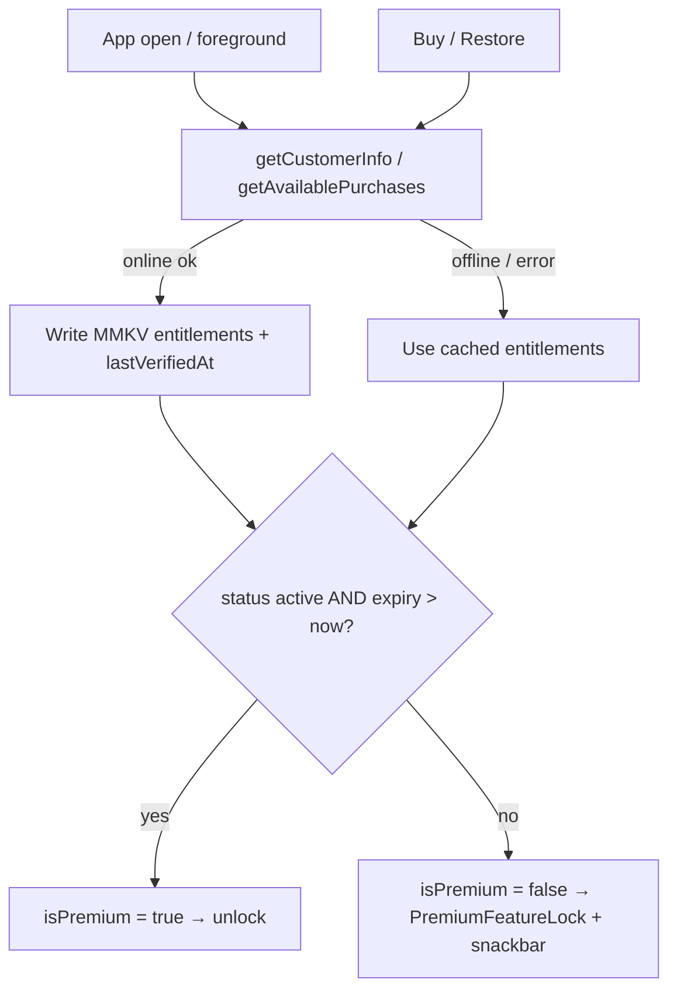

# Premium & Monetization

> How Pawductivity sells one paid **Premium** tier, what it unlocks, and how **Entitlement** is verified and cached fully on-device in the local-first rebuild.

**Status vs legacy:** [PRESERVE] the concept of a single Premium membership (`basic`/`premium`) that unlocks cosmetic pets/food/clothes plus a detailed-stats view. [CHANGE] server-side Google Play receipt verification + nightly expiry cron → RevenueCat or client-cached `react-native-iap`, with expiry evaluated lazily on app open. [DROP] the entire Midtrans one-off-payment surface (backend endpoints, Snap webhook, WebView UI, confirmation emails), all JWT/account-scoped entitlement, and Amplitude purchase events.

## What it is

Pawductivity has exactly **one** paid tier. Every user's entitlement of record is a **membership class**: `basic` (free, default) or `premium` (paid). Premium is a cosmetic-plus-insights upgrade — it does not gate the core loop (tasks/quests, feeding, the timer). The marketing pitch was literally *"For just Rp3.000,00, unlock more pets, foods, clothes, and more features."* (legacy: Pawductivity-Website/pages/features/index.tsx:29).

The legacy codebase shipped **two parallel, contradictory** monetization systems, only one of which the app actually invoked at runtime:

1. **LIVE — Google Play Billing subscriptions.** The Flutter app used the `in_app_purchase` plugin to buy a single product `pawductivity_premium`, forwarded the `purchaseToken` to a Go backend, which server-verified it against the Google Play Developer API and upserted membership. This is what the Premium page and app startup actually called.
2. **SHIPPED-BUT-UNUSED — Midtrans one-off purchases.** The backend exposed `/api/premium/1-month|6-month|1-year` (Rp3 000 / 9 000 / 15 000) driven by a Midtrans Snap webhook, and the Flutter side shipped a full WebView checkout UI (`payment.dart` + `payment_web_view.dart`). The Premium page was **never wired** to it, so it granted no revenue in the current flow — but the client code really shipped (legacy: completeness-critic gap "Midtrans payment client UI actually exists").

For the rebuild there is **no backend**, so the central problem is: *how do you verify a Google Play purchase and hold entitlement with no server?* The Play Developer API needs a `service_account.json` secret that cannot be safely embedded in a client. The deep option analysis lives in [`context/migration/monetization-options.md`](../../../context/migration/monetization-options.md); the short answer is RevenueCat (holds the credential, real verification) or accept spoofable client-side trust given the low value of what's gated.

## Core business rules

| # | Rule | Tag | Source |
|---|------|-----|--------|
| 1 | Membership class is `basic` or `premium`; one `membership` row per user, default `basic`. The gate is `class == 'premium' AND membership_expired_date > now`. | [PRESERVE] | membership.model.go |
| 2 | Single Google Play product id `pawductivity_premium`, package `com.production.pawductivity`. Durations were *intended* as multiple base plans of this one product but never confirmed (TODO comment). | [CHANGE] | subscription.controller.go:83-84 |
| 3 | Legacy Midtrans price/duration catalog: **1 month = Rp3 000** (`M-001`), **6 months = Rp9 000** (`M-006`), **1 year = Rp15 000** (`Y-001`). | [DROP] | premium.controller.go:42-45 |
| 4 | Midtrans duration→months: `1MONTH`→1, `6MONTHS`→6, `1YEAR`→12. | [DROP] | premium.controller.go:313-317 |
| 5 | Membership extension **stacks** (Midtrans path): if `expired_date > now` add N months to existing expiry, else set `now + N months`; `months = durationDays/30`, min 1. | [DROP] | membership.controller.go:39-42 (months = durationDays/30, min 1) + membership.repository.go:56-64 (ChangeMembership stacking) |
| 6 | Google Play membership sync **does not stack**: membership expiry is set to *exactly* Google's reported expiry (store owns renewal). | [CHANGE] | subscription.repository.go (UpdateMembership) |
| 7 | Subscription status derivation: `active`; if Google `CancelReason != 0` → `canceled`; if `expiry <= now` → `expired`. | [CHANGE] | subscription.controller.go |
| 8 | Nightly cron downgrades expired premium: `UPDATE membership SET class='basic' WHERE class='premium' AND membership_expired_date <= NOW()`, at local midnight, forever. | [CHANGE] | checkMembership.routine.go |
| 9 | Verify only re-calls Google when the **locally cached expiry has already passed**; otherwise trusts the cached DB status. | [PRESERVE] | subscription.controller.go |
| 10 | Only **one live subscription per user**: a new purchase archives + deletes the prior `subscriptions` row before inserting (purchase_token + transaction_id are UNIQUE). | [CHANGE] | subscription.repository.go |
| 11 | Purchase is `buyNonConsumable` (treated as a durable subscription entitlement). | [PRESERVE] | subscription_handler.dart |
| 12 | UI premium gate = `user.premium == 'premium'` (derived from `membership.class`). A **second, divergent** in-memory flag `SubscriptionHandler.isPremium` is set from verify's `status=='active'` — two sources of truth that can disagree. | [CHANGE] | subscription_handler.dart / home_widget |

### What Premium unlocks (verified against source)

Premium gates a small, well-defined set. All cosmetic catalogs carry an explicit `"premium": true/false` boolean.

| Surface | Premium-gated items | Tag | Source |
|---------|--------------------|-----|--------|
| **Pets** | **Rabbit** (id 3, 200 coins). Dog (100) and Cat (200) are free. | [PRESERVE] | config/constant/pet.dart:4 |
| **Food** | **Pizza** (id 3, price 4, heals 20). Apple/Chicken/Watermelon/Carrot are free. | [PRESERVE] | config/constant/food.dart:4 |
| **Clothes** | **Tuxedo** (id 3, price 20), **Star Shirt** (id 4, price 15), **Pink Dress** (id 5, price 15). Cyan t-shirt / Green shirt are free. | [PRESERVE] | config/constant/clothes.dart:4-6 |
| **Stats** | Home-screen **statistics container** and task-overview **weekly progress graph** are premium-only; free users see a blurred `PremiumFeatureLock` overlay with a "Go Premium" CTA. | [PRESERVE] | home_widget/premium_feature_lock.dart |
| **Shop tap** | Tapping a premium-flagged shop item as a free user shows `PremiumSnackbar` ("requires premium access") and blocks the purchase dialog. | [PRESERVE] | premium_widget/ |

> Note: premium items still cost **coins** on top of requiring premium — premium is a gate, not a free grant. See [coin-economy-and-shop](../coin-economy-and-shop/SKILL.md).

> The marketing said *"and more features later on"* — the intended full gated set beyond the above is unconfirmed. See Open decisions.

## Data & entities

Local schema owns entitlement state; there is no `membership`/`subscriptions`/`orders` server table anymore.

**MMKV + Zustand — the single source of truth for entitlement** (see [`context/data-model/state-and-mmkv.md`](../../../context/data-model/state-and-mmkv.md)):

```
entitlements = {
  isPremium: boolean,          // derived: status active && expiryMillis > now (or offline-grace)
  productId: string,           // e.g. 'pawductivity_premium'
  status: 'active'|'canceled'|'expired'|'none',
  expiryMillis: number,        // store-reported expiry
  autoRenewing: boolean,
  lastVerifiedAt: number,      // epoch ms of last successful RevenueCat/IAP fetch
}
```

**expo-sqlite (optional)** — a `purchase_history` table mirroring the legacy `subscriptions` + `archived_subscriptions` pair, purely for an in-app receipt/history view. Not required for gating. See [`context/data-model/sqlite-schema.md`](../../../context/data-model/sqlite-schema.md).

Legacy tables collapsed/dropped: `membership` → MMKV `entitlements`; `subscriptions`/`archived_subscriptions` → optional `purchase_history`; `orders`/`purchases` (Midtrans) → **[DROP]**.

## Key flows

### 1. Purchase (rebuild)
1. User opens the Premium/paywall screen and taps a plan.
2. **RevenueCat:** `Purchases.purchasePackage(pkg)` runs the native Play Billing sheet; RevenueCat server-verifies the receipt. **`react-native-iap`:** `requestSubscription(sku)` then **acknowledge** the purchase (mandatory within 3 days on Android or Google auto-refunds — a risk the legacy code never handled).
3. On success, read the entitlement (`getCustomerInfo().entitlements.active['premium']` / the acknowledged purchase) and write `entitlements` to MMKV.
4. UI re-renders from the `isPremium(state)` selector immediately.

### 2. Verify on app open (replaces `GET /subscription/verify` + nightly cron)
1. On cold start / foreground, call `Purchases.getCustomerInfo()` (or `getAvailablePurchases()`).
2. Update MMKV `entitlements` + `lastVerifiedAt`.
3. **Offline path:** if the call fails, fall back to cached `entitlements`; treat as premium if `expiryMillis > now` (offline grace). Lazy expiry: `isPremium = status==='active' && expiryMillis > Date.now()` — no cron, no daemon.

### 3. Restore purchases (NEW entry point)
- A **"Restore Purchases"** button calls `Purchases.restorePurchases()` / `getAvailablePurchases()`. Required because, with no accounts, a reinstall or new device otherwise loses premium. [NEW]

### 4. Feature gate (preserved pattern)
1. Read `isPremium(state)`.
2. If false: overlay `PremiumFeatureLock` (blur + "Go Premium") on the stats surfaces; show the premium snackbar and block purchase on premium-flagged shop items.



## Local-first rebuild guidance

| Legacy piece | Rebuild | Tag |
|---|---|---|
| Flutter `in_app_purchase` | **RevenueCat (`react-native-purchases`)** recommended, or **`react-native-iap`** for pure client-side. `expo-in-app-purchases` is deprecated — do **not** target it. | [CHANGE] |
| Server receipt verification with `service_account.json` | The secret **cannot** ship in the RN client. **(B) RevenueCat** holds the credential and verifies server-side → real verification + cross-device sync + offline cache. **(A) `react-native-iap` client-trust** → simple, fully offline, but spoofable on rooted devices. **(C) tiny serverless function** → secure but reintroduces a backend. See [`context/migration/monetization-options.md`](../../../context/migration/monetization-options.md). | [CHANGE]/[DECIDE] |
| `GET /subscription/verify` | On-launch `getCustomerInfo()`; update MMKV; offline-grace fallback. | [CHANGE] |
| `POST /subscription/purchase` (+ token forward) | Local purchase handler: acknowledge + write MMKV (automatic under RevenueCat). | [CHANGE] |
| `membership` table + nightly downgrade cron | Lazy client check: compare cached `expiryMillis` to `Date.now()` on every foreground/read. No background job. | [CHANGE] |
| Midtrans one-off flow, `/premium/*`, Snap webhook, WebView UI, Hostinger confirmation emails | **Delete entirely.** Show an in-app confirmation screen if a receipt is wanted. | [DROP] |
| Membership "stacking" extension math | Irrelevant for auto-renewing store subs; mirror store expiry. | [DROP] |
| Admin `/membership` endpoints | No server admin. Omit; optionally a hidden dev toggle to force-enable premium for testing. | [DROP]/[DECIDE] |
| JWT / account-scoped entitlement | Device-scoped (`react-native-iap`) or RevenueCat app-user-id. Add **Restore Purchases**; premium won't sync across devices without RevenueCat/Play restore. | [CHANGE] |
| Amplitude purchase events | Drop, or local-only. See [analytics-and-insights](../analytics-and-insights/SKILL.md). | [DROP] |

## New-app enhancements

- **AI features as the headline premium benefit.** [NEW] Client-side Claude calls (the [Brain Dump Parser](../ai-braindump-parser/SKILL.md) and [AI Lottie director](../ai-lottie-director/SKILL.md)) cost real money per request — far higher value than cosmetic gates. Consider gating AI behind premium with free-tier fallbacks (heuristic/regex parsing, static Lottie) for graceful degradation when free or offline.
- **Offline entitlement check before invoking Claude.** [NEW] Read the cached MMKV flag before any paid AI call; never block the UI on a network verify.
- **Fraud tolerance rises** once premium unlocks paid AI usage. That argues for RevenueCat/server-verified entitlement (option B) over pure client trust, plus **rate-limiting AI calls per entitlement** to cap cost. [DECIDE]
- **In-app purchase confirmation screen** replacing the dropped email receipt. [NEW]

## Open decisions

- **[DECIDE] Verification approach:** RevenueCat (option B) vs client-trust `react-native-iap` (A) vs serverless (C). Depends on fraud tolerance below.
- **[DECIDE] Fraud tolerance:** is spoofable client-only entitlement acceptable? For cosmetics + a stats view, yes; if premium also unlocks paid AI, likely no.
- **[DECIDE] Durations & real prices:** legacy is contradictory — the UI cards assumed 1/3/6 months, Midtrans sold 1/6/12 months. What SKUs/base-plans/prices actually exist for `pawductivity_premium` must be confirmed from the Play Console. The live Premium UI renders three plan cards (`1 month`/`3 months`/`6 months`) but the Google Play query returns a single product, so `_prices` only ever populates index 0 and cards 2 and 3 are perpetually stuck at `"Loading..."` — the multi-tier UI was never functional (legacy: premium_plan_container.dart:26,56-82 fed from `availableProducts` of the single-SKU `queryProductDetails({'pawductivity_premium'})` in subscription_handler.dart:34). The rebuild must model real base plans (see [`monetization-options.md`](../../../context/migration/monetization-options.md) §6) before showing multiple tiers. Cross-links to `context/02-open-decisions.md`.
- **[DECIDE] Subscription vs one-time:** auto-renewing subscription (Google Play path) or one-off purchase (Midtrans path)? The two legacy systems disagree.
- **[DECIDE] Cross-device / reinstall survival:** needed? Determines RevenueCat vs pure device-local IAP.
- **[DECIDE] Full gated feature set:** confirm what "and more features" was meant to include beyond Rabbit/Pizza/Tuxedo/Star Shirt/Pink Dress + stats — and whether AI features join the gate.
- **[DECIDE] Free trial / promo / grace period:** none existed in legacy. Add any?
- **[DECIDE] Refund/revocation:** legacy had no Google RTDN endpoint (only a Midtrans webhook). Is lazy expiry-on-launch sufficient, or is real-time revocation needed?

## Legacy references

- App (live Google Play path): `Pawductivity_App/lib/features/user/presentation/handlers/subscription_handler.dart`, `.../pages/premium.dart`, `.../widgets/premium_widget/premium_plan_container.dart`, `.../premium_feature_list.dart`, `.../home_widget/premium_feature_lock.dart`
- App (premium bloc/repo/model): `Pawductivity_App/lib/features/premium/presentation/bloc/premium/remote/remote_subscription_bloc.dart`, `.../data/repository/subscription_repository_impl.dart`, `.../data/model/subscription_model.dart`, `.../data/data_sources/remote/subscription_api_service.dart`
- App (Midtrans shipped-but-unused): `.../pages/payment.dart`, `.../pages/payment_web_view.dart`, `.../features/premium/data/data_sources/remote/premium_api_service.dart`
- App (premium item catalogs): `Pawductivity_App/lib/config/constant/pet.dart`, `.../food.dart`, `.../clothes.dart`
- Backend: `Pawductivity_BE/internal/controllers/subscription.controller.go`, `premium.controller.go`, `membership.controller.go`; `internal/repository/subscription.repository.go`, `membership.repository.go`; `internal/routines/checkMembership.routine.go`; `database/migration/model/membership.model.go`, `subscription.model.go`

## Related

- [`context/migration/monetization-options.md`](../../../context/migration/monetization-options.md) — deep RevenueCat vs `react-native-iap` vs serverless analysis
- [account-and-profile](../account-and-profile/SKILL.md) — entitlement is device/profile-scoped; no accounts to attach it to
- [coin-economy-and-shop](../coin-economy-and-shop/SKILL.md) — premium items still cost coins; the shop enforces the gate
- [food-and-feeding](../food-and-feeding/SKILL.md) · [clothes-and-wardrobe](../clothes-and-wardrobe/SKILL.md) · [pet-companion-system](../pet-companion-system/SKILL.md) — the premium-flagged catalogs (Pizza / Rabbit / Tuxedo, Star Shirt, Pink Dress)
- [analytics-and-insights](../analytics-and-insights/SKILL.md) — the premium-gated stats/weekly-progress surfaces
- [ai-braindump-parser](../ai-braindump-parser/SKILL.md) · [ai-lottie-director](../ai-lottie-director/SKILL.md) — candidate NEW premium gates
- [local-first-data-layer](../local-first-data-layer/SKILL.md) — MMKV/Zustand entitlement cache
- [`context/legacy/dead-and-incomplete-features.md`](../../../context/legacy/dead-and-incomplete-features.md) — the Midtrans surface as shipped-but-dead
- [`context/02-open-decisions.md`](../../../context/02-open-decisions.md) — monetization decisions roll up here
