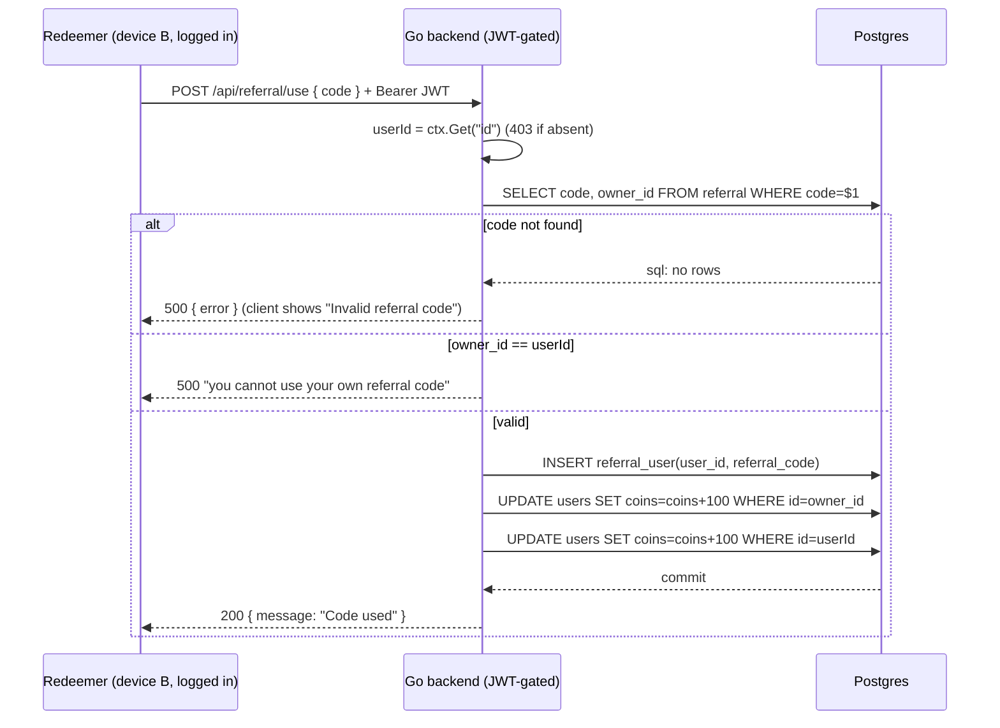

# Referral System

> Invite-a-friend: every user got a personal **referral** code; redeeming a friend's code paid **+100 Coins to both** parties. This is the **one subsystem that structurally fights the local-first, no-account rebuild** — referral inherently links two users across two devices and needs a shared service to attribute A→B.

**Status vs legacy:** [PRESERVE] the *concept* — a shareable per-user code and a two-sided Coin reward. [CHANGE] nothing cleanly, because [DROP] the entire mechanism as built: it depended on server accounts, JWT identity, a central `referral`/`referral_user` table, and a server transaction that credited two user rows — all of which HARD RULE #1 (no backend) and #2 (no accounts) delete. [DECIDE] whether referral exists in v1 at all, and if so, *how* attribution works without a central server. This file documents the legacy behavior faithfully, then confronts that gap honestly. Rolls up to [context/02-open-decisions.md](../../../context/02-open-decisions.md) D9–D11.

## What it is

In the legacy product, referral was a light growth loop wired into the **user/profile** feature (not its own top-level feature):

- At **signup**, the backend minted an **8-character A–Z uppercase code** unique to that user and stored it in a `referral` table keyed to their `owner_id` (legacy: `Pawductivity_BE/internal/repository/user.repository.go:167-177`).
- On the profile/referral screen the user could **paste a friend's code** and submit it. The server verified the code, recorded the redemption, and **granted +100 Coins to the code's owner AND +100 Coins to the redeemer** (legacy: `Pawductivity_BE/internal/repository/referral.repository.go:54-56`).
- The user could also **see who had used their code** and **who they had been referred by** (name + avatar index), rendered as a friends list (legacy: `referral.repository.go:61-155`; `Pawductivity_App/lib/features/user/presentation/pages/referral_users.dart`).

Everything load-bearing — code generation, uniqueness, the reward, and attribution — lived **server-side** and was gated by JWT auth (`c.Get("id")`, legacy: `referral.controller.go:17-25`). The Flutter client only rendered the code, a text field, and a generic success dialog; it **never even knew the reward amount** (legacy: `referral_widget/referral_dialogs.dart` shows a generic "submitted" message, no coins figure).

## How it worked (legacy)

### Code generation (at signup)
Two signup paths both generated the code inline inside the account-creation DB transaction:

```go
// legacy: Pawductivity_BE/internal/repository/user.repository.go:168-174
code := ""
for i := 0; i < 8; i++ {
    code += string(rune(65 + rand.Intn(26)))   // ASCII 65='A' .. 90='Z'
}
_, err = tx.Exec("INSERT INTO referral (code, owner_id) VALUES ($1, $2)", code, newUserId)
```

- **8 chars, uppercase A–Z only** (`rune(65 + rand.Intn(26))` → 'A'…'Z'). No digits, no lowercase, no ambiguity-stripping.
- Keyspace = 26⁸ ≈ **2.09 × 10¹¹** codes.
- Same generator runs in the **email/password** signup (`CreateUsers`, `user.repository.go:170-174`) and the **Google sign-in** signup (`user.repository.go:337-341`). Google sign-up returns the fresh code to the client (legacy: `auth.controller.go:124` `"referral_code": code`).
- **No collision check / retry.** The `INSERT` relies on the `code` PRIMARY KEY. On the (astronomically unlikely) collision the whole *signup* transaction fails — referral generation is not isolated or retried. See anti-abuse gaps.

### Redemption flow


Legacy: `referral.repository.go:24-59`, `referral.controller.go:17-61`, `routes/referral.route.go:52`. The redeemer must be **authenticated** — there is no anonymous redemption. The redeem screen accepts **any non-empty string** with no client-side validation (legacy: `referral_input_section.dart:57-59`).

### Tracking (the friends list)
`GET /api/referral/users` returns, per code, the list of users who redeemed it (name + `profile_index` avatar), plus the people **you** were referred by, merged into one list (legacy: `referral.repository.go:61-155`; controller `:63-96`; route `:93`).

## Core business rules

All tags cited. Paths relative to `old/`.

| # | Rule | Tag | Legacy source |
|---|---|---|---|
| 1 | Each user gets **one** referral code, minted **at signup** inside the account-creation transaction. | [PRESERVE] (concept) / [DROP] (as built — needs accounts) | `internal/repository/user.repository.go:167-177` |
| 2 | Code format = **8 uppercase letters A–Z**, `rune(65 + rand.Intn(26))` × 8. Keyspace 26⁸ ≈ 2.09×10¹¹. | [PRESERVE] (format is fine) | `user.repository.go:170-172`, `:337-339` |
| 3 | Code column is **`VARCHAR(8)` PRIMARY KEY** on `referral`; `owner_id` FK → `users`. | [CHANGE] (no `users` table locally) | `database/script/pawductivity.sql:167-172`; `internal/models/referral.go:8` |
| 4 | Redemption requires **JWT auth**; `userId` comes from token context, 403 if missing. | [DROP] (no auth server) | `referral.controller.go:17-25`, `:38-49` |
| 5 | **Self-redemption blocked:** `owner_id == user_id` → error "you cannot use your own referral code". | [PRESERVE] (keep the intent) | `referral.repository.go:45-47` |
| 6 | Redemption **inserts `referral_user(user_id, referral_code)`**; PK `(referral_code, user_id)` stops the *same* user redeeming the *same* code twice. | [CHANGE] | `referral.repository.go:49`; `pawductivity.sql:174-180` |
| 7 | **Reward = +100 Coins to the owner AND +100 Coins to the redeemer**, in the same transaction. Applied as two bare `UPDATE users SET coins = coins + 100` statements — **NOT** via the `buy_coins` procedure — so referral rewards left **no purchases-ledger row**, unlike every other coin credit (signup/task/coin-pack). | [PRESERVE] (concept) / [DECIDE] (amount + who) / [CHANGE] (ledger it — see rebuild guidance) | `referral.repository.go:54-56` |
| 8 | Reward amount was **never shown client-side** — the redeem dialog is generic; the client didn't know it was 100. | [CHANGE] (surface the real reward if kept) | `referral_widget/referral_dialogs.dart`; see [02-open-decisions §3](../../../context/02-open-decisions.md) |
| 9 | **Tracking:** `GET /api/referral/users` lists redeemers of your code + who referred you (name + avatar index). | [CHANGE] (needs a shared datastore) | `referral.repository.go:61-155` |
| 10 | Google signup also returns the new `referral_code` to the client. | [DROP] (Google Sign-In dropped) | `auth.controller.go:124` |
| 11 | Client method `createReferral` → `POST /api/referral` exists in the Dart API layer but **has no backend route** (backend only serves `/use` and `/users`). Codes are auto-minted at signup, never via this call. | [DROP] (dead client code) | `referral_api_service.dart:11-12` vs `routes/referral.route.go` |

### Anti-abuse gaps (legacy) — inherit none of these

The legacy design is easy to farm; document so the rebuild doesn't reproduce it:

| Gap | Why it's exploitable | Legacy source |
|---|---|---|
| **No redemption limit per user** | Only the *same code + same user* pair is blocked (PK, rule 6) and your *own* code (rule 5). A user can redeem **many different codes**, +100 each — pure Coin farming by collecting friends' codes. | `referral.repository.go:45-52` |
| **No new-user gating** | Redemption is allowed **any time by any account**, not only right after signup. It is not tied to being a genuinely new install. | `referral.controller.go` (no time/state check) |
| **Sybil / sock-puppet** | Create throwaway account B, redeem account A's code → both +100. Self-block (rule 5) only stops the *literal same* account. With free account creation this is trivial. | conceptual |
| **Coin-grant errors swallowed** | The two `UPDATE ... coins+100` assign to `err` but the function `return nil` regardless; the deferred commit fires even if a grant failed → redemption recorded without (or with partial) reward. | `referral.repository.go:55-58` |
| **No collision handling** | Generated code isn't checked/retried; a PK clash aborts the entire *signup*. | `user.repository.go:170-177` |
| **No rate limiting / fraud detection** | No cooldown, velocity check, or device fingerprinting anywhere. | (absent) |
| **Tracking-list bug** | `GetReferralUsers` appends **all** of your referral-friends to **every** code group; harmless only because each user has exactly one code. | `referral.repository.go:103-112` |

## Data & entities (legacy)

Two tiny tables, both keyed on the server `users` table that **does not exist in the rebuild** (single local profile, no `users` rows to reference):

| Table | Columns | Role |
|---|---|---|
| `referral` | `code VARCHAR(8) PK`, `owner_id int FK→users` | one code per user | 
| `referral_user` | `referral_code VARCHAR(8) FK`, `user_id int FK`, **PK (referral_code, user_id)** | who redeemed which code |

Legacy: `pawductivity.sql:167-180`; `internal/models/referral.go`. Neither table survives as-is — the whole point of a referral row is to link **two different `users.id` values**, and the rebuild has exactly one local profile (`id=1`, see [account-and-profile](../account-and-profile/SKILL.md)). There is nothing local to be "the other user."

## The local-first problem — stated honestly

Referral is the one feature in Pawductivity that **cannot be made truly local-first**. It is definitionally a **two-party, cross-device** transaction:

1. Two *distinct* identities must exist (referrer, referee). The rebuild has **no accounts** and a **single local profile** — there is no stable, server-verifiable identity to own a code or to be credited (HARD RULE #2).
2. A shared authority must **attribute** "device B redeemed device A's code" and **credit both** — that requires a datastore both devices can reach, i.e. **a server** (HARD RULE #1 forbids one).
3. Without a shared authority, a manually typed code is **unverifiable**: the receiving device can't tell a real friend's code from a made-up 8-letter string, so any "reward" is just a self-serve Coin faucet — farmable and meaningless. There is no offline way to prove a code was legitimately issued (no signing key is provisioned, and even a signed code can't credit the *other* side).

So the choice is not "how do we port referral" but **"do we accept a scoped remote touchpoint for this one feature, or drop it for v1?"** This is the same category of honest exception as store receipt verification ([premium-and-monetization](../premium-and-monetization/SKILL.md)) — a place where the no-server rule genuinely bites. It must be surfaced as a decision, never silently solved by building a server.

## Options [DECIDE]

Mirrors [context/02-open-decisions.md](../../../context/02-open-decisions.md) D9 (keep at all), D10 (reward), D11 (attribution).

| Option | What it is | Attribution / reward | Cost | Local-first honesty |
|---|---|---|---|---|
| **(a) Defer / omit for MVP** ✅ *recommended* | Ship v1 with **no referral**. Keep the concept parked. | none | zero | Fully compliant. No server, no fake reward. |
| **(b) Share-a-code deep link + lightweight future service** | Generate a local code, share an app/deep link (or use the Play **Install Referrer**). A minimal service captures who installed from whom and credits later. | Real two-sided attribution, but **only once the service exists** | needs a small backend eventually | Deferred; honest — reward is gated on the service being built. |
| **(c) Minimal cloud function just for referral** | One scoped serverless function + a tiny table `(code, owner, redeemed_by[])`. Redeem calls it; it credits both via a signed grant the app applies to local Coins. | Real, verifiable, two-sided | a single-purpose function + KV/table; ops + abuse-mitigation burden | The narrowest honest server touchpoint; **must be raised as `[DECIDE]` before building** (HARD RULE #1). |
| **(d) Local-only "welcome bonus" (not real referral)** | Manual code entry grants the **referee only** a one-time Coin bonus; **no referrer credit, no attribution**. | referee-only, unverifiable | zero | Compliant but **not a referral** — really just an onboarding bonus; farmable unless capped to once-per-install (MMKV flag). Don't call it "referral." |

### Recommendation

**Default = (a): drop referral for v1**, and record it in [02-open-decisions.md](../../../context/02-open-decisions.md) as D9 = defer. Rationale:

- It's the only feature that breaks the two HARD RULES, and its legacy reward was invisible to users anyway (rule 8) — the growth value it actually delivered was low.
- If the product later adds *any* server (e.g. store receipt verification lands, or a growth push is prioritized), revisit with **(c)** as the least-bad shape: a single, opt-in, single-purpose function, with the anti-abuse gaps above explicitly closed (one redemption per install, new-user-only window, server-side idempotent crediting, velocity limits).
- **(d)** is acceptable *only* if reframed as an onboarding "welcome bonus" in the [coin-economy-and-shop](../coin-economy-and-shop/SKILL.md), capped to once per install via an MMKV flag — but it must **not** be presented to users or in the codebase as "referral," to avoid implying attribution that doesn't exist.

Whatever is chosen, the **reward amount and recipients** (legacy +100/+100) are themselves a `[DECIDE]` (D10) and belong to the [coin-economy-and-shop](../coin-economy-and-shop/SKILL.md) tuning table, not hard-coded here.

## Local-first rebuild guidance

| Legacy piece | Rebuild disposition |
|---|---|
| `referral` / `referral_user` tables + `owner_id`/`user_id` FKs | [DROP] — no `users` table; a single local profile has no second party to link. |
| `POST /api/referral/use`, `GET /api/referral/users`, dead `POST /api/referral` | [DROP] — no backend. If option (c) is chosen, exactly one function replaces `/use`. |
| JWT-gated `userId` from token | [DROP] — no auth server (HARD RULE #2). |
| 8× `rune(65+rand.Intn(26))` code generator | [PRESERVE] the *format* only if referral is kept — it's a fine, collision-safe-enough code; generate locally, but attribution still needs a shared authority. |
| +100/+100 Coin grant | [DECIDE] — if kept, apply via the local Coin ledger ([coin-economy-and-shop](../coin-economy-and-shop/SKILL.md)) as a signed delta. Note this **intentionally diverges from legacy**, which wrote bare `UPDATE users SET coins+100` with no ledger entry (`referral.repository.go:55-56`); ledgering it keeps the balance reconstructable. The *referrer* side is impossible without a server. |
| Friends list (who used your code) | [DROP] for (a); requires a shared datastore for (b)/(c). |
| Server crons / analytics on referral | [DROP]. |

## Open decisions

- **[DECIDE] D9 — Keep referral at all?** Recommend **defer/drop for v1** (this file's default). Revisit only if a server touchpoint already exists for another reason.
- **[DECIDE] D10 — Reward (amount + who).** Legacy actually granted **+100 to both** (`referral.repository.go:54-56`), though it was never shown client-side. If kept, specify and surface it; tune in [coin-economy-and-shop](../coin-economy-and-shop/SKILL.md).
- **[DECIDE] D11 — Attribution without a central server.** Deep-link / Install-Referrer + a lightweight service (b), a scoped cloud function (c), or referee-only local bonus (d, not real referral). Contingent on D9.
- **[DECIDE] Anti-abuse posture** (only if kept): one redemption per install, new-user-only window, server-idempotent crediting, velocity/fraud limits — none existed in legacy.

## Legacy references

- `Pawductivity_BE/internal/repository/referral.repository.go` — `UseCode` (self-block, insert, +100/+100, swallowed errors), `GetReferralUsers`, `GetReferralFriends`.
- `Pawductivity_BE/internal/controllers/referral.controller.go` — JWT gate, `/use` + `/users` handlers.
- `Pawductivity_BE/routes/referral.route.go` — route registration + swagger.
- `Pawductivity_BE/internal/models/referral.go` — `Referral`, `UserReferral`, `ReferralUsers` DTOs.
- `Pawductivity_BE/internal/repository/user.repository.go:167-177`, `:337-341` — the 8-char A–Z code generator at signup (email + Google paths).
- `Pawductivity_BE/database/script/pawductivity.sql:167-180` — `referral` / `referral_user` schema.
- `Pawductivity_BE/internal/controllers/auth.controller.go:124` — Google signup returns `referral_code`.
- `Pawductivity_App/lib/features/user/data/data_sources/remote/referral_api_service.dart` — Dart API layer (incl. dead `createReferral`).
- `Pawductivity_App/lib/features/user/domain/usecases/{create_referral,use_referral,get_referral_users}.dart` — usecases.
- `Pawductivity_App/lib/features/user/presentation/widgets/referral_widget/*` (`referral_input_section.dart`, `referral_dialogs.dart`, `referral_code_section.dart`, `referral_friends_lists.dart`), `pages/referral_users.dart` — the UI.

## Related

- [account-and-profile](../account-and-profile/SKILL.md) — the single local profile that replaces the `users` table; why there's no second party to attribute a referral to.
- [coin-economy-and-shop](../coin-economy-and-shop/SKILL.md) — where any referral reward (and a possible "welcome bonus" reframing) is granted and tuned; the Coin ledger.
- [premium-and-monetization](../premium-and-monetization/SKILL.md) — the other honest remote-touchpoint (receipt verification); same "don't silently build a server" trade-off.
- [context/02-open-decisions.md](../../../context/02-open-decisions.md) — **D9 (keep referral?), D10 (reward), D11 (attribution)** — the product owner's call.
- [context/01-glossary.md](../../../context/01-glossary.md) — canonical **Referral** definition.
- [context/legacy/backend-api-catalog.md](../../../context/legacy/backend-api-catalog.md) — the `/referral/*` endpoints in the full API inventory.
- [context/migration/backend-to-local-first.md](../../../context/migration/backend-to-local-first.md) — the general server→device mapping this feature is the exception to.
