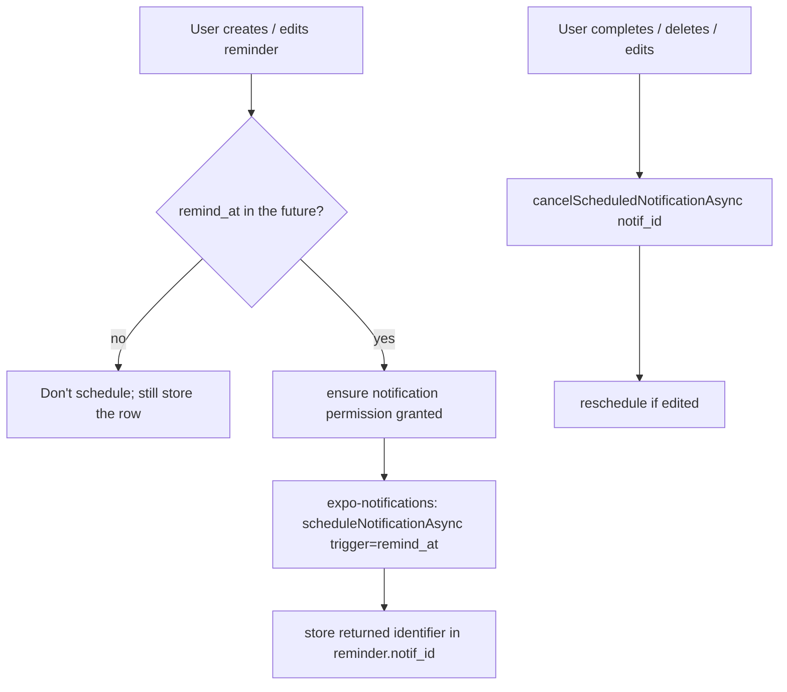

# Reminders & Calendar / Activity

> **Scope.** Three related surfaces that legacy lumped under the `task` feature but are conceptually distinct from Quests: (1) **Reminders** — lightweight, time-anchored notes that fire a notification; (2) the **Calendar** — a month grid combining Quests + Reminders + a per-day completion heatmap; (3) **Activity / Timeline** — the analytics rollups (7-day bar chart, 2-hour timeline). Quest mechanics themselves live in [task-quest-system](../task-quest-system/SKILL.md); this skill owns everything reminder- and calendar-shaped.

**Local-first north star.** Legacy fetched all three from the Go/Postgres server (`extract(...)` date SQL + `generate_series` CTEs). The rebuild computes the identical shapes from **expo-sqlite** on device, and — critically — makes reminders *actually fire* via **expo-notifications** (legacy never did). No server, no daemon, no cron. See HARD RULES in [CLAUDE.md](../../../CLAUDE.md) and [backend-to-local-first](../../../context/migration/backend-to-local-first.md).

---

## 1. TL;DR for the implementer

| You need to… | Do this | Tag |
|---|---|---|
| Store a reminder | `reminder` table, single `remind_at` epoch-ms (legacy split `time`+`date`) | [CHANGE] |
| Make a reminder notify | Schedule an `expo-notifications` trigger at create/edit; **reschedule all future reminders on app boot** | [NEW] |
| Recur a reminder | Materialize the recurrence client-side; legacy had **no** recurrence expansion at all | [DECIDE] |
| Show a calendar month | Query reminders + quests overlapping the month ±7 days; build the checklist heatmap from `daily_log` | [CHANGE] |
| Show the completion heatmap | Derive per-day booleans from `daily_log` — the legacy `checklist` int[] table is **dropped** | [CHANGE] |
| Show the 7-day activity bar chart | `SUM(time_completed) GROUP BY DATE` over a client-built 7-day series | [CHANGE] |
| Show the 2-hour timeline | Bucket `time_log` rows into 12× 2-hour intervals for a given day | [CHANGE] |

Everything below is the detail behind that table, with legacy citations you can verify.

---

## 2. Canonical vocabulary

Use these terms only (see [glossary](../../../context/01-glossary.md)); do not introduce synonyms.

- **Reminder** — a named, time-anchored entry (`remind_at`, optional recurrence) that fires a local notification and appears on the calendar. Distinct from a **Quest** (which has estimated time, XP, coins, focus tracking).
- **Recurrence** — `once` | `weekly` | `monthly` | `yearly` (legacy `ReminderType`). [PRESERVE] the enum values.
- **Calendar** — the month grid view mixing Quests + Reminders + the completion heatmap.
- **Checklist status / completion heatmap** — one boolean-ish value per day-of-month indicating "did meaningful work happen that day". (Legacy noun: `checklistStatus`. Not to be confused with the [NEW] `checklist`-kind Quest subtasks in [task-quest-system](../task-quest-system/SKILL.md) — unrelated despite the name collision.)
- **Activity** — the 7-day "seconds completed per day" series behind the bar chart.
- **Timeline** — a single day split into 2-hour buckets, each listing which tasks got time.

---

## 3. The reminder model

### 3.1 Legacy shape (ground truth)

Legacy defined the reminder **four times** with drift:

| Source | Fields |
|---|---|
| GORM runtime table (`Pawductivity_BE/database/migration/model/reminder.model.go`) | `id, userid, remindername varchar(50), reminder_description varchar(50), time timestamp, date timestamp, iscompleted bool default false, reminder_type enum, createdat timestamp` |
| API model (`Pawductivity_BE/internal/models/reminder.go`) | same, but `date` typed as `string` (drift) |
| Flutter entity (`Pawductivity_App/lib/features/task/domain/entitites/reminder_entity.dart`) | `id, userId, remindername, reminderDescription, time DateTime, date DateTime, isCompleted, reminderType String` |
| Flutter **template** (`.../data/model/reminder_template_model.dart`) | adds client-only `alarmStatus bool` + stores `reminderTime` as **seconds-since-midnight int**, `date` as a `CustomDate` |

`ReminderType` enum values are identical in both stacks: `once, weekly, monthly, yearly` (`reminder.model.go:9-14`, `Pawductivity_App/lib/features/task/domain/entitites/enum.dart:1-6`).

**Two legacy facts that drive the rebuild:**

1. **`time` and `date` were redundant separate timestamps.** `time` carried the clock, `date` carried the calendar day; both were full timestamps. Aggregation queried `date`, scheduling would have needed both. This is error-prone → **merge into one `remind_at`**.
2. **`alarmStatus` went nowhere.** It existed only on the Flutter `ReminderTemplate`/`ScheduledEntry` client models and the "Alarm" `Switch` (`.../widgets/new_reminder_widget/new_reminder_alarm_toggle.dart`). It was **never persisted to the server** (the `Reminder` API/table has no alarm column) and **never wired to `flutter_local_notifications`** — that plugin was used *only* by the focus timer/background service (`.../background/background_service.dart`, `.../pages/task_management_screen.dart`). **Legacy reminders never actually notified the user.** [DROP] the dead toggle; [NEW] real scheduling (§5).

### 3.2 New shape (expo-sqlite)

The canonical DDL lives in [sqlite-schema](../../../context/data-model/sqlite-schema.md) (table map row: `reminder → reminder`, "merge legacy `time`+`date` into one `remind_at`"). Proposed table — reconcile here if you edit it there:

```sql
CREATE TABLE reminder (
  id            INTEGER PRIMARY KEY AUTOINCREMENT,
  name          TEXT    NOT NULL,               -- legacy remindername varchar(50)
  description   TEXT,                            -- legacy reminder_description varchar(50)
  remind_at     INTEGER NOT NULL,               -- Unix epoch MS; merges legacy time+date. [CHANGE]
  recurrence    TEXT    NOT NULL DEFAULT 'once'
                  CHECK (recurrence IN ('once','weekly','monthly','yearly')),  -- [PRESERVE]
  is_completed  INTEGER NOT NULL DEFAULT 0 CHECK (is_completed IN (0,1)),      -- [PRESERVE]
  notif_id      TEXT,                            -- expo-notifications identifier for cancel/reschedule. [NEW]
  created_at    INTEGER NOT NULL DEFAULT (unixepoch() * 1000)
);
-- next-to-fire scheduling / calendar-range scans:
CREATE INDEX idx_reminder_time ON reminder(remind_at) WHERE is_completed = 0;
```

| Legacy field | New field | Change | Note |
|---|---|---|---|
| `userid` | — | [DROP] | single local user (id=1) — see [local-first-data-layer](../local-first-data-layer/SKILL.md) |
| `remindername varchar(50)` | `name TEXT` | [CHANGE] | keep the 50-char UX limit in the form; SQLite need not enforce it |
| `reminder_description varchar(50)` | `description TEXT` | [CHANGE] | optional |
| `time` + `date` (two timestamps) | `remind_at INTEGER` (epoch ms) | [CHANGE] | one value; timestamps are epoch-ms per schema convention |
| `reminder_type` | `recurrence` | [PRESERVE] | same 4 values |
| `iscompleted` | `is_completed` (0/1) | [PRESERVE] | SQLite bool = INTEGER |
| `alarmStatus` (client-only) | — | [DROP] | replaced by real scheduling; every reminder notifies (or add an opt-out later — [DECIDE]) |
| `createdat` | `created_at` | [PRESERVE] | epoch ms |

---

## 4. Reminder CRUD (server endpoints → local ops)

Legacy `reminders.route.go` (JWT-gated) registers **only five** reminder routes — the CRUD-by-id set below; there is **no** `GET /reminders` list-by-Y/M/D or -by-Y/M route. The two list queries (`GetReminders`, `GetRemindersMonthly`) live in `reminder.repository.go` but are reached (if at all) from the **task** controller, not a reminder endpoint. Each routed op maps 1:1 to a local SQLite function. **Every mutation must also touch the notification scheduler (§5).**

| Legacy endpoint | Handler | Local replacement | Extra local step |
|---|---|---|---|
| `POST /reminders` | `CreateReminder` (`reminders.controller.go:56`) | `INSERT INTO reminder …` | schedule notification → store `notif_id` |
| `PATCH /reminders` (complete) | `CompleteReminder` (`:19`) | `UPDATE reminder SET is_completed=1 WHERE id=?` | cancel its scheduled notification |
| `PUT /reminders` (edit) | `EditReminder` (`:181`) | `UPDATE reminder SET …` | cancel old `notif_id`, reschedule, store new id |
| `DELETE /reminders/:reminderId` | `DeleteReminder` (`:89`) | `DELETE FROM reminder WHERE id=?` | cancel its scheduled notification |
| `GET /reminders/:id` | `GetReminder` (singular, `:152`) | `SELECT … WHERE id=?` | — |

**The two list queries (not reminder endpoints):**

| Legacy query | Where it's actually called | Local replacement |
|---|---|---|
| `GetReminders` by Y/M/D (`reminder.repository.go:27`) | invoked inside the **task** controller: `GET /task` (`GetTasks`) returns `{tasks, reminders}` for the day (`task.controller.go:46`), and the checklist endpoint calls it too (`:343`) | `WHERE strftime('%Y-%m-%d', remind_at/1000,'unixepoch','localtime')=?` for the day view |
| `GetRemindersMonthly` by Y/M (`reminder.repository.go:54`) | **dead code** — defined in the repo interface but never routed and never called anywhere; the calendar's reminders come from `GetCalendarData`'s own inline `SELECT … FROM reminders` (`task.repository.go:150-169`), not this. **[DROP]** | month-range scan on `remind_at` (for the calendar) |

Legacy ownership/tenancy checks (`DeleteReminder` verified `userid` match, `reminder.repository.go:103-143`) are **[DROP]** — single local user, no rows to guard.

> **Legacy checklist reminders were always empty (defect — do not port).** `GetChecklist` (`task.controller.go:343`) calls `GetReminders(userId, year, month, "")` — reusing the Y/M/D query with an **empty day**, so its `extract(day from date) = $4` filter (`reminder.repository.go:31`) matches nothing and the checklist's `reminders` array is effectively always empty. Derive the calendar/checklist reminders from a proper month-range scan on `remind_at` (§6) rather than porting this path. [CHANGE]

> **Legacy date-matching gotcha.** `GetReminders` filtered with Postgres `extract(day from date)=…` (`reminder.repository.go:31`). That is a **UTC** extraction against a timestamp — reminders near midnight could land on the wrong calendar day. Locally, always compare with `'localtime'` (`strftime(..., 'unixepoch','localtime')`) so a 11pm reminder shows on the user's day. [CHANGE]

---

## 5. Scheduling, recurrence & firing notifications `[NEW]`

This is the biggest gap the rebuild fills: **legacy stored reminders but never notified.** The rebuild uses **expo-notifications** for local, on-device scheduled notifications. Permission handling, Android notification channels, and the boot/rehydrate hook are owned by [notifications-and-permissions](../notifications-and-permissions/SKILL.md) — this skill defines *what* to schedule; that skill defines *how* to talk to the OS.

### 5.1 Scheduling a single reminder



Rules:
- Schedule at **create** and **edit**; cancel at **complete**, **delete**, and before an edit reschedule. Always keep `reminder.notif_id` in sync so cancellation is possible.
- Do not schedule reminders already in the past or already `is_completed`.
- The notification title = `reminder.name`, body = `reminder.description`. (Legacy had no notification content to port; this is [NEW].)

### 5.2 Reschedule-on-boot (mandatory) `[NEW]`

OS-scheduled notifications can be lost on reboot, app reinstall, timezone change, or when the OS trims a large pending queue. Because there is **no server** to re-push, the app is the only source of truth:

> **On every app launch** (and on returning from background after a long gap), reconcile the OS scheduled set with the DB: cancel all app-owned scheduled notifications, then re-schedule every `reminder` where `is_completed = 0 AND remind_at > now`. Update `notif_id` for each.

This mirrors the "server crons → on-app-open computation from timestamps" principle in [CLAUDE.md](../../../CLAUDE.md) §3 and is the same reschedule-on-boot pattern the focus timer relies on — see [focus-timer-and-background](../focus-timer-and-background/SKILL.md) and [notifications-and-permissions](../notifications-and-permissions/SKILL.md).

### 5.3 Recurrence — the honest state `[DECIDE]`

Legacy stored `reminder_type` (`once/weekly/monthly/yearly`) but had **no recurrence-expansion logic anywhere on the server**: `GetReminders` matched one exact `date`, and the calendar aggregation (`GetCalendarData`, §6) returned the raw `type` string without projecting future occurrences. So a legacy "monthly" reminder was effectively a single-date row with a label — it never actually recurred in queries or notifications (which didn't fire at all). Verify: `reminder.repository.go:27-76`, `task.repository.go:150-169`.

The rebuild must decide the real semantics. Options:

| Approach | How | Trade-off |
|---|---|---|
| **A. expo-notifications native recurrence** | Use calendar/weekly triggers (`repeats: true`) for `weekly`; compute next date for `monthly`/`yearly` | Simple for weekly; native triggers don't cleanly express "monthly on the Nth"; calendar view must re-derive occurrences separately |
| **B. Materialize N future occurrences** | On create/boot, expand recurrence into concrete future `remind_at` values (as rows or as a virtual list) up to a horizon (e.g. 12 months); schedule each | One model feeds both calendar and notifications; needs a periodic top-up (do it on boot) |
| **C. Keep `once` only for v1** | Ship non-recurring reminders; defer recurrence | Smallest scope; loses a legacy-advertised concept |

**[DECIDE]** which approach — logged in [open-decisions](../../../context/02-open-decisions.md). Recommendation to evaluate: **B** (materialize + boot top-up) because it unifies the calendar month view and the notification queue against one list of concrete datetimes, avoiding two divergent recurrence engines. Until decided, treat all reminders as `once` and render the stored `recurrence` as a label only (legacy-equivalent behavior, minus the dead toggle).

---

## 6. Calendar month data

### 6.1 Legacy shape (ground truth)

`GET /calendar?month=&year=` → `GetCalendarData` (`task.controller.go:248`, repo `task.repository.go:106-172`) returned a `CalendarMonthData` (`internal/models/calendarMonthData.go`):

```
CalendarMonthData {
  checklistStatus : int[]            // per-day completion flags for the month
  tasks           : MonthlyTask[]    // { taskName, createdAt, dueDate, repetition:bool[7] }
  reminders       : MonthlyReminder[]// { name, createdAt, date, type }
}
```

Aggregation logic worth preserving (`task.repository.go:106-172`):
- **Range = month ± 7 days.** `startRange = firstOfMonth − 7d`, `endRange = lastOfMonth + 7d` (`:110-113`). Tasks/reminders are included if they **overlap** that padded window (so entries spilling in from adjacent months render on the grid's leading/trailing days).
- **Tasks** included where `creationdate <= endRange AND duedate >= startRange` (`:128-134`) — i.e. the task's active span intersects the window. `repetition` is the weekday mask (see [task-quest-system](../task-quest-system/SKILL.md)).
- **Reminders** included where `createdat <= endRange AND date >= startRange` (`:150-156`).
- **`checklistStatus`** was read from a separate `checklists` table as a Postgres `int[]` (`:116-120`), one entry per day. That table is **[DROP]** in the rebuild (`sqlite-schema.md` line 176: "the month-completion heatmap is derived from `daily_log` on demand").

> **Warning — do not port the mock.** `Pawductivity_App/lib/features/task/presentation/handlers/calendar_handler.dart` contains `getMockCalendarData()` that fabricates `checklistStatus = index%2==0 || index%3==0` and hard-coded demo tasks/reminders ("Pay Rent", "Doctor Appointment"). This is **demo scaffolding**, not real behavior. Ignore it; the real source is the backend aggregation above.

### 6.2 New shape (on-device SQLite)

Compute the same `CalendarMonthData` from local tables. The month grid renders quests, reminders, and a per-day heatmap.

**Reminders in month (± 7 days):**
```sql
SELECT id, name, remind_at, recurrence, is_completed
FROM reminder
WHERE remind_at BETWEEN :startRangeMs AND :endRangeMs;   -- month firstday−7d .. lastday+7d, epoch ms
-- If recurrence is materialized (§5.3 opt B), this naturally returns each occurrence.
```

**Quests in month (± 7 days):** overlap test on the task's active span — see [task-quest-system](../task-quest-system/SKILL.md) for the canonical query (creation/due + repetition weekday mask).

**Completion heatmap (derived, replaces `checklistStatus`):** a day is "active" if any real work landed that day. Derive from `daily_log` (per-day rollup) or `time_log`:
```sql
SELECT date, SUM(time_completed) AS secs        -- date is 'YYYY-MM-DD' local
FROM daily_log
WHERE date BETWEEN :firstDay AND :lastDay
GROUP BY date;
-- map to a boolean/intensity per day-of-month for the grid.
```
`daily_log.date` is stored as local `'YYYY-MM-DD'` text (schema convention), so `strftime`/string range works and there is no UTC-offset day-shift. [CHANGE]

**[DECIDE]** the exact "active day" threshold — legacy stored an opaque flag with unknown population rules (the `checklists` table had no visible writer in the repo layer). Simplest: `secs > 0`. Consider tying it to streak logic in [gamification-xp-levels](../gamification-xp-levels/SKILL.md) so the calendar heatmap and streak agree.

---

## 7. Activity (7-day bar chart)

### 7.1 Legacy

`GET /task/activity` → `GetUserActivity` (`task.controller.go:227`, repo `task.repository.go:517-557`):
- Aggregates `daily_logs.timecompleted` **summed per day**, then LEFT JOINs a **7-day series** (`generate_series(now()−6 days, now())`, `:528-530`) so every one of the last 7 days appears, missing days as `0`.
- Returns `[{ day:'YYYY-MM-DD', duration:seconds }]` ascending.
- Flutter side (`.../domain/entitites/activity.dart`) modeled `{ activityDate, totalTimeCompleted }`. There was also a deprecated `task_log`-based variant (`task.repository.go:623+`, commented out) and a dead `GET /activity` route (`task.route.go:326`, commented) with its own `activity_api_service.dart` retrofit stub — all **[DROP]**.

### 7.2 New (SQLite)

Replace `generate_series` with a **client-built 7-day array** (or a recursive CTE), then LEFT JOIN the per-day sums so gaps are zero-filled:

```sql
-- Preferred: build the 7 dates in TS, then one query:
SELECT date, SUM(time_completed) AS secs
FROM daily_log
WHERE date >= :sixDaysAgo         -- 'YYYY-MM-DD' local
GROUP BY date;
-- Then in TS, map onto the 7-day array, filling absent days with 0.
```

Units are **seconds** (legacy `timecompleted`/`time_completed` are seconds — see [sqlite-schema](../../../context/data-model/sqlite-schema.md) line 170). This bar chart and the calendar heatmap share the same `daily_log` source. The rich analytics surfaces (tag breakdowns, per-task summaries) live in [analytics-and-insights](../analytics-and-insights/SKILL.md); this skill only owns the raw activity rollup the calendar screen shows.

---

## 8. Timeline (2-hour buckets for one day)

### 8.1 Legacy

`GET /task/timeline?date=` → `GetTaskTimeline` (`task.controller.go:485`, repo `task.repository.go:767-838`):
- Builds **twelve 2-hour intervals** from `00:00` to `22:00` via `generate_series(..., interval '2 hours')`; each interval end = `start + 2h − 1min` (`:769-777`).
- LEFT JOINs `task_log` rows whose `task_timestamp` hour falls in the interval **and** whose date equals the requested day (`:786`), joined to `task` for names, summing `timecompleted` per (interval, task) (`:779-789`).
- Returns `[{ interval:'HH:MM:SS - HH:MM:SS', task:[{id,taskName,timeCompleted}] }]`. Flutter usecase: `Pawductivity_App/lib/features/summary/domain/usecases/get_task_timeline.dart`.
- **Bug to not reproduce:** the interval match used only `EXTRACT(hour ...)` boundaries (`:786`), so a log at `10:59` and one at `10:00` bucket identically but minute precision is lost, and the `−1 minute` end never actually excludes anything (hour-granular compare). Rebuild bucketing should compare the full timestamp: `bucket = floor(local_hour / 2)`.

### 8.2 New (SQLite)

Bucket the append-only `time_log` (legacy `task_log`) by 2-hour slot for the chosen day:

```sql
SELECT
  (CAST(strftime('%H', logged_at/1000, 'unixepoch','localtime') AS INTEGER) / 2) AS bucket,  -- 0..11
  tl.task_id, t.name, SUM(tl.seconds) AS secs
FROM time_log tl
JOIN task t ON t.id = tl.task_id
WHERE strftime('%Y-%m-%d', tl.logged_at/1000, 'unixepoch','localtime') = :day
GROUP BY bucket, tl.task_id;
-- Then in TS, project onto 12 labeled 2-hour intervals (00:00–02:00 … 22:00–24:00), empty buckets included.
```

`time_log.seconds` are per-increment deltas (see [sqlite-schema](../../../context/data-model/sqlite-schema.md) line 160-166). Use `'localtime'` so buckets match the user's clock (legacy compared in server/UTC time — a latent off-by-timezone bug).

---

## 9. Local-first mapping summary

| Legacy (server) | Rebuild (device) | Tag |
|---|---|---|
| `reminders` Postgres table, `time`+`date` split, `userid` | `reminder` SQLite table, single `remind_at` ms, no `userid` | [CHANGE] |
| REST reminder CRUD (JWT-gated) | local SQLite functions, no auth | [CHANGE] |
| `alarmStatus` toggle that never fired | real `expo-notifications` scheduling + reschedule-on-boot | [NEW] |
| server never expanded recurrence | client-side recurrence (approach [DECIDE], §5.3) | [DECIDE] |
| `GET /calendar` server aggregation (± 7-day window) | on-device month-range SQLite query, same window | [CHANGE] |
| `checklists` int[] month table | derived heatmap from `daily_log` | [CHANGE]/[DROP] |
| `GET /task/activity` `generate_series` 7-day | client 7-day array + `daily_log` sums | [CHANGE] |
| `GET /task/timeline` 2-hour `generate_series` | 2-hour buckets over `time_log`, localtime | [CHANGE] |
| UTC `extract(...)` day matching | `strftime(..., 'localtime')` | [CHANGE] |
| `activity_api_service.dart`, dead `/activity` route, deprecated `task_log` activity | deleted | [DROP] |
| `calendar_handler.getMockCalendarData()` | deleted (demo scaffolding) | [DROP] |

---

## 10. Open decisions (roll up to context/02-open-decisions.md)

- **[DECIDE] Recurrence semantics** — approach A/B/C from §5.3. Until chosen, reminders behave as `once`.
- **[DECIDE] Per-reminder notification opt-out** — legacy `alarmStatus` was dead. Ship "every reminder notifies", or reintroduce a real per-reminder toggle? (Reintroducing means a `notify INTEGER` column.)
- **[DECIDE] "Active day" heatmap threshold** — `secs > 0` vs. a completion-based rule aligned with streaks ([gamification-xp-levels](../gamification-xp-levels/SKILL.md)).
- **[DECIDE] Materialization horizon** — if recurrence approach B, how far ahead to project occurrences and how often to top up (boot-only vs. background task).
- **[DECIDE] 50-char name limit** — keep legacy `varchar(50)` as a form validation or relax it (Brain Dump could generate longer)?

---

## 11. Legacy source index (verify before restating)

Paths relative to `old/`.

**Backend (Go/Postgres):**
- `Pawductivity_BE/database/migration/model/reminder.model.go` — GORM reminder table + `ReminderType` enum.
- `Pawductivity_BE/internal/models/reminder.go` — API reminder model (note `date` typed as `string` drift).
- `Pawductivity_BE/internal/models/calendarMonthData.go` — `CalendarMonthData` / `MonthlyTask` / `MonthlyReminder`.
- `Pawductivity_BE/internal/repository/reminder.repository.go` — CRUD + the `GetReminders` (Y/M/D) query (called from the task controller, not a reminder route) and `GetRemindersMonthly` (Y/M) which is **dead code — defined but never routed or called anywhere, [DROP]**.
- `Pawductivity_BE/internal/controllers/reminders.controller.go` — reminder endpoints.
- `Pawductivity_BE/routes/reminders.route.go` — reminder routes (only `POST`/`PATCH`/`DELETE /reminders/:id`/`GET /reminders/:id`/`PUT`; **no list route**).
- `Pawductivity_BE/internal/controllers/task.controller.go:46,343` — where `GetReminders(Y/M/D)` is actually invoked (`GetTasks` day view returns `{tasks, reminders}`; `GetChecklist` calls it with an **empty day**, yielding no reminders).
- `Pawductivity_BE/internal/repository/task.repository.go:106` — `GetCalendarData` (± 7-day window, checklist int[]).
- `Pawductivity_BE/internal/repository/task.repository.go:517` — `GetUserActivity` (7-day series).
- `Pawductivity_BE/internal/repository/task.repository.go:767` — `GetTaskTimeline` (2-hour buckets).
- `Pawductivity_BE/routes/task.route.go` — `/calendar`, `/task/activity`, `/task/timeline` (+ dead commented `/activity`).

**Flutter (client):**
- `.../features/task/domain/entitites/enum.dart` — `ReminderType`, `ScheduledEntryType`.
- `.../features/task/domain/entitites/reminder_entity.dart`, `.../data/model/reminder_model.dart` — reminder entity/model.
- `.../data/model/reminder_template_model.dart` — client `alarmStatus`, `reminderTime` as seconds-since-midnight.
- `.../data/model/monthly_reminder_model.dart`, `calendar_month_data_model.dart` — calendar payload models.
- `.../presentation/widgets/new_reminder_widget/new_reminder_alarm_toggle.dart` — the dead "Alarm" switch.
- `.../presentation/handlers/calendar_handler.dart` — **mock** calendar data (do not port).
- `.../features/summary/domain/usecases/get_task_timeline.dart` — timeline usecase.
- `.../features/task/domain/entitites/activity.dart` — activity entity.
- `.../features/task/data/data_sources/remote/activity_api_service.dart` — dead retrofit `/api/activity` stub ([DROP]).
- `.../features/task/background/background_service.dart`, `.../pages/task_management_screen.dart` — where `flutter_local_notifications` actually lived (focus timer only, **not** reminders).

---

## Related

- [task-quest-system](../task-quest-system/SKILL.md) — Quests, repetition weekday mask, the calendar's task rows.
- [focus-timer-and-background](../focus-timer-and-background/SKILL.md) — produces the `time_log` / `daily_log` rows the activity & timeline read; shares the reschedule-on-boot pattern.
- [notifications-and-permissions](../notifications-and-permissions/SKILL.md) — expo-notifications permission, channels, boot rehydrate hook (the "how" behind §5).
- [analytics-and-insights](../analytics-and-insights/SKILL.md) — richer analytics (tag breakdowns, per-task summaries) built on the same `daily_log`/`time_log`.
- [gamification-xp-levels](../gamification-xp-levels/SKILL.md) — streaks, which should agree with the calendar completion heatmap.
- [context/data-model/sqlite-schema.md](../../../context/data-model/sqlite-schema.md) — canonical `reminder` table + derived-calendar decision.
- [context/data-model/entity-relationship.md](../../../context/data-model/entity-relationship.md) — `REMINDER` entity in the ERD.
- [context/migration/backend-to-local-first.md](../../../context/migration/backend-to-local-first.md) — server → device mapping principles.
- [context/02-open-decisions.md](../../../context/02-open-decisions.md) — where the §10 `[DECIDE]` items live.
