# Task / Quest System

> The productivity core: the user creates **quests** (tasks framed for the companion), works them to completion, and completion pays out **XP** and **Coins** that drive the whole gamification loop.

**Status vs legacy:** [PRESERVE] the task data model (name, description, target time, tag, deadline, weekday recurrence, per-day progress) and the completion→reward payout. [CHANGE] every server round-trip becomes a local expo-sqlite transaction; on-device timestamps replace the Go backend + Postgres procedures. [NEW] the manual multi-field create/edit form is **replaced by the Brain Dump capture** — the user types/speaks free text and an **on-device rules parser** structures it (an optional Phase-2 Claude parser can swap in behind the same interface; **not in the FE-only MVP**). [DECIDE] the legacy **three-way reward inconsistency** (100 vs FLOOR(est/60/3) vs est/60) must be resolved into ONE canonical formula, and whether a non-timed check-off quest kind is added.

## What it is

In the legacy app a "task" is fundamentally **one thing: a timed, numeric-target quest**. It carries an `estimatedTime` (the target, in seconds) and accrues `timeCompleted` (seconds worked via the [Focus Session timer](../focus-timer-and-background/SKILL.md)). A task is **complete purely when `timeCompleted >= estimatedTime`** — there is **no manual checkbox-complete** for tasks; logging enough time is the only way to finish one (legacy: `Pawductivity_BE/internal/repository/task.repository.go:51-53`). Reminders are a *separate* entity that DO have a manual Complete button; tasks and reminders share one unified day list — see [reminders-and-calendar](../reminders-and-calendar/SKILL.md).

Tasks are **recurring by design**. Each task carries a `repetition bool[7]` weekday mask. If any weekday is selected the task repeats on those days between its creation date and its `dueDate`; if none are selected it is a one-time task (`isOnce = !repetition.contains(true)`). Progress is tracked **per day** in a `daily_logs` table keyed by `(taskId, version, date)`, so a recurring quest shows fresh `0` progress each day and can be completed once per occurrence.

The reward/economy logic lived **entirely in the Go backend** (`UpdateTaskProgress`), not in Flutter. Crossing the target in a single increment grants XP, runs a level-up loop, and grants coins — all in one Postgres transaction. In the new app this becomes **one local expo-sqlite/Zustand transaction** owned by this subsystem.

The **canonical vocabulary** now names three **quest kinds** — Target, Checklist, Focus — described below. Legacy only shipped the timed kind; Target and Focus are two framings of that same timed quest, and a true **Checklist** kind is a small [NEW] addition. Do not confuse this with the legacy `checklists` table, which was a *monthly habit grid*, not a per-task subtask list.

## Quest kinds

Canonical vocabulary (CONVENTIONS §2). Legacy shipped only a single timed task; the mapping below is how the rebuild frames it.

| Kind | Definition | Completion rule | Legacy basis |
|---|---|---|---|
| **Target quest** | Numeric / measurable goal driven by a time target (e.g. "jog 5 km", "study 2h"). | `timeCompleted >= estimatedTime`. | [PRESERVE] — the legacy timed task exactly. |
| **Focus quest** | Time-based, run live via the [Focus Session timer](../focus-timer-and-background/SKILL.md). Same data as Target; the difference is *how progress is logged* (a live timer vs. logged increments). | `timeCompleted >= estimatedTime`. | [PRESERVE] — legacy `TaskTimerPage` drove all progress. |
| **Checklist quest** | A set of subtasks/todo items; done when all items are checked. No timer required. | all subtasks checked (manual). | [NEW] / [DECIDE] — legacy had **no** per-task checklist or any manual-complete task. See open decision below. |

> [DECIDE] Legacy has exactly one task type (timed). Adding a manual **Checklist** quest (and/or a quick check-off todo) means defining completion WITHOUT the `timeCompleted>=estimatedTime` rule. The Brain Dump implies many quick tasks that may not warrant a timer, so this is worth resolving early. (Legacy `isNoLimit` "no time limit" flag existed in the Flutter entity but had **zero backend support** — it is the same unmet need.)

## Core business rules

All rules tagged and cited. Paths relative to `old/`.

| # | Rule | Tag | Legacy source |
|---|---|---|---|
| 1 | `estimatedTime` is stored in **seconds**. DB hard constraint **`CHECK (estimatedTime > 600)`** — a task must exceed **10 minutes** or the INSERT fails. | [PRESERVE] / [DECIDE] | `database/migration/model/task.model.go:15`, `database/script/pawductivity.sql:36` |
| 2 | Completion is **computed**, never stored: `completed = COALESCE(daily_logs.timeCompleted,0) >= task.estimatedTime`. The `task.completed` / `task.timeCompleted` columns are **stale** in the versioned schema — do not trust them. | [PRESERVE] | `internal/repository/task.repository.go:51-53` |
| 3 | **XP on completion** (fires only when `currentTimeCompleted + increment >= estimatedTime` AND `currentTimeCompleted < estimatedTime`): `current_xp += estimatedTime/60` (integer minutes). | [PRESERVE] | `task.repository.go:431-435` |
| 4 | **Level-up loop:** `while current_xp >= needed_xp: current_xp -= needed_xp; needed_xp = 10*level² + 50*level + 100; level += 1`. Uses the **pre-increment** level in the formula. | [PRESERVE] | `task.repository.go:451-461` |
| 5 | **Coins on completion:** `buy_coins(userId, estimatedTime/60)` — grants coins equal to the target **in minutes**, and writes a `purchases` row of type `'coins'`. | [CHANGE] (proc → local ledger) | `task.repository.go:470`, `pawductivity.sql:221` |
| 6 | **Displayed reward** from `GetTask` is `FLOOR(estimatedTime/60/3)` (`rewardCoins`). For a 1h task that is `FLOOR(3600/60/3)=20`. | [DROP] (inconsistent) | `task.repository.go:234` |
| 7 | **UI reward chip is hard-coded `+100`** and is never sent to the server (the create request has no reward field at all). | [DROP] | `.../new_task_widget/new_task_rewards.dart` |
| 8 | **Per-day progress cap:** the `daily_logs` upsert caps `timeCompleted`/`duration` at `estimatedTime`, so a day's progress never exceeds the target. | [PRESERVE] | `task.repository.go:423` (ON CONFLICT) |
| 9 | **Recurrence:** `repetition` is a `bool[7]` weekday mask. A task shows on a date only if `repetition[EXTRACT(DOW FROM date)+1]=true`. Postgres DOW: **Sunday=0**, so `index0 = Sunday`. One-time task = all-false — **but both `GetTasks` UNION branches require this bit, so an all-false task appears on NO day** (it only rendered because the create form defaults today's/the-due weekday ON). Rebuild must add an explicit one-time path. | [PRESERVE] (mind the off-by-one) | `task.repository.go:64,81` GetTasks UNION; `.../new_task_repeating_days.dart` |
| 10 | **Tags/categories:** hard-coded list `[Work, School, Personal, Project A, Sport]`, default **School**. The "edit tags" button is a dead no-op (debugPrint only). | [CHANGE] / [DECIDE] | `.../new_task_widget/new_task_tags.dart` |
| 11 | **Editing = soft-versioning:** editing sets the current version's `dueDate = now()` and INSERTs a new row with `version+1`. `GetTasks` always selects `MAX(version)`. "A task" is really a chain of versioned rows. | [CHANGE] / [DECIDE] | `task.repository.go:308` (UpdateTask) |
| 12 | **Deletion** is ownership-checked and **silently no-ops** (returns nil) if not owner or not found — no 404, no error surfaced. | [CHANGE] (surface errors) | `task.repository.go` DeleteTask |
| 13 | **Pet usage credit:** each increment upserts `pet_usages.hoursUsed += increment` for `(userId, petId, date, taskId)`. Column is named `hoursUsed` but **stores seconds**. `petId==0` defaults to `MAX(pet.id)` (newest pet). | [CHANGE] (rename → secondsUsed) | `task.repository.go` pet_usages upsert |
| 14 | **`level_up(user_id, task_time)` procedure** (would grant `floor(task_time/600)*3` coins on level-up) is **defined but never called** — dead code; the inline loop in rule 4/5 is used instead. | [DROP] | `pawductivity.sql:183` |
| 15 | `taskName` and `description` are both **`varchar(50)`**; the old form set `maxLength 50` on both. | [PRESERVE] | `task.model.go:13-14` |
| 16 | **Priority:** legacy has **no priority field**. Ordering was by date/recurrence only. | [NEW] / [DECIDE] | (absent in legacy) |

### The reward discrepancy — flag prominently

There are **three divergent "reward" numbers** in the legacy code for the same task:

| Source | Formula | 1h task (3600s) |
|---|---|---|
| UI reward chip (hard-coded) | `100` | 100 |
| `GetTask.rewardCoins` (shown on details) | `FLOOR(estimatedTime/60/3)` | 20 |
| **Actually granted** on completion | `estimatedTime/60` via `buy_coins` | **60** |

So the user **sees +100 or +20 but actually receives +60 coins**. XP granted is also `estimatedTime/60` (= 60 for a 1h task). This is a top user-visible bug — captured in [known-bugs-and-antipatterns](../../../context/legacy/known-bugs-and-antipatterns.md). [DECIDE] pick ONE canonical coin formula (recommendation: keep the actually-granted `estimatedTime/60`, i.e. ~1 coin per estimated minute, and make the displayed chip show that same resolved value). Full economy detail in [coin-economy-and-shop](../coin-economy-and-shop/SKILL.md) and [gamification-xp-levels](../gamification-xp-levels/SKILL.md).

## Data & entities

The new local schema (see [sqlite-schema](../../../context/data-model/sqlite-schema.md) and [entity-relationship](../../../context/data-model/entity-relationship.md)). Legacy backend tables in parentheses.

### `tasks` (legacy `task`)
The quest definition. [CHANGE] drop `userId` scoping (single local profile) and reconsider versioning (rule 11).

| Field | Type | Notes |
|---|---|---|
| `id` | INTEGER PK AUTOINCREMENT | Legacy composite PK was `(id, userId, version)`. |
| `taskName` | TEXT (≤50) | quest title, required |
| `description` | TEXT (≤50) | nullable |
| `estimatedTime` | INTEGER (seconds) | the **target**; legacy `CHECK > 600` |
| `dueDate` | INTEGER epoch ms / ISO TEXT | deadline / recurrence range end |
| `taskTag` | TEXT | category (rule 10) |
| `repetition` | TEXT JSON `[bool×7]` (or 7 int cols) | weekday mask, **index0 = Sunday** |
| `creationDate` | INTEGER/TEXT | recurrence range start |
| `isOnce` | INTEGER/bool | `!repetition.contains(true)` (derivable) |
| `version` | INTEGER | [DECIDE] keep only if historical occurrence fidelity matters |
| `priority` | (proposed) | [NEW] / [DECIDE] — no legacy equivalent |

Legacy `task` also carried stale `timeCompleted`, `completed`, `duration` columns — **do not port** (progress lives in the per-day log).

### `task_daily_logs` (legacy `daily_logs`)
**The real progress store.** One row per task-occurrence per calendar day → what makes recurring quests reset daily. [PRESERVE].

| Field | Notes |
|---|---|
| `taskId`, `version`, `date` | PK together (per-occurrence per day) |
| `timeCompleted` | seconds accrued that date, **capped at `estimatedTime`** |

### `task_log` (legacy `task_log`)
Append-only audit: `(taskId, increment seconds, timestamp)`. Drives the 2-hour-bucket timeline analytics. [PRESERVE].

### `pet_usages` (legacy `pet_usages`)
Credits the active companion with time worked: `(petId, taskId, date, secondsUsed)`. [CHANGE] rename `hoursUsed`→`secondsUsed`; feeds [pet-companion-system](../pet-companion-system/SKILL.md) and analytics.

### Not a per-task checklist: `checklists`
Legacy `checklists (userId, month, year, date int[])` was a **monthly habit/streak grid** (which calendar days were completed), not subtasks. [CHANGE] — compute calendar completion locally from `task_daily_logs` instead of a materialized table. See [reminders-and-calendar](../reminders-and-calendar/SKILL.md).

### Flutter domain shape (the AI parser target)
Legacy `TaskTemplateEntity` serialized to: `taskName, taskDescription, estimatedTime, dueDate, taskTag, repetition, reward, isOnce, isNoLimit`. Fields `reward`/`isNoLimit` were vestigial (no server support). This shape — minus the vestigial fields — is exactly what the **Brain Dump Parser must emit** (see below).

## Lifecycle / states

```mermaid
stateDiagram-v2
    [*] --> Created: Brain Dump / (legacy manual form)
    Created --> Due: occurrence date arrives (repetition[DOW] set — legacy never surfaces all-false; rule 9)
    Due --> InProgress: Focus Session logs increment(s)
    InProgress --> InProgress: more increments (capped per day at estimatedTime)
    InProgress --> Complete: timeCompleted >= estimatedTime (crossing → reward payout)
    Due --> Complete: single increment overshoots target
    Complete --> Due: next calendar day (recurring task: fresh 0 progress)
    Created --> Edited: edit → (legacy) new version row
    Created --> [*]: delete
```

- **Created** — persisted quest definition.
- **Due / active for a date** — appears in the day list only if `repetition[DOW]` is set (either `dueDate` matches the exact date, or `date ∈ [creationDate, dueDate]`). **Legacy bug:** an all-false one-time task satisfies neither `GetTasks` branch and never surfaces (rule 9); the rebuild must add an explicit one-time path.
- **In-progress** — has a `task_daily_logs` row with `0 < timeCompleted < estimatedTime` for that date.
- **Complete** — `timeCompleted >= estimatedTime` for that date. Completion is **per occurrence/day**, so a recurring quest returns to Due the next day.

## Key flows

### 1. Create a quest (legacy MANUAL multi-field form — fully described)
This is the legacy `new_task_form.dart` flow, described in full because the AI parser must reproduce its *output*, not its UX.

1. **Title** (text, required, ≤50) and **Description** (text, ≤50).
2. **Time allocation** via an **HH:MM:SS spinner**, default **01:00:00** → `allocatedTime = hours*3600 + minutes*60 + seconds`.
3. **Rewards** — a cosmetic **`+100`** coin chip is shown but is **non-interactive** and never sent (rule 7).
4. **Repeating days** — 7 toggles, **default = today's weekday**.
5. **Deadline** — day/month/year pickers, **default today**, **cannot be in the past**.
6. **Tag** — single-select from `[Work, School, Personal, Project A, Sport]`, **default School** (rule 10).
7. `isOnce` computed = `!repetition.contains(true)`.
8. Dispatch `AddTask` → `POST /api/task` with JSON `{taskName, taskDescription, estimatedTime, dueDate, taskTag, repetition}`. Backend INSERTs with `version=1`; **`reward`/`isOnce`/`isNoLimit` are ignored server-side**.

> **Form validation** (`add_task_form.dart`): name required; time `> 0`; time `<= 24h` (rejects `>24h`, or `==24h` with any minute/second); minutes 0–59; seconds 0–59; deadline not in the past. **Bug:** the form does NOT enforce the `>600s` DB minimum, so sub-10-minute tasks fail server-side with an opaque error. The **edit form additionally drops seconds** (`allocatedTime = h*3600 + m*60`), silently zeroing the seconds component. Both captured in [known-bugs-and-antipatterns](../../../context/legacy/known-bugs-and-antipatterns.md).

### 2. Work on / complete a quest (the reward engine)
Legacy `UpdateTaskProgress`, one Postgres transaction. [CHANGE] → one local expo-sqlite/Zustand transaction.

1. Timer posts progress `{taskId, increment(seconds), petId}` (the [Focus Session timer](../focus-timer-and-background/SKILL.md) owns cadence).
2. Pick `MAX(version)`; read current `daily_logs.timeCompleted` (0 if none) and `task.estimatedTime`.
3. **Upsert `daily_logs`**: add `increment`, **capped at `estimatedTime`** (per-day, rule 8).
4. **If this increment crosses the target for the first time** (`currentTimeCompleted < estimatedTime <= currentTimeCompleted + increment`):
   - add **`estimatedTime/60` XP**;
   - run the **level-up loop** `needed_xp = 10*L² + 50*L + 100` (rule 4);
   - grant **`estimatedTime/60` coins** via `buy_coins` (writes a `purchases` ledger row).
5. Insert a `task_log` audit row (increment, timestamp).
6. Upsert `pet_usages` for the active pet (rule 13).
7. On subsequent reads the occurrence shows `completed = true`.

> **Edge case:** the daily-log cap uses the capped value, but the crossing check in step 4 uses the **raw** `currentTimeCompleted + increment`. The two paths use different capped/uncapped values — fragile; define one clear local transaction boundary. No double reward on overshoot after completion (the `currentTimeCompleted < estimatedTime` guard).

### 3. View a day's quests + reminders
`GET /api/task?year&month&day` → UNION of (a) tasks whose `dueDate` matches the exact date and (b) recurring tasks where the date is within `[creationDate, dueDate]` — but **both branches also require `repetition[EXTRACT(DOW)+1]=true`** (`task.repository.go:64,81`), so an all-false one-time task (rule 9) satisfies **neither branch and never appears in the day list**. It only rendered in practice because the create form defaults the current/due weekday ON. Each row LEFT JOINed to `daily_logs` for that date to compute `timeCompleted`/`completed`. Flutter merges tasks + reminders into one `ScheduledEntry` list. The **only** query that surfaces genuinely all-false tasks is `GetTasksByMonth` (`task.repository.go:174`, the `repetition = ARRAY[false×7]` branch), which is **unrouted dead code** — its swagger doc sits above `rg.GET("/calendar", …)` (`task.route.go:68`) and no route binds the `GetTasksByMonth` controller. [CHANGE] → local SQL query (see local-first below).

### 4. Edit a quest
`GET /api/task/{id}` to prefill (parses `estimatedTime` into HH:MM, **dropping seconds**); user edits; `PUT /api/task` → backend sets current version `dueDate=now()` and INSERTs `version+1`. [DECIDE] keep versioning vs. edit-in-place locally.

### 5. Analytics / overview
All SQL-heavy backend endpoints — reimplement as **local expo-sqlite aggregate queries** ([analytics-and-insights](../analytics-and-insights/SKILL.md)):
- Weekly activity — last 7 days summed `daily_logs.timeCompleted`.
- Per-task summary — last 7 days progress ratio `ROUND(timeCompleted/estimatedTime, 2)`.
- Tag summary — time + % per tag (day/month).
- Pet usage — per-pet totals (`SUM/3600` for hours).
- Timeline — fixed **2-hour buckets 00:00→22:00** from `task_log`.

## Local-first rebuild guidance

| Legacy piece | New local implementation |
|---|---|
| All `/api/task` CRUD | expo-sqlite `tasks` table; drop `userId` scoping (single profile). [CHANGE] |
| `daily_logs` | `task_daily_logs (taskId, version, date)`, `timeCompleted` capped at target in app logic. Per-occurrence completion. [PRESERVE] |
| Recurrence UNION query | Local SQL: `WHERE date BETWEEN creationDate AND dueDate AND (repetition bit for today set) LEFT JOIN task_daily_logs`. **Store mask index0=Sunday and index by JS `Date.getDay()`** to avoid the Postgres `DOW+1` off-by-one. **Warning:** this bit clause **reproduces the legacy bug** — you MUST add an explicit one-time path (`OR (isOnce AND date = dueDate)`) so all-false quests show on their `dueDate` instead of silently vanishing. [CHANGE] |
| `UpdateTaskProgress` reward engine | One local TS transaction (`expo-sqlite` runInTransaction / Zustand action): cap daily log → on first crossing add XP, run level-up loop, add coins, append `task_log`, credit pet usage. **Resolve the reward discrepancy here.** [CHANGE] / [DECIDE] |
| `buy_coins` procedure | Local function: increment coins in the Zustand/MMKV economy store AND write a `purchases`/ledger row for history. [CHANGE] |
| `users` XP/level/coins columns | MMKV + Zustand user/economy store; task completion mutates it in a race-safe transaction. [CHANGE] |
| `task_log` | expo-sqlite append-only table for timeline analytics. [PRESERVE] |
| `pet_usages` | expo-sqlite table; rename `hoursUsed`→`secondsUsed`. [CHANGE] |
| `checklists` / calendar | Compute a day's "checked" status from `task_daily_logs` (day is complete if all its due tasks are complete) instead of a materialized table. [CHANGE] |
| Analytics endpoints | Local SQL aggregates; build 7-day / bucket ranges in JS (emulate `generate_series`), then query. No server. [CHANGE] |
| JWT / `userId` from context | Removed — single local profile. [DROP] |
| Manual create/edit form | **Replaced by Brain Dump AI** (below). [NEW] |

## New-app enhancements — Brain Dump replaces the manual form

The entire manual multi-field form (Flow 1) is [NEW]-replaced by the **Brain Dump** capture: free text/voice (e.g. *"finish the physics essay by Friday, about 2 hours, and go for a 30-min run every weekday"*) is turned into **one or more structured task objects** by an **on-device rules/heuristic parser in the FE-only MVP** (an optional Phase-2 client-side Claude call can swap in behind the same interface), then reuses the same local insert path. Full spec: [ai-braindump-parser](../ai-braindump-parser/SKILL.md).

**The parser MUST output exactly these fields per task** (legacy `TaskTemplateEntity` minus vestigial fields):

| Field | Type | Rule |
|---|---|---|
| `taskName` | string (≤50) | required |
| `taskDescription` | string (≤50) | may be empty |
| `estimatedTime` | number (**seconds**) | from durations ("~2h" → 7200); respect a sensible minimum (legacy DB required `>600`). [DECIDE] keep 10-min floor? |
| `dueDate` | `{year, month, day}` or epoch | not in the past; for recurring quests = recurrence range end |
| `tag` | string | from the known set, else inferred; [DECIDE] user-editable / AI-inferred tags |
| `repetition` | `bool[7]` | weekday mask, **index0 = Sunday**; from phrases ("every weekday", "MWF") |
| `isOnce` | bool | `= !repetition.contains(true)` |

The parser does **not** ask the user for a reward — the economy is **computed on completion** using the single canonical formula (resolve the 3-way discrepancy). Task cards should display that **resolved real reward**, not a hard-coded 100. Completion events (`task completed → XP/coins/level-up`) emitted by this subsystem's reward transaction also drive the [AI Lottie director](../ai-lottie-director/SKILL.md) pet reactions.

## Open decisions

- **[DECIDE] Reward formula.** Resolve the 3-way inconsistency (100 UI / `FLOOR(est/60/3)` / `est/60` granted) into ONE value shown and paid. Recommendation: `estimatedTime/60`.
- **[DECIDE] Non-timed quest kind.** Add a manual **Checklist** and/or quick check-off todo (with a non-time completion rule)? Legacy had none; Brain Dump implies many quick tasks. Relates to the vestigial `isNoLimit`.
- **[DECIDE] Soft-versioning.** Keep edit→new-version rows (historical occurrence fidelity) or edit in place (simpler locally)?
- **[DECIDE] Tags.** Hard-coded `[Work, School, Personal, Project A, Sport]` vs. user-editable / AI-inferred.
- **[DECIDE] Priority.** Introduce a priority field/ordering ([NEW]) or keep date-only ordering?
- **[DECIDE] Minimum duration.** Keep the 10-minute (`>600s`) floor or drop it (and fix the form/DB mismatch)?
- **[DECIDE] `dueDate` semantics for recurring quests** — recurrence range end (legacy) vs. an independent "complete-by" date?
- **[DECIDE] XP curve** — carry over `needed_xp = 10*level² + 50*level + 100` (pre-increment level) exactly? Note the legacy seed `needed_xp=150` disagrees with the level-1 value 160.
- **[DECIDE] Pet usage unit** — `hoursUsed` stores seconds while display divides by 3600; confirm intended unit and rename.
- **[DECIDE] Progress cadence** — foreground vs. background increment posting; affects the reward-crossing detection boundary (see [focus-timer-and-background](../focus-timer-and-background/SKILL.md)).

## Legacy references

- `Pawductivity_BE/internal/repository/task.repository.go` — the reward engine (`UpdateTaskProgress`), `GetTasks`/`GetTask`, `UpdateTask` versioning, `DeleteTask`.
- `Pawductivity_BE/internal/controllers/task.controller.go`, `routes/task.route.go` — endpoints.
- `Pawductivity_BE/internal/models/task.go`, `models/requests.go` — DTOs (`rewardCoins`, `TaskUpdateRequest`).
- `Pawductivity_BE/database/migration/model/{task,daily_log,task_log,checklist}.model.go` — schema + `CHECK (estimatedTime > 600)`.
- `Pawductivity_BE/database/script/pawductivity.sql` — `buy_coins` (:221), unused `level_up` (:183), constraints.
- `Pawductivity_App/lib/features/task/domain/entitites/task_template_entity.dart` — the AI-parser target shape.
- `Pawductivity_App/lib/features/task/presentation/widgets/new_task_widget/{new_task_form,new_task_tags,new_task_repeating_days,new_task_rewards}.dart` — the manual form.
- `Pawductivity_App/lib/features/task/presentation/widgets/edit_task_widget/edit_task_form.dart`, `.../task_details/task_details_{popup,buttons}.dart`, `.../pages/add_task_form.dart`.

## Related

- [focus-timer-and-background](../focus-timer-and-background/SKILL.md) — the Focus Session timer that logs progress.
- [reminders-and-calendar](../reminders-and-calendar/SKILL.md) — the sibling manual-complete entity and the unified day/calendar list.
- [gamification-xp-levels](../gamification-xp-levels/SKILL.md) — XP grant and the level-up curve.
- [coin-economy-and-shop](../coin-economy-and-shop/SKILL.md) — `buy_coins`, the purchases ledger, and the reward discrepancy.
- [ai-braindump-parser](../ai-braindump-parser/SKILL.md) — the NEW input that replaces the manual form; consumes the output schema above.
- [ai-lottie-director](../ai-lottie-director/SKILL.md), [pet-companion-system](../pet-companion-system/SKILL.md) — completion events drive pet reactions and usage.
- [analytics-and-insights](../analytics-and-insights/SKILL.md) — the local aggregate queries replacing the analytics endpoints.
- Data model: [sqlite-schema](../../../context/data-model/sqlite-schema.md) · [entity-relationship](../../../context/data-model/entity-relationship.md) · [state-and-mmkv](../../../context/data-model/state-and-mmkv.md)
- Legacy record: [known-bugs-and-antipatterns](../../../context/legacy/known-bugs-and-antipatterns.md) · [backend-api-catalog](../../../context/legacy/backend-api-catalog.md)
- Open decisions roll-up: [context/02-open-decisions.md](../../../context/02-open-decisions.md)
