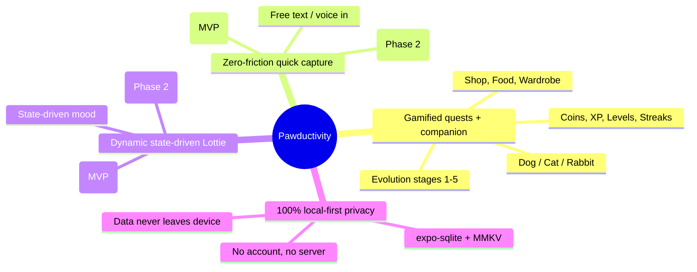

# Product Vision & Pillars

> Why Pawductivity exists, who it's for, the four pillars it stands on, and exactly what is NEW in the rebuild versus the legacy app.

This is the anchor document for the Pawductivity rebuild knowledge base. It defines the business problem and the product's shape at the highest level. Everything downstream (skills, data model, migration plans) should trace back to a pillar here. Every claim is tagged with a change-intent tag (§3 of the conventions) and, where it restates legacy behavior, cited to `old/`.

---

## 1. The core problem — "tracker fatigue"

Most people do not fail at productivity because they lack a to-do list. They fail because **being the administrator of your own life is exhausting**. Every todo app asks the user to do unpaid data-entry: pick a project, set a priority, choose a due date, tag it, estimate it, split it into subtasks — before a single real thing gets done. The tool becomes another chore. This is **tracker fatigue**: the friction and dread of maintaining the system that is supposed to help you.

Pawductivity's bet is that the way through tracker fatigue is **motivation + zero-friction capture**:

- **Motivation** — you are not maintaining a spreadsheet; you are caring for a living companion that grows and thrives when you make progress, and visibly needs you when you don't. The reward loop is emotional, not administrative.
- **Zero-friction capture** — you should be able to dump what's in your head in plain language and let the app do the structuring. The admin work becomes the machine's job, not yours.

The legacy product already delivered the motivation half (a virtual pet you nurture by completing tasks). It did **not** deliver the zero-friction half — legacy task entry was a manual multi-field form (legacy: `Pawductivity_App/lib/features/task/presentation/pages/add_task_form.dart`). Closing that gap is the central thesis of the rebuild.

---

## 2. The solution — four pillars

### Pillar A — Gamified quests with a virtual pet companion  `[PRESERVE]`

The heart of the product, carried over from the legacy app largely intact. The user completes **tasks framed as quests** for their **Companion** (a Dog, Cat, or Rabbit). Completing quests earns **Coins** and **XP**, raises the user's **Level**, extends **Streaks**, and keeps the Companion's **Health** up; neglect lets Health decay. Coins are spent in the **Shop** on **Food** (restores Health via **Feeding**) and **Wardrobe** cosmetics (via **Equipping**). The Companion advances through **Evolution stages 1–5**.

This entire loop — pet, quests, coins, XP/levels, shop, food, clothes — is **preserved**. The legacy marketing site markets exactly these as its six headline features and four value props (see §4), which confirms this loop is the validated product truth.

- Legacy grounding: pet/health/coin/level mechanics across `Pawductivity_BE` procs and `Pawductivity_App/lib/features/{task,user,pet,food,clothes,coin}`; seed catalogs and formulas are documented in [`context/data-model/seed-catalogs.md`](./data-model/seed-catalogs.md) and the per-subsystem skills.
- See: [pet-companion-system](../.claude/skills/pet-companion-system/SKILL.md), [task-quest-system](../.claude/skills/task-quest-system/SKILL.md), [coin-economy-and-shop](../.claude/skills/coin-economy-and-shop/SKILL.md), [gamification-xp-levels](../.claude/skills/gamification-xp-levels/SKILL.md).

### Pillar B — Zero-friction quick capture  `[NEW]` (AI parsing is optional Phase-2)

The friction-killer. Instead of a multi-field form, the user gets one free-text (and/or voice) input — the **Brain Dump** — where they type or speak everything on their mind in natural language ("jog 5k tomorrow morning, finish the deck by Friday, call mum") and get structured **task/quest** objects back (quest kind, targets, subtasks, deadlines, reminders).

**Scope split (important):**
- **MVP `[NEW]` — 100% FE-only, no LLM.** The capture box + a **rules-based/heuristic parser** (dates, times, numbers, keywords) that structures the input on-device with **no network and no API key**. This is the shippable no-backend form of the pillar.
- **Optional Phase-2 `[NEW]` `[DECIDE]` — LLM parsing.** A **client-side Claude call** for smarter free-form parsing. It is **not in the FE-only MVP** because a client can't safely hold an Anthropic key and the text leaves the device — it requires **BYO-key** or a thin proxy (see [03-fe-only-gap-analysis §3.1](./03-fe-only-gap-analysis.md) and D22–D25). The capture UX and schema are identical whether the parser is rules-based or LLM-backed, so this can be dropped in later without redesign.

This is **net-new**: the legacy task model was explicitly manual — users "set tasks for themselves" by hand (legacy: `Pawductivity-Website/lib/data.ts` FAQ).

- See: [ai-braindump-parser](../.claude/skills/ai-braindump-parser/SKILL.md) (transport-agnostic; rules-first), [task-quest-system](../.claude/skills/task-quest-system/SKILL.md).

### Pillar C — Dynamic, state-driven Lottie animation  `[NEW]` (AI direction is optional Phase-2)

The Companion is rendered as a **Lottie** animation whose behavior is **driven by the pet's state** (Health, Mood, activity, Evolution stage) — mutating the bundled Lottie JSON on-device (recolor, speed, segment) so the pet reflects how it "should" feel, rather than playing a fixed clip per stage.

**Scope split:**
- **MVP `[NEW]` — 100% FE-only.** A **deterministic, rules-based director**: state → animation modifications, computed on-device with no network. This is the shippable form.
- **Optional Phase-2 `[NEW]` `[DECIDE]` — AI direction.** A client-side Claude call that *decides* richer, situational animation "moments." Same key/privacy caveat as Pillar B — **not in the FE-only MVP** (D22–D25). The engine that *executes* modifications is the same either way.

The legacy app already shipped per-species, per-stage static Lottie files (legacy: `Pawductivity_App/assets/pet/{cat,dog,rabbit}/*.json`). So **Lottie is the established format** — dynamic on-device mutation is an evolution of an existing pipeline. Static per-stage playback is `[PRESERVE]`d as the base; the dynamic direction layer is `[NEW]`.

- See: [lottie-animation-engine](../.claude/skills/lottie-animation-engine/SKILL.md), [ai-lottie-director](../.claude/skills/ai-lottie-director/SKILL.md) (rules-first; AI optional).

### Pillar D — 100% local-first privacy  `[NEW]` (as a guarantee) / `[CHANGE]` + `[DROP]` (as an architecture)

All user data lives **on-device**: **expo-sqlite** for relational data (tasks, coins ledger, pet state, catalogs), **react-native-mmkv + Zustand** for settings and ephemeral state (timer, session). There is **no backend server, no account, and no login**. Nothing the user creates ever leaves their phone.

This is a hard reversal of the legacy architecture, which was a server-backed, account-based, data-collecting product (Flutter app → Go/Postgres backend → Next.js site). The legacy Privacy Policy explicitly promises Accounts, email + usage-data collection, cross-border transfer, and data-sharing with partners (legacy: `Pawductivity-Website/pages/privacy-policy/index.tsx`) — a description that **actively contradicts** the local-first rebuild and must be rewritten (see §7 and [`context/02-open-decisions.md`](./02-open-decisions.md)).

- Server cron routines (health decay, membership expiry) → **on-app-open / on-resume computation** from timestamps. `[CHANGE]`
- Auth / JWT / Google Sign-In / email verify → **removed**; identity = a single local profile. `[DROP]`
- Server usage-data/analytics telemetry (Amplitude) → **dropped**; insights become on-device SQLite aggregate queries. `[DROP]`
- See: [local-first-data-layer](../.claude/skills/local-first-data-layer/SKILL.md), [`context/migration/backend-to-local-first.md`](./migration/backend-to-local-first.md).

---

## 3. Target user

Legacy marketing states the audience explicitly (legacy: `Pawductivity-Website/lib/data.ts`, "Personalized Task Management"): the app "adapts to your needs" whether you are **a student, a professional, or managing household chores**. `[PRESERVE]`

Refined for the rebuild, the target user is someone who:

- Wants to be more productive but is **turned off by heavyweight, high-admin task managers** (tracker fatigue).
- Responds to **playful, emotional motivation** (a pet to care for) more than to streak-shaming or productivity dashboards.
- Values **privacy** and is happy with — or actively prefers — an app that keeps everything on their device and needs no sign-up.
- Wants to capture tasks fast in natural language rather than filling out forms (structured on-device; AI parsing optional later).

Legacy distribution was **Android-only** via Google Play (`com.production.pawductivity`); there was no iOS path (legacy: `Pawductivity-Website/pages/index.tsx`). The rebuild is React Native + Expo and therefore cross-platform-capable — whether iOS ships is an open decision (§7). `[DECIDE]`

---

## 4. Value propositions (as marketed on the legacy website)

These are the **real marketed claims**, quoted from the legacy site, and they remain valid product truth for the rebuild (the AI direction/parsing layers are **optional Phase-2** upgrades on top, not MVP requirements). Source: `Pawductivity-Website/lib/data.ts`, `pages/index.tsx`, `pages/features/index.tsx`, `components/footer.tsx`.

### 4.1 The pitch

- **Homepage H1:** *"Pawductivity: Boost Your Productivity with a Virtual Companion."*
- **Footer / category line:** *"Pawductivity is a task tracker and timer app with gamification, featuring virtual pets and accessories to make your productivity journey fun and engaging."*
- **Homepage 3-beat carousel:** *"Manage your time"* · *"Enjoy your productive activity"* · *"Review your Performance."* (The last implies an analytics/stats surface not otherwise elaborated on the site.)

### 4.2 Six marketed features (`Features[]`)  `[PRESERVE]`

| Feature | Marketed claim (verbatim) | Rebuild skill |
|---|---|---|
| Virtual Pet | "Keep a cute companion by your side as you complete tasks." | [pet-companion-system](../.claude/skills/pet-companion-system/SKILL.md) |
| Calendar | "Organize your schedule and never miss a deadline." | [reminders-and-calendar](../.claude/skills/reminders-and-calendar/SKILL.md) |
| Coins | "Earn rewards for completing tasks and achievements." | [coin-economy-and-shop](../.claude/skills/coin-economy-and-shop/SKILL.md) |
| Shop | "Use your coins to buy accessories and upgrades for your pet." | [coin-economy-and-shop](../.claude/skills/coin-economy-and-shop/SKILL.md), [clothes-and-wardrobe](../.claude/skills/clothes-and-wardrobe/SKILL.md) |
| Level | "Progress and unlock new features as you accomplish more." | [gamification-xp-levels](../.claude/skills/gamification-xp-levels/SKILL.md) |
| Timer | "Stay focused with customizable timers for your tasks." | [focus-timer-and-background](../.claude/skills/focus-timer-and-background/SKILL.md) |

> Note: the Coins blurb mentions "achievements," but achievements/badges were **never implemented** in the legacy app or backend (schema-only, dead) — see §6 and `context/legacy/dead-and-incomplete-features.md`. Treat achievements as greenfield scope, not a ported system. `[DECIDE]`

### 4.3 Four "Why Choose Us" value props  `[PRESERVE]`

| Prop | Marketed claim (verbatim, trimmed) |
|---|---|
| Gamified Productivity | "Transform your daily tasks into an engaging adventure… Earn rewards, level up your virtual pet, and achieve your goals with a smile!" |
| Personalized Task Management | "Whether you're a student, a professional, or managing household chores, Pawductivity adapts to your needs." |
| Virtual Pet Companions | "Your pet grows and thrives as you complete your tasks, adding a fun and rewarding twist to productivity." |
| Seamless User Experience | "Enjoy an intuitive and user-friendly interface designed to make task management effortless." |

### 4.4 Behavior encoded in the marketing FAQ

Quoted claims that double as product requirements (legacy: `Pawductivity-Website/lib/data.ts` FAQ):

- **Free + premium:** *"Pawductivity offers a free version with access to all the basic features. We also offer premium plans to buy some accessories and pet that available in premium only."* `[PRESERVE]`
- **Coins from tasks:** *"Coins are earned by doing tasks that you set for yourself. The more tasks you complete, the more coins you'll earn."* `[PRESERVE]` (exact rates come from app/BE code, not the site — see [gamification-xp-levels](../.claude/skills/gamification-xp-levels/SKILL.md))
- **Multiple pets, each with "its own personality":** *"You can collect multiple virtual pets, each with its own personality."* `[PRESERVE]` for "collect multiple pets"; whether "personality" is a real mechanic or pure flavor is `[DECIDE]` (no evidence of a personality system in the app/BE).
- **Deadlines & reminders:** *"Pawductivity allows you to set deadlines and reminders for your tasks."* `[PRESERVE]` (now local via expo-notifications).

### 4.5 Pricing as marketed (context only — see monetization docs for the decision)

- **/features page:** *"For just Rp3.000,00, users will be able to access more pets, foods, clothes, and more features later on. Purchase this via the in-app store."* — i.e. IDR 3,000 (~USD 0.20).
- **Conflict:** the Terms & Conditions Clause 6 (FEES) instead describes a **recurring monthly license fee** paid via **Midtrans** (legacy: `Pawductivity-Website/pages/terms-conditions/index.tsx`). The site therefore ships **two mutually exclusive monetization models** (cheap one-time/per-item unlock vs monthly subscription) with no single source of truth. Resolving this into one explicit SKU model is a `[DECIDE]` — see [`context/migration/monetization-options.md`](./migration/monetization-options.md) and [premium-and-monetization](../.claude/skills/premium-and-monetization/SKILL.md).

---

## 5. What is NEW vs the legacy app

The single most important framing for reviewers: **the pet / quest / economy loop is preserved; almost everything around how you feed it tasks, how it looks, where the data lives, and how you get started is new.**

| Capability | Status | One-liner |
|---|---|---|
| Pet companion (Dog/Cat/Rabbit), evolution 1–5 | `[PRESERVE]` | Core emotional hook, carried over intact. |
| Quests: Target / Checklist / Focus + Focus Timer | `[PRESERVE]` | Same task/quest model and timer concept. |
| Economy: Coins, XP, Levels, Streaks | `[PRESERVE]` | Same earn/spend loop and progression. |
| Shop, Food/Feeding, Wardrobe/Equipping | `[PRESERVE]` | Same spend surfaces and health/cosmetic mechanics. |
| Calendar, deadlines, reminders | `[PRESERVE]` (concept) / `[CHANGE]` (local) | Same feature, now local notifications instead of server push. |
| **Zero-friction quick capture** | **`[NEW]`** | Free-text/voice → structured quests. MVP = on-device rules-based parse (no LLM); **optional Phase-2** = client-side Claude parsing (BYO-key/proxy). Replaces the manual add-task form. |
| **Dynamic state-driven Lottie** | **`[NEW]`** | Pet animation mutates from live state on-device (rules-based MVP); **optional Phase-2** AI direction layer. Over the preserved static per-stage clips. |
| **100% local-first (no account, no server)** | **`[NEW]` guarantee / `[DROP]` server** | All data on-device (expo-sqlite + MMKV); accounts, JWT, sync, telemetry removed. |
| **Dark mode** | **`[NEW]`** | Legacy shipped a single hardcoded light theme with brand colors as scattered literals and no dark theme (legacy: `Pawductivity_App/lib/config/theme/theme.dart`). Rebuild needs a real token/theme layer. |
| **Onboarding / first-run flow** | **`[NEW]`** | Legacy had a dead `welcome.dart` and an unused carousel dependency (`smooth_page_indicator`); no tutorial, pet-selection, or permission-priming ever shipped (legacy: `Pawductivity_App/lib/features/user/presentation/pages/auth/welcome.dart`). Real onboarding is greenfield. |

### Dropped from legacy (not just changed) — `[DROP]`

Called out so reviewers know these are intentionally gone, not forgotten. Details in [`context/legacy/known-bugs-and-antipatterns.md`](./legacy/known-bugs-and-antipatterns.md) and the migration docs.

- **Accounts / auth / JWT / Google Sign-In / email verification** — identity collapses to one local profile. The legacy auth gate was literally "can I fetch `/api/user` with the stored JWT" (legacy: `Pawductivity_App/lib/main.dart` startup → `RemoteUserBloc`).
- **Plaintext password persistence** — the legacy app stored the user's password in `flutter_secure_storage` in plaintext (legacy: `remote_auth_bloc.dart` `StoreCredential`). A security anti-pattern; with no accounts it simply ceases to exist.
- **Server sync / Go+Postgres backend / retrofit+Dio network layer** — replaced by on-device storage.
- **Midtrans payment flow** (both the WebView Snap surface in `payment_web_view.dart` and the server receipt path) — replaced by store-native billing (RevenueCat / react-native-iap). `[CHANGE]`
- **Amplitude analytics** — server telemetry dropped; any insights are on-device only.
- **Server push notifications** — replaced by locally scheduled `expo-notifications`. `[CHANGE]`

---

## 6. Explicit non-goals

What Pawductivity is deliberately **not** doing in this rebuild:

- **No accounts, login, or user profiles-as-identity.** `[DROP]` One local profile per device; no sign-up wall. Multi-device sync is explicitly out of MVP scope (optional cloud is a future `[DECIDE]`).
- **No backend server for core features.** `[NEW]` The only thing that genuinely wants a server is real-money receipt verification; that is handled by a billing SDK, not a bespoke backend. `[CHANGE]`/`[DECIDE]`
- **No cross-device data, no cloud backup, no data-sharing with third parties.** `[DROP]` A direct reversal of the legacy Privacy Policy's promises. Data stays on the device, full stop.
- **No behavioral/usage telemetry off-device.** `[DROP]` If analytics ship at all, they are opt-in and on-device only.
- **No social feed / friends / multiplayer.** Not in scope. **Referral** is the only inter-user concept, and even that is constrained by having no backend (deferred/deep-link/optional — `[DECIDE]`, see [referral-system](../.claude/skills/referral-system/SKILL.md)).
- **No achievements/badges as a ported feature.** `[DECIDE]` The legacy `achievement` / `user_achievement` tables were migrated and seeded but have **zero** controllers, routes, repositories, or working UI — a defined-but-dead feature (legacy: `Pawductivity_BE/database/migration/model/achievement.model.go`; commented-out `ProfileBadges` in `profile.dart`). If achievements ship, they are new product design, not a migration.
- **Not a note-taking / journaling / calendar-replacement app.** The Brain Dump captures actionable tasks/quests; it is not a general notes store. Calendar exists to serve deadlines and reminders, not to replace the user's primary calendar.
- **Not building the legacy dead/placeholder surfaces.** e.g. the `/shop-health` "potion" placeholder (a grid literally labelled "Item 0..19") is not a feature to reproduce; whether a consumable "potion/health" category exists at all is `[DECIDE]` (see `context/legacy/dead-and-incomplete-features.md`).

---

## 7. Open decisions raised here

These roll up into [`context/02-open-decisions.md`](./02-open-decisions.md).

- `[DECIDE]` **Legal/privacy rewrite.** The legacy Privacy Policy and Terms describe an account-based, server-backed, data-collecting, monthly-billed product that does not exist in a local-first app. New legal copy must state data stays on-device, and must reconcile "delete your data via account settings" with a design where all data is already only on the user's device. Owner/approver TBD.
- `[DECIDE]` **Monetization model.** One-time/per-item Rp3.000 unlock (per /features) vs recurring monthly subscription (per T&C). Mutually exclusive; must pick one explicit SKU model. → [`context/migration/monetization-options.md`](./migration/monetization-options.md).
- `[DECIDE]` **iOS in scope?** Legacy was Android-only; Expo makes iOS feasible. Note iOS has no equivalent of Android's background timer service — affects the Focus Timer design.
- `[DECIDE]` **Achievements/badges** — build as new product scope, or leave out of MVP?
- `[DECIDE]` **"Each pet has its own personality"** — is personality a real mechanic (behavior/stats) or purely marketing flavor? No legacy implementation exists.
- `[DECIDE]` **"Review your Performance" analytics surface** — what stats does the insights screen actually show? Build from local SQLite aggregates. → [analytics-and-insights](../.claude/skills/analytics-and-insights/SKILL.md).
- `[DECIDE]` **Canonical contact/brand identity** — legacy shipped two support domains (`cs@pawductivity.id` vs `support@pawductivity.com`) and a commented-out Instagram; pick one canonical set for the rebuild.

---

## Related

- [`context/01-glossary.md`](./01-glossary.md) — canonical vocabulary for every term used above.
- [`context/02-open-decisions.md`](./02-open-decisions.md) — full open-decisions register.
- [pawductivity-overview](../.claude/skills/pawductivity-overview/SKILL.md) — the system-level tour of subsystems.
- Pillar skills: [pet-companion-system](../.claude/skills/pet-companion-system/SKILL.md) · [task-quest-system](../.claude/skills/task-quest-system/SKILL.md) · [ai-braindump-parser](../.claude/skills/ai-braindump-parser/SKILL.md) · [ai-lottie-director](../.claude/skills/ai-lottie-director/SKILL.md) · [lottie-animation-engine](../.claude/skills/lottie-animation-engine/SKILL.md) · [local-first-data-layer](../.claude/skills/local-first-data-layer/SKILL.md).
- Economy & monetization: [coin-economy-and-shop](../.claude/skills/coin-economy-and-shop/SKILL.md) · [gamification-xp-levels](../.claude/skills/gamification-xp-levels/SKILL.md) · [premium-and-monetization](../.claude/skills/premium-and-monetization/SKILL.md) · [`context/migration/monetization-options.md`](./migration/monetization-options.md).
- Migration context: [`context/legacy/architecture-overview.md`](./legacy/architecture-overview.md) · [`context/legacy/dead-and-incomplete-features.md`](./legacy/dead-and-incomplete-features.md) · [`context/migration/backend-to-local-first.md`](./migration/backend-to-local-first.md) · [`context/migration/flutter-to-react-native.md`](./migration/flutter-to-react-native.md).
- Design: [`context/design/brand-and-tokens.md`](./design/brand-and-tokens.md) · [design-system-and-theming](../.claude/skills/design-system-and-theming/SKILL.md).
