# Entity-Relationship Model (New Local Schema)

> The conceptual data model for the rebuilt, 100% local-first Pawductivity: entities, their relationships, and where each one came from in the legacy stack. DDL and column types live in [`sqlite-schema.md`](./sqlite-schema.md) — this file is the map, that file is the blueprint.

## How to read this doc

- **Change tags** on every entity/rule: `[PRESERVE]` keep as-is · `[CHANGE]` same concept, new implementation (almost always server→local) · `[NEW]` no legacy equivalent · `[DROP]` deleted · `[DECIDE]` open product decision.
- **Origin** — where the data lived in the legacy app:
  - **Server (Postgres)** — authoritative row in the Go/Postgres backend, reached over REST. This is *almost everything* — the legacy app was online-first.
  - **Local (Floor)** — cached in the Flutter on-device Floor/SQLite DB. Only **4** entities were ever registered locally (Task, Food, Pet, User) and they were lossy subsets (legacy: `Pawductivity_App/lib/database/app_database.dart`).
  - **Synced** — existed both places (a Floor cache of a server row).
- In the **new app there is a single local user**, so the legacy `userid` foreign key is dropped from every table (or collapses to a single constant profile row). Relationships below are drawn as they matter *logically*; see [`sqlite-schema.md`](./sqlite-schema.md) for the actual keys.

---

## ER diagram

```mermaid
erDiagram
    PROFILE ||--|| ENTITLEMENT : "has"
    PROFILE ||--o{ COMPANION : "owns"
    PROFILE ||--o{ QUEST : "creates"
    PROFILE ||--o{ REMINDER : "schedules"
    PROFILE ||--o{ FOOD_INVENTORY : "stocks"
    PROFILE ||--o{ WARDROBE : "owns"
    PROFILE ||--o{ COIN_LEDGER : "records"
    PROFILE ||--o{ ACHIEVEMENT_PROGRESS : "earns"
    PROFILE ||--o| REFERRAL : "holds code"

    SPECIES ||--o{ COMPANION : "instantiated as"
    COMPANION ||--o{ COMPANION_CLOTHES : "wears"
    COMPANION ||--o{ COMPANION_USAGE : "logged in"

    FOOD ||--o{ FOOD_INVENTORY : "stocked as"
    CLOTHES ||--o{ WARDROBE : "owned as"
    WARDROBE ||--o{ COMPANION_CLOTHES : "equipped via"

    QUEST ||--o{ CHECKLIST_ITEM : "contains"
    QUEST ||--o{ QUEST_LOG : "increments"
    QUEST ||--o{ DAILY_LOG : "aggregates into"
    QUEST ||--o{ COMPANION_USAGE : "attributed to"

    ACHIEVEMENT ||--o{ ACHIEVEMENT_PROGRESS : "tracked by"

    PROFILE {
        int id PK "always 1 (singleton)"
        int coins
        int level
        int current_xp
        int needed_xp
        text display_name
        text avatar
    }
    ENTITLEMENT {
        text class "basic|premium"
        int expiry_epoch "null when basic"
        int source "iap|referral|none"
    }
    SPECIES {
        int id PK
        text name "Dog|Cat|Rabbit"
        int price_coins
        text asset "lottie base"
        bool premium
    }
    COMPANION {
        int id PK
        int species_id FK
        text name
        int health "0-100"
        int evolution_stage "0-5 [NEW]"
        int last_health_decay_at
    }
    QUEST {
        int id PK
        text name
        text kind "target|checklist|focus"
        int estimated_time_s
        int time_completed_s
        bool completed
        int due_epoch
        text tag
        blob repetition "7 weekday flags"
    }
    CHECKLIST_ITEM {
        int id PK
        int quest_id FK
        text label
        bool done
        int sort
    }
    QUEST_LOG {
        int id PK
        int quest_id FK
        int delta_s
        int at_epoch
    }
    DAILY_LOG {
        int id PK
        int quest_id FK
        int day "date"
        int duration_s
        int time_completed_s
    }
    REMINDER {
        int id PK
        text name
        int at_epoch
        text recurrence "once|weekly|monthly|yearly"
        bool completed
    }
    FOOD {
        int id PK
        text name
        int price_coins
        int stats "health restored"
        bool premium
    }
    FOOD_INVENTORY {
        int food_id FK
        int quantity
    }
    CLOTHES {
        int id PK
        text name
        int price_coins
        text type "hat|shirt|pants|shoes"
        bool premium
    }
    WARDROBE {
        int clothes_id PK
        int acquired_at
    }
    COMPANION_CLOTHES {
        int companion_id FK
        int clothes_id FK
        text slot
    }
    COIN_LEDGER {
        int id PK
        int delta "signed +grant/-spend"
        text reason "task_reward|level_up|purchase_pet|purchase_food|purchase_clothes|referral|iap_topup|other"
        int at_epoch
    }
    COMPANION_USAGE {
        int companion_id FK
        int quest_id FK
        int day "date"
        int seconds_used
    }
    ACHIEVEMENT {
        int id PK
        text name
        text requirement
    }
    ACHIEVEMENT_PROGRESS {
        int achievement_id FK
        int progress
        int unlocked_epoch "null until earned"
    }
    REFERRAL {
        text code PK
        bool redeemed
    }
```

> Note on the ERD: `PROFILE` is a singleton (one row, `id=1`). The `PROFILE ||--o{ …` edges represent legacy per-user ownership; in the local schema those `userid` FKs are simply dropped because there is only one user. Catalog tables (`SPECIES`, `FOOD`, `CLOTHES`, `ACHIEVEMENT`) are seeded, read-mostly reference data — see [`seed-catalogs.md`](./seed-catalogs.md).

---

## Entity dictionary

### PROFILE `[CHANGE]` — origin: Synced (server `users` + Floor `UserModel`)
The single local account and gamification counters. Legacy split identity fields across a Postgres `users` row (int `id` PK) and a lossy Floor `UserModel` keyed on **email** — a mismatch we delete.

- **Key fields:** `coins` (int, `CHECK >= 0`), `level` (default 1), `current_xp` (default 0), `needed_xp` (int, default 160 — fixed from the legacy 150 seed to match the L1 curve value 160; drift #5), `display_name`, `avatar` (was `userImage 'default.png'` + `profile_index`).
- **Relationships:** 1:1 with `ENTITLEMENT`; conceptually owns all per-user data (companions, quests, reminders, inventories, ledger, achievements, referral).
- **New-app changes:** no `email`/`password`/`bcrypt`/`unique(name)` — auth is `[DROP]`. `current_xp`, `needed_xp`, `profile_index`, `userimage` existed only in the GORM model, never in the hand-written SQL DDL (schema drift) — the new schema includes them explicitly from day one.
- **Legacy:** `Pawductivity_BE/database/migration/model/user.model.go`, `pawductivity.sql:4`, `Pawductivity_App/lib/features/*/data/model/user.dart`.

### ENTITLEMENT `[CHANGE]` — origin: Server (`membership`)
Whether Premium is currently active. Legacy `membership` was one row per user, downgraded nightly by a server cron. **Not a SQLite table in the rebuild** — this is an MMKV-only entitlement cache, shown here as an entity purely for relational context.

- **Key fields:** `class` (`basic`|`premium`, default `basic`), `expiry_epoch` (was `membership_expired_date timestamptz`), `source`.
- **Rule `[CHANGE]`:** legacy downgraded via nightly cron `UPDATE membership SET class='basic' WHERE class='premium' AND membership_expired_date <= NOW()` (legacy: `internal/routines/checkMembership.routine.go`). New app: **compute on read** — premium iff `expiry_epoch > now`; no cron. Entitlement is held only in MMKV (no relational table) for offline reads (see [`state-and-mmkv.md`](./state-and-mmkv.md); [`sqlite-schema.md`](./sqlite-schema.md) §8 `membership (→ MMKV entitlement)`).
- **Relationships:** 1:1 with `PROFILE`.
- **Legacy:** `pawductivity.sql:19`, `internal/repository/membership.repository.go`.

### SPECIES (catalog) `[PRESERVE]` — origin: Server (`animal`)
Global catalog of purchasable companion species: **Dog, Cat, Rabbit**.

- **Key fields:** `name`, `price_coins` (`CHECK >= 0`), `asset` (Lottie JSON base path), `premium` (bool).
- **Seed (verified `pawductivity.sql:233`):** Dog 100 / `dog_default.json` / free · Cat 200 / `cat_default.json` / free · Rabbit 200 / `rabbit_default.json` / **premium**. See [`seed-catalogs.md`](./seed-catalogs.md).
- **Relationships:** 1:N with `COMPANION`.
- **New-app note `[NEW]`:** the static `asset` path model is superseded by client-side dynamic Lottie — art is bundled per species and mutated at runtime by the AI Lottie director based on health/mood (see [`../../.claude/skills/ai-lottie-director/SKILL.md`](../../.claude/skills/ai-lottie-director/SKILL.md)). The catalog still names the base asset.
- **Legacy:** `pawductivity.sql:62`, `internal/repository/animal.repository.go`.

### COMPANION `[CHANGE]` — origin: Synced (server `pet` + Floor `PetModel`, read-only DAO)
A user-owned instance of a species — the virtual pet.

- **Key fields:** `species_id` (FK → SPECIES), `name` (was `petName`), `health` (int, default **100**, `CHECK >= 0`), `evolution_stage` (int, 0–5, default 0) `[NEW]`, `last_health_decay_at` `[NEW]` (epoch ms; **per-pet** lazy-decay anchor — the authoritative one, see [`sqlite-schema.md`](./sqlite-schema.md) §6).
- **Health rules:**
  - `[CHANGE]` Decay **−1 per day** at local midnight, floored at 0. Legacy did this as a server cron `UPDATE pet SET health = health - 1 WHERE health > 0` (legacy: `internal/routines/decreasePetHealth.routine.go`) with a known bug: a restart or downtime lost only 1 point regardless of missed midnights, and all users shared the server timezone. New app: store `last_health_decay_at`, and on app open compute `health -= min(floor(days_elapsed), health)` in the device timezone — this also fixes the missed-midnight and shared-tz bugs.
  - `[PRESERVE]` Feeding restores `health` by `food.stats`, **capped at 100** (`if health + stats > 100 → 100`).
- **Relationships:** N:1 to `SPECIES`; N:M with `WARDROBE` through `COMPANION_CLOTHES`; 1:N to `COMPANION_USAGE`.
- **Open decision `[DECIDE]`:** what happens at `health = 0`? Legacy only floors at 0 with no consequence. Define sad-state / block behavior.
- **Legacy:** `pawductivity.sql:72`, `internal/repository/animal.repository.go` (FeedPet), `Pawductivity_App/lib/features/*/data/model/pet.dart` (adds derived `clothesAsset`).

### QUEST `[CHANGE]` — origin: Synced (server `task` + Floor `TaskModel`, lossy)
A task, framed to the user as a quest for the companion. The core gameplay entity. Quest **kind** distinguishes Target / Checklist / Focus quests (see [`../../.claude/skills/task-quest-system/SKILL.md`](../../.claude/skills/task-quest-system/SKILL.md)).

- **Key fields:** `name` (was `taskName varchar(50)`), `kind` `[NEW]`, `estimated_time_s` (SECONDS, legacy `CHECK > 600` = min 10 min), `time_completed_s` (SECONDS), `completed` (bool), `due_epoch`, `tag` (legacy `tasktag`, GORM-only), `repetition` (7 weekday flags, GORM-only).
- **Versioning `[DECIDE]`/`[DROP]`:** legacy used a **composite PK `(id, userid, version)`** — editing a task created `version+1` and marked the old version's `dueDate = now()` (immutable history for multi-device sync). With no sync, the new app can **mutate in place** and drop `version` — confirm this is acceptable (open decision). `QUEST_LOG`/`DAILY_LOG` FKs simplify accordingly.
- **Reward rules (flag the legacy discrepancy):**
  - On first crossing completion (`prev < estimated ≤ prev + increment`): user gains **XP = `estimated_time_s / 60`** (minutes) and **coins = `estimated_time_s / 60`** via the `buy_coins` grant (legacy: `task.repository.go:434,470`).
  - BUT the task-list **preview** showed `FLOOR(estimated_time_s / 60 / 3)` coins (legacy: `task.repository.go:234`) — a real display-vs-grant mismatch. `[DECIDE]` Pick ONE canonical formula for the rebuild and delete the other. Captured in [`../legacy/known-bugs-and-antipatterns.md`](../legacy/known-bugs-and-antipatterns.md).
- **Relationships:** 1:N to `CHECKLIST_ITEM`, `QUEST_LOG`, `DAILY_LOG`, `COMPANION_USAGE`.
- **New-app note `[NEW]`:** quests can be created by the **Brain Dump Parser** (client-side Claude) instead of manual forms (see [`../../.claude/skills/ai-braindump-parser/SKILL.md`](../../.claude/skills/ai-braindump-parser/SKILL.md)).
- **Legacy:** `pawductivity.sql:30`, `database/migration/model/task.model.go`, `Pawductivity_App/lib/features/*/data/model/task.dart` (drops userid/version/tag/repetition/duration).

### CHECKLIST_ITEM `[NEW]` — origin: none (greenfield)
Subtasks / todo items that make up a **Checklist quest**. Legacy had no per-quest subtask table — its `checklist` table was something unrelated (a per-user, per-month array of checked day-of-month ints used for a calendar view; that concept now derives from `DAILY_LOG` and lives in analytics). This entity is net-new to support the Checklist quest kind.

- **Key fields:** `quest_id` (FK → QUEST), `label`, `done` (bool), `sort`.
- **Relationships:** N:1 to `QUEST`.
- **Open decision `[DECIDE]`:** does completing all checklist items auto-complete the parent quest and trigger its reward, or are they independent?

### QUEST_LOG `[PRESERVE]` — origin: Server (`task_log`)
Append-only event log of each progress increment on a quest; drives the activity timeline.

- **Key fields:** `quest_id` (FK → QUEST), `delta_s` (seconds logged this increment), `at_epoch` (was `task_timestamp`).
- **Relationships:** N:1 to `QUEST` (legacy `ON DELETE CASCADE` — deleting a quest destroyed history; the rebuild should consider soft-delete to preserve stats).
- **Legacy:** `pawductivity.sql:45`, `task.repository.go`.

### DAILY_LOG `[PRESERVE]` — origin: Server (`daily_logs`)
Per-day aggregate of time spent on a quest. Drives the calendar/summary heatmap and completion state.

- **Key fields:** `quest_id` (FK), `day` (date), `duration_s`, `time_completed_s`.
- **Rules `[PRESERVE]`:** UPSERT on `(quest, day)`; both `duration` and `time_completed` are **capped at the quest's `estimated_time_s`** on upsert (legacy: `task.repository.go:416-422`). `completed` is derived: `time_completed_s >= estimated_time_s`.
- **Relationships:** N:1 to `QUEST` (legacy PK `(taskid, version, userid, date)`).
- **Analytics `[CHANGE]`:** legacy 7-day activity windows, 2-hour timeline buckets, and month calendar queries become on-device SQLite aggregate queries (`strftime`, recursive-CTE day series). Amplitude is `[DROP]`. See [`../../.claude/skills/analytics-and-insights/SKILL.md`](../../.claude/skills/analytics-and-insights/SKILL.md).
- **Legacy:** `pawductivity.sql`, `task.repository.go`.

### REMINDER `[CHANGE]` — origin: Synced (server `reminder`)
Lightweight scheduled reminders, shown alongside quests in calendar/day views. Separate from quests.

- **Key fields:** `name` (`remindername varchar(50)`), `at_epoch` (legacy split `time` + `date` timestamps), `recurrence` (`once`|`weekly`|`monthly`|`yearly`), `completed`.
- **Rule `[CHANGE]`:** legacy stored `remindertype` recurrence but had **no server-side recurrence-expansion logic**. New app schedules via **expo-notifications** locally and recomputes on boot. `[DECIDE]` define how each recurrence actually repeats/notifies. See [`../../.claude/skills/reminders-and-calendar/SKILL.md`](../../.claude/skills/reminders-and-calendar/SKILL.md).
- **Relationships:** owned by `PROFILE`.
- **Legacy:** `pawductivity.sql` reminder table, `database/migration/model/reminder.model.go`.

### FOOD (catalog) `[PRESERVE]` — origin: Synced (server `food` + Floor `FoodModel`, read-only)
Global catalog of feedable food items.

- **Key fields:** `name`, `price_coins` (`CHECK >= 0`), `stats` (health restored when fed), `premium`.
- **Seed (verified `pawductivity.sql:255`):** Apple 3/+10 · Chicken 3/+10 · Pizza 4/+20 **premium** · Watermelon 4/+10 · Carrot 5/+15. See [`seed-catalogs.md`](./seed-catalogs.md).
- **Relationships:** 1:N with `FOOD_INVENTORY`.
- **Legacy:** `pawductivity.sql:84`, `internal/repository/food.repository.go`.

### FOOD_INVENTORY `[CHANGE]` — origin: Server (`playerFood`)
Owned-food inventory. **This is a deliberate redesign.** Legacy `playerFood` stored **one row per owned item** with no quantity column — quantity was derived by `SELECT COUNT(*) … GROUP BY food_id`, and consuming meant `DELETE MIN(id)` (fragile counter, race-prone; legacy: `food.repository.go:59`).

- **New shape `[CHANGE]`:** a single row per food type with a real **`quantity`** integer column. Buying `+1`, feeding `−1`.
- **Key fields:** `food_id` (FK → FOOD), `quantity`.
- **Relationships:** N:1 to `FOOD`.
- **Legacy:** `pawductivity.sql:95`, `internal/repository/food.repository.go`.

### CLOTHES (catalog) `[PRESERVE]` — origin: Server (`clothes`)
Global cosmetic catalog. Legacy `clothesType` enum has `hat|shirt|pants|shoes`, but **only `shirt` items were ever seeded**.

- **Key fields:** `name`, `price_coins`, `type` (`hat`|`shirt`|`pants`|`shoes`), `asset`, `premium`.
- **Seed (verified `pawductivity.sql:296`, all type `shirt`):** Cyan t-shirt 15 · Green shirt 10 · Tuxedo 20 **premium** · Star Shirt 15 **premium** · Pink Dress **20** **premium**. (Note: conventions §5 lists Pink Dress at 15 — the source says **20**; trust the source. See [`../legacy/known-bugs-and-antipatterns.md`](../legacy/known-bugs-and-antipatterns.md).)
- **Open decision `[DECIDE]`:** are `hat/pants/shoes` slots real (multi-slot equip) or is clothing single-slot cosmetic? Legacy only equips one item per companion.
- **Relationships:** 1:N with `WARDROBE`.
- **Legacy:** `pawductivity.sql:118`, `clothesType` enum `pawductivity.sql:116`.

### WARDROBE `[CHANGE]` — origin: Server (`wardrobe`)
Owned-clothing inventory. Same fragile one-row-per-item design as `playerFood` (count derived via `COUNT`). Redesigned to an owned-once set (PK `clothes_id`, `acquired_at`, no `quantity`) — see `clothes_inventory` in [`sqlite-schema.md`](./sqlite-schema.md) §7.

- **Key fields:** `clothes_id` (PK, FK → CLOTHES), `acquired_at`.
- **Relationships:** N:1 to `CLOTHES`; 1:N to `COMPANION_CLOTHES` (each owned garment can be equipped).
- **Legacy:** `pawductivity.sql:129`, `internal/models/wardrobe.go` (derived `count`).

### COMPANION_CLOTHES `[PRESERVE]` — origin: Server (`petClothes` join)
Join table: which owned garment a companion is currently wearing.

- **Key fields:** `companion_id` (FK → COMPANION), `clothes_id` (FK → CLOTHES), `slot` — PK `(companion_id, slot)`, one garment per slot (canonical `pet_clothes`, [`sqlite-schema.md`](./sqlite-schema.md) §7).
- **Rules `[PRESERVE]`:** equip inserts, unequip deletes (legacy `clothesId = -1` request meant unequip), swap updates the wardrobe reference. Determines the companion's rendered clothing asset (legacy resolved via a multi-table join; new app resolves locally).
- **Relationships:** N:M bridge between `COMPANION` and `WARDROBE`.
- **Legacy:** `pawductivity.sql:138`, `animal.repository.go`.

### COIN_LEDGER `[CHANGE]` — origin: Server (`purchases`)
Audit ledger of every coin grant and spend.

- **Key fields:** `delta` (int, signed), `reason` (`task_reward`|`level_up`|`purchase_pet`|`purchase_food`|`purchase_clothes`|`referral`|`iap_topup`|`other`), `at_epoch` (canonical `delta`/`reason`, [`sqlite-schema.md`](./sqlite-schema.md) §7).
- **Redesign `[CHANGE]`:** legacy `purchases` stored **both grants and spends as positive `price`**, with direction implied only by `type` — a fragile ledger. New app uses **signed `delta`** (`+` grant, `−` spend) so balance = `SUM(delta)` and reconciles with `PROFILE.coins`.
- **Grant/spend rules `[PRESERVE]` (as economy logic, now client-side):**
  - `buy_coins(amount)` → `coins += amount` + ledger row (used for task reward, referral, and — in legacy — a free-coins exploit; see below).
  - `buy_item(price, type)` → `coins -= price` + ledger row. Enforce `coins >= 0`.
  - **Level-up bonus (dead in legacy):** the SQL `level_up()` proc granted `coins += floor(task_time/600)*3` (`pawductivity.sql:183`) but was **superseded** by the Go XP path and is commented-out / unused — do **not** carry it over (`[DROP]`).
- **Relationships:** owned by `PROFILE`.
- **Legacy:** `pawductivity.sql:106` (table) + `:221` (`buy_coins`), `internal/repository/purchase.repository.go`.

### COMPANION_USAGE `[PRESERVE]` — origin: Server (`pet_usages`)
Tracks which companion was "active" during which quest on which day, and for how long — powers the pet-usage analytics screen.

- **Key fields:** `companion_id` (FK), `quest_id` (FK), `day` (date), `seconds_used`.
- **Note the legacy unit bug:** column was named `hoursUsed` but actually **accumulated seconds** (`totalHours = SUM(hoursUsed)/3600`). Rebuild uses an honest `seconds_used` name. If `petId == 0`, legacy defaulted to the user's max pet id.
- **Open decision `[DECIDE]`:** how is the "active companion" for a quest determined? The selection logic was not in the persistence layer.
- **Legacy:** `pawductivity.sql` pet_usage table, `task.repository.go` (IncrementTime).

### ACHIEVEMENT + ACHIEVEMENT_PROGRESS `[NEW]` — origin: stubbed on server
Achievements catalog + per-user unlock/progress. Legacy had `achievement` and `userachievement` tables but **no seed data**, and the Flutter `UserEntity.badges` getter returned null — the feature was never built. Treat as **greenfield** for the rebuild.

- **Key fields:** `ACHIEVEMENT` — `name`, `requirement`. `ACHIEVEMENT_PROGRESS` — `achievement_id` (FK), `progress`, `unlocked_epoch` (null until earned).
- **Relationships:** N:M (catalog ↔ profile) via the progress table.
- **Open decision `[DECIDE]`:** is the achievements feature in scope for MVP, and what is the catalog? See [`../../.claude/skills/gamification-xp-levels/SKILL.md`](../../.claude/skills/gamification-xp-levels/SKILL.md).

### REFERRAL `[DECIDE]` — origin: Server (`referral` + `referral_user`)
Invite-a-friend codes. **Fundamentally cross-user**, so it does not fit a single-device local app without a backend.

- **Legacy shape:** `referral(code varchar(8), owner_id)` + `referral_user(referral_code, user_id)`. Redeeming granted **+100 coins to BOTH** owner and redeemer (legacy: `referral.repository.go:55-56`), with bugs: coin-grant errors were swallowed and a user could redeem unlimited distinct codes (no cap). Notably, `referral`/`referral_user` were created only by the SQL script, **not** in the GORM AutoMigrate list — another schema-source split.
- **New-app options `[DECIDE]`:** (a) **drop** referral; (b) keep a **local promo-code** table (single-column `code`, `redeemed` flag) that grants coins once, with no second party; (c) defer to a future optional-sync service. If kept, add a one-time redemption cap to fix the unlimited-redemption bug.
- **Relationships:** loosely owned by `PROFILE` (holds its own code).
- **Legacy:** `pawductivity.sql:167`, `internal/repository/referral.repository.go`. See [`../../.claude/skills/referral-system/SKILL.md`](../../.claude/skills/referral-system/SKILL.md).

---

## Dropped legacy entities (no new-app equivalent)

These server tables/flows are **`[DROP]`** in the local-first rebuild:

| Legacy entity | Why dropped |
|---|---|
| `verification` (email OTP staging, 4-char code, 15-min TTL) | No accounts / email ownership to prove; profile is created instantly on first launch. `[DROP]` |
| `orders` (Midtrans real-money orders, IDR) | Web payment gateway removed; any real payment moves to native store IAP. `[DROP]` (see [`../migration/monetization-options.md`](../migration/monetization-options.md)) |
| `subscription` / `archived_subscription` (Google Play Billing state) | Server-side receipt verification replaced by the IAP SDK's local entitlement; resolved status caches into `ENTITLEMENT` + MMKV. `[CHANGE]` — the one genuine remote touchpoint; see [`../../.claude/skills/premium-and-monetization/SKILL.md`](../../.claude/skills/premium-and-monetization/SKILL.md) |
| JWT sessions / `password` / AES / Google-Sign-In | Auth removed for a single local user (legacy JWT even used a hardcoded `"secret"`). `[DROP]` |
| Legacy Floor `CoinModel`/`ClothesModel`/`ActivityModel` | Annotated `@Entity` but never registered in the Floor `@Database` list — dead code with no table. `[DROP]` |

---

## Reference constants (verified against source)

| Constant | Value | Source |
|---|---|---|
| Min quest length | `estimated_time_s > 600` (10 min) | `pawductivity.sql:36` |
| Health default / floor / cap | 100 / 0 / 100 | `pawductivity.sql:77`, feed logic |
| Health decay | −1 / local midnight | `decreasePetHealth.routine.go` |
| XP on completion | `estimated_time_s / 60` (minutes) | `task.repository.go:434` |
| Level-up curve | `needed_xp = 10·level² + 50·level + 100` | `task.repository.go:451-454` |
| Level seed quirk | seed `needed_xp = 150` but formula@L1 = 160 (off-by-one) | GORM default vs formula — flag |
| Coins on completion | `estimated_time_s / 60` (grant) vs `FLOOR(min/3)` (preview) — **mismatch** | `task.repository.go:470` vs `:234` |
| Referral reward | +100 coins to both parties | `referral.repository.go:55-56` |

> New-user starting state `[DECIDE]`: legacy signup granted a free **Cat** + **200 coins** — but that 200 was a *side effect of misusing* `buy_coins(cat_price)`, not a designed grant (legacy: `users.controller.go` register flow). Confirm the intended MVP starting inventory.

---

## Related

- [`sqlite-schema.md`](./sqlite-schema.md) — concrete expo-sqlite DDL, keys, indexes for every entity here.
- [`state-and-mmkv.md`](./state-and-mmkv.md) — ephemeral/settings state (active timer, health cache, entitlement cache) not in SQLite.
- [`seed-catalogs.md`](./seed-catalogs.md) — full seed rows for SPECIES / FOOD / CLOTHES.
- [`../legacy/backend-api-catalog.md`](../legacy/backend-api-catalog.md) — the REST surface these tables were served through.
- [`../legacy/known-bugs-and-antipatterns.md`](../legacy/known-bugs-and-antipatterns.md) — reward mismatch, ledger direction, COUNT-inventory, missed-midnight decay, referral bugs.
- [`../migration/backend-to-local-first.md`](../migration/backend-to-local-first.md) — how Postgres/cron/REST collapse into local computation.
- [`../../.claude/skills/local-first-data-layer/SKILL.md`](../../.claude/skills/local-first-data-layer/SKILL.md) — expo-sqlite + MMKV + Zustand layering.
- Subsystem skills: [`pet-companion-system`](../../.claude/skills/pet-companion-system/SKILL.md) · [`task-quest-system`](../../.claude/skills/task-quest-system/SKILL.md) · [`coin-economy-and-shop`](../../.claude/skills/coin-economy-and-shop/SKILL.md) · [`food-and-feeding`](../../.claude/skills/food-and-feeding/SKILL.md) · [`clothes-and-wardrobe`](../../.claude/skills/clothes-and-wardrobe/SKILL.md).
