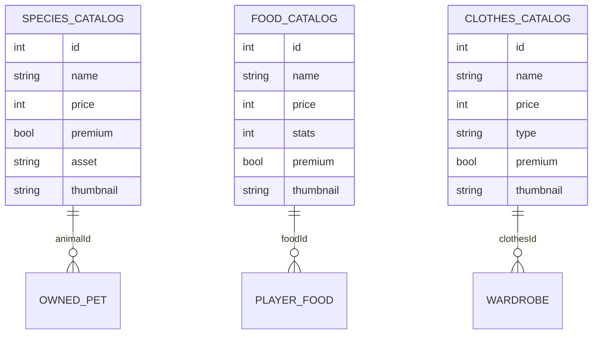

# Seed Catalogs

> **Type:** context doc (data-model reference)
> **Owner review:** product owner sign-off required on every `[DECIDE]` in §7.
> **Purpose:** The exact, verified seed/catalog data the REBUILD ships with — species (pets), food, clothes, and monetization products (memberships, coin packs). These are the read-only reference rows that populate the local database on first launch. Every number here has been verified against legacy source; discrepancies between the two legacy sources of truth are flagged.

---

## 1. Scope & local-first mapping

Legacy split catalog data across **two sources that do not fully agree**:

| Source | File | Role in legacy |
|---|---|---|
| Server DB seed | `old/Pawductivity_BE/database/script/pawductivity.sql` | Canonical catalog + the only place that carries **food heal stats** and clothes `type`. |
| Flutter constants | `old/Pawductivity_App/lib/config/constant/{pet,food,clothes}.dart` | Client-side hardcoded mirror + the only place that carries **thumbnail image paths**; used for shop rendering. |

**[CHANGE] Local-first target.** The REBUILD is local-first (see `local-first-data-layer`). These catalogs become **app-bundled, read-only seed tables** written into the on-device database on first launch (or shipped as a bundled asset the DB reads). There is no network fetch for the catalog. The union of both legacy sources must be carried locally so no field is lost:

- **stats** (heal amount) — legacy only in SQL → must ship locally.
- **thumbnail image** — legacy only in Dart → must ship locally.
- **animated asset** (Lottie) — in both for pets; must ship locally.

User-owned rows (owned pets, wardrobe, player food inventory) are **separate mutable local tables**, not part of these seed catalogs. See `pet-companion-system`, `clothes-and-wardrobe`, `food-and-feeding`.

Vocabulary note: "species" = the buyable animal template (legacy table `animal`); an "owned pet" (legacy table `pet`) is one user-owned instance of a species with its own name and health.

---

## 2. Species (pets) catalog `[PRESERVE]`

Prices are in **coins**. `asset` is the default idle Lottie for the species; `thumbnail` is the shop PNG.

| id | name | price (coins) | premium | default asset (Lottie) | thumbnail |
|---|---|---|---|---|---|
| 1 | Dog | 100 | false | `assets/pet/dog/dog_default.json` | `assets/pet/dog.png` |
| 2 | Cat | 200 | false | `assets/pet/cat/cat_default.json` | `assets/pet/cat.png` |
| 3 | Rabbit | 200 | **true** | `assets/pet/rabbit/rabbit_default.json` | `assets/pet/rabbit.png` |

Verified: SQL `INSERT INTO animal` (`pawductivity.sql:233-253`) and `pet.dart:1-5`. **Both sources agree** on name/price/premium/asset. Thumbnail exists only in `pet.dart`.

Notes:
- **[PRESERVE]** New owned pets start at `health = 100` (SQL `pet.health DEFAULT 100`, `pawductivity.sql:77`). Evolution stages `_1`.._5` exist as sibling Lottie files per species (e.g. `assets/pet/dog/dog_1.json` … `dog_5.json`, plus `dog_default.json`) — the catalog seeds only the `_default` asset; stage selection is runtime logic (see `pet-companion-system`).
- **[PRESERVE]** Rabbit is the only premium species: purchasable/usable only under a premium membership.

---

## 3. Food catalog `[PRESERVE]` (with one resolved VERIFY)

Prices are in **coins**. `stats` = health restored per feeding.

| id | name | price (coins) | stats (heal) | premium | thumbnail |
|---|---|---|---|---|---|
| 1 | Apple | 3 | 10 | false | `assets/food/apel.png` |
| 2 | Chicken | 3 | 10 | false | `assets/food/ayam.png` |
| 3 | Pizza | 4 | **20** | **true** | `assets/food/pizza.png` |
| 4 | Watermelon | 4 | 10 | false | `assets/food/semangka.png` |
| 5 | Carrot | 5 | **15** | false | `assets/food/wortel.png` |

Verified: SQL `INSERT INTO food` (`pawductivity.sql:255-294`) carries name/price/**stats**/premium; `food.dart:1-6` carries name/price/premium/thumbnail but **no stats**.

- ✅ **Carrot stat resolved:** the brief marked it `VERIFY`; SQL is authoritative → **stats = 15** (`pawductivity.sql:291`).
- **[CHANGE]** `food.dart` has no `stats` field — heal amounts live only server-side in legacy. The REBUILD must ship `stats` in the local seed (see §1).
- **[PRESERVE]** Pizza is the only premium food.
- Thumbnail filenames are Indonesian (`apel`=apple, `ayam`=chicken, `semangka`=watermelon, `wortel`=carrot); keep the asset filenames as-is unless assets are re-authored.
- Data-quality note (legacy): Watermelon's SQL `description` is a copy-paste of Pizza's ("A tasty pizza for your pet"). Descriptions are not shipped in the catalog table today; if the REBUILD surfaces descriptions, rewrite these.

---

## 4. Clothes (cosmetics) catalog `[PRESERVE]` + `[DECIDE]` price conflict

Prices are in **coins**. Cosmetic only — no stat effect.

| id | name | price (coins) — SQL | price (coins) — Dart | premium | type (SQL enum) | thumbnail (Dart) | asset (SQL) |
|---|---|---|---|---|---|---|---|
| 1 | Cyan t-shirt | 15 | 15 | false | shirt | `assets/clothes/shirt.png` | `shirt` |
| 2 | Green shirt | 10 | 10 | false | shirt | `assets/clothes/polo_shirt.png` | `polo_shirt` |
| 3 | Tuxedo | 20 | 20 | **true** | shirt | `assets/clothes/suit.png` | `suit` |
| 4 | Star Shirt | 15 | 15 | **true** | shirt | `assets/clothes/emo_shirt.png` | `emo_shirt` |
| 5 | Pink Dress | **20** ⚠️ | **15** ⚠️ | **true** | shirt | `assets/clothes/dress.png` | `dress` |

Verified: SQL `INSERT INTO clothes` (`pawductivity.sql:296-335`) and `clothes.dart:1-6`.

- ⚠️ **[DECIDE] Pink Dress price conflict.** SQL says **20** (`pawductivity.sql:331`); Dart says **15** (`clothes.dart:6`). The two legacy sources disagree. Pick one canonical value for the REBUILD seed. (Brief's spec text said "Pink Dress 15", matching the client/shop UI — but confirm this is the intended sale price, not a client bug that undercharged.)
- **[DECIDE] Clothes `type`.** All five rows are seeded as `'shirt'`, including Pink Dress, even though the SQL enum `clothesType` is `('hat','shirt','pants','shoes')` (`pawductivity.sql:116`). There is no `'dress'` category and no hat/pants/shoes items. Decide whether the REBUILD keeps a single flat "outfit/shirt" slot or introduces real equip slots (which changes the wardrobe/equip model — see `clothes-and-wardrobe`).
- **[CHANGE] Asset path normalization.** SQL stores bare tokens (`shirt`, `polo_shirt`, `suit`, `emo_shirt`, `dress`) with no directory or extension; Dart stores full `assets/clothes/<token>.png`. Ship **one** canonical asset path in the REBUILD seed (recommend the Dart form). Note the name→file mismatches are intentional legacy: "Green shirt" → `polo_shirt.png`, "Star Shirt" → `emo_shirt.png`, "Tuxedo" → `suit.png`.
- Data-quality note (legacy): Star Shirt's SQL `description` is wrong ("A pair of shoes for your pet"); rewrite if descriptions are surfaced.

---

## 5. Coin packs (IAP) — `[DECIDE]` no catalog exists

**There is no coin-pack catalog in legacy.** Coins are bought via a procedure that accepts an **arbitrary amount**, not a fixed SKU list:

- SQL `PROCEDURE buy_coins(user_id INT, amount INT)` inserts a `purchases` row of `type = 'coins'` and credits `users.coins` by `amount` (`pawductivity.sql:221-230`).
- BE endpoint `POST /purchase/coin` → `PurchaseCoin` → `CALL buy_coins($1, $2)` with `CoinPurchaseRequest.Amount` (`purchase.controller.go:60`, `purchase.repository.go:160-161`). The amount is caller-supplied; no server-side price/pack table.
- `buy_coins` is also reused internally as a coin **credit** mechanism (task completion reward, signup/referral bonus): `task.repository.go:470`, `user.repository.go:157,324`. So legacy "buy coins" doubles as a generic "grant coins" call, not a real store.

**[DECIDE] items for the REBUILD (Google Play IAP path):**
1. Define an explicit **coin-pack SKU catalog** (e.g. pack name, coin amount granted, Google Play product ID, display price). None exists to migrate — prices below are placeholders to be set, **not** legacy values.

   | (proposed) pack | coins granted | Google Play product ID | price |
   |---|---|---|---|
   | [DECIDE] | [DECIDE] | [DECIDE] | [DECIDE] (Play Console) |

2. Confirm whether coins remain purchasable at all in the REBUILD, or whether coins become purely earned (task/referral) with only **memberships** sold for real money. (Legacy sold both.)

See `coin-economy-and-shop` for how coins are spent (this catalog's `price` columns) and earned.

---

## 6. Membership tiers (premium) `[PRESERVE]` tiers / `[DECIDE]` pricing

Membership class is a two-value enum — there is exactly **one paid tier**:

| class | meaning | source |
|---|---|---|
| `basic` | default, free (all new users) | `membershipclass` enum, `pawductivity.sql:17`; `membership.class DEFAULT 'basic'` |
| `premium` | paid; unlocks premium species/food/clothes | same |

Premium is time-boxed via `membership.membership_expired_date` (`pawductivity.sql:19-28`). Downgrade to `basic` happens when the subscription lapses (`subscription.controller.go` sets `basic` with zero expiry when not active).

### 6a. Durations (three) `[PRESERVE]`

The app exposes three premium **durations** (all grant the same `premium` class, differing only in expiry length):

| duration | legacy app endpoint | legacy Midtrans product | Midtrans product ID | Midtrans price (IDR) |
|---|---|---|---|---|
| 1 month | `POST /api/premium/1-month` | "1 Month Premium Package" | `M-001` | 3000 |
| 6 months | `POST /api/premium/6-month` | "6 Months Premium Package" | `M-006` | 9000 |
| 1 year | `POST /api/premium/1-year` | "1 Year Premium Package" | `Y-001` | 15000 |

Verified: durations/endpoints `premium_api_service.dart:16-27`; Midtrans product map & prices `premium.controller.go:41-45`.

### 6b. Two legacy payment rails — pick one `[DECIDE]`

Legacy shipped **two parallel purchase paths** for the same premium tier:

1. **Midtrans Snap** (web/IDR) — the `M-001/M-006/Y-001` products above, priced in-repo (3000/9000/15000 IDR). See `premium.controller.go`.
2. **Google Play subscription** (in-app) — a **single** subscription product, with durations expressed as Google Play **base plans**, not separate SKUs:
   - `packageName = "com.production.pawductivity"`
   - `subscriptionID = "pawductivity_premium"` (legacy `TODO` comment: will change once more than one product is sellable)
   - Verified via Google Play Developer API (`subscription.controller.go` `PurchaseSubscription` / `VerifySubscription`); expiry/auto-renew come from `ExpiryTimeMillis` / `AutoRenewing`.

**[DECIDE] for REBUILD:**
- The REBUILD targets **Google Play IAP** (per brief). Confirm the Midtrans rail is **[DROP]** and only Google Play remains.
- **Prices are set in Google Play Console, not in the app.** The 3000/9000/15000 IDR figures are Midtrans-rail values and are **reference only** — do not hardcode them as the IAP price.
- Define the canonical **Google Play product ID + base plan IDs** for the three durations (legacy used one product `pawductivity_premium` and left `BasePlanID` empty — `subscription.controller.go`). Decide whether the REBUILD uses one product with three base plans, or three products.
- Confirm the exact expiry math per duration (1 month / 6 months / 1 year) is delegated to Google Play's `ExpiryTimeMillis` (recommended) rather than computed locally.

See `premium-and-monetization` for entitlement/verification flow and gating.

---

## 7. Open decisions (`[DECIDE]`) — product owner sign-off

| # | Decision | Legacy evidence | Recommendation |
|---|---|---|---|
| D1 | **Pink Dress price:** 15 or 20 coins? | SQL=20 (`pawductivity.sql:331`) vs Dart=15 (`clothes.dart:6`) | Pick one; brief/shop UI imply 15. |
| D2 | **Clothes equip model / `type`:** keep single "shirt" slot or introduce real slots (hat/pants/shoes/dress)? | All 5 seeded `type='shirt'`; enum lacks `dress` (`pawductivity.sql:116,296-335`) | Keep single slot unless new cosmetics planned. |
| D3 | **Canonical clothes asset path** (bare token vs `assets/clothes/<t>.png`). | SQL bare vs Dart pathed | Use Dart pathed form. |
| D4 | **Coin packs:** ship a fixed SKU catalog, or drop paid coins entirely? | No catalog; `buy_coins` takes arbitrary amount (`pawductivity.sql:221-230`) | Define explicit packs or drop. |
| D5 | **Coin-pack prices / product IDs** (if D4 = ship). | None in repo | Set in Play Console. |
| D6 | **Payment rail:** drop Midtrans, keep Google Play only? | Two rails coexist (`premium.controller.go` vs `subscription.controller.go`) | Drop Midtrans → Google Play IAP. |
| D7 | **Membership IAP prices + product/base-plan IDs.** | Midtrans IDR 3000/9000/15000 (reference); GP product `pawductivity_premium`, base plan empty | Set prices in Play Console; define base-plan IDs for 1mo/6mo/1yr. |
| D8 | **Food `stats` + pet `thumbnail`** must be carried in local seed (fields split across two legacy sources). | stats: SQL only; thumbnail: Dart only | Ship the union locally (see §1). |

---

## 8. Legacy source citations

| Catalog | SQL seed | Flutter constant | Other |
|---|---|---|---|
| Species/pets | `old/Pawductivity_BE/database/script/pawductivity.sql:62-70, 72-82 (schema), 233-253 (seed)` | `old/Pawductivity_App/lib/config/constant/pet.dart:1-5` | Lottie assets `assets/pet/<species>/<species>_{default,1..5}.json` |
| Food | `pawductivity.sql:84-93 (schema), 255-294 (seed)` | `old/Pawductivity_App/lib/config/constant/food.dart:1-6` | — |
| Clothes | `pawductivity.sql:116 (enum), 118-127 (schema), 296-335 (seed)` | `old/Pawductivity_App/lib/config/constant/clothes.dart:1-6` | — |
| Coins | `pawductivity.sql:104 (purchaseType enum), 106-114 (purchases), 221-230 (buy_coins)` | — | `old/Pawductivity_BE/internal/controllers/purchase.controller.go:60`, `internal/repository/purchase.repository.go:160-161` |
| Membership | `pawductivity.sql:17 (enum), 19-28 (membership table)` | — | Durations `old/Pawductivity_App/lib/features/premium/data/data_sources/remote/premium_api_service.dart:16-27` |
| Premium (Midtrans) | — | — | `old/Pawductivity_BE/internal/controllers/premium.controller.go:41-45` |
| Premium (Google Play) | — | — | `old/Pawductivity_BE/internal/controllers/subscription.controller.go`; `internal/models/subscription.go` |

---

## 9. Cross-links

- `pet-companion-system` — species → owned-pet instances, health/evolution stages.
- `food-and-feeding` — how `stats` heals owned-pet health; premium food gating.
- `clothes-and-wardrobe` — wardrobe/equip model; the `type`/slot decision (D2).
- `coin-economy-and-shop` — spending catalog prices; earning/granting coins; coin packs (D4/D5).
- `premium-and-monetization` — membership entitlement, Google Play verification, gating of premium catalog rows.
- `local-first-data-layer` — how seed catalogs are bundled and written to the on-device DB (§1).
- `legacy-migration-guide` — reconciling the SQL-vs-Dart source split.
