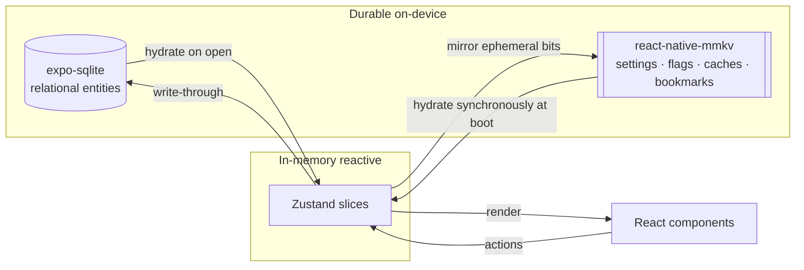
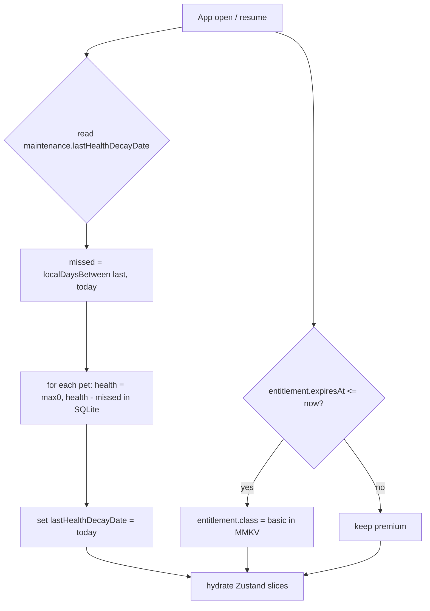

# State & MMKV — the non-relational persistence layer

> How the rebuild splits on-device state across three stores: **react-native-mmkv** (fast synchronous key/value: settings, flags, ephemeral caches, active-timer bookmark, entitlement cache, maintenance timestamps), **Zustand** (reactive in-memory UI state hydrated from the durable stores), and **expo-sqlite** (all relational/entity data — covered in [`./sqlite-schema.md`](./sqlite-schema.md)).

This doc owns the **MMKV key schema** and the **Zustand store design**. It also audits the legacy `flutter_secure_storage` key/value store — which was the app's *real* client-side state layer — and maps every key to keep / drop / relocate.

---

## 1. The three storage layers (decision rule)

The legacy Flutter app was **online-first**: nearly all durable data lived in the Go/Postgres backend, the local Floor (SQLite) DB was vestigial (only 4 registered entities, largely unused), and the app's actual live client state sat in **`flutter_secure_storage`** across ~30 files (legacy: `Pawductivity_App/lib/database/app_database.dart`; legacy: `Pawductivity_App/lib/features/user/presentation/bloc/user/remote/remote_auth_bloc.dart`). The rebuild is **100% local-first**, so we must consciously place every piece of state.

Use this decision rule for **where a value lives**:

| Put it in… | When the value is… | Examples |
|---|---|---|
| **expo-sqlite** | Relational, queried, historical, or an entity the user owns | user row (coins/level/xp), tasks/quests, task time logs, daily logs, pets, wardrobe, inventory, purchases ledger, catalogs, reminders |
| **react-native-mmkv** | Small, scalar-ish, needs synchronous read at startup, ephemeral, or a *bookmark/cache* that can be recomputed | settings, onboarding flag, selected companion id, active-timer bookmark, entitlement cache, last-decay timestamp, pet-mood cache |
| **Zustand** | Reactive UI state derived from the two durable stores; never the sole source of truth | live coin balance, today's task list, live ticking timer value, selected pet + equipped clothes, current mood |

**Golden rule:** MMKV and Zustand hold **derived, ephemeral, or bookmark** state. If losing it would lose real user history or money, it belongs in **SQLite**. Coins, XP, level, owned items, and completed-time logs are **authoritative in SQLite** — MMKV/Zustand only cache or mirror them.



> **[NEW]** This three-layer split is net-new. The legacy app had no equivalent structure — it read/wrote the server on nearly every interaction and used secure storage as an ad-hoc bag of strings.

---

## 2. Legacy `flutter_secure_storage` audit → keep / drop / relocate

These are the **actual** keys the legacy app persisted on-device (legacy: `remote_auth_bloc.dart:50-60`, `countdown_manager.dart:33-41`, `background_service.dart`, `home_screen.dart`). `flutter_secure_storage` was (mis)used as a general K/V store, not just for secrets. In the rebuild, **none of it is genuinely sensitive** once accounts are dropped, so it all maps to plain (unencrypted) MMKV.

| Legacy key | Legacy meaning | Rebuild disposition | Tag | New home |
|---|---|---|---|---|
| `auth_token` | JWT, attached per-endpoint (no interceptor); also the *auth gate* ("can I read `auth_token`?") | Delete — no accounts, no server, no JWT for MVP | **[DROP]** | — |
| `email` | Account email, cached for re-login | Delete — no accounts in MVP | **[DROP]** | — (identity = single local profile) |
| `password` | **User's plaintext password persisted on device** (legacy: `remote_auth_bloc.dart:59`) | **Delete — never store a password, plaintext or otherwise** | **[DROP]** | — (security fix) |
| `name` | User display name | Relocate — becomes the local profile name | **[CHANGE]** | SQLite `user` row (see [`./sqlite-schema.md`](./sqlite-schema.md)) |
| `current_task_id` | Id of the task the timer is running (legacy: `countdown_manager.dart:39`) | Relocate to the active-timer bookmark | **[CHANGE]** | MMKV `timer.active` |
| `start_time` | ISO8601 wall-clock when the current run segment began (legacy: `countdown_manager.dart:40`) | Relocate; store as **epoch ms**, not ISO string | **[CHANGE]** | MMKV `timer.active.startedAt` |
| `locked_pet_id` | Pet chosen when the timer started (legacy: `countdown_manager.dart:41`) | Relocate — the companion locked to the session | **[PRESERVE]** concept, relocate | MMKV `timer.active.lockedPetId` + `companion.selectedPetId` |
| `locked_pet_index` | Carousel page index to restore the pet picker | Relocate | **[PRESERVE]** concept | MMKV `companion.selectedPetIndex` |
| `is_running` | `'true'` flag (old path only) | Relocate as a boolean inside the bookmark | **[CHANGE]** | MMKV `timer.active.isRunning` |
| `remaining_time` | Seconds counter the background service **decremented every tick** and rewrote each second | **Drop as a stored field** — do NOT persist a decrementing counter; recompute from `startedAt` + allocated (timestamp-authoritative) | **[DROP]** (field) / **[CHANGE]** (behavior) | recomputed, not stored |
| `task_name` | Task name shown in the ongoing notification | Relocate as a tiny cache (or read from SQLite task by id) | **[CHANGE]** | MMKV `timer.active.taskName` |

**Behavioral drops carried over from the audit:**

- **[DROP]** The "auth gate = can I fetch `/api/user` with the stored JWT" pattern (legacy: `main.dart` splash → `GetUserInfo`). Replaced by "load the single local profile row; if none, run onboarding."
- **[DROP]** Persisting `remaining_time` as a per-second-mutated counter. It is redundant with `startedAt` and drifts under Android background throttling. See §5.
- **[DROP]** Plaintext credential storage entirely (`email`/`password`/`name` written in `onStoreCredential`).

---

## 3. MMKV key schema (proposed)

Single MMKV instance, id `pawductivity`. Keys use **dotted namespaces** as a flat string convention (MMKV is not hierarchical; the dots are just naming). Values are scalars where possible; compound values are JSON-stringified and noted. Every key below is either a setting, a flag, a cache, or a bookmark — **never** the sole source of truth for money/history.

> **Encryption:** none required for MVP — nothing here is a secret after accounts are dropped. If a future cloud-sync/account feature returns, put only genuine tokens in an encrypted MMKV instance. **[DECIDE]** (defer).

### 3a. Settings — user preferences

| Key | Type | Default | Notes | Tag |
|---|---|---|---|---|
| `settings.theme` | `'light' \| 'dark' \| 'system'` | `'system'` | Legacy had a single hardcoded light theme, no dark mode | **[NEW]** |
| `settings.soundEnabled` | boolean | `true` | | **[NEW]** |
| `settings.hapticsEnabled` | boolean | `true` | | **[NEW]** |
| `settings.notif.remindersEnabled` | boolean | `true` | Gates locally-scheduled reminder notifications | **[CHANGE]** |
| `settings.notif.timerEnabled` | boolean | `true` | Gates the ongoing focus-session notification | **[CHANGE]** |
| `settings.locale` | string | device | i18n scope | **[DECIDE]** |

### 3b. First-run / onboarding

| Key | Type | Default | Notes | Tag |
|---|---|---|---|---|
| `onboarding.completed` | boolean | `false` | Legacy had **no onboarding** (`welcome.dart` was dead/unreferenced). Gates the first-run pet-selection + permission-priming flow | **[NEW]** |
| `onboarding.version` | number | `0` | Bump to re-show onboarding after a major redesign | **[NEW]** |
| `app.firstLaunchAt` | number (epoch ms) | set once | Analytics/streak anchor | **[NEW]** |
| `app.schemaVersion` | number | current | MMKV-layout migration guard (see §7) | **[NEW]** |

### 3c. Selected companion

| Key | Type | Default | Notes | Tag |
|---|---|---|---|---|
| `companion.selectedPetId` | number | seeded pet id | The active pet shown on Home / used in a session. Replaces `locked_pet_id`. Authoritative *ownership* is the SQLite `pet` table; this is just "which one is selected" | **[PRESERVE]** concept |
| `companion.selectedPetIndex` | number | `0` | Carousel restore position. Replaces `locked_pet_index` | **[PRESERVE]** |

### 3d. Ephemeral pet-mood cache

Mood is **derived** from health + recent activity and selects which Lottie animation to play (see canonical vocabulary: *Mood*). It is recomputed, but caching it lets Home render the correct mood **instantly on cold start** before the SQLite hydrate + recompute completes.

| Key | Type | Notes | Tag |
|---|---|---|---|
| `pet.moodCache` | JSON `{ petId, health, mood, computedAt }` | Ephemeral render hint only; safe to discard. `health` mirrors SQLite `pet.health`; `mood` is the derived enum used to pick animation | **[NEW]** |

> Health decays **−1 per day at local midnight, floored at 0** (verified — legacy: `Pawductivity_BE/internal/routines/decreasePetHealth.routine.go`, `UPDATE pet SET health = health - 1 WHERE health > 0`; capped 100 on feeding). The **authoritative** health integer lives in the SQLite `pet` row; `pet.moodCache.health` is only a display mirror. Decay math is computed lazily (§6).

### 3e. Active focus-timer bookmark (the critical one)

Replaces the legacy secure-storage timer keys. Stored as one JSON blob so it is written/cleared atomically. See §5 for the timestamp-authoritative model.

| Key | Type | Notes | Tag |
|---|---|---|---|
| `timer.active` | JSON (see below) or `null` when idle | The **bookmark** that lets a running focus session survive backgrounding, app kill, and reboot | **[CHANGE]** |

```jsonc
// timer.active
{
  "taskId": 1234,            // was current_task_id
  "taskName": "Write report",// was task_name (cache for notification)
  "lockedPetId": 7,          // was locked_pet_id
  "lockedPetIndex": 2,       // was locked_pet_index
  "startedAt": 1720900000000,// was start_time — EPOCH MS, not ISO
  "allocatedSeconds": 1500,  // total planned focus seconds for this run
  "accumulatedSeconds": 300, // seconds already banked from prior segments
  "isRunning": true          // was is_running
}
// remaining is NEVER stored — it is computed (see §5)
```

### 3f. Entitlement (premium) cache

Premium is the one subsystem that may still touch a remote (Play/App Store billing). We cache the **resolved** entitlement so the app knows premium status **offline** and degrades to `basic` gracefully.

| Key | Type | Notes | Tag |
|---|---|---|---|
| `entitlement.class` | `'basic' \| 'premium'` | Mirrors legacy `membership.class` enum. Default `basic` | **[CHANGE]** |
| `entitlement.expiresAt` | number (epoch ms) or `null` | Local copy of `membership_expired_date`; used for lazy expiry check (§6) | **[CHANGE]** |
| `entitlement.productId` | string or `null` | e.g. the yearly plan (legacy `Y-001`, "1 Year Premium Package" = 15000 IDR; legacy: `premium.controller.go:45`). Verify tiers per store config | **[CHANGE]** / **[DECIDE]** |
| `entitlement.lastVerifiedAt` | number (epoch ms) | When billing was last successfully re-verified; drives re-check cadence | **[CHANGE]** |

> Server-side receipt verification (legacy: `subscription.controller.go` + `service_account.json`) is the **one thing that genuinely wants a backend**. Options (react-native-iap vs RevenueCat vs local-only) are weighed in [`../migration/monetization-options.md`](../migration/monetization-options.md). Whichever is chosen, the **resolved** result is cached here.

### 3f-note: no `email`/`password`/`auth_token` keys exist in the rebuild. Their absence is intentional (§2).

### 3g. Maintenance timestamps (replace server midnight cron)

The legacy backend ran two infinite goroutine loops firing at **server-local midnight** (legacy: `decreasePetHealth.routine.go`, `checkMembership.routine.go`). Local-first replaces both with **lazy, timestamp-based catch-up computed on app open / resume** — no daemon, and it correctly catches up days missed while the app was closed.

| Key | Type | Notes | Tag |
|---|---|---|---|
| `maintenance.lastHealthDecayDate` | string `YYYY-MM-DD` (device-local) | On open: `missedMidnights = localDaysBetween(lastHealthDecayDate, today)`; apply `health = max(0, health − missedMidnights)` for each pet, then set to today. Uses **device** local midnight. ⚠️ **Single source of truth:** the canonical relational schema instead stores a **per-pet** anchor `pet.last_health_decay_at` (epoch ms, [`sqlite-schema.md`](./sqlite-schema.md) §6). Pick ONE — recommended: the per-pet SQLite column (owned-but-inactive pets then decay independently); if you keep this global MMKV date, drop the per-pet column so they can't drift. **[DECIDE]** | **[CHANGE]** |
| `maintenance.lastMembershipCheckAt` | number (epoch ms) | On open: if `entitlement.expiresAt <= now`, downgrade `entitlement.class → 'basic'` | **[CHANGE]** |

> **Legacy fragility fixed:** the Go cron was stateless — a server restart near midnight could **skip or double-apply** decay, and it used server (not per-user) timezone. The timestamp model above is idempotent and uses the device clock. **[DECIDE]:** decay per *each* missed calendar day (catch-up) vs only once on next open — this doc assumes catch-up per missed local midnight; product must confirm. See [`../02-open-decisions.md`](../02-open-decisions.md).

---

## 4. Zustand store design

Zustand holds **reactive in-memory** state hydrated from the two durable stores at boot, with **actions that write through** to SQLite and **mirror ephemeral bits** to MMKV. Zustand is **never** the sole source of truth. Suggested slices (each a store or a slice of a root store):

| Slice | Fields (reactive) | Source of truth | Mirrors to | Tag |
|---|---|---|---|---|
| `useSettingsStore` | theme, sound, haptics, notif prefs, locale | MMKV `settings.*` | writes straight to MMKV | **[NEW]** |
| `useProfileStore` | name, avatarIndex, coins, level, currentXp, neededXp, streak | **SQLite `user` row** | — (reads/writes SQLite) | **[CHANGE]** |
| `useTaskStore` | today's tasks/quests, per-task progress, active filters | **SQLite** `task` / logs | — | **[CHANGE]** |
| `useCompanionStore` | owned pets, selectedPet, equipped clothes, health, mood | **SQLite** `pet`/`wardrobe`/`pet_clothes` | `companion.selectedPetId/Index`, `pet.moodCache` | **[CHANGE]** |
| `useTimerStore` | live remaining seconds, isRunning, lockedPetId, HH:MM:SS string | derived; bookmark in **MMKV `timer.active`**, logs in SQLite | `timer.active` on every start/pause/tick-boundary | **[CHANGE]** |
| `useEntitlementStore` | class, isPremium, expiresAt | **MMKV `entitlement.*`** (billing-resolved) | writes to MMKV | **[CHANGE]** |

**Write-through contract (example — task completion reward):** the legacy reward logic was a server transaction (XP `+= estimatedTime/60`; level-up loop `neededXp = 10*level² + 50*level + 100`; `CALL buy_coins(userId, estimatedTime/60)` — verified: legacy `task.repository.go:434-435, 444-459, 470`). In the rebuild this becomes a **single expo-sqlite transaction** invoked by a Zustand action (`applyTaskReward`), after which the store re-reads the updated `user` row so `useProfileStore` re-renders. Details live in the [`../../.claude/skills/gamification-xp-levels/SKILL.md`](../../.claude/skills/gamification-xp-levels/SKILL.md) and [`../../.claude/skills/task-quest-system/SKILL.md`](../../.claude/skills/task-quest-system/SKILL.md) skills; the point here is **money/XP mutations go through SQLite in a transaction, never live only in Zustand.**

> **[DECIDE]** Reward-formula discrepancy to resolve once for the whole app: actual grant `estimatedTime/60` vs the task-list preview `FLOOR(estimatedTime/60/3)` (legacy: `task.repository.go:234`). Pick one; see [`../02-open-decisions.md`](../02-open-decisions.md).

---

## 5. Active timer: timestamp-authoritative model

The legacy live countdown was an in-memory `Timer.periodic(1s)` decrementing a counter, with an **intended** (but in the shipping build **commented-out / disabled**) Android foreground service that also decremented `remaining_time` in secure storage every second (legacy: `countdown_manager.dart:53,58-62`; `background_service.dart:45-78`). Consequences in legacy: killing/backgrounding the app stopped the visible countdown; only the `start_time` bookmark survived; two decrementers could double-count; no reboot recovery.

**Rebuild rule — never trust tick counts across suspension. Reconcile from the wall clock.** **[CHANGE]**

- Persist only the **bookmark** in MMKV `timer.active` (`startedAt`, `allocatedSeconds`, `accumulatedSeconds`, `isRunning`).
- On every foreground / resume / cold start, compute:
  `remaining = allocatedSeconds − accumulatedSeconds − floor((Date.now() − startedAt) / 1000)`
  (verified legacy analog: `elapsed = DateTime.now().difference(start_time).inSeconds`, `countdown_manager.dart:81-90`). If `remaining <= 0`, complete immediately.
- The visible HH:MM:SS is a Zustand-driven JS interval **for display only**; it is authoritative only between reconciliations.
- On pause/switch, bank the segment: `accumulatedSeconds += floor((now − startedAt)/1000)` (cap total at `allocatedSeconds`), write the SQLite time log, clear/update the bookmark.
- **Completion alarm** (legacy explicit TODO, never built): on start, schedule a **one-shot `expo-notifications` trigger** at `startedAt + remaining` seconds; cancel on pause/complete. This removes any need to keep a process alive.

Because the bookmark is timestamp-based, **reboot recovery is free** — on next launch, recompute from `startedAt`. (Android clears scheduled alarms on reboot, so re-register the completion notification on app start by reading `timer.active`.) Full timer/background spec: [`../../.claude/skills/focus-timer-and-background/SKILL.md`](../../.claude/skills/focus-timer-and-background/SKILL.md).

> **[DECIDE]** Clock-tampering guard: the elapsed calc trusts the device wall clock; changing the clock/DST can corrupt elapsed or jump a task to complete (legacy had no client clamp). Decide whether to clamp increments to a sane max. See [`../02-open-decisions.md`](../02-open-decisions.md).

---

## 6. Lazy maintenance on app open (health decay + entitlement expiry)



This replaces both server goroutines with pure on-device computation from timestamps — no background daemon required. An optional `expo-background-task` daily wake can pre-warm this, but **lazy-on-open is the robust baseline** (see local-first mapping in [`../migration/backend-to-local-first.md`](../migration/backend-to-local-first.md)).

---

## 7. Serialization & versioning notes

- **Scalars first.** Prefer native MMKV scalar setters (`setString`/`setNumber`/`setBool`) over JSON blobs where a value is a single field. Reserve JSON for the two compound values: `timer.active` and `pet.moodCache`.
- **Epoch ms, not ISO strings.** The legacy mixed ISO8601 (`start_time`) and epoch millis (Flutter `TaskModel.dueDate`) and int64 vs string vs ISO in subscription dates — a real inconsistency. **Canonicalize all MMKV timestamps to epoch milliseconds** (dates that must be day-granular use `YYYY-MM-DD` device-local strings, e.g. `maintenance.lastHealthDecayDate`).
- **MMKV layout migrations.** `app.schemaVersion` guards the key layout. On boot, if the stored version is older, run a small migration function (rename/backfill keys) before hydrating Zustand.
- **Clear-on-reset.** A "reset app data" / "delete my data" action (no legacy equivalent — legacy logout merely deleted `auth_token`) should wipe the MMKV instance **and** the SQLite DB. This satisfies the data-deletion right the website Privacy Policy promised but the app never implemented. See [`../../.claude/skills/account-and-profile/SKILL.md`](../../.claude/skills/account-and-profile/SKILL.md). **[NEW]**

---

## 8. What must NOT go in MMKV/Zustand (goes to SQLite)

To keep the boundary crisp, these are **SQLite-only** (see [`./sqlite-schema.md`](./sqlite-schema.md) and [`./entity-relationship.md`](./entity-relationship.md)):

- **Coins, level, current_xp, needed_xp** — authoritative in the `user` row; MMKV/Zustand only cache for display. (Money must never live only in memory or a KV blob.)
- **Owned entities** — pets, wardrobe garments, food inventory, equipped clothes (`pet_clothes`). MMKV holds only *which pet is selected*, not the ownership set.
- **History/logs** — task time logs, daily logs, purchases ledger. These drive the summary/heatmap and must be queryable.
- **Tasks/quests, reminders, catalogs** — relational and queried.

MMKV's `entitlement.*` is the one apparent exception (a "money-adjacent" cache), and it is deliberately a **cache** — the durable subscription record (if kept) still lives in SQLite; MMKV holds the fast-read resolved status.

---

## Related

- [`./sqlite-schema.md`](./sqlite-schema.md) — the relational tables MMKV/Zustand hydrate from and write through to.
- [`./entity-relationship.md`](./entity-relationship.md) — the entity graph.
- [`./seed-catalogs.md`](./seed-catalogs.md) — seed pets/food/clothes values referenced here.
- [`../migration/backend-to-local-first.md`](../migration/backend-to-local-first.md) — server cron → lazy on-open computation; REST → local queries.
- [`../migration/flutter-to-react-native.md`](../migration/flutter-to-react-native.md) — Flutter → RN/Expo state-layer mapping.
- [`../migration/monetization-options.md`](../migration/monetization-options.md) — how `entitlement.*` gets resolved (IAP/RevenueCat/local).
- [`../02-open-decisions.md`](../02-open-decisions.md) — the `[DECIDE]` items raised here.
- [`../../.claude/skills/local-first-data-layer/SKILL.md`](../../.claude/skills/local-first-data-layer/SKILL.md) — overall local-first data strategy.
- [`../../.claude/skills/focus-timer-and-background/SKILL.md`](../../.claude/skills/focus-timer-and-background/SKILL.md) — timestamp-authoritative timer + notifications.
- [`../../.claude/skills/premium-and-monetization/SKILL.md`](../../.claude/skills/premium-and-monetization/SKILL.md) — entitlement caching.
- [`../../.claude/skills/pet-companion-system/SKILL.md`](../../.claude/skills/pet-companion-system/SKILL.md) — health/mood that back `pet.moodCache`.
- [`../../.claude/skills/account-and-profile/SKILL.md`](../../.claude/skills/account-and-profile/SKILL.md) — single local profile, settings, data-reset.
