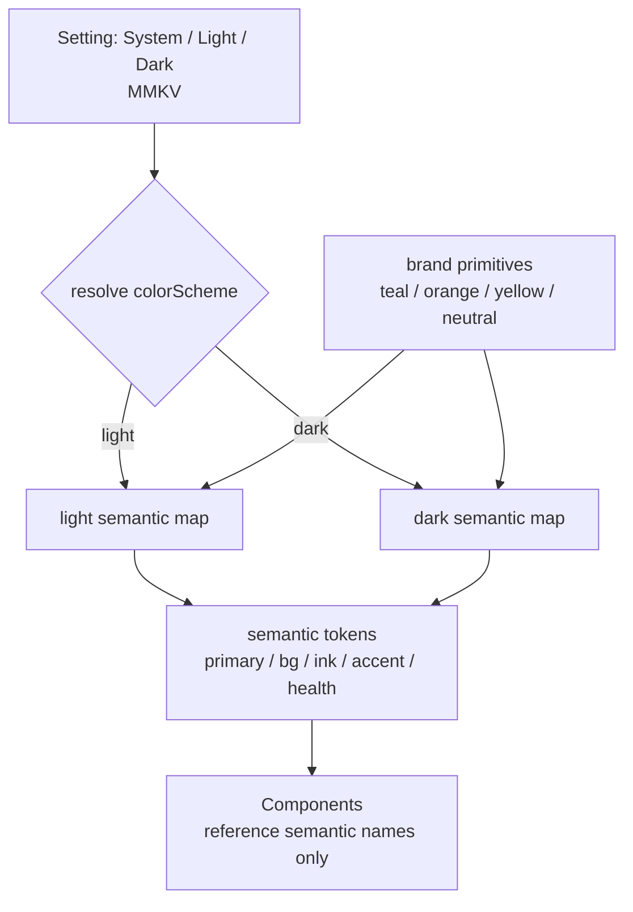

# Brand & Design Tokens

> The design system for the rebuild, reverse-engineered from the legacy Flutter app (and cross-checked against the marketing site). The legacy had **no token system at all**: brand colors were hardcoded hex literals copy-pasted across dozens of widgets, there was no dark mode, and one dead screen even mistyped the font family. This file recovers the real palette, names it, and proposes a **NativeWind token structure with light + dark schemes** so the rebuild has one source of truth for color, spacing, radius, and type.
>
> Primary consumer: **[design-system-and-theming](../../.claude/skills/design-system-and-theming/SKILL.md)** (the skill that implements this). Every color below was verified against `old/Pawductivity_App/lib/` at time of writing.

## How to read this file

- Legacy paths are relative to `old/`. Hex values are quoted from the exact literal in the source (Flutter `Color(0xAARRGGBB)` → the `RRGGBB` is the web hex).
- Change-tags per [CLAUDE.md §5](../../CLAUDE.md): **[PRESERVE]** keep as-is · **[CHANGE]** keep concept, new implementation · **[NEW]** net-new · **[DROP]** delete · **[DECIDE]** open product decision (rolls up to [02-open-decisions](../02-open-decisions.md)).
- "Usage count" = number of `lib/` occurrences of that exact literal (evidence of how load-bearing a color is, and of the copy-paste anti-pattern).

---

## 1. The core brand palette (recovered)

These are the four intentional brand colors — the ones that carry meaning and recur across the product. **[PRESERVE]** the hues (they are the brand); **[CHANGE]** how they're delivered (literals → tokens).

| Token name | Hex | Flutter literal | Usage count | Meaning / where it appears |
|---|---|---|---|---|
| **primary** (teal) | `#0C4C60` | `0xFF0C4C60` | 106 | The brand color. AppBar icons + title, primary buttons, headings, progress fills, selected tabs. Commented `// Dark Blue` in code (legacy: `features/task/presentation/styles/task_details_styles.dart:4`). AppBar theme default (legacy: `config/theme/theme.dart:16-17`). |
| **secondary / accent** (orange) | `#E28A4B` | `0xFFE28A4B` | 83 | The warm counterpoint. Alternating list-card backgrounds (paired with primary via `index % 2`), secondary CTAs, dialog accents, "add task" button (legacy: `features/task/.../old_widget/task_item.dart:21`, `add_task_form.dart:424`, `features/pet/.../pet_rename_dialog.dart:94`). |
| **health / pet-yellow** | `#FFDA7C` | `0xFFFFDA7C` | 8 | The pet-health + reward accent. Health-bar fill (legacy: `features/pet/presentation/widget/pet_list.dart:266`), premium badge yellow (`features/user/presentation/styles/premium_styles.dart:8`), snackbar text (`.../auth_widget/custom_snackbar.dart:26`). |
| **teal-accent / progress** | `#4EA59A` | `0xFF4EA59A` | 11 | Lighter teal for progress bars and selected/alt states, paired against primary and pet-yellow (legacy: `features/task/.../old_widget/task_item.dart:22`, `task_screen_old.dart:247`). Include as a tertiary brand token. |

### Splash / launch color (distinct)

| Token name | Hex | Source | Meaning |
|---|---|---|---|
| **splash-bg** | `#00688b` | native splash config | Native launch-screen background — a **brighter, separate teal** from `primary`, not reused anywhere in-app. Set in `flutter_native_splash` (legacy: `Pawductivity_App/pubspec.yaml:117,119`) and the Android 12 splash styles for both light and **night** (legacy: `android/app/src/main/res/values-v31/styles.xml:9` and `values-night-v31/styles.xml:9`). |

> Note: `values-night-v31` already sets the **same** `#00688b` — the legacy had a "night" resource bucket but used the identical color, i.e. the splash was the *only* place with even a nominal dark-mode hook, and it was a no-op. **[CHANGE]** align `splash-bg` with the `primary` token family (or keep as an intentional launch accent — `[DECIDE]`).

---

## 2. The anti-pattern: no tokens, scattered near-duplicates

The single most important finding for the rebuild: the palette above was never centralized. `theme.dart` defined **only** a white scaffold, the `Poppins` family, and an AppBar theme — every other color was an inline `Color(0x…)` literal (legacy: `config/theme/theme.dart`, 19 lines total). Beyond the four brand colors, the app accumulated a **swarm of almost-identical dark teals** that a designer clearly meant to be "the primary color" but which drifted because there was no token:

| Hex | Uses | Note |
|---|---|---|
| `#0C4C60` | 106 | the real primary |
| `#204165` | 15 | near-dupe dark teal/navy |
| `#004A59` | 8 | near-dupe |
| `#0D3B66` | 5 | near-dupe |
| `#2C4C60` | 4 | near-dupe |
| `#1E4B5F` | 4 | near-dupe |
| `#1C4755` | 4 | near-dupe |
| `#0F4C5C` | 4 | near-dupe |
| `#2D2F41`, `#2D404F` | 7 / 2 | dark slate used as "text/ink" |

Plus orange drift (`#E0874F`×4, `#FF8F43`, `#FF8A30`) and ad-hoc neutrals (`#FFFFFF`, `#ECECEC`, `#F2F2F2`, `#DADADA`, `#606060`). None of these are brand decisions — they are the **symptom of missing tokens**. (This is logged as a Low-severity smell in [known-bugs §6.5](../legacy/known-bugs-and-antipatterns.md) and [dead-and-incomplete-features](../legacy/dead-and-incomplete-features.md).)

**Rebuild rules:**

- **[NEW]** One token layer. No component ever hardcodes a hex. All eight near-dupe teals collapse into `primary` (+ a defined `primary.dark`/`primary.light` ramp).
- **[NEW]** Collapse the ad-hoc neutrals into a named neutral ramp (`neutral.0…900`) and semantic aliases (`bg`, `surface`, `border`, `ink`, `muted`).
- **[NEW]** **Dark mode** — the legacy had none (light-only `scaffoldBackgroundColor: Colors.white`). See §5.

### Cross-check: the marketing site

The Next.js site (`old/Pawductivity-Website`) is a shadcn/ui build that **already** uses semantic CSS-variable tokens and `darkMode: ["class"]` (legacy: `tailwind.config.ts`) — i.e. the *web* side already had a token system and class-based dark mode, while the *app* had neither. Its brand accents (`#F5B04F`/`#F58D4F` orange, `#1C3D4B` dark teal) are the same teal+orange identity. The rebuild should make the **app** match the token discipline the site already had. This is confirmation the brand identity is teal + warm orange, not a reason to import the site's exact hexes.

---

## 3. Typography

| Aspect | Legacy value | Source | Tag |
|---|---|---|---|
| Family | **Poppins** | `config/theme/theme.dart:6` (`fontFamily: 'Poppins'`), and repeated inline `fontFamily: 'Poppins'` across widgets | **[PRESERVE]** |
| Registered weights | **Regular (400)** and **Bold (700)** only | `pubspec.yaml:211-216` — only `Poppins-Regular.ttf` + `Poppins-Bold.ttf` (weight 700) are bundled | **[CHANGE]** add the intermediate weights the UI actually needs |
| The typo | **`'Poppin'`** (missing the *s*) on a dead screen | `features/user/presentation/pages/health_shop.dart:39` | **[DROP]** — the screen is a placeholder grid (`Item 0..19`), see [known-bugs §6.2](../legacy/known-bugs-and-antipatterns.md) |

Notes for the rebuild:

- Because only 400 and 700 were bundled, any widget asking for medium/semibold silently fell back to synthetic weights. **[CHANGE]** bundle the weights the type scale references (typically 400/500/600/700) via `expo-font`, or use `@expo-google-fonts/poppins`.
- The `'Poppin'` typo means that one dead screen rendered in the **system default font**, not Poppins — a visible inconsistency nobody caught. **[NEW]** a single `fontFamily` token removes the whole class of typo.
- **[NEW]** Define a real **type scale** (the legacy had only ad-hoc `fontSize:` numbers, e.g. AppBar title `18`). Proposed scale in §4.

---

## 4. Proposed NativeWind token structure **[NEW]**

The rebuild styles with **NativeWind / Tailwind** (per [CLAUDE.md §3](../../CLAUDE.md)). Define tokens once in `tailwind.config.js` `theme.extend`, expose semantic aliases, and drive light/dark from a single source. This whole section is **[NEW]** — there is nothing to port; it is recovered-brand + net-new structure.

### 4.1 Color primitives (the brand ramp)

```js
// tailwind.config.js — theme.extend.colors (primitives)
const brand = {
  teal:   { 50:'#E7F0F3', 100:'#C6DBE1', 300:'#4EA59A', 500:'#0C4C60', 700:'#083545', 900:'#04222D' },
  orange: { 50:'#FCEEE1', 300:'#F0B078', 500:'#E28A4B', 700:'#C06E33' },
  yellow: { 300:'#FFE9AE', 500:'#FFDA7C', 700:'#E7B94F' }, // pet-health / reward
  neutral:{ 0:'#FFFFFF', 50:'#F5F5F5', 100:'#ECECEC', 300:'#DADADA', 500:'#9AA0A6',
            700:'#606060', 900:'#2D2F41' },              // ink = 900
  splash: '#00688b',
};
```

Anchor values are the **verified legacy hexes** (`teal.500 = #0C4C60`, `teal.300 = #4EA59A`, `orange.500 = #E28A4B`, `yellow.500 = #FFDA7C`, `splash = #00688b`, `neutral.900 = #2D2F41`, `neutral.100 = #ECECEC`, `neutral.700 = #606060`). The 50/700/900 shades are **proposed derivations** for hover/pressed/dark states — sign-off needed (see `[DECIDE]` in §6).

### 4.2 Semantic tokens (what components actually use)

Components reference **semantic** names, never primitives — this is what makes dark mode a one-file change.

| Semantic token | Light value | Dark value (proposed) | Legacy origin |
|---|---|---|---|
| `color.primary` | `teal.500` `#0C4C60` | `teal.300` `#4EA59A` | AppBar/icons/buttons |
| `color.primary-fg` | `neutral.0` `#FFFFFF` | `neutral.900` `#2D2F41` | text on primary |
| `color.accent` | `orange.500` `#E28A4B` | `orange.300` `#F0B078` | secondary CTAs, alt cards |
| `color.health` | `yellow.500` `#FFDA7C` | `yellow.500` `#FFDA7C` | pet health bar / reward |
| `color.bg` | `neutral.0` `#FFFFFF` | `#0E1A1F` (proposed) | `scaffoldBackgroundColor: white` |
| `color.surface` | `neutral.50` `#F5F5F5` | `#16262D` (proposed) | card/dialog fills |
| `color.border` | `neutral.300` `#DADADA` | `#274049` (proposed) | dividers |
| `color.ink` | `neutral.900` `#2D2F41` | `neutral.100` `#ECECEC` | body text |
| `color.muted` | `neutral.700` `#606060` | `neutral.500` `#9AA0A6` | secondary text |
| `color.success` | `teal.300` `#4EA59A` | `teal.300` `#4EA59A` | progress / positive |
| `color.danger` | `#D9534F` (proposed) | `#E27A76` (proposed) | errors (legacy had no consistent error color — see error_snackbar) |

### 4.3 Spacing, radius, typography scales

```js
// theme.extend
spacing: { // 4pt base — replaces ad-hoc EdgeInsets numbers
  0:'0', 1:'4px', 2:'8px', 3:'12px', 4:'16px', 5:'20px', 6:'24px', 8:'32px', 10:'40px', 12:'48px'
},
borderRadius: { // legacy used scattered 8/12/16/999 radii inline
  sm:'8px', md:'12px', lg:'16px', xl:'24px', full:'9999px'
},
fontFamily: {
  sans: ['Poppins', 'System'], // the ONE family token — kills the 'Poppin' typo class
},
fontSize: { // named scale replacing raw fontSize: 18 etc.
  xs:'12px', sm:'14px', base:'16px', lg:'18px', xl:'22px', '2xl':'28px', '3xl':'34px'
},
fontWeight: { normal:'400', medium:'500', semibold:'600', bold:'700' },
```

- `fontSize.lg = 18px` matches the legacy AppBar title size (`theme.dart:17`). Everything else is a proposed scale.
- **[CHANGE]** the legacy only ever bundled 400/700; if the scale uses `medium`/`semibold`, bundle those Poppins weights too (§3).

---

## 5. Light + dark scheme **[NEW]**

The legacy was **light-only** (`scaffoldBackgroundColor: Colors.white`, `config/theme/theme.dart:5`); the sole "night" resource (`values-night-v31`) reused the light splash color — effectively no dark mode. Dark mode is a **[NEW]** capability for the rebuild (listed under [NEW] in [CLAUDE.md §5](../../CLAUDE.md)).

Recommended mechanism (matches NativeWind + the site's existing `darkMode: ["class"]`):

- Use NativeWind's `dark:` variant driven by a `colorScheme` store value, with an app setting: **System / Light / Dark** (persisted in MMKV, per [state-and-mmkv](../data-model/state-and-mmkv.md)). Default = **System**.
- Components only ever read **semantic** tokens (§4.2); switching scheme swaps the semantic → primitive mapping, nothing else.
- Keep `color.health` (`#FFDA7C`) constant across schemes — it's a fixed signal color for the pet's health bar and coin/reward moments, and must read the same in both (coordinate with [pet-companion-system](../../.claude/skills/pet-companion-system/SKILL.md) and [lottie-animation-engine](../../.claude/skills/lottie-animation-engine/SKILL.md), where Mood/Health drive animation tint).



**Contrast caution [NEW]:** the primary teal `#0C4C60` on white passes AA for text; in dark mode, using `teal.500` as a *background* with white text is fine, but as *text* on a dark background it fails — hence dark mode maps `color.primary` to the lighter `teal.300` (`#4EA59A`). Verify final pairs against WCAG AA (4.5:1 body / 3:1 large) before ship.

---

## 6. Open decisions

- **[DECIDE]** Sign off the **derived shades** (the 50/700/900 teal/orange/yellow steps and all proposed dark-mode background/surface/border values in §4.1–4.2). Only the anchor hexes are legacy-verified; the ramp is a proposal.
- **[DECIDE]** Is `splash-bg #00688b` an intentional launch accent to keep, or should it fold into the `primary` teal family? (§1)
- **[DECIDE]** Introduce a canonical **danger/error** color — the legacy never had one consistent error color (each snackbar picked its own). (§4.2)
- **[DECIDE]** Dark-mode default: **System** vs shipping light-only for v1 and adding dark later. (§5)

These roll up to [context/02-open-decisions.md](../02-open-decisions.md).

---

## Related

- [design-system-and-theming](../../.claude/skills/design-system-and-theming/SKILL.md) — the skill that **implements** these tokens (NativeWind config, `dark:` wiring, font loading). Primary consumer of this file.
- [navigation-and-app-shell](../../.claude/skills/navigation-and-app-shell/SKILL.md) — the app shell/AppBar that used `primary` for icons + title.
- [pet-companion-system](../../.claude/skills/pet-companion-system/SKILL.md) & [lottie-animation-engine](../../.claude/skills/lottie-animation-engine/SKILL.md) — consume `color.health` and Mood-driven tint.
- [known-bugs-and-antipatterns §6.5 / §6.2](../legacy/known-bugs-and-antipatterns.md) — the "no dark mode, hardcoded literals" smell and the dead `health_shop` screen with the `'Poppin'` typo.
- [dead-and-incomplete-features](../legacy/dead-and-incomplete-features.md) — placeholder screens where the drift lived.
- [state-and-mmkv](../data-model/state-and-mmkv.md) — where the theme setting (System/Light/Dark) is persisted.
- [CLAUDE.md](../../CLAUDE.md) — §3 tech stack (NativeWind), §5 change-tag legend.
- [02-open-decisions](../02-open-decisions.md) — where the `[DECIDE]` items above roll up.
