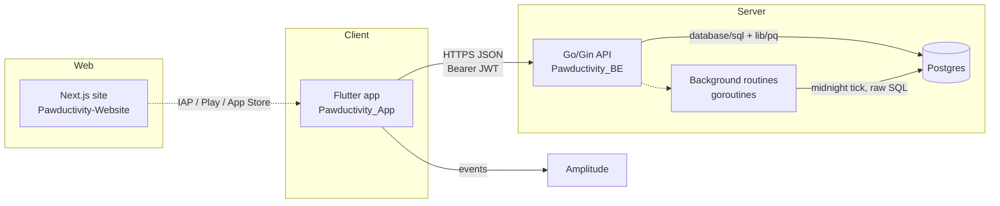
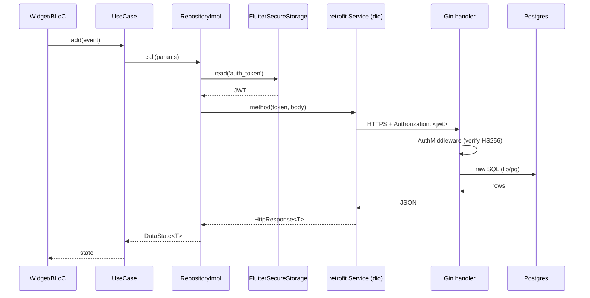
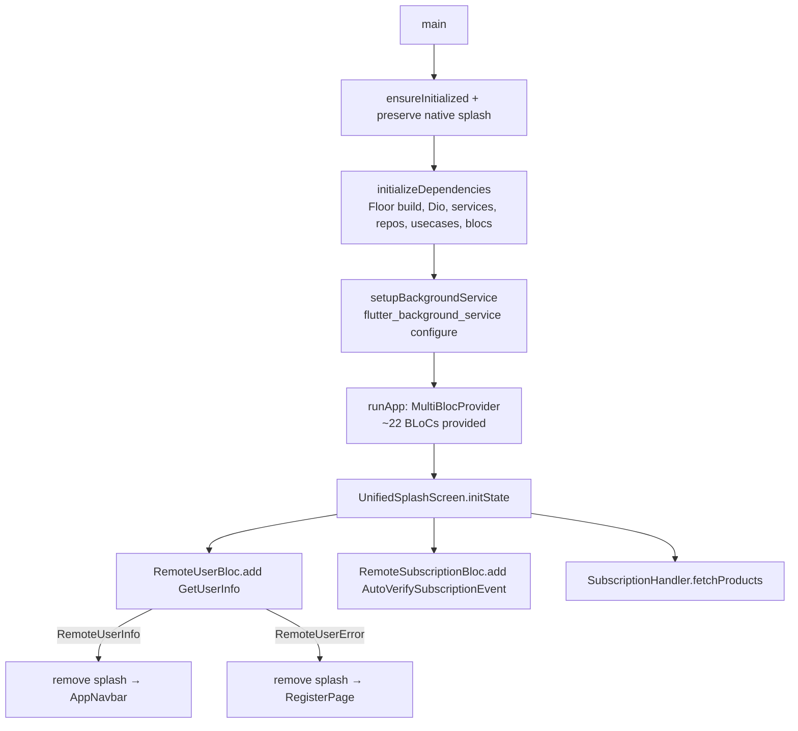

# Legacy Architecture Overview

> **Status: LEGACY REFERENCE — describes the system being replaced.**
> Everything on this page documents the *old* implementation under `old/`. It exists so the
> rebuild team understands what was where before porting. Nothing here is a target design; treat
> every "how it works today" statement as a snapshot of code we are moving away from.
>
> **Tagging** — each rule/decision is tagged for the port:
> `[PRESERVE]` keep the behavior · `[CHANGE]` keep intent, change mechanism ·
> `[NEW]` add in rebuild · `[DROP]` remove · `[DECIDE]` open question for the product owner.
>
> **Provenance note:** The conventions file and the three deep-analysis finding JSONs named in
> this file's task brief were not present on disk at authoring time (their paths resolved to
> `undefined`, and `context/`, `.claude/skills/` were empty scaffolds). This document was therefore
> written directly against the legacy source under `old/`, with every cited constant verified in
> code. See the closing "Sources & verification" section. When the conventions/manifest land, the
> cross-links and vocabulary here should be reconciled against them.

---

## 1. The three repositories

Pawductivity legacy ships as three independent repos, all rooted under `old/`:

| Repo | Path | Stack | Role |
|---|---|---|---|
| **Flutter app** | `old/Pawductivity_App/` | Flutter/Dart 3.3.4, BLoC, get_it, Floor, retrofit+dio | The product. iOS/Android client; thin over the backend. |
| **Go backend** | `old/Pawductivity_BE/` | Go 1.23, Gin, raw `database/sql`+`lib/pq`, GORM (migrate-only), Postgres | All business logic, auth, IAP webhooks, scheduled routines. |
| **Marketing site** | `old/Pawductivity-Website/` | Next.js 14 (pages router), React 18, Tailwind, Radix UI | Static-ish marketing/legal site. No app data. |



**Key architectural fact for the port:** the app is a *thin client*. Almost no domain rules live in
Dart — the app collects input, attaches a token, calls an endpoint, and renders the response. The
Go backend owns tasks, reminders, coins, pets, food, clothes, membership, referrals, subscriptions,
and the two daily routines. `[CHANGE]` The rebuild's local-first direction inverts this: the client
becomes the source of truth for most user data, so the port must *reconstruct* the business rules
that currently live only in Go repositories/SQL. Those rules are the real deliverable to mine out of
this repo — the Dart layer will teach you almost nothing about them.

---

## 2. Flutter app — clean-architecture layout

Root: `old/Pawductivity_App/lib/`. Structure is feature-first clean architecture.

```
lib/
  main.dart                 # bootstrap + MultiBlocProvider + splash routing
  injection_container.dart  # get_it wiring for the ENTIRE app (single file)
  config/
    constant/               # constant.dart (SERVER_URI), clothes.dart, food.dart, pet.dart
    routes/routes.dart      # onGenerateRoute
    theme/theme.dart
  core/
    resource/data_state.dart  # DataState<T> = DataSuccess | DataFailed(DioException)
    usecase/usecase.dart      # UseCase<Type, Params> base
    amplitude/                # analytics service + setup
  database/app_database.dart  # Floor @Database(version:1)
  theme/app_navbar.dart       # bottom-nav shell
  features/
    <feature>/
      data/
        data_sources/
          remote/   # retrofit @RestApi services (*_api_service.dart)
          local/DAO # Floor DAOs (only some features)
        model/      # json_serializable + Floor @Entity models
        repository/ # *_repository_impl.dart  (reads token, calls service, maps to DataState)
      domain/
        entities/   # plain entities
        repository/ # abstract repository contracts
        usecase(s)/ # one class per action
      presentation/
        bloc/       # flutter_bloc BLoCs (mostly "Remote*")
        pages/      # screens
        widgets/    # UI
        handlers/ managers/ styles/ utils/  # feature-local helpers
      background/   # (task only) foreground service entrypoints
```

### Features present

`clothes`, `coin`, `food`, `pet`, `premium`, `summary`, `task`, `user`. (`old/Pawductivity_App/lib/features/`)

`[PRESERVE]` The feature decomposition is sound and maps cleanly onto the rebuild skill set
(`task-quest-system`, `pet-companion-system`, `coin-economy-and-shop`, `food-and-feeding`,
`clothes-and-wardrobe`, `premium-and-monetization`, `analytics-and-insights` ≈ `summary`,
`account-and-profile` ≈ `user`). `[CHANGE]` The `data/data_sources/remote` layer is where the port
diverges most: retrofit services become local repositories / sync adapters.

### Layer conventions (as-built)

| Layer | Pattern | Example |
|---|---|---|
| Remote data source | retrofit `@RestApi(baseUrl: SERVER_URI)` abstract class, `dio` transport | `features/task/data/data_sources/remote/task_api_service.dart` |
| Repository impl | reads `auth_token` from `FlutterSecureStorage`, passes it as `@Header('Authorization')`, wraps result in `DataState<T>` | `features/task/data/repository/task_repository_impl.dart` |
| Domain use case | thin `UseCase<ReturnT, Params>` calling one repository method | `features/task/domain/usecase/*` |
| BLoC | `Remote*Bloc`, injected use cases, emits states | `features/task/presentation/bloc/remote_task_bloc.dart` |

`[PRESERVE]` `DataState<T>` (`core/resource/data_state.dart`) is the app's error envelope:
`DataSuccess(data)` / `DataFailed(DioException)`. `[CHANGE]` In a local-first world the error type
should stop being `DioException` — that couples the domain layer to the HTTP client. `[DECIDE]`
Whether to keep a `DataState`-style result type or move to a different error model.

---

## 3. App ↔ backend split (thin client)

The contract is plain HTTPS JSON. Every authenticated call attaches the JWT manually per request.



**Where the logic lives**

| Concern | Legacy location | Port implication |
|---|---|---|
| Task/reminder CRUD, versioning, checklist rollup | Go `internal/repository/task.repository.go` (raw SQL, `WITH current_version` CTEs, `daily_logs` joins) | `[CHANGE]` Reconstruct locally. The completion rule (`timeCompleted >= estimatedTime`) is computed in SQL, not Dart. |
| Coin balance / purchases | Go `purchase.*`, `user coins` endpoints | `[CHANGE]` becomes local economy. |
| Pet health decay | Go routine (see §7) | `[CHANGE]` client-side timer/tick. |
| Membership downgrade | Go routine | `[CHANGE]` client-side + store receipt. |
| Auth / JWT issue+verify | Go `auth.controller.go` + `jwtMiddleware.go` | `[DECIDE]` local-first auth story. |
| IAP verification / webhooks | Go `premium`/`subscription` controllers | `[PRESERVE]` intent (server still needed for receipt validation). |

`[PRESERVE]` The app never talks to Postgres directly and holds no schema knowledge beyond the JSON
models — good boundary. `[DROP]` The per-call manual token threading (`token!` bang everywhere) is a
smell to remove in the rebuild.

---

## 4. DI wiring & its quirks (`injection_container.dart`)

One 252-line file registers the whole graph via `get_it` (`final sl = GetIt.instance`). Order:
`AppDatabase` (Floor) → `Dio` → API services → repositories → use cases → BLoCs. Services/repos/
use cases are `registerSingleton`; BLoCs are `registerFactory`.
(`old/Pawductivity_App/lib/injection_container.dart`)

### Quirk 1 — Dual old/new task stacks coexist `[DROP]`

Two complete, parallel task stacks are registered and both are provided to the widget tree:

| Old stack | New stack |
|---|---|
| `TaskApiServiceOld` | `TaskApiService` |
| `TaskRepositoryOld` / `TaskRepositoryImplOld` | `TaskRepository` / `TaskRepositoryImpl` |
| `AddTaskUseCaseOld`, `GetAllTaskUseCase`, `UpdateTaskProgressUseCaseOld`, `UpdateTaskUseCaseOld`, `DeleteTaskUseCaseOld`, `GetAllActivityUseCase` | `AddTaskUseCase`, `UpdateTaskUseCase`, `AddReminderUseCase`, `UpdateReminderUseCase`, `DeleteTaskUseCase`, `DeleteReminderUseCase`, `GetScheduledEntriesUseCase`, `GetTaskTemplateByIdUseCase`, `GetReminderTemplateByIdUseCase`, `GetCalendarMonthDataUseCase`, `UpdateTaskProgressUseCase`, `CompleteReminderTaskUseCase`, `GetOverviewUsecase`, … |
| `RemoteTaskBlocOld` | `RemoteTaskBloc`, `RemoteCalendarBloc`, `RemoteProgressBloc`, `RemoteCompleteReminderBloc`, `RemoteOverviewBloc` |

Both hit the **same** backend paths (`/api/task`, `/api/task/progress`) but with different payload
shapes: the old service uses untyped `Map<String,dynamic>` / `Map<String,List<TaskModel>>`
(`task_api_service_old.dart`), the new service uses typed template + scheduled-entry models
(`task_api_service.dart`, which also adds `/api/reminders/*`, `/api/calendar`, `/api/task/{id}/summary`).
This is a half-finished migration frozen in place. `[DROP]` The rebuild ports the **new** task model
(templates + scheduled entries + reminders + daily progress); the old stack is dead weight — do not
carry it forward. `[DECIDE]` Confirm no screen still depends on `RemoteTaskBlocOld` before deleting.

### Quirk 2 — Single, interceptor-less Dio `[CHANGE]`

```dart
sl.registerSingleton<Dio>(Dio());   // injection_container.dart:129
```

One bare `Dio()` instance is shared by every retrofit service. Consequences:
- **No interceptors** — no auth interceptor, no logging, no retry, no refresh-on-401. Each
  repository re-reads the token from secure storage and passes it as a header by hand.
- **No base options / timeouts** configured centrally; `baseUrl` comes from the retrofit annotation.
- **No token-refresh flow** — an expired JWT surfaces as a raw 401 `DioException` per call.

`[CHANGE]` A rebuild that still speaks to a server should centralize auth/logging/retry in one
interceptor (or a typed client) instead of threading `token!` through every method.

### Quirk 3 — Hardcoded `SERVER_URI` `[CHANGE]`

```dart
const SERVER_URI = "https://fcfcvrer.pawductivity.id";   // config/constant/constant.dart
```

A single compile-time constant is the base URL for *all* retrofit services (`@RestApi(baseUrl: SERVER_URI)`).
No dev/staging/prod switching, no `--dart-define`, no env file. `[CHANGE]` Externalize per-environment
config in the rebuild.

### Quirk 4 — Multi-arg constructors wired positionally `[PRESERVE]`

BLoCs take long positional `sl()` lists, e.g.
`RemoteTaskBloc(sl(), sl(), sl(), sl(), sl(), sl(), sl(), sl(), sl(), sl(), sl())` (11 deps) and
`RemoteUserBloc(...)` (8 deps). Works, but brittle to reorder. `GOauthRepositoryImpl(sl(), sl())`
takes two deps (service + a second dependency). `[PRESERVE]` The get_it approach is fine; `[DECIDE]`
whether to keep hand-wired positional injection or adopt codegen/named registration.

---

## 5. Local persistence — Floor (SQLite)

`old/Pawductivity_App/lib/database/app_database.dart`:

```dart
@Database(version: 1, entities: [TaskModel, FoodModel, PetModel, UserModel])
abstract class AppDatabase extends FloorDatabase {
  TaskDao get taskDao;
  PetDAO get petDao;
  FoodDao get foodDao;
  UserDao get userDao;
}
```

Built once at bootstrap: `$FloorAppDatabase.databaseBuilder('app_database.db').build()`.

`[PRESERVE]` intent · `[CHANGE]` scope. Notable facts for the port:
- Only **4** entities are locally persisted (task, food, pet, user), and only the old task stack
  really uses the DAO — most features are **server-only** with no local cache. Clothes, coin,
  premium, summary, referral have **no** Floor entity.
- `version: 1` with no migrations defined — the local schema never evolved.
- The JWT lives outside Floor, in `FlutterSecureStorage` under key `auth_token`.

This is the single biggest gap the rebuild closes: the legacy app is **online-first with a vestigial
local DB**, not local-first. See the planned `local-first-data-layer` skill and `context/data-model/`
for the target. `[NEW]` A real offline store + sync layer is net-new work with almost no legacy code
to port — the *data shapes* come from the Go models, not from Floor.

---

## 6. App startup / bootstrap flow (`main.dart`)



Sequence (`main.dart:43-121`):
1. `WidgetsFlutterBinding.ensureInitialized()`, preserve native splash.
2. `await initializeDependencies()` — build the entire get_it graph (Floor DB opens here).
3. `await setupBackgroundService()` — configure the Android/iOS foreground service used by the task
   timer (`autoStart: false`; started on demand). `notificationChannelId` / `notificationId` from
   `features/task/background/background_service.dart`.
4. `runApp(MultiBlocProvider(...))` — ~22 `Remote*` BLoCs provided app-wide (user, subscription,
   food, clothes, pet, feed, equip-clothes, task-old, activity, auth, premium, referral, level, task,
   calendar, progress, complete-reminder, overview, goauth, coin, summary).
5. `UnifiedSplashScreen` fires `GetUserInfo` + `AutoVerifySubscriptionEvent` and prefetches IAP
   products; the presence/absence of user info decides `AppNavbar` (logged-in shell) vs `RegisterPage`.

`[PRESERVE]` The "resolve session → route to shell or auth" gate is good UX. `[CHANGE]` `GetUserInfo`
is a **network** call today (needs the server up to boot past splash); local-first should resolve the
session locally and treat the network as a background refresh. `[DECIDE]` Auth/session bootstrap in
the rebuild. `[PRESERVE]` The background-service wiring for the focus timer maps to the
`focus-timer-and-background` skill.

---

## 7. Go backend — shape & server routines

Entry: `old/Pawductivity_BE/cmd/main.go`. Layout:

```
cmd/main.go                     # boot: migrate → start routines → configure Gin → mount route groups
database/
  connector.go                  # raw *sql.DB singleton (lib/pq), lazy, mutex-guarded
  migration/migration.go        # GORM AutoMigrate ONLY (schema definition)
  migration/model/*.model.go    # GORM structs = schema source of truth (~20 tables)
internal/
  controllers/                  # Gin handlers (one file per domain)
  repository/                   # raw database/sql queries (the real business logic)
  models/                       # request/response DTOs
  middleware/                   # jwtMiddleware.go, rateLimiter.go (rate limiter is commented out)
  routines/                     # decreasePetHealth, checkMembership (goroutines)
  utils/                        # decrypt.utils.go (IAP payloads)
routes/                         # route-group registration per domain
```

### Persistence: GORM for migrate, `database/sql` for runtime `[PRESERVE-as-note]`

A deliberate split worth calling out because the task brief says "GORM/Postgres":
- **Schema** is defined by GORM structs and applied with `db.AutoMigrate(...)` in
  `migration.go` (two batches; ~20 models incl. `User, Membership, Achievement, UserAchievement,
  Pet, Animal, Food, Purchases, Wardrobe, Clothes, Orders, Verification, Task, TaskLog,
  Subscription, ArchivedSubscription, Checklist, Reminder, PetUsage, DailyLog`).
- **Runtime queries** do **not** use GORM. Every repository uses raw `*sql.DB` from
  `database.GetInstance()` with hand-written SQL and `lib/pq` (e.g. `task.repository.go` uses CTEs,
  `$1` params, `pq` arrays). GORM is essentially a migration tool here.

`[CHANGE]` For the data-model port, **read the GORM models for the schema and the raw SQL for the
behavior** — the interesting rules (task versioning via `WITH current_version`, completion via
`timeCompleted >= estimatedTime`, checklist rollups, tag summaries, pet-usage) live in the SQL
strings, not in any ORM abstraction. Connection pool is fixed at `MaxOpen=25, MaxIdle=25,
ConnMaxLifetime=1m` (`connector.go`).

### Routing & auth

`main.dart`... in `main.go`, route groups are mounted under `/` and `/api`; most `/api` groups apply
`middleware.AuthMiddleware`, but **note the exceptions**: `food`, `animalPet`, and `clothing` groups
are mounted **without** auth, and the premium `/premium/webhook` is under the webhook group.
CORS is wide open (`AllowAllOrigins: true`). The rate limiter exists but is commented out in
`main.go` (`// router.Use(middleware.RateLimiter())`).

`[DROP]`/`[CHANGE]` **Security debt to not reproduce:**
- JWT is signed/verified with a hardcoded key `[]byte("secret")` in `jwtMiddleware.go` (both
  `AuthMiddleware` and `CheckTokenValid`). `[DROP]` — never port the literal secret.
- `AuthMiddleware` returns `nil, nil` from the keyfunc on a bad signing method (relying on a later
  error) and stores only `claims["id"]` in the Gin context.
- Public catalog endpoints (foods/animals/clothes) are unauthenticated by design; `[DECIDE]` whether
  that's intended for the rebuild's shop.

### Server routines (cron-less goroutines) `[CHANGE]`

Two long-lived goroutines started in `main.go` (`go routines.DecreasePetHealth()`,
`go routines.CheckMembership()`). Both use the same "sleep until next local midnight, then act,
loop" pattern:

| Routine | File | Action at midnight |
|---|---|---|
| Pet health decay | `decreasePetHealth.routine.go` | `UPDATE pet SET health = health - 1 WHERE health > 0` (in a tx) |
| Membership downgrade | `checkMembership.routine.go` | `UPDATE membership SET class='basic' WHERE class='premium' AND membership_expired_date <= NOW()` |

`[CHANGE]` These are the clearest "server owns the game clock" behaviors. In a local-first rebuild
they become **client-evaluated** rules (compute decay/expiry from timestamps on read, or on a local
daily tick) so the app works offline. Capture the exact decrement (`-1/day`, floored at 0) and the
premium→basic expiry rule as `[PRESERVE]`-intent business rules even though the mechanism is `[CHANGE]`.

---

## 8. Backend API surface (endpoint map)

All handlers live in `internal/controllers/`, registered in `routes/`. Grouped map (paths relative
to host; `/api` prefix applied at group mount). ✅ = auth required, ⚠️ = no auth middleware.

| Domain | Endpoints | Auth |
|---|---|---|
| **default** | `GET /` (hello world) | ⚠️ |
| **auth** | `POST /login`, `/register`, `/token`, `/verify`, `/reset-password`, `/change-password`, `/google-sign-in` | ⚠️ (public by design) |
| **user** | `GET /users`, `/user`, `/user/:id`, `/user/coins`, `/user/level`, `/user/level/:id`; `PUT /user`, `/user/:id`; `PATCH /user/profile`; `DELETE /user`, `/user/:id` | ✅ |
| **task** | `GET /task`, `/task/:id`, `/task/:id/summary`, `/calendar`, `/task/year/:year/month/:month/checklist`, `/task/activity`, `/task/pet-usage`, `/task/tag-summary`, `/task/timeline`, `/activity`; `POST /task`; `PUT /task`, `/task/progress`; `DELETE /task/:id` | ✅ |
| **reminders** | `POST/PUT/PATCH /reminders`, `GET /reminders/:id`, `DELETE /reminders/:reminderId` | ✅ |
| **animal/pet** | `GET /animals`, `/animal/:id`, `/pets`, `/pet/:id`; `POST /animal`, `/pet/:id/feed`; `PATCH /pet/:id` | ⚠️ (mounted without auth) |
| **food** | `GET /foods`, `/food/:id`, `/inventory/food`, `/inventory/food/:id` | ⚠️ |
| **clothing** | `GET /clothes`, `/clothes/:id`, `/wardrobes`; `POST /wardrobe` | ⚠️ |
| **purchase** | `POST /purchase/food`, `/purchase/pet`, `/purchase/coin`, `/purchase/wardrobe` | ✅ |
| **membership** | `GET /membership`; `POST /membership/:id` | ✅ |
| **referral** | `POST /referral/use`; `GET /referral/users` | ✅ |
| **premium** | `POST /premium/1-month`, `/premium/6-month`, `/premium/1-year`, `/premium/webhook` | ✅ (webhook via webhook group) |
| **subscription** | `GET /subscription/verify`; `POST /subscription/purchase` | ✅ |

`[CHANGE]` This surface is the functional spec for the rebuild's feature set. Most read endpoints
(`/foods`, `/clothes`, `/pets`, `/task/*`) become local reads; write/economy/IAP endpoints are the
ones that plausibly still need a server. `[DECIDE]` Which of these survive as remote calls vs. move
fully local.

---

## 9. Marketing site (`Pawductivity-Website`)

Next.js 14 **pages router** (not app router). Static marketing + legal content; **carries no app
data and does not call the backend**.

- Pages: `index`, `about-us`, `features`, `faq`, `contact-us`, `feedback-form`, `privacy-policy`,
  `terms-conditions`, `thankyou`, `404` (`pages/`). Only stub API route is `pages/api/hello.ts`.
- Content lives in `lib/data.ts`; UI uses Radix primitives + Tailwind + `embla-carousel` +
  `lottie-react` for a hero animation (`assets/lottie-kucing.json`).
- Ships `Dockerfile`, `Dockerfile.production`, `Jenkinsfile`, `sitemap.xml`, `robots.ts`.

`[PRESERVE]` Effectively decoupled — it can ship/deploy independently of the app rebuild. `[DECIDE]`
Whether the rebuild touches the site at all (likely out of scope for the app port).

---

## 10. Cross-cutting: analytics, IAP, notifications

| Concern | Legacy mechanism | Location | Port tag |
|---|---|---|---|
| Analytics | Amplitude via `AnalyticsService(amplitude)`, registered in DI | `core/amplitude/`, `injection_container.dart:146` | `[DECIDE]` keep Amplitude? |
| IAP | `in_app_purchase` + `SubscriptionHandler().fetchProducts()`, server-side verify via `/subscription/*`, `/premium/*`, webhook + `decrypt.utils.go` | app `features/premium`, BE `subscription`/`premium` | `[PRESERVE]` intent (receipt validation needs a server) |
| Notifications / focus timer | `flutter_local_notifications` + `flutter_background_service` foreground service | `features/task/background/` | `[PRESERVE]` → `focus-timer-and-background`, `notifications-and-permissions` |
| Secrets in client | `encrypt` package + `flutter_secure_storage` (`auth_token`) | app-wide | `[CHANGE]` review for local-first auth |

---

## 11. Port cheat-sheet (what was where)

| I need the truth about… | Read this in `old/` |
|---|---|
| Task/reminder rules, versioning, completion, checklist, tag summary, pet-usage | `Pawductivity_BE/internal/repository/task.repository.go` (+ `reminder.repository.go`) |
| DB schema (all tables) | `Pawductivity_BE/database/migration/model/*.model.go` |
| Which fields the app sends/receives | app `features/*/data/model/*` + BE `internal/models/*` |
| Endpoint list & auth | `Pawductivity_BE/routes/*.route.go`, `cmd/main.go` |
| Daily game-clock rules (pet decay, membership expiry) | `Pawductivity_BE/internal/routines/*.routine.go` |
| Coin/economy & shop | BE `purchase.*`, `user coins`; app `features/coin`, `features/food`, `features/clothes` |
| Auth/JWT | BE `internal/controllers/auth.controller.go`, `internal/middleware/jwtMiddleware.go` |
| App boot & DI graph | app `lib/main.dart`, `lib/injection_container.dart` |
| Local cache (limited) | app `lib/database/app_database.dart` + `features/*/data/data_sources/local/DAO` |

---

## 12. Cross-links

> These point at planned siblings in the rebuild knowledge base (per the intended manifest). Some
> targets were still empty scaffolds at authoring time — reconcile when they land.

- **Data model / persistence port:** `context/data-model/` and the `local-first-data-layer` skill
  (`.claude/skills/local-first-data-layer/`) — this doc's §5 and §7 feed those.
- **Migration strategy:** `context/migration/` and `.claude/skills/legacy-migration-guide/`.
- **Feature specs** (business rules mined from the Go repositories referenced here):
  `.claude/skills/task-quest-system/`, `pet-companion-system/`, `coin-economy-and-shop/`,
  `food-and-feeding/`, `clothes-and-wardrobe/`, `premium-and-monetization/`,
  `focus-timer-and-background/`, `notifications-and-permissions/`, `analytics-and-insights/`,
  `account-and-profile/`, `referral-system/`, `gamification-xp-levels/`.
- **Product overview:** `.claude/skills/pawductivity-overview/`.

---

## Sources & verification

All statements verified against the following legacy files (paths under `old/`):

- App bootstrap/DI/config: `Pawductivity_App/lib/main.dart`, `lib/injection_container.dart`,
  `lib/config/constant/constant.dart`, `lib/database/app_database.dart`,
  `lib/core/resource/data_state.dart`, `lib/features/task/background/setup_background_service.dart`,
  `pubspec.yaml`.
- App task stacks (dual): `lib/features/task/data/data_sources/remote/task_api_service.dart`,
  `.../task_api_service_old.dart`, `lib/features/task/data/repository/task_repository_impl.dart`.
- Backend: `Pawductivity_BE/cmd/main.go`, `database/connector.go`, `database/migration/migration.go`,
  `internal/middleware/jwtMiddleware.go`, `internal/routines/decreasePetHealth.routine.go`,
  `internal/routines/checkMembership.routine.go`, `internal/repository/task.repository.go`,
  `routes/*.route.go`, `go.mod`.
- Website: `Pawductivity-Website/package.json`, `pages/*`, `lib/data.ts`.

**Verified constants:** `SERVER_URI = "https://fcfcvrer.pawductivity.id"`; single `Dio()` singleton
with no interceptors; Floor `@Database(version: 1, entities: [TaskModel, FoodModel, PetModel,
UserModel])`; JWT key literal `"secret"`; pet decay `health - 1` floored at 0; membership downgrade
`premium → basic` on `membership_expired_date <= NOW()`; SQL pool `MaxOpen/MaxIdle = 25`,
`ConnMaxLifetime = 1m`; GORM used only for `AutoMigrate`, runtime queries via `database/sql`+`lib/pq`.

**Caveat:** The conventions/manifest file and the three finding JSONs assigned for this file were
absent (resolved to `undefined`); vocabulary and cross-link targets here are best-effort and should
be reconciled once those inputs exist.
