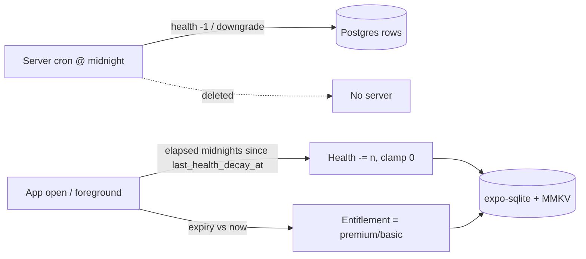

# Legacy Backend API Catalog & Server Routines

> The complete legacy REST surface (Go/Gin + Postgres) as an internalization checklist: every endpoint mapped to its local-first replacement and change tag, plus the two nightly server routines with exact SQL and their on-device equivalents.

This is the **"delete the server" checklist** for the rebuild. The new app is 100% local-first (expo-sqlite + react-native-mmkv + Zustand); there is **no backend**. Every row below must resolve to a local mechanism (SQLite query, MMKV/Zustand state, on-device computation, native store SDK) or an explicit product decision. Tags per conventions §3: [PRESERVE] / [CHANGE] / [NEW] / [DROP] / [DECIDE].

## How the legacy server was wired

Go/Gin monolith over Postgres (raw `database/sql` in the repository layer + a few stored procedures). Controllers are thin; almost all business logic is raw SQL in `internal/repository/*` (legacy: `Pawductivity_BE/cmd/main.go`).

Route groups and their auth posture (legacy: `Pawductivity_BE/cmd/main.go:68-116`):

| Router group | Prefix | Auth | Contents |
|---|---|---|---|
| default | `/` | none | health check `GET /` |
| auth | `/` | none | login, register, token, verify, reset/change password, google-sign-in |
| webhook | `/api` | **none** | Midtrans webhook (public by design — an exploit, see below) |
| food / animalPet / clothing catalog | `/api` | **per-route** | public catalog reads; inventory/pet/wardrobe writes carry `AuthMiddleware` inline |
| premium, user, task, reminder, purchase, membership, referral, subscription | `/api` | `AuthMiddleware` on the whole group | all gameplay + account + payment endpoints |

**Auth mechanism (all [DROP]):** JWT HS256 with a **hardcoded literal secret `"secret"`** in both the middleware and the login controller; token claims `{id, email, exp}`, `exp = now + 744h` (31 days). Passwords travel AES-CBC-encrypted (shared env `AES_KEY`/`AES_VI`, PKCS7), decrypted server-side, then bcrypt-compared (legacy: `Pawductivity_BE/internal/middleware/jwtMiddleware.go`, `internal/controllers/auth.controller.go`, `internal/utils/decrypt.utils.go`). The whole identity/credential stack is deleted for a single-device local profile.

**CORS:** `AllowAllOrigins = true`, methods GET/POST/DELETE/PUT/OPTIONS (legacy: `cmd/main.go:34-38`). **Rate limiter:** `rate.NewLimiter(5, 10)` per-IP is defined but **never wired** (the `router.Use(middleware.RateLimiter())` line is commented out at `cmd/main.go:40`) → no rate limiting is active. Both are **[DROP]** — N/A with no network surface.

> Legacy security posture is broadly broken (forgeable JWTs, IDOR on user routes, an unauthenticated premium webhook, a free-coins endpoint, uncapped referral rewards). None of it survives. Full list in [known-bugs-and-antipatterns.md](./known-bugs-and-antipatterns.md).

---

## Endpoint catalog by domain

Legend — **Auth**: 🔓 public / 🔒 JWT required. **Local**: the new-app mechanism + tag.

### 1. Auth & session — all [DROP]

Root-group routes, no `/api` prefix, no JWT (legacy: `routes/auth.route.go`, `internal/controllers/auth.controller.go`, `internal/controllers/users.controller.go`).

| Method | Path | Purpose | Auth | Key request → response | Local-first replacement |
|---|---|---|---|---|---|
| POST | `/login` | Authenticate, mint JWT | 🔓 | `{email/name, password(AES)}` → `{token}` | No login. Single local profile on first launch. **[DROP]** |
| POST | `/register` | Consume verification code, create user (+ basic membership, referral code, free Cat, **200 free coins**) | 🔓 | `{code}` → `{name, email, referral}` | Instant local profile row in SQLite; seed starting inventory in code. **[DROP]** (server flow) / see [DECIDE] on starting balance |
| POST | `/verify` | Store 4-digit code (15-min TTL), email it via SMTP | 🔓 | `{email, name, password(AES)}` → `{message}` | No email ownership to prove locally. **[DROP]** |
| POST | `/token` | Validate/refresh a token | 🔓 | `{token}` → `{valid}` | No tokens. **[DROP]** |
| POST | `/reset-password` | Send reset code | 🔓 | `{email}` → `{message}` | No passwords. **[DROP]** |
| POST | `/change-password` | Set new password from code | 🔓 | `{email, code, password(AES)}` → `{message}` | No passwords. **[DROP]** |
| POST | `/google-sign-in` | Upsert user by email (creates with empty password), mint JWT | 🔓 | `{email, name}` → `{token, referral_code}` | Only relevant if cross-device sync becomes a requirement. **[DROP]** for MVP / **[DECIDE]** if sync wanted |

SMTP dependency (gomail, `smtp.hostinger.com:465` SSL) for verification / reset / confirmation emails → **[DROP]** entirely.

### 2. User & profile

Legacy: `routes/users.route.go`, `internal/controllers/users.controller.go`, `internal/repository/user.repository.go`. Note the **IDOR**: the `:id` path variant overrides the JWT identity with **no ownership check** — any authenticated user can read/update/delete any user. `GET /api/users` returns **all** users. No admin role exists. All of that collapses to "there is exactly one local profile."

| Method | Path | Purpose | Auth | Key fields | Local-first replacement |
|---|---|---|---|---|---|
| GET | `/api/users` | List **all** users (no admin gate) | 🔒 | → `[user]` | N/A — single profile. **[DROP]** |
| GET | `/api/user` / `/api/user/:id` | Get user by JWT id / by path id (IDOR) | 🔒 | → `{id, name, email, coins, level, user_image, class, premiumExp, profile_index}` | `SELECT` the single `profile` row. **[CHANGE]** |
| PUT | `/api/user` / `/api/user/:id` | Update user (IDOR) | 🔒 | `{name, email, …}` | Local `UPDATE profile`. **[CHANGE]** |
| DELETE | `/api/user` / `/api/user/:id` | Delete user (IDOR) | 🔒 | — | "Reset app / delete data" local action. **[CHANGE]** |
| GET | `/api/user/coins` | Current coin balance | 🔒 | → `{coins}` | Zustand coin store (mirrors `profile.coins` in SQLite). **[CHANGE]** |
| GET | `/api/user/level` / `/api/user/level/:id` | Level + XP (IDOR on `:id`) | 🔒 | → `{level, current_xp, needed_xp}` | Local read; XP/level math client-side (see gamification). **[CHANGE]** |
| PATCH | `/api/user/profile` | Update avatar (`userImage`, `profile_index`) | 🔒 | `{profile_index / userImage}` | Local `UPDATE profile`. **[CHANGE]** |

XP/level are columns on `users` (not a separate table): `current_xp` default 0, `needed_xp` default 150, `level` default 1. Note: `current_xp`/`needed_xp` are **not** on the `/user` DTO — they come only from `/user/level` (the `LevelInfo` DTO; legacy: `internal/models/user.go`, `user.repository.go:86-98`). `/user` is also a **premium-status read**: `class` + `premiumExp` are how the client learns membership status (legacy: `user.repository.go:63-84`), alongside `/subscription/verify`. Reward math and the 150-vs-160 seed inconsistency are documented in the task section. See [account-and-profile SKILL](../../.claude/skills/account-and-profile/SKILL.md) and [gamification-xp-levels SKILL](../../.claude/skills/gamification-xp-levels/SKILL.md).

### 3. Task / quest

Legacy: `routes/task.route.go`, `internal/controllers/task.controller.go`, `internal/repository/task.repository.go`. Tasks are stored in **seconds** with `CHECK (estimatedTime > 600)` (must exceed 10 min) and an **immutable versioning** scheme (edits close the old row `dueDate = now()` and insert `version + 1`).

| Method | Path | Purpose | Auth | Key fields | Local-first replacement |
|---|---|---|---|---|---|
| GET | `/api/task` | List tasks (UNION of two subqueries; can duplicate repeating rows) | 🔒 | → `[task]` | `SELECT` from local `task`. **[CHANGE]** |
| GET | `/api/task/:id` | One task; returns `rewardCoins = FLOOR(estimatedTime/60/3)` for **display** | 🔒 | → `{task, rewardCoins}` | Local read; **reconcile reward display vs grant** (bug). **[CHANGE]** |
| GET | `/api/task/:id/summary` | 7-day summary for a task | 🔒 | → `{summary}` | SQLite aggregate over `daily_logs`. **[CHANGE]** |
| POST | `/api/task` | Create task | 🔒 | `{taskName, description, estimatedTime(s), dueDate, taskTag, repetition[7]}` | Local `INSERT`. **[CHANGE]**; also fed by the new **Brain Dump Parser** **[NEW]** |
| PUT | `/api/task` | Edit → close old version, insert `version+1` | 🔒 | `{id, …}` | Local versioned insert (preserve immutable history). **[PRESERVE]** concept / **[CHANGE]** impl |
| DELETE | `/api/task/:id` | Delete latest version (ON DELETE CASCADE destroys `task_log`/`daily_logs` history) | 🔒 | — | Local delete; **[DECIDE]** whether to soft-delete to keep history |
| PUT | `/api/task/progress` | **Core loop**: accumulate progress, grant XP + coins on first completion, log pet usage | 🔒 | `{taskId, incrementTime(s), petId}` | Pure client transaction (see Core-loop flow below). **[CHANGE]** |
| GET | `/api/calendar` | Tasks + reminders in `[monthStart-7d, monthEnd+7d]` | 🔒 | `?month&year` → `{calendarMonthData}` | SQLite date-range query. **[CHANGE]** |
| GET | `/api/task/year/:year/month/:month/checklist` | Per-month checklist day-status array | 🔒 | → `{date[]}` | SQLite / derived from logs. **[CHANGE]** |
| GET | `/api/task/activity` | 7-day activity window (`generate_series now-6d..now`) | 🔒 | → `[{date, …}]` | Recursive CTE or client day-array + SQLite. **[CHANGE]** |
| GET | `/api/task/pet-usage` | Hours a pet was "used" focusing (`SUM(hoursUsed)/3600`; column stores **seconds**) | 🔒 | → `[{petId, totalHours}]` | SQLite over `pet_usages`. **[CHANGE]**; unit is [DECIDE] |
| GET | `/api/task/tag-summary` | Time grouped by `taskTag` (7-day) | 🔒 | → `[{tag, …}]` | SQLite `GROUP BY tag`. **[CHANGE]** |
| GET | `/api/task/timeline` | `task_log` bucketed into 2-hour intervals 00:00–22:00 | 🔒 | → `[{bucket, …}]` | SQLite `strftime` buckets. **[CHANGE]** |

Progress is stored in `daily_logs` (UPSERT on `(taskId,userId,version,date)`), accumulating `duration`/`timeCompleted` **capped at `estimatedTime`**; `completed` is derived (`timeCompleted >= estimatedTime`). Each increment also appends to append-only `task_log` and upserts `pet_usages`. See [task-quest-system SKILL](../../.claude/skills/task-quest-system/SKILL.md), [analytics-and-insights SKILL](../../.claude/skills/analytics-and-insights/SKILL.md), [ai-braindump-parser SKILL](../../.claude/skills/ai-braindump-parser/SKILL.md).

### 4. Reminders (calendar/activity)

Legacy: `routes/reminders.route.go`, `internal/controllers/reminders.controller.go`, `internal/repository/reminder.repository.go`. Standalone reminders shown alongside tasks. `reminder_type` ∈ `once|weekly|monthly|yearly` is **stored but never expanded** server-side (no recurrence logic exists).

| Method | Path | Purpose | Auth | Key fields | Local-first replacement |
|---|---|---|---|---|---|
| POST | `/api/reminders` | Create reminder | 🔒 | `{remindername, reminder_description, time, date, reminder_type}` | Local `INSERT` + schedule via **expo-notifications**. **[CHANGE]** |
| GET | `/api/reminders/:id` | Get reminder(s) | 🔒 | → `[reminder]` | Local read. **[CHANGE]** |
| PUT | `/api/reminders` | Edit reminder | 🔒 | `{id, …}` | Local update + reschedule notification. **[CHANGE]** |
| PATCH | `/api/reminders` | Mark complete (`isCompleted = true`) | 🔒 | `{id}` | Local update. **[CHANGE]** |
| DELETE | `/api/reminders/:reminderId` | Delete (ownership-checked; silent no-op on mismatch) | 🔒 | — | Local delete + cancel scheduled notification. **[CHANGE]** |

**[DECIDE]** recurrence semantics: legacy stores `once/weekly/monthly/yearly` but never repeats them; on-device we must actually expand/reschedule recurring reminders. See [reminders-and-calendar SKILL](../../.claude/skills/reminders-and-calendar/SKILL.md), [notifications-and-permissions SKILL](../../.claude/skills/notifications-and-permissions/SKILL.md).

### 5. Pet / animal

Legacy: `routes/animalPet.route.go`, `internal/controllers/animalPet.controller.go`, `internal/repository/animal.repository.go`. Catalog reads are public; pet writes are per-route authed.

| Method | Path | Purpose | Auth | Key fields | Local-first replacement |
|---|---|---|---|---|---|
| GET | `/api/animals` | Purchasable species catalog | 🔓 | → `[{id, name, price, asset, premium}]` | Bundled seed catalog in SQLite / TS. **[CHANGE]** |
| GET | `/api/animal/:id` | One species | 🔓 | → `{animal}` | Local read. **[CHANGE]** |
| POST | `/api/animal` | Create a catalog species (no admin gate) | 🔒 | `{name, price, asset, premium}` | N/A — catalog is a fixed local seed. **[DROP]** |
| GET | `/api/pets` | User's owned pets; builds lottie/clothes asset paths server-side | 🔒 | → `[{id, animalId, petName, health, clothesAsset}]` | Local read; derive asset paths in TS. **[CHANGE]** |
| GET | `/api/pet/:id` | One owned pet | 🔒 | → `{pet}` | Local read. **[CHANGE]** |
| POST | `/api/pet/:id/feed` | Feed: consume cheapest owned food of `foodId`, add `food.stats` capped at 100 | 🔒 | `{foodId}` → `{pet}` | Local transaction (see Feed flow). **[CHANGE]** |
| PATCH | `/api/pet/:id` | Rename pet (`SetPetName`) | 🔒 | `{petName}` | Local `UPDATE pet`. **[CHANGE]** |

Pet health: DB default **100**, `CHECK (health >= 0)`, feeding caps at **100** (`if health + stats > 100 → 100`), decays **−1/day** (routine below). Server-computed asset path strings (`assets/pet/<type>/<type>_<id>.json`, `assets/clothes/<asset>.png`) move client-side; the **[NEW]** dynamic-Lottie feature generates/modifies Lottie JSON on-device via Claude instead of static per-index files. See [pet-companion-system SKILL](../../.claude/skills/pet-companion-system/SKILL.md), [lottie-animation-engine SKILL](../../.claude/skills/lottie-animation-engine/SKILL.md), [ai-lottie-director SKILL](../../.claude/skills/ai-lottie-director/SKILL.md).

### 6. Food & inventory

Legacy: `routes/food.route.go`, `internal/controllers/food.controller.go`, `internal/repository/food.repository.go`. Catalog public; inventory per-route authed. Inventory quantity = row count in `playerFood` (one row per owned item).

| Method | Path | Purpose | Auth | Key fields | Local-first replacement |
|---|---|---|---|---|---|
| GET | `/api/foods` | Food catalog | 🔓 | → `[{id, name, price, stats, asset, premium}]` | Bundled seed catalog. **[CHANGE]** |
| GET | `/api/food/:id` | One food | 🔓 | → `{food}` | Local read. **[CHANGE]** |
| GET | `/api/inventory/food` | Owned food grouped by type (with counts) | 🔒 | → `[{foodId, qty}]` | SQLite `GROUP BY foodId`. **[CHANGE]** |
| GET | `/api/inventory/food/:id` | Owned count of one food | 🔒 | → `{qty}` | Local read. **[CHANGE]** |

See [food-and-feeding SKILL](../../.claude/skills/food-and-feeding/SKILL.md).

### 7. Clothes & wardrobe

Legacy: `routes/clothing.route.go`, `internal/controllers/clothing.controller.go`, `internal/repository/clothing.repository.go`. Catalog public; wardrobe per-route authed. `petClothes` records which wardrobe item is equipped on which pet; a request with `clothesId = -1` means **unequip**.

| Method | Path | Purpose | Auth | Key fields | Local-first replacement |
|---|---|---|---|---|---|
| GET | `/api/clothes` | Cosmetic catalog | 🔓 | → `[{id, name, price, type, asset, premium}]` | Bundled seed catalog. **[CHANGE]** |
| GET | `/api/clothes/:id` | One clothing item | 🔓 | → `{clothes}` | Local read. **[CHANGE]** |
| GET | `/api/wardrobes` | User's owned clothing | 🔒 | → `[wardrobe]` | Local read. **[CHANGE]** |
| POST | `/api/wardrobe` | Equip/unequip on a pet (`GiveToPet`; `clothesId=-1` unequips) | 🔒 | `{petId, wardrobeId/clothesId}` | Local upsert to `petClothes`. **[CHANGE]** |

**[DECIDE]** clothing slots: the enum `clothesType` supports `hat|shirt|pants|shoes`, but **all five seed items are `type='shirt'`** (asset base names `shirt`, `polo_shirt`, `suit`, `emo_shirt`, `dress`) and equip is effectively single-slot — decide whether the rebuild is multi-slot or single-slot cosmetic. See [clothes-and-wardrobe SKILL](../../.claude/skills/clothes-and-wardrobe/SKILL.md).

### 8. Coin economy & purchases

Legacy: `routes/purchase.route.go`, `internal/controllers/purchase.controller.go`, `internal/repository/purchase.repository.go`. `buy_item()` = `UPDATE users coins -= price` + `INSERT purchases(type)`; each purchase (1) reads coins + membership class, (2) reads item price + premium flag, (3) rejects if `coins < price` ("insufficient coins"), (4) rejects if `item.premium && class == 'basic'` ("premium content"), then grants + deducts. `users.coins` has `CHECK (coins >= 0)`.

| Method | Path | Purpose | Auth | Key fields | Local-first replacement |
|---|---|---|---|---|---|
| POST | `/api/purchase/food` | Buy a food item | 🔒 | `{foodId}` | Local transaction: same price/premium checks; `INSERT playerFood`, deduct coins. **[CHANGE]** |
| POST | `/api/purchase/pet` | Buy a pet; also rejects if already owns that `animalId` ("user already have this pet") | 🔒 | `{animalId}` | Local transaction: + no-duplicate-pet rule. **[CHANGE]** |
| POST | `/api/purchase/wardrobe` | Buy a clothing item | 🔒 | `{clothesId}` | Local transaction. **[CHANGE]** |
| POST | `/api/purchase/coin` | **Top up coins** — server-side just `CALL buy_coins(userId, amount)` with **no payment/receipt validation** | 🔒 | `{amount}` | **Free-coins exploit.** No coin IAP in MVP, or a real store SKU. **[DROP]** as-is / **[DECIDE]** if coin IAP is a product |

`buy_coins` stored procedure = `INSERT purchases(userId, amount, 'coins')` + `UPDATE users SET coins = coins + amount` — a **pure grant** reused for the signup grant, task-completion reward, AND `PurchaseCoin`. Referral is the exception: it credits +100 to each party via a direct `UPDATE users SET coins = coins + 100` (legacy: `Pawductivity_BE/internal/repository/referral.repository.go:55-56`) and writes **NO** `purchases` ledger row — worth flagging because the rebuild's signed-ledger "balance = `SUM(delta)`" design assumes every credit hits the ledger. In the rebuild, coin logic is a Zustand store persisted to SQLite; enforce `coins >= 0` in code. See [coin-economy-and-shop SKILL](../../.claude/skills/coin-economy-and-shop/SKILL.md).

### 9. Premium (Midtrans, web/IDR) — [CHANGE]/[DECIDE]

Legacy: `routes/premium.routes.go`, `internal/controllers/premium.controller.go`. Purchase endpoints are authed under `/api`; the **webhook is public**. Product list (IDR): **1MONTH `M-001` = 3000**, **6MONTHS `M-006` = 9000**, **1YEAR `Y-001` = 15000** (legacy: `premium.controller.go` productList).

| Method | Path | Purpose | Auth | Key fields | Local-first replacement |
|---|---|---|---|---|---|
| POST | `/api/premium/1-month` | Create Midtrans Snap order (Rp3000) | 🔒 | → `{snap_token, redirect_url}` | Native store IAP SKU. **[CHANGE]** |
| POST | `/api/premium/6-month` | Create Snap order (Rp9000) | 🔒 | → `{snap_token, redirect_url}` | Native store IAP SKU. **[CHANGE]** |
| POST | `/api/premium/1-year` | Create Snap order (Rp15000) | 🔒 | → `{snap_token, redirect_url}` | Native store IAP SKU. **[CHANGE]** |
| POST | `/api/premium/webhook` | Midtrans callback → extend membership | **🔓** | `{order_id, transaction_status}` | **Exploit**: unauthenticated, signature **not** verified — anyone can POST `{transaction_status:'settlement'}` to grant themselves premium. Disappears with store SDK as source of truth. **[DROP]** |

On `capture`/`settlement` the webhook maps product → months (1/6/12) and calls `ChangeMembership`, which sets `membership_expired_date = (existing > NOW() ? existing : NOW()) + N months` and `class = 'premium'` (extends from the later of now/current expiry). `membership.controller.ChangeMembership` also accepts `?duration=<days>` (default 30, `months = days/30`, min 1). Real payments genuinely need a store (not a self-hosted server): use **react-native-iap / RevenueCat / expo-in-app-purchases**, entitlement cached locally. See [premium-and-monetization SKILL](../../.claude/skills/premium-and-monetization/SKILL.md) and [monetization-options.md](../migration/monetization-options.md).

### 10. Membership

Legacy: `routes/membership.route.go`, `internal/controllers/membership.controller.go`, `internal/repository/membership.repository.go`. One `membership` row per user; premium gates shop items; downgraded nightly by the CheckMembership routine.

| Method | Path | Purpose | Auth | Key fields | Local-first replacement |
|---|---|---|---|---|---|
| GET | `/api/membership` | List **all** memberships (no admin gate — IDOR) | 🔒 | → `[membership]` | N/A — single local membership row. **[DROP]** (bulk) / **[CHANGE]** (self read) |
| POST | `/api/membership/:id` | Extend/change membership (`?duration=<days>`, default 30) | 🔒 | `{duration}` | Locally set by the IAP entitlement, not a manual endpoint. **[CHANGE]** |

Entitlement in the rebuild = "premium iff locally-stored expiry timestamp > now," computed on read (see CheckMembership replacement below). `class` ∈ `basic|premium`.

### 11. Referral — [DECIDE]

Legacy: `routes/referral.route.go`, `internal/controllers/referral.controller.go`, `internal/repository/referral.repository.go`. Each user gets an **8-uppercase-letter** code at signup. Redemption grants **+100 coins to BOTH** owner and redeemer.

| Method | Path | Purpose | Auth | Key fields | Local-first replacement |
|---|---|---|---|---|---|
| POST | `/api/referral/use` | Redeem a code (rejects using your own; +100/+100 coins) | 🔒 | `{code}` | Meaningless without a shared backend. Drop, make cosmetic (no reward), or defer to future sync. **[DECIDE]** |
| GET | `/api/referral/users` | List users who used your code | 🔒 | → `[referral_user]` | N/A locally. **[DROP]** / **[DECIDE]** |

**Bug to not carry over:** the two coin `UPDATE`s share one `err` var (second overwrites the first) and the function returns `nil` regardless; only *same-code* reuse is blocked by the PK, so a user can redeem **unlimited distinct** codes for +100 each. If any local reward survives, add a one-time/idempotency cap. See [referral-system SKILL](../../.claude/skills/referral-system/SKILL.md).

### 12. Google Play subscription — [CHANGE]

Legacy: `routes/subscription.route.go`, `internal/controllers/subscription.controller.go`, `internal/repository/subscription.repository.go`. Package `com.production.pawductivity`, subscription ID `pawductivity_premium`, verified against the Android Publisher API (`androidpublisher/v3`, `service_account.json`).

| Method | Path | Purpose | Auth | Key fields | Local-first replacement |
|---|---|---|---|---|---|
| POST | `/api/subscription/purchase` | Verify `purchaseToken` with Google; `InsertNewSubscription` (archives prior into `archived_subscriptions`) | 🔒 | `{purchaseToken, productId}` | IAP SDK local receipt/entitlement; no androidpublisher server call. **[CHANGE]** |
| GET | `/api/subscription/verify` | Re-check with Google when expired; `UpdateMembership` premium-until-expiry else basic | 🔒 | → `{status, expiry}` | IAP SDK entitlement check on app open. **[CHANGE]** |

**[DECIDE]** server-side receipt validation (anti-fraud) would need a small serverless function, not the old Go server — document honestly in [monetization-options.md](../migration/monetization-options.md).

### 13. Default / misc

| Method | Path | Purpose | Auth | Local-first replacement |
|---|---|---|---|---|
| GET | `/` | Health check (`HelloWorld`) | 🔓 | N/A — no server. **[DROP]** |

---

## Server routines (nightly cron-equivalents)

Both are single **goroutine forever-loops** started at boot (`go routines.DecreasePetHealth()`, `go routines.CheckMembership()` — legacy: `cmd/main.go:24-25`). Each computes the duration until the **next server-local midnight**, sleeps on a `time.NewTimer`, fires, then loops. Shared flaws: **one server timezone for all users**, and **no missed-day catch-up** — if the process is down across several midnights, the mutation runs **once** on restart's next tick, not once per missed day.

### DecreasePetHealth

- **Schedule:** every server-local midnight (legacy: `internal/routines/decreasePetHealth.routine.go`).
- **Exact SQL:**
  ```sql
  UPDATE pet SET health = health - 1 WHERE health > 0;
  ```
- **Effect:** −1 health per day for every pet with `health > 0`, floored at 0 (the `WHERE health > 0` guard + `CHECK (health >= 0)`). No per-user timezone.
- **Local replacement — [CHANGE]:** compute lazily on **app open / foreground** from the `last_health_decay_at` anchor (canonical: per-pet SQLite column; a global MMKV date is the alternative — see [state-and-mmkv](../data-model/state-and-mmkv.md) §5):
  `health = max(0, health − localMidnightsElapsed(last_health_decay_at, now))`, then advance the timestamp. This **fixes the missed-midnight bug** (decrements once per elapsed local midnight, not once total) and the **shared-timezone bug** (uses the device timezone). Optionally schedule a cosmetic local notification via **expo-notifications**, but the authoritative decay is the lazy computation — never trust wall-clock ticks across backgrounding.
- **[DECIDE]:** what happens at `health = 0` — legacy only floors with no consequence (no death, no feature gating). Define the rebuild behavior (sad mood / blocked actions / revive-by-feeding).

### CheckMembership

- **Schedule:** every server-local midnight (legacy: `internal/routines/checkMembership.routine.go`).
- **Exact SQL:**
  ```sql
  UPDATE membership
     SET class = 'basic'::membershipclass
   WHERE class = 'premium'::membershipclass
     AND membership_expired_date <= NOW();
  ```
- **Effect:** downgrades expired premium members to basic each night.
- **Local replacement — [CHANGE]:** no cron. Membership is **premium iff the locally-stored expiry timestamp > now**, computed **on read**. The IAP SDK entitlement is the source of truth; the "downgrade" is just the entitlement lapsing. No daemon, no missed-day problem.



---

## Verified seed catalogs (source of truth for the rebuild)

Verified against `database/script/pawductivity.sql:233-335`. Prices in **coins**; food `stats` = health restored.

| Kind | Item | Price | Extra | Premium |
|---|---|---|---|---|
| Animal | Dog | 100 | `dog_default.json` | no |
| Animal | Cat | 200 | `cat_default.json` (default new-user pet) | no |
| Animal | Rabbit | 200 | `rabbit_default.json` | **yes** |
| Food | Apple | 3 | heal 10 | no |
| Food | Chicken | 3 | heal 10 | no |
| Food | Pizza | 4 | heal 20 | **yes** |
| Food | Watermelon | 4 | heal 10 | no |
| Food | Carrot | 5 | heal 15 | no |
| Clothes | Cyan t-shirt | 15 | type `shirt`, asset `shirt` | no |
| Clothes | Green shirt | 10 | type `shirt`, asset `polo_shirt` | no |
| Clothes | Tuxedo | 20 | type `shirt`, asset `suit` | **yes** |
| Clothes | Star Shirt | 15 | type `shirt`, asset `emo_shirt` | **yes** |
| Clothes | Pink Dress | 20 | type `shirt`, asset `dress` | **yes** |

> Corrections vs conventions §5: **Carrot = 5/15** (not "5/?"), **Pink Dress = 20** (not 15). All five clothes are seeded `type='shirt'` despite the `hat|shirt|pants|shoes` enum. Canonical seed catalog lives in [seed-catalogs.md](../data-model/seed-catalogs.md).

---

## Key flows (the contracts worth preserving)

### Core loop — task progress + reward (`PUT /api/task/progress`)
1. Resolve the latest task `version`.
2. Read `daily_logs.timeCompleted` (0 if none) and `task.estimatedTime`.
3. UPSERT `daily_logs`: `duration`/`timeCompleted += increment`, **capped at `estimatedTime`**.
4. If this increment **first crosses completion** (`prev < estimatedTime <= prev + increment`): `current_xp += estimatedTime/60`; run level-up loop `while xp >= needed { xp -= needed; needed = 10*L² + 50*L + 100; L++ }`; `CALL buy_coins(estimatedTime/60)`.
5. Append a `task_log` row.
6. If `petId == 0` default to `MAX(pet.id)`; UPSERT `pet_usages.hoursUsed += increment`.

**Reward/level bugs to resolve in the rebuild ([DECIDE], per open questions):**
- Coin **display** = `FLOOR(estimatedTime/60/3)` but coins **granted** = `estimatedTime/60` (whole minutes) — they don't match. Pick one canonical formula (recommend: display = grant).
- `needed_xp` seeds at **150** but the formula at level 1 yields **160**, and `neededXP` is recomputed with the *pre-increment* `level` — an off-by-one curve. Seed `needed_xp` from the formula.
- **200 free coins + free Cat** on signup come from misusing `buy_coins` as a grant — define the intended starting inventory deliberately.
- `estimatedTime CHECK > 600` (tasks must exceed 10 min) — keep, or relax for the NLP Brain Dump (which may produce shorter tasks)?

### Feed pet (`POST /api/pet/:id/feed`)
1. Find cheapest owned `playerFood` row of `foodId` + its `food.stats`; error if none owned.
2. Read `pet.health`.
3. Cap `food_stats` so `health <= 100` (`if health + stats > 100 → stats = 100 - health`).
4. `UPDATE pet.health = health + food_stats`.
5. `DELETE` one `playerFood` row (`MIN(id)`).

> Legacy does this as a non-atomic read-modify-write (`SET health = <read value> + stats`) — concurrent feeds race. The local version should do it in a single SQLite transaction / atomic `UPDATE`.

### Buy shop item (`POST /api/purchase/{food|pet|wardrobe}`)
Read coins + class → read price + premium → reject if `coins < price` → reject if `premium && class=='basic'` → (pet only) reject duplicate `animalId` → insert inventory row → `buy_item` (deduct + ledger).

---

## Internalization summary

| Legacy dependency | Fate | Mechanism |
|---|---|---|
| Go/Gin REST layer (all `/api`) | **[DROP]** | Direct expo-sqlite queries; no network |
| JWT + AES + bcrypt + SMTP auth | **[DROP]** | Single local profile; optional device biometric |
| Postgres (GORM + raw SQL + stored procs) | **[CHANGE]** | expo-sqlite tables mirroring the schema |
| `buy_coins` / `level_up` procs | **[CHANGE]** | Client coin/XP logic in Zustand + SQLite |
| DecreasePetHealth cron | **[CHANGE]** | Lazy on-open decay from MMKV timestamp |
| CheckMembership cron | **[CHANGE]** | Entitlement computed on read from stored expiry |
| Midtrans (web/IDR) | **[CHANGE]/[DECIDE]** | Native store IAP; kill the unauth webhook |
| Google Play androidpublisher verify | **[CHANGE]** | IAP SDK local entitlement |
| Referral (cross-user) | **[DECIDE]** | Drop / cosmetic / future sync |
| Amplitude + analytics endpoints | **[DROP]** / local | On-device SQLite aggregate queries |
| Rate limiter + CORS | **[DROP]** | N/A — no network surface |
| Server-built asset path strings | **[CHANGE]** | Derive in TS; **[NEW]** client-side Lottie via Claude |
| Brain Dump NLP task creation | **[NEW]** | Client-side Claude → local task rows |

---

## Related
- [architecture-overview.md](./architecture-overview.md) — how the legacy Flutter + Go + Next.js pieces fit together.
- [known-bugs-and-antipatterns.md](./known-bugs-and-antipatterns.md) — the security/logic bugs enumerated here, consolidated.
- [dead-and-incomplete-features.md](./dead-and-incomplete-features.md) — unwired rate limiter, unused recurrence, broken queries.
- [navigation-map.md](./navigation-map.md) — which client screens called which endpoints.
- [backend-to-local-first.md](../migration/backend-to-local-first.md) — the migration playbook these mappings feed into.
- [monetization-options.md](../migration/monetization-options.md) — store IAP vs serverless receipt validation.
- [entity-relationship.md](../data-model/entity-relationship.md) · [sqlite-schema.md](../data-model/sqlite-schema.md) · [seed-catalogs.md](../data-model/seed-catalogs.md) — the local schema these endpoints map onto.
- [local-first-data-layer SKILL](../../.claude/skills/local-first-data-layer/SKILL.md) · [legacy-migration-guide SKILL](../../.claude/skills/legacy-migration-guide/SKILL.md).
