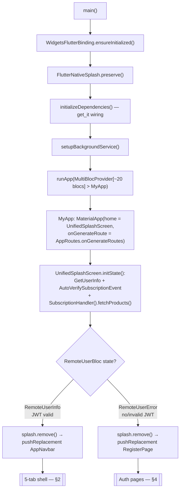
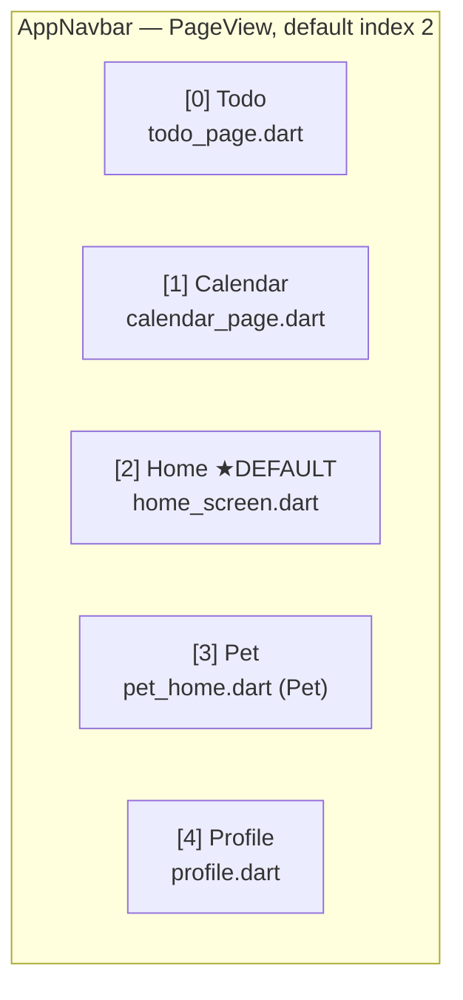
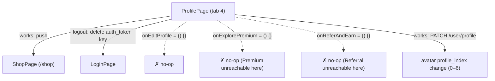
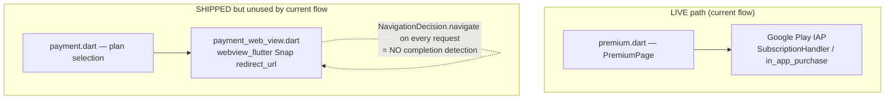
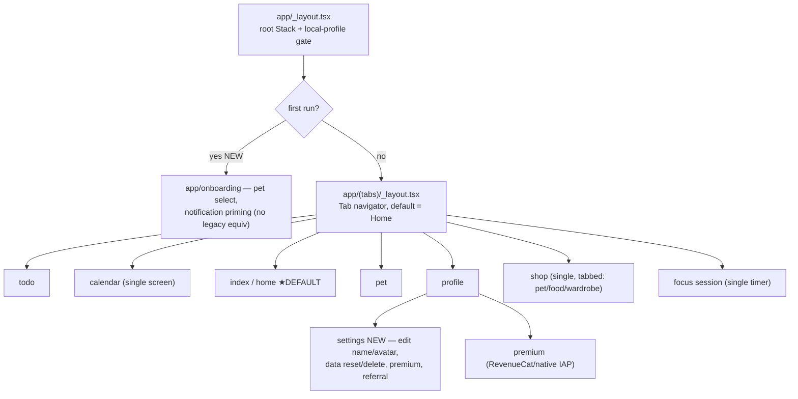

# Legacy Navigation Map

> The complete screen/route graph of the legacy Flutter app — cold-start gate, the 5-tab bottom shell, the named-route table, auth/shop/monetization pages, and every DEAD/duplicate screen the rebuild must NOT port. This is the top-level UX skeleton no per-feature analysis captured.

The legacy app runs **two parallel navigation mechanisms** at once:

1. **A bottom-nav `PageView` shell** (`AppNavbar`) — the real day-to-day UX, 5 tabs, no route names.
2. **A named-route table** (`onGenerateRoute` in `routes.dart`) reached via `Navigator.pushNamed`, PLUS ad-hoc `Navigator.push(MaterialPageRoute(...))` calls scattered across pages.

The rebuild collapses both into **one coherent `expo-router` file tree**. See the "Proposed new navigation" section at the end and the [navigation-and-app-shell skill](../../.claude/skills/navigation-and-app-shell/SKILL.md).

---

## 1. Cold-start & auth gate

`main()` is a linear boot sequence, then a splash screen acts as the auth gate: it fetches `/api/user` with the stored JWT and routes to the tab shell on success or the register page on failure. There is **no dedicated login-vs-authenticated router** — the "gate" is literally *"can I read `auth_token` and call `GetUserInfo`?"*

Verified facts (legacy: `Pawductivity_App/lib/main.dart`):
- Boot order is exactly `ensureInitialized → FlutterNativeSplash.preserve → initializeDependencies() → setupBackgroundService() → runApp`. `[CHANGE]` — the new app boots to a local profile load; no dependency-injection container of network services, no background-service setup at boot.
- On **every cold start** the splash re-verifies the subscription (`AutoVerifySubscriptionEvent`) and re-fetches IAP products (`SubscriptionHandler().fetchProducts()`). `[CHANGE]` → local entitlement cache; re-verify only when needed. See [premium-and-monetization](../../.claude/skills/premium-and-monetization/SKILL.md).
- `RemoteUserInfo` → `AppNavbar` (with a global `appNavbarKey`); `RemoteUserError` → `RegisterPage`. `[DROP]` — the server-JWT auth gate goes away entirely; identity becomes a single on-device profile. See [account-and-profile](../../.claude/skills/account-and-profile/SKILL.md).
- Note the failure landing is **RegisterPage**, not LoginPage — a first launch drops the user straight into sign-up.

---

## 2. The 5-tab bottom shell (`AppNavbar`)

The primary UX skeleton (legacy: `Pawductivity_App/lib/theme/app_navbar.dart`). A `PageView` with a custom `Container` bottom bar of 5 image buttons. **`initialPage: 2` → Home is the default landing tab.** Tabs swipe or tap; there is no per-tab navigation stack (tapping a tab `jumpToPage`s the single `PageView`).

| Idx | Tab | Widget / file | Nav icon | Notes |
|-----|-----|---------------|----------|-------|
| 0 | Todo | `TodoPage` (`todo_page.dart`) | `assets/nav/todo.png` | Task/quest list. |
| 1 | Calendar | `CalendarPage` (`calendar_page.dart`) | `assets/nav/calender.png` | **Different file from the `/calendar` route** — see duplicate warning §6. |
| 2 | **Home** | `HomeScreen` (`home_screen.dart`) | `assets/nav/home.png` | **Default tab.** Hosts Statistics card + weekly activity; requests notification permission at runtime (line ~82) with no manifest `POST_NOTIFICATIONS` — silently fails on Android 13+. |
| 3 | Pet | `Pet` (`pet_home.dart`) | `assets/nav/paw.png` | Companion home. |
| 4 | Profile | `ProfilePage` (`profile.dart`) | `assets/nav/profil.png` | Entry to Shop; edit/premium/refer buttons are dead no-ops (§5). |

Tab set is `[PRESERVE]` in spirit for the rebuild, but the exact tab list is a `[DECIDE]` — see proposed nav below.

---

## 3. Named-route table (`onGenerateRoute`)

Reached via `Navigator.pushNamed`; registered in `AppRoutes.onGenerateRoutes` (legacy: `Pawductivity_App/lib/config/routes/routes.dart`). All entries verified against source.

| Route name | Screen | File | Status |
|------------|--------|------|--------|
| `/` (and default) | `LoginPage` | `auth/login.dart` | `[DROP]` — auth removed |
| `/register` | `RegisterPage` | `auth/register.dart` | `[DROP]` — auth removed |
| `/home` | `HomeScreen` | `task/.../home_screen.dart` | `[PRESERVE]` concept (becomes Home tab) |
| `/todo` | `TodoPage` | `task/.../todo_page.dart` | `[PRESERVE]` concept (becomes Todo tab) |
| `/calendar` | `CalendarScreen` | `task/.../calendar_screen.dart` | ⚠️ **DUPLICATE** of navbar's `CalendarPage` — §6 |
| `/profile` | `ProfilePage` | `user/.../profile.dart` | `[PRESERVE]` concept (becomes Profile tab) |
| `/shop` | `ShopPage` (unified, tabbed) | `user/.../shop.dart` | `[PRESERVE]` — the canonical shop |
| `/shop-pet` | `PetShop` | `user/.../pet_shop.dart` | ⚠️ standalone duplicate of a shop tab — §6 |
| `/shop-food` | `FoodShop` | `user/.../food_shop.dart` | ⚠️ standalone duplicate of a shop tab — §6 |
| `/shop-wardrobe` | `WardrobeShop` | `user/.../wardrobe_shop.dart` | ⚠️ standalone duplicate of a shop tab — §6 |
| `/shop-health` | `HealthShop` | `user/.../health_shop.dart` | ☠️ **DEAD placeholder** — §6 |

> The default branch of the `switch` returns `LoginPage` for any unknown route name.

Note the routes and the shell are **disjoint sets of instances**: the shell instantiates its own `TodoPage`/`CalendarPage`/`HomeScreen`/`ProfilePage` widgets; the identically-named routes construct *fresh* instances. Nothing in the running app actually pushes `/home`, `/todo`, `/calendar`, or `/profile` — those named routes are effectively vestigial next to the `PageView`.

---

## 4. Auth pages

Legacy folder `Pawductivity_App/lib/features/user/presentation/pages/auth/` (+ one at pages root). Entire cluster is `[DROP]` for the local-first MVP (no accounts, JWT, email verification, or Google Sign-In).

| Page | File | Role | Status |
|------|------|------|--------|
| Login | `auth/login.dart` | Email/password + Google auth | `[DROP]` |
| Register | `auth/register.dart` | Sign-up; **the cold-start landing for unauthenticated** | `[DROP]` |
| Verification | `auth/verification.dart` | 4-digit email code | `[DROP]` |
| Forgot Password | `auth/forgot_password.dart` | Password reset | `[DROP]` |
| Request Code | `request_code.dart` (pages root) | Request verification code | `[DROP]` |
| **Welcome** | `auth/welcome.dart` | Logo + Login/Sign-Up over `assets/background.png` | ☠️ **DEAD** — referenced only by itself; the real boot bypasses it — §6 |

Replacement direction: `[NEW]` first-run **onboarding** (pet selection, notification priming) with no legacy equivalent — the abandoned `smooth_page_indicator` dependency hints at an intended-but-unbuilt onboarding carousel. See [notifications-and-permissions](../../.claude/skills/notifications-and-permissions/SKILL.md).

---

## 5. Profile → Shop and dead profile actions

`ProfilePage` (tab 4) is the only entry point to the Shop and holds several **dead action stubs** (legacy: `user/.../pages/profile.dart`, `.../widgets/profile_widget/profile_navigation.dart`).

- `onEditProfile`, `onExplorePremium`, `onReferAndEarn` are all empty `() {}` — profile editing, the Premium entry, and the Referral entry are **non-functional from Profile**. `[NEW]` — the rebuild must actually wire these.
- Logout just deletes the `auth_token` key. `[DROP]`.
- **No Settings screen and no delete-account UI exist anywhere**, despite the backend exposing `DELETE /api/user` and the website Privacy Policy promising a data-deletion right. `[NEW]` — settings, edit-name/avatar, data reset/delete are greenfield.
- The only working profile mutation is the avatar `profile_index` (`PATCH /user/profile`, avatars 0–6). `[PRESERVE]` concept (local).

See [account-and-profile](../../.claude/skills/account-and-profile/SKILL.md) and [referral-system](../../.claude/skills/referral-system/SKILL.md).

---

## 6. DEAD / duplicate screens (do NOT port)

Consolidated list of mid-migration duplicates and dead surfaces. The rebuild reconciles each to a single screen.

| # | Screen(s) | What's wrong | Rebuild action |
|---|-----------|--------------|----------------|
| a | `welcome.dart` (WelcomePage) | ☠️ **Dead** — referenced only by its own file; boot goes splash → AppNavbar / RegisterPage, bypassing it. | `[DROP]`; replace with real `[NEW]` onboarding. |
| b | `profile.dart` vs `profile_old.dart` | Old profile implementation left in tree. | `[DROP]` `profile_old.dart`; keep one Profile. |
| c | `calendar_page.dart` (navbar tab 1) vs `calendar_screen.dart` (`/calendar` route) | ⚠️ **Two divergent calendar screens** — the tab and the route render different widgets. | `[CHANGE]` → one calendar screen. See [reminders-and-calendar](../../.claude/skills/reminders-and-calendar/SKILL.md). |
| d | `/shop-health` → `HealthShop` | ☠️ **Pure placeholder**: a `GridView` of 20 cards literally labelled "Item 0..19", no data, no purchase, typo'd font `"Poppin"`. Implies an intended potion/health category (`assets/potion.png` exists) that was never built. | `[DROP]` the placeholder; `[DECIDE]` whether a consumable "potion/health" category is in scope. See [coin-economy-and-shop](../../.claude/skills/coin-economy-and-shop/SKILL.md). |
| e | `pet_shop.dart`, `food_shop.dart`, `wardrobe_shop.dart` (standalone routes) vs `shop.dart` (unified tabbed) | ⚠️ Four standalone per-category shop pages coexist with the unified tabbed shop. | `[CHANGE]` → consolidate to one Shop with tabs. |
| f | `task_timer_page.dart` vs `task_management_screen.dart` vs `task_screen_old.dart` | ⚠️ **Multiple parallel timer/task implementations** (a known mid-migration split). | `[CHANGE]` → one Focus Session screen. See [focus-timer-and-background](../../.claude/skills/focus-timer-and-background/SKILL.md). |
| g | Old vs new task **data stacks** both DI-registered | `TaskApiService`+`TaskApiServiceOld`, `TaskRepository`+`TaskRepositoryOld`, `RemoteTaskBloc`+`RemoteTaskBlocOld` all wired simultaneously. | `[DROP]` the whole retrofit/Dio layer; local-only data. |
| h | Two Android foreground-service declarations | `flutter_background_service` (type `location` — policy risk) + a ghost `flutter_foreground_task` service not in `pubspec`. | `[DROP]`/`[CHANGE]` → expo-notifications + expo-task-manager. |

See the full inventory in [dead-and-incomplete-features.md](./dead-and-incomplete-features.md) and [known-bugs-and-antipatterns.md](./known-bugs-and-antipatterns.md).

---

## 7. Monetization pages

Two **real-money surfaces shipped code simultaneously** — the app is genuinely bifurcated here.

| Page | File | Path | Status |
|------|------|------|--------|
| Premium | `premium.dart` | Google Play IAP (1-month / 6-month / 1-year) | **LIVE**. `[CHANGE]` → react-native-iap / RevenueCat, local entitlement cache. |
| Payment (plan select) | `payment.dart` | Midtrans plan chooser | ☠️ shipped, not on current flow. `[DROP]` for MVP. |
| Payment WebView | `payment_web_view.dart` | `webview_flutter` loading the Midtrans **Snap** `redirect_url`; returns `NavigationDecision.navigate` on every request → **no payment-completion detection**. | ☠️ shipped, not on current flow. `[DROP]`. |

Reachability caveat: Premium/Payment are pushed ad-hoc (the Profile "Explore Premium" entry is a dead no-op, §5), so these screens have **weak/broken entry points** in the running app. See [premium-and-monetization](../../.claude/skills/premium-and-monetization/SKILL.md) and [monetization-options](../migration/monetization-options.md).

---

## 8. Other pushed pages (not in the named-route table)

Reached only via ad-hoc `Navigator.push(MaterialPageRoute(...))`:

- `referral_users.dart` — Refer & Earn list (entry from Profile is a dead no-op, §5).
- `add_task_form.dart` — manual task creation form. `[CHANGE]` → replaced by the `[NEW]` **Brain Dump** flow (see [ai-braindump-parser](../../.claude/skills/ai-braindump-parser/SKILL.md)).
- `task_timer_page.dart` / `task_management_screen.dart` — the duplicate timer screens (§6f).
- Task detail / overview popups (dialogs).
- `task_overview_page.dart` — the per-Quest 7-day overview/summary screen (a `StatefulWidget` reached via a push from the `task_details_popup.dart` dialog); PREMIUM-GATED (`isUserPremium = state.user.premium == "premium"`; the upgrade action pushes `PremiumPage` for non-premium users) — backed by `GET /api/task/:id/summary` (legacy: `task/.../data/data_sources/remote/task_api_service.dart:102`). `[CHANGE]` → the reconciled `quest/[id]` detail + per-Quest analytics summary, with the premium gate preserved. See [analytics-and-insights](../../.claude/skills/analytics-and-insights/SKILL.md) and [premium-and-monetization](../../.claude/skills/premium-and-monetization/SKILL.md).

---

## 9. Proposed new navigation (expo-router)

> Full spec lives in the [navigation-and-app-shell skill](../../.claude/skills/navigation-and-app-shell/SKILL.md); this is the mapping from the legacy graph.

Direction for the rebuild — **one navigator, no dual routing, no dead screens**:

Key mappings and open decisions:
- **Auth gate → local profile gate.** No splash/JWT round-trip; `[CHANGE]`/`[DROP]`.
- **Keep the 5 tabs**, default to Home, `[PRESERVE]` in spirit — but the exact tab set (does Focus get a tab? does Shop live under Profile or Pet?) is a `[DECIDE]`.
- **One calendar, one shop, one timer** — collapse all §6 duplicates.
- **Add** onboarding + settings (with edit-profile and delete/reset) as `[NEW]` — no legacy screens to port.
- **Drop** `/shop-health`, `welcome.dart`, `profile_old.dart`, the Midtrans webview, and the entire named-route table's auth entries.

---

## Related

- [navigation-and-app-shell skill](../../.claude/skills/navigation-and-app-shell/SKILL.md) — the forward-looking app-shell spec this map feeds.
- [architecture-overview.md](./architecture-overview.md) — legacy layering (Flutter + Go BE + Next.js site).
- [dead-and-incomplete-features.md](./dead-and-incomplete-features.md) — the full DEAD/stub inventory (welcome, HealthShop, achievements, Midtrans).
- [known-bugs-and-antipatterns.md](./known-bugs-and-antipatterns.md) — duplicate stacks, foreground-service type, missing permissions.
- [backend-api-catalog.md](./backend-api-catalog.md) — endpoints behind the pushed pages.
- [account-and-profile](../../.claude/skills/account-and-profile/SKILL.md) · [coin-economy-and-shop](../../.claude/skills/coin-economy-and-shop/SKILL.md) · [premium-and-monetization](../../.claude/skills/premium-and-monetization/SKILL.md) · [reminders-and-calendar](../../.claude/skills/reminders-and-calendar/SKILL.md) · [focus-timer-and-background](../../.claude/skills/focus-timer-and-background/SKILL.md) · [notifications-and-permissions](../../.claude/skills/notifications-and-permissions/SKILL.md).
