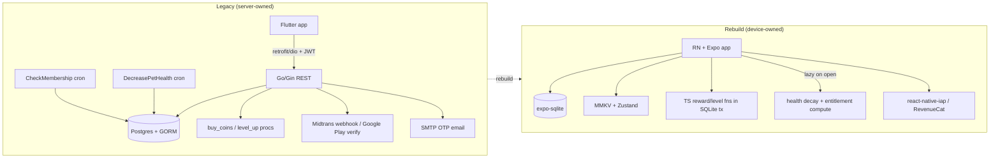
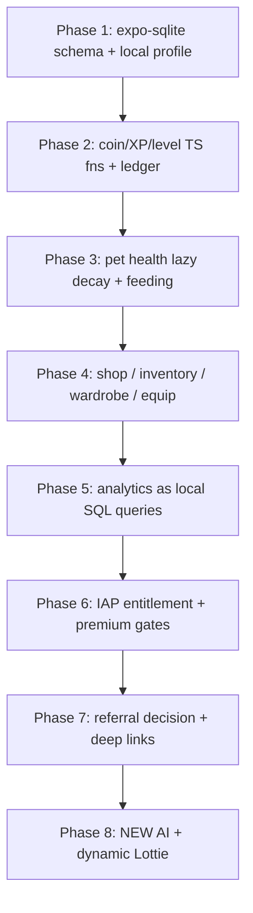

# Backend → Local-First Migration Playbook

> The definitive server→local map: for every responsibility the legacy Go/Postgres backend owned, this document states the exact local-first replacement in the React Native + Expo rebuild — what moves to expo-sqlite, what becomes a lazy on-open computation, what is dropped, and the one thing that genuinely still wants a server.

## Orientation

The legacy backend is a **Go/Gin monolith over Postgres** exposing a flat REST surface, plus two always-on `goroutine` cron loops and a couple of Postgres stored procedures. The Flutter client is effectively **online-first**: its local Floor/SQLite DB registers only 4 entities and is a lossy, under-used cache; nearly every read/write is a network call (legacy: `Pawductivity_App/lib/database/app_database.dart`).

The rebuild inverts this: **the device is the source of truth.** There is no server. Relational data lives in **expo-sqlite**; settings and ephemeral state live in **react-native-mmkv (+ Zustand)**; the two nightly crons become **lazy computations on app open/resume**; auth/email/JWT are **deleted** in favour of a single local profile; and the only responsibility that meaningfully benefits from a backend — **IAP entitlement verification** — is delegated to a store SDK (react-native-iap or RevenueCat), not a server we run.

## Responsibility → local-strategy map (index)

| # | Backend responsibility | Local-first strategy | Tag |
|---|---|---|---|
| 1 | Relational storage (Postgres + GORM, all `/api` reads/writes) | expo-sqlite, single local user | [CHANGE] |
| 2 | Auth: JWT, AES password, bcrypt, email verify, Google Sign-In | Deleted; single local profile | [DROP] |
| 3 | Coin ledger + `buy_coins`/`level_up` stored procs | SQLite transaction + TypeScript functions | [CHANGE] |
| 4 | `DecreasePetHealth` nightly cron | Compute elapsed midnights on open/resume | [CHANGE] |
| 5 | `CheckMembership` nightly cron | Compute entitlement from cached expiry on open | [CHANGE] |
| 6 | IAP receipt verification + Midtrans webhook | Store SDK entitlement (react-native-iap / RevenueCat) | [CHANGE]/[DECIDE] |
| 7 | Referral (links two user accounts) | No faithful local option — invite bonus or defer | [DECIDE] |
| 8 | Analytics endpoints (7-day activity, timeline, summary) | On-device SQLite aggregate queries | [CHANGE] |
| 9 | Server-computed asset paths (pet Lottie / clothes PNG) | Derived client-side in TypeScript from bundled assets | [CHANGE] |
| 10 | Rate limiter, CORS, SMTP email | N/A locally — no network surface | [DROP] |

Details for each follow.

---

## 1. Relational storage → expo-sqlite  [CHANGE]

**Legacy:** All persistent data lives in Postgres, managed by GORM `AutoMigrate` (the effective runtime schema) plus a stale hand-written DDL script (`old/Pawductivity_BE/database/script/pawductivity.sql`). Entity graph is per-user keyed by `userid`, with global catalog tables (`animal`, `food`, `clothes`, `achievement`) shared across users. GORM adds columns the SQL script lacks (`users.current_xp`, `users.needed_xp`, `users.profile_index`, `users.userimage`; `task.tasktag`, `task.duration`, `task.repetition`) — the SQL script is **not** authoritative (legacy: `database/migration/migration.go`).

**Local strategy:**
- One on-device **expo-sqlite** database mirroring the Postgres tables. Because the app is single-user, **drop `userid` from every table** or keep one constant `user` row (id = 1). Pick one convention and apply it everywhere. [DECIDE — see §Open decisions]
- Fold the GORM-vs-SQL schema drift into **one canonical migration** from day one: include `current_xp`, `needed_xp`, `profile_index`, `userimage`, `tasktag`, `duration`, `repetition` explicitly.
- Replace **derived-by-COUNT inventory** (`playerFood`/`wardrobe` = one row per owned item, quantity via `COUNT(*) GROUP BY`; legacy: `internal/repository/food.repository.go`) with **materialized `quantity` columns** — simpler and less fragile.
- Replace Postgres ENUMs (`membershipclass`, `purchaseType`, `clothesType`, `ReminderType`, `SubscriptionStatus`) with **TypeScript string-literal unions + SQLite `CHECK` constraints / app-level validation**.
- Keep DB-level invariants: `coins >= 0`, `price >= 0`, `health >= 0` as `CHECK` constraints.
- **Task versioning** (composite PK `id,userid,version`; edits create `version+1`) exists only to preserve history for a multi-device server. With no sync, task edits can mutate in place. [DECIDE — keep immutable history vs mutate-in-place; see `../data-model/sqlite-schema.md`]

Full table definitions live in **[`../data-model/sqlite-schema.md`](../data-model/sqlite-schema.md)** and the entity graph in **[`../data-model/entity-relationship.md`](../data-model/entity-relationship.md)**. Ephemeral/session state → **[`../data-model/state-and-mmkv.md`](../data-model/state-and-mmkv.md)**.

Ephemeral state that must NOT go in SQLite (belongs in MMKV + Zustand): current selected/active pet id, cached coin balance, live timer state, cached premium status + expiry, onboarding flags, `last_health_update` timestamp.

---

## 2. Auth / JWT / email verify / Google Sign-In → deleted, local profile  [DROP]

**Legacy (all to be deleted):**
- JWT **HS256 with a hardcoded secret literal `"secret"`** in both the middleware and the login controller — verified at `old/Pawductivity_BE/internal/middleware/jwtMiddleware.go:27,52`. Tokens are trivially forgeable; any client can mint another user's token. Claims `{id,email,exp}`, `exp = now + 744h` (31 days).
- Passwords travel **AES-CBC encrypted** with a shared static env `AES_KEY`/`AES_VI`, decrypted server-side, then bcrypt-compared (legacy: `internal/utils/decrypt.utils.go`).
- **Two-phase email signup:** `POST /verify` stores a 4-digit code (15-min TTL) and emails it via Hostinger SMTP; `POST /register` consumes it and provisions the account (legacy: `internal/controllers/users.controller.go`).
- **Google Sign-In** creates users with empty password `''` (such accounts can never password-login — a latent bug).
- **IDOR everywhere:** `/api/user/:id`, `/api/user/level/:id` trust the path `:id` over the JWT identity with no ownership check; `GET /api/users` and `GET /api/membership` return ALL rows; no admin role exists.

**Local strategy:**
- **Delete auth entirely.** Identity = a **single local profile row** created on first launch (name, avatar `profile_index`, `userimage`). No JWT, no password, no AES, no bcrypt, no email, no OTP, no SMTP.
- Signup becomes **instant and local** — part of onboarding, not a network round-trip.
- Optional device-level lock via **expo-local-authentication** (passcode/biometric) if the product wants app-open protection — this is a UI gate, not an account.
- **Do NOT reuse any of the legacy auth model.** If cross-device cloud sync is ever wanted it must be a deliberate new design (see §Genuinely needs a server). Google Sign-In is only relevant if sync is a confirmed requirement. [DECIDE — single-device only vs future sync]

Detail in **[`../../.claude/skills/account-and-profile/SKILL.md`](../../.claude/skills/account-and-profile/SKILL.md)**.

---

## 3. Coin ledger + `buy_coins`/`level_up` → SQLite transaction + TS functions  [CHANGE]

**Legacy:**
- `buy_coins(user_id, amount)` — verified at `pawductivity.sql:221`: `INSERT INTO purchases(userId, price, 'coins')` **+** `UPDATE users SET coins = coins + amount`. It is a pure **grant** (adds coins), reused for the signup grant, task-completion reward, referral reward, AND the `PurchaseCoin` top-up — the last being an unauthenticated free-coin exploit.
- `buy_item(tx, user, price, type)` — `UPDATE users SET coins = coins - price` + `INSERT purchases(price, type)` (legacy: `internal/repository/purchase.repository.go`).
- `level_up(user_id, task_time)` — verified at `pawductivity.sql:183`: `level = level+1, coins = coins + floor(task_time/600)*3`. **This proc is DEAD** — superseded by live XP-curve code in `task.repository.go`. Do not port it.
- **Reward discrepancy (real bug):** on completion the server grants `coins = estimatedTime/60` (whole minutes; `task.repository.go:470`) but the task list **displays** a preview reward of `FLOOR(estimatedTime/60/3)` (`task.repository.go:234`). Display ≠ grant.
- **XP/level:** on the increment that first completes a task, `current_xp += estimatedTime/60`; then `while current_xp >= needed_xp { current_xp -= needed_xp; needed_xp = 10*level² + 50*level + 100; level += 1 }`. Seed defaults `level=1, current_xp=0, needed_xp=150` — but the formula at level 1 yields **160**, and `needed_xp` is recomputed with the **pre-increment `level`**, so the curve is off-by-one (legacy: `task.repository.go:451-454`).
- **Ledger design flaw:** grants and spends are both stored as **positive `price`**, direction implied only by `type` — fragile.

**Local strategy:**
- Reimplement `buy_coins`/`buy_item`/`level_up` as **TypeScript functions inside a single expo-sqlite transaction** (e.g. a Zustand store action `applyTaskReward`): add XP, run the level-up loop, add coins, write one `purchases` ledger row — all atomic. Enforce `coins >= 0` in code + `CHECK`.
- **Fix the reward discrepancy:** pick ONE formula and make preview == grant. Recommended: `coins = floor(estimatedTime_seconds / 60)` (1 coin per estimated minute) and delete the `/3` preview. [DECIDE — canonical reward formula]
- **Fix the XP seed:** seed `needed_xp` from the formula (`10·1²+50·1+100 = 160`), not the literal `150`, and recompute using the correct level. [DECIDE — confirm canonical level curve]
- **Signed ledger:** store grants as positive and spends as negative (or keep typed + a sign column) so the balance is a simple `SUM`.
- The `PurchaseCoin` free-coin exploit **disappears** — real coin top-ups (if any) must go through IAP (§6), not a self-granting call.

Rules and catalogs: **[`../../.claude/skills/coin-economy-and-shop/SKILL.md`](../../.claude/skills/coin-economy-and-shop/SKILL.md)**, **[`../../.claude/skills/gamification-xp-levels/SKILL.md`](../../.claude/skills/gamification-xp-levels/SKILL.md)**.

---

## 4. `DecreasePetHealth` cron → compute elapsed midnights on open/resume  [CHANGE]

**Legacy:** A forever `goroutine` sleeps until the next **server-local midnight**, then runs `UPDATE pet SET health = health - 1 WHERE health > 0` — verified in `old/Pawductivity_BE/internal/routines/decreasePetHealth.routine.go`. So **−1 health/day**, floored at 0 (`CHECK health >= 0`), for every pet. Two bugs: (a) **no catch-up** — if the process is down across several midnights, a pet still loses only 1; (b) **one shared server timezone** for all users.

**Local strategy — lazy computation, no daemon:**
1. Persist a `last_health_update` timestamp (MMKV, mirrored/authoritative per your choice) alongside each pet's health.
2. On **app open and on foreground/resume**, compute the number of **device-local midnights elapsed** since `last_health_update`.
3. `health = max(0, health - midnightsElapsed)`; set `last_health_update = now` (or to the most recent crossed midnight).
4. This **fixes both legacy bugs**: catch-up is inherent (missed days all subtract), and it uses the **device timezone**.
5. Optionally schedule a cosmetic **expo-notifications** reminder ("your companion is getting hungry"), but the **authoritative decay is the lazy computation** — never trust wall-clock ticks or a background job to be the source of truth.

Health cap on feeding stays **100** (`if pet_health + food.stats > 100 → 100`; legacy `animal.repository FeedPet`). What happens at health 0 (die / sad state / block features?) is **undefined in legacy** — it only floors. [DECIDE — health-0 consequence]

Detail in **[`../../.claude/skills/pet-companion-system/SKILL.md`](../../.claude/skills/pet-companion-system/SKILL.md)** and **[`../../.claude/skills/food-and-feeding/SKILL.md`](../../.claude/skills/food-and-feeding/SKILL.md)**.

---

## 5. `CheckMembership` cron → compute entitlement from cached expiry on open  [CHANGE]

**Legacy:** A second forever `goroutine` fires at server-local midnight and runs `UPDATE membership SET class='basic' WHERE class='premium' AND membership_expired_date <= NOW()` — verified in `old/Pawductivity_BE/internal/routines/checkMembership.routine.go`. Downgrades expired premium daily.

**Local strategy — lazy, on read:**
- Store the resolved **entitlement + expiry** in MMKV (`{ isPremium, expiryMillis, autoRenewing, status, lastVerifiedAt }`).
- **No cron.** Whenever entitlement is read (app open, foreground, before gating a feature), evaluate: `isPremium = expiryMillis > Date.now()` (and `status` from the store SDK). If expired and not auto-renewing, flip to basic on the spot.
- This is the exact analogue of the nightly downgrade, computed on demand. It also removes the legacy **race** between the nightly cron and the verify endpoint re-upgrading a user.

Feeds directly into §6 (the entitlement source of truth) and **[`../../.claude/skills/premium-and-monetization/SKILL.md`](../../.claude/skills/premium-and-monetization/SKILL.md)**.

---

## 6. IAP receipt verification + webhook → store SDK entitlement  [CHANGE]/[DECIDE]

> **This is the ONE responsibility that genuinely benefits from a server. Documented honestly below.**

**Legacy — two parallel, partly-contradictory monetization paths (only one is live):**

| Path | Status | Mechanism |
|---|---|---|
| **Google Play subscription** | **LIVE** | Flutter `in_app_purchase` buys product `pawductivity_premium` (package `com.production.pawductivity`), sends `purchaseToken` to `POST /api/subscription/purchase`; backend **server-side verifies** against the Google Play Developer API (`androidpublisher v3`) using a `service_account.json` secret, stores a `subscriptions` row, upserts `membership` to premium with Google's expiry. `GET /api/subscription/verify` re-checks. |
| **Midtrans one-off (IDR)** | **DEAD** | `POST /api/premium/{1-month,6-month,1-year}` (Rp3000 / Rp9000 / Rp15000 for 1/6/12 months) creates a Snap order; an **unauthenticated, signature-unverified webhook** `POST /api/premium/webhook` extends membership. The Flutter UI never calls it. |

**The core problem:** Google Play verification requires the `service_account.json` credential, which **cannot be safely embedded in a client** — extract it and anyone can mint premium. So "verify the receipt yourself, on-device, securely" is **not possible** without either a store-provider service or your own server. This is why IAP is the honest exception to "100% local-first."

**Local strategy — three options (pick one):**

| Option | What it is | Verification | "No backend of our own"? | Recommended when |
|---|---|---|---|---|
| **A. react-native-iap, client-only** | Trust Play Billing's local purchase acknowledgement (`purchaseStateAndroid == purchased`); cache entitlement in MMKV. | **None** (spoofable on rooted devices / replay) | ✅ Fully offline, simplest | Premium unlocks only **low-value cosmetics** (extra pets/foods/clothes + a stats view) — this app's current gate set |
| **B. RevenueCat** *(recommended)* | `react-native-purchases`; RevenueCat holds the Google credential and verifies server-side for you. App calls `getCustomerInfo()` and reads entitlement `premium`. | **Real, server-side** (theirs) | ✅ Yes — no server we operate; gets cross-device restore + offline caching free | Premium unlocks higher-value things (e.g. paid **AI** features), or fraud matters |
| **C. Tiny serverless function** | A Cloud Function / Supabase Edge holds the service account and verifies. | **Real, server-side** (ours, minimal) | ⚠️ Contradicts "no backend" but is a single stateless function, not the old Go monolith | Fraud matters AND we want to own verification |

**Regardless of option:**
- **DROP** the Midtrans path entirely (`/premium/*`, Snap tokens, the unauthenticated webhook, Hostinger confirmation emails). The webhook exploit disappears because the store SDK becomes the source of truth.
- **DROP** admin `/membership` endpoints (no server-side admin). Optionally keep a hidden dev toggle to force-premium for testing.
- On successful purchase, **acknowledge within 3 days** (Android auto-refunds unacknowledged purchases) — RevenueCat does this automatically; react-native-iap requires an explicit `finishTransaction`/acknowledge.
- Implement a **"Restore Purchases"** button (`getAvailablePurchases()` / `restorePurchases()`) since without accounts entitlement is device-scoped.
- Membership **stacking math** (Midtrans `expiry + N months`) is irrelevant for auto-renewing subscriptions — the store manages renewal/expiry. **Drop it; just mirror the store's expiry.**
- Entitlement must be **checkable fully offline** (cached MMKV flag) before deciding whether to unlock a feature or invoke a paid AI call.

**New-app note:** client-side Claude calls (Brain Dump parsing, dynamic AI Lottie) cost real money per request, making **AI the natural high-value premium gate** — far higher-value than legacy cosmetics. If AI becomes premium, fraud tolerance drops and **Option B (RevenueCat) is the stronger pick**, plus per-entitlement rate-limiting of AI calls to cap cost.

Confirmed legacy premium gates (port as-is to a local TS constants file): home statistics container, task-overview weekly progress graph, premium shop items — **Pizza** food, **Rabbit** pet, **Tuxedo / Star Shirt / Pink Dress** clothes.

Deeper options analysis: **[`./monetization-options.md`](./monetization-options.md)** and **[`../../.claude/skills/premium-and-monetization/SKILL.md`](../../.claude/skills/premium-and-monetization/SKILL.md)**.

---

## 7. Referral (needs linked users) → no faithful local option  [DECIDE]

**Legacy:** Each user gets an **8-uppercase-letter A-Z code** at signup (`string(rune(65 + rand.Intn(26)))` ×8, no uniqueness check — verified `internal/repository/user.repository.go:167-174,334-341`). Redeeming someone's code (`POST /api/referral/use`) grants **+100 coins to BOTH** the owner and the redeemer (`referral.repository.go:55-56`), blocks self-redemption, and blocks re-redeeming the *same* code (composite PK) — but does **not** cap redeeming many *different* codes (unlimited coin farming). The coin-grant errors are also silently swallowed (`return nil` regardless), so rewards can vanish while the redemption commits.

**The fundamental constraint:** true two-sided referral **requires a shared identity/ledger across two devices**. A 100%-local app has no shared server to verify a code belongs to a real other user, or to credit that other user's balance. The mutual "+100/+100" **cannot be faithfully reproduced offline.** Be honest about this.

**No-backend options:**

| Option | Behaviour | Notes |
|---|---|---|
| **Drop for v1** *(cleanest)* | Remove referral entirely | Coins are soft currency; no revenue lost |
| **Local invite bonus** *(recommended if kept)* | New user pastes a code **once** during onboarding → grant **this user** +100 coins locally; enforce single-use with an MMKV `referral_redeemed` flag. Frame as a **welcome bonus**, not a mutual reward. The referrer **cannot** be credited (different device). | Self-serve, unverifiable, but low-stakes |
| **Deep-link sharing** | Generate the 8-char code locally, share via **expo-linking + RN Share** as `pawductivity://invite?code=XXXXXXXX`; the receiving app auto-fills the redeem field | Handles distribution without a server; pairs with the invite bonus |
| **Defer to future service** | Keep the code concept dormant; add true tracked referral only if a backend is later built | See §Genuinely needs a server |

**Do not attempt to fake mutual crediting.** Drop the friends-list screen (no cross-user data to show). Anti-abuse is moot locally (nothing shared to protect) — a single MMKV single-use flag suffices.

[DECIDE — drop referral vs local invite bonus vs future service]

Detail in **[`../../.claude/skills/referral-system/SKILL.md`](../../.claude/skills/referral-system/SKILL.md)**.

---

## 8–10. Remaining backend responsibilities

| # | Legacy | Local strategy | Tag |
|---|---|---|---|
| **8. Analytics** | `GetUserActivity`/`TaskSummary` (7-day `generate_series` windows), `GetTaskTimeline` (2-hour buckets 00:00–22:00), `GetCalendarData`, pet-usage `SUM(hoursUsed)/3600` — server SQL. Legacy also fired **Amplitude** events. | Reimplement as **expo-sqlite aggregate queries** (`strftime` date math; `generate_series` → recursive CTE or a client-side day array). Window/`GROUP BY` queries port directly. **DROP Amplitude** (or local-only, privacy-preserving). | [CHANGE] / [DROP] |
| **9. Asset path building** | Server returned `assets/pet/<type>/<type>_<id>.json` and `assets/clothes/<asset>.png` strings to the client. | **Bundle assets in the RN app**; derive paths in TypeScript from `petType` + `clothesId`. For the NEW dynamic-Lottie feature, generate/mutate Lottie JSON client-side via Claude instead of static per-index files. | [CHANGE] |
| **10. Rate limiter / CORS / SMTP** | Per-IP rate limiter (`rate.NewLimiter(5,10)`) — **defined but never wired** (dead). `AllowAllOrigins` CORS. Hostinger SMTP for OTP + confirmation emails. | **N/A** — no network surface locally. Nothing to port. | [DROP] |

Analytics detail: **[`../../.claude/skills/analytics-and-insights/SKILL.md`](../../.claude/skills/analytics-and-insights/SKILL.md)**. Lottie: **[`../../.claude/skills/lottie-animation-engine/SKILL.md`](../../.claude/skills/lottie-animation-engine/SKILL.md)**.

---

## Genuinely needs a server (optional future shortlist)

Everything above is local **except** where a shared/authoritative party is inherent. If the product later demands these, add the **smallest possible** service (serverless functions, not a monolith) — never resurrect the legacy Go server or its `"secret"` JWT model.

| Want | Why a server is unavoidable | Minimal shape |
|---|---|---|
| **Tamper-proof IAP entitlement** | Google Play verification needs a `service_account.json` secret that can't live in the client | RevenueCat (no server we run) **or** one serverless verify function |
| **True two-sided referral** | Must link + credit two distinct accounts across devices | Lightweight identity + ledger service; deep-link attribution |
| **Cross-device / cloud sync & backup** | A shared authoritative store across a user's devices | Sync backend with a *deliberately-designed* auth model (Supabase/Firebase-class) |
| **Server-side receipt anti-fraud (RTDN)** | Real-time revocation on refund/chargeback | Google Play RTDN endpoint (a webhook function) |
| **Push/social features** | Shared state between users | Not in scope today |

None of these are required for the MVP. The MVP is **100% local-first** with IAP delegated to a store SDK.

---

## Phased migration order

Build bottom-up so each phase runs on the phase below it. Auth/email/server are simply never built.

1. **Foundation — data layer.** Canonical expo-sqlite schema (resolving GORM/SQL drift), catalog seed data, single local profile row. No `userid`, no auth. *(§1, §2)*
2. **Economy core.** `buy_coins`/`buy_item`/`level_up` as TS functions in one SQLite transaction; signed ledger; pick the canonical reward + XP formulas. *(§3)*
3. **Pet lifecycle.** Lazy health decay on open/resume from `last_health_update`; feeding cap at 100. *(§4)*
4. **Shop & inventory.** Purchase gating (price, premium gate, no-duplicate-pet), materialized quantity columns, wardrobe equip/unequip. *(§1, §3)*
5. **Insights.** Port the 7-day / timeline / calendar / pet-usage queries to local SQL; drop Amplitude. *(§8)*
6. **Monetization.** Wire react-native-iap or RevenueCat; cache entitlement in MMKV; lazy expiry check; premium gates on stats + premium catalog items; Restore Purchases. *(§5, §6)*
7. **Referral.** Implement the chosen option (drop / local invite bonus / defer) + deep-link sharing. *(§7)*
8. **New capabilities.** Brain Dump NLP → task rows; dynamic AI Lottie; consider AI as the headline premium gate. *(§6 note, NEW)*

---

## Open decisions (roll up to `../02-open-decisions.md`)

- **[DECIDE]** Single local `user` row (id=1) vs fully dropping `userid` from every table.
- **[DECIDE]** Keep task **immutable versioning** locally, or mutate task edits in place (no sync to justify history).
- **[DECIDE]** Canonical coin reward: grant `estimatedTime/60` (recommended) vs the legacy preview `FLOOR(estimatedTime/60/3)` — make preview == grant.
- **[DECIDE]** Canonical XP/level curve: seed `needed_xp` from the formula (160 at L1) and fix the pre-increment recompute, vs preserve legacy quirk.
- **[DECIDE]** New-user starting inventory: legacy handed out **200 coins + a free Cat** via the `buy_coins` bug — intended or not? Define starting balance/pet.
- **[DECIDE]** Keep the `estimatedTime > 600s` (>10 min) task-minimum constraint, or relax it (the Brain Dump parser may produce shorter tasks).
- **[DECIDE]** IAP verification option B (RevenueCat) vs A (client-only) vs C (serverless) — driven by whether AI becomes a premium gate.
- **[DECIDE]** Premium durations/prices for the rebuild — the live Google Play cards (1/3/6 months) disagree with the dead Midtrans catalog (1/6/12 months); confirm real Play Console SKUs.
- **[DECIDE]** Referral: drop for v1 vs local invite bonus vs defer to a future service.
- **[DECIDE]** Single-device only vs eventual cloud sync — determines whether any identity concept survives.
- **[DECIDE]** Health-0 consequence (die / sad / block features) — legacy only floors at 0.

## Related

- [`../data-model/sqlite-schema.md`](../data-model/sqlite-schema.md) — the target local schema
- [`../data-model/entity-relationship.md`](../data-model/entity-relationship.md) — entity graph
- [`../data-model/state-and-mmkv.md`](../data-model/state-and-mmkv.md) — MMKV/Zustand ephemeral state
- [`./monetization-options.md`](./monetization-options.md) — deep IAP/entitlement comparison
- [`./flutter-to-react-native.md`](./flutter-to-react-native.md) — client-side migration
- [`../legacy/backend-api-catalog.md`](../legacy/backend-api-catalog.md) — full legacy endpoint list
- [`../legacy/known-bugs-and-antipatterns.md`](../legacy/known-bugs-and-antipatterns.md) — JWT secret, IDOR, webhook, referral, reward discrepancies
- [`../02-open-decisions.md`](../02-open-decisions.md) — decision register
- Skills: [`local-first-data-layer`](../../.claude/skills/local-first-data-layer/SKILL.md), [`premium-and-monetization`](../../.claude/skills/premium-and-monetization/SKILL.md), [`referral-system`](../../.claude/skills/referral-system/SKILL.md), [`coin-economy-and-shop`](../../.claude/skills/coin-economy-and-shop/SKILL.md), [`account-and-profile`](../../.claude/skills/account-and-profile/SKILL.md), [`legacy-migration-guide`](../../.claude/skills/legacy-migration-guide/SKILL.md)
