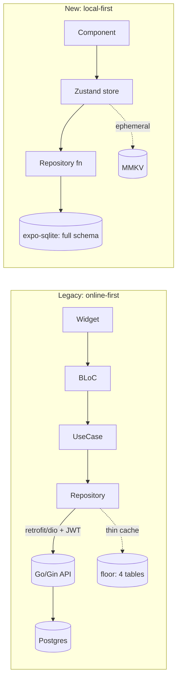

# Flutter → React Native / Expo: Porting Map

> A practical, package-by-package map from the legacy Flutter app to the new React Native + Expo, 100% local-first stack. Read this alongside [`backend-to-local-first.md`](./backend-to-local-first.md), which covers the server-side half of the rebuild.

The legacy app is a Flutter 3.x app (`sdk: >=3.3.4`, `version 1.0.0+1`) that is **online-first**: nearly all reads/writes go over `retrofit`/`dio` to a Go/Gin backend at `https://fcfcvrer.pawductivity.id` (hardcoded `SERVER_URI`), and the on-device `floor` DB is a near-vestigial 4-table cache. The rebuild inverts this: **on-device expo-sqlite is the source of truth, there is no network for app data**, and a single client-side Claude call replaces the manual task-entry forms.

This doc maps *how each Flutter mechanism becomes an RN/Expo one*. It does not restate business rules — those live in the per-subsystem skills and the data-model docs.

---

## 1. TL;DR dependency map

Every row is tagged per [conventions §3](../../CLAUDE.md). Legacy versions are the exact pins from `pubspec.yaml` (legacy: `Pawductivity_App/pubspec.yaml`).

| Legacy Flutter package (pin) | Role in legacy app | New RN/Expo replacement | Tag |
|---|---|---|---|
| `flutter_bloc ^8.1.6` | State management (~20 global BLoCs) | **Zustand** stores + React hooks | [CHANGE] |
| `get_it ^8.0.2` | Service-locator DI (singletons/factories) | **Plain ES module imports** + tiny provider fns; no locator | [CHANGE] |
| `floor ^1.5.0` (+ `floor_generator`) | Local SQLite (only 4 registered entities) | **expo-sqlite** (+ optional Drizzle ORM) — now the *primary* store | [CHANGE] |
| `retrofit ^4.1.0` (+ `retrofit_generator`) | Typed REST client over the Go API | **DELETED** — no network layer at all | [DROP] |
| `dio ^5.4.3+1` | HTTP transport (single interceptor-less `Dio()`) | **DELETED** | [DROP] |
| `http ^1.3.0` | Ad-hoc HTTP (Google auth, misc) | **DELETED** | [DROP] |
| `json_annotation ^4.9.0` | JSON (de)serialization for DTOs | Native TS types + `JSON.parse`; **Zod** for any external JSON | [CHANGE] |
| `flutter_secure_storage ^9.2.2` | K/V store (auth + timer state) — the *real* local state | **react-native-mmkv** for settings/ephemeral state; **expo-secure-store** for true secrets only | [CHANGE] |
| `flutter_local_notifications ^18.0.1` | Local reminder/timer notifications | **expo-notifications** | [CHANGE] |
| `flutter_background_service ^5.1.0` | Foreground service for the live timer | **expo-task-manager / expo-background-task** + **timestamp math** (never trust ticks) | [CHANGE] |
| `permission_handler ^11.3.1` | Runtime permission requests | **expo-notifications** / per-module `requestPermissionsAsync()` | [CHANGE] |
| `lottie ^3.1.2` | Pet companion animations | **lottie-react-native** | [PRESERVE] |
| `fl_chart ^0.69.0` | Stats charts (pie / line / bar) | **RN chart lib — [DECIDE]** (see §7) | [DECIDE] |
| `flutter_svg ^2.0.17` | SVG icons (`assets/icons/*.svg`) | **react-native-svg** (+ `react-native-svg-transformer` to import `.svg`) | [CHANGE] |
| `webview_flutter ^4.8.0` | Midtrans Snap payment WebView | **DELETED** (Midtrans dropped); `react-native-webview` only if a webview is ever needed | [DROP] |
| `in_app_purchase ^3.2.1` | Google Play premium subscriptions | **react-native-iap** or **RevenueCat** — see [`monetization-options.md`](./monetization-options.md) | [CHANGE] |
| `google_sign_in ^6.3.0` | Google OAuth login | **DELETED** — no accounts in MVP (local profile) | [DROP] |
| `amplitude_flutter ^4.0.0` | SaaS analytics (hardcoded key) | **DELETED** (or opt-in on-device metrics table) | [DROP] |
| `encrypt ^5.0.3` | Client-side encryption helper | **DELETED** unless a concrete need remains; use **expo-crypto** if so | [DROP] |
| `flutter_native_splash ^2.4.0` | Splash screen (`#00688b`) | **expo-splash-screen** | [CHANGE] |
| `smooth_page_indicator ^1.2.1` | Carousel dots (dependency, effectively unused) | Onboarding carousel dots — **[NEW]** onboarding, own component | [NEW] |
| `url_launcher ^6.0.20` | Open external URLs | **expo-linking** / **expo-web-browser** | [CHANGE] |
| `path_provider ^2.0.0` | Filesystem paths | **expo-file-system** | [CHANGE] |
| `flutter_hooks ^0.20.5` | Reusable widget logic | Built-in **React hooks** | [CHANGE] |
| `equatable ^2.0.5` | Value equality for BLoC states | Not needed (plain JS objects; Zustand selectors) | [DROP] |
| `intl ^0.19.0` | Number/date formatting (`yyyy-MM-dd`) | **date-fns** (or `Intl` + `expo-localization`) | [CHANGE] |
| `shimmer ^3.0.0` | Loading skeletons (also mis-used as error UI) | RN skeleton (`react-native-reanimated` shimmer or `moti`) | [CHANGE] |
| `flutter_layout_grid ^2.0.7` | Grid layout (debug) | Flexbox / RN `FlatList` columns | [DROP] |
| `cupertino_icons ^1.0.8` | iOS icon font | `@expo/vector-icons` | [CHANGE] |
| — (Navigator + `onGenerateRoute`) | Navigation (dual mechanism) | **expo-router** (file-based) | [CHANGE] |
| — (`ThemeData`, scattered color literals) | Theming (single light theme) | **NativeWind** + design tokens; adds dark mode | [CHANGE]/[NEW] |

---

## 2. State management: `flutter_bloc` → Zustand

The legacy app registers **~20 global `BlocProvider`s** in a `MultiBlocProvider` above `MyApp` (legacy: `Pawductivity_App/lib/main.dart`), each BLoC pairing events → states with an `Equatable` state class, most firing `*_started` / `*_success` / `*_failed` Amplitude events.

**Rebuild pattern:**

| BLoC concept | Zustand equivalent |
|---|---|
| `Bloc<Event, State>` | A store slice created with `create<T>()(...)` |
| `add(SomeEvent())` | Calling a store **action** (`useStore.getState().doThing()`) |
| `emit(NewState())` | `set({ ... })` inside the action |
| `BlocBuilder` / `context.watch` | `useStore(s => s.slice)` selector hook (re-renders on change) |
| `BlocListener` (side effects) | `useEffect` on a selected value, or `store.subscribe` |
| `RemoteXBloc` (network fetch) | An action that runs an **expo-sqlite query** and hydrates state |
| `*_started/_success/_failed` telemetry | **Removed** (Amplitude dropped) [DROP] |

Guidance: **one Zustand store per subsystem** (e.g. `useTaskStore`, `usePetStore`, `useEconomyStore`, `useTimerStore`, `useSummaryStore`), not one god-store. Store actions are the *only* place that writes to SQLite/MMKV; components read via selectors. This mirrors the legacy "BLoC owns the mutation, widget just renders" discipline while dropping the boilerplate. [CHANGE]

> The legacy app registers **both** an old and new task stack simultaneously (`RemoteTaskBloc` + `RemoteTaskBlocOld`, `TaskRepository` + `TaskRepositoryOld`) — a mid-migration duplicate (legacy: `Pawductivity_App/lib/injection_container.dart`). The rebuild ships **one** `useTaskStore`; do not port the `*Old` variants. [DROP]

---

## 3. Dependency injection: `get_it` → module imports

`injection_container.dart` registers every `ApiService` / `Repository` / `UseCase` / `Bloc` as a `get_it` singleton or factory (`sl<T>()` at call sites). In a small local-first app this indirection is unnecessary.

**Rebuild pattern:** [CHANGE]
- **Repositories** (SQLite DAO wrappers) are plain modules exporting functions — `import { insertTask } from '@/db/tasks'`.
- **Cross-cutting singletons** (the SQLite connection, the MMKV instance, the Claude client) are module-level constants created once and imported.
- If a React-context provider is genuinely useful (e.g. a DB handle for tests), use a **thin React Context**, not a service locator.
- The whole retrofit/dio "ApiService" layer that `get_it` wired up is **deleted** (§4); there are no remote data sources to register.

---

## 4. Data layer: `floor` + `retrofit`/`dio` → expo-sqlite (network deleted)

This is the biggest structural change.

**Legacy reality** (legacy: `Pawductivity_App/lib/database/app_database.dart`, `injection_container.dart`):
- `floor` DB v1 registers only **4** entities (`TaskModel`, `FoodModel`, `PetModel`, `UserModel`); `CoinModel`, `ClothesModel`, `ActivityModel` carry `@Entity` but are unregistered → **no table** (dead code).
- A **single bare `Dio()`** with no base-URL override and **no interceptor**; base URL comes from `@RestApi(baseUrl: SERVER_URI)` and the JWT is attached **per-endpoint** via an explicit `@Header('Authorization')` read from secure storage at each call site. No central auth, refresh, or 401 handling.
- All meaningful reads/writes (tasks, pets, shop, summary, user) go to the Go API; local models are **lossy subsets** (e.g. `TaskModel` drops `userid`, `version`, `taskTag`, `repetition`, `duration`, `creationDate`).

**Rebuild:** [CHANGE] / [DROP]
- **Delete the entire retrofit/dio/http layer.** No `ApiService`, no DTOs-over-the-wire, no `Authorization` header. [DROP]
- **expo-sqlite becomes the source of truth**, with the *full* schema (not lossy subsets). The Postgres tables collapse to a single-user on-device DB — see [`../data-model/sqlite-schema.md`](../data-model/sqlite-schema.md). Optionally use **Drizzle** for typed queries/migrations.
- Server-side aggregations (tag-summary, timeline, pet-usage, weekly activity) that were raw SQL in `task.repository.go` become **on-device `GROUP BY` queries** — see [`../data-model/entity-relationship.md`](../data-model/entity-relationship.md) and the analytics skill. Fix the legacy day/month-only limitation while porting.
- Server stored procedures `buy_coins` / `level_up` become **TypeScript store actions inside a single SQLite transaction**. Pick one canonical reward formula (the actual grant `estimatedTime/60` vs the list preview `FLOOR(estimatedTime/60/3)` disagree — a real legacy bug; see [`../legacy/known-bugs-and-antipatterns.md`](../legacy/known-bugs-and-antipatterns.md)). [DECIDE]

See [`backend-to-local-first.md`](./backend-to-local-first.md) for the endpoint-by-endpoint retirement plan.

---

## 5. Local K/V + secrets: `flutter_secure_storage` → MMKV (+ expo-secure-store)

Despite the "vestigial floor DB", the app's **real live client state** lives in `flutter_secure_storage` across ~30 files (legacy: `remote_auth_bloc.dart`, `countdown_manager.dart`, `background_service.dart`). Enumerated keys:

| Legacy secure-storage key | Purpose | New home | Tag |
|---|---|---|---|
| `auth_token` (JWT) | Auth gate ("can I read this key?") | **Deleted** — no accounts in MVP | [DROP] |
| `email` | Account email | Deleted (local profile has no email) | [DROP] |
| `password` (**plaintext!**) | Stored user password — a security defect | **Deleted** — never store passwords | [DROP] |
| `name` | Display name | MMKV profile settings | [CHANGE] |
| `current_task_id` | Active timer's task | MMKV timer slice | [CHANGE] |
| `start_time` | Timer start epoch | MMKV timer slice (timestamp math) | [CHANGE] |
| `locked_pet_id` | Pet bound to the session | MMKV timer slice | [CHANGE] |
| `is_running` | Timer running flag | MMKV timer slice | [CHANGE] |
| `remaining_time` | Countdown value | Derived from timestamps; cache in MMKV | [CHANGE] |
| `task_name` | Active timer label | MMKV timer slice | [CHANGE] |

**Rebuild pattern:** [CHANGE]
- **react-native-mmkv** holds app settings (theme, notification prefs, sound), onboarding/first-run flags, the **active timer state** (running task id, start epoch, accumulated seconds), the pet-health `last_decay_timestamp`, cached premium/subscription status + expiry, and the selected pet id. See [`../data-model/state-and-mmkv.md`](../data-model/state-and-mmkv.md).
- **expo-secure-store** is reserved for genuine secrets only (e.g. a RevenueCat/IAP token or a future cloud credential) — not general app state. In MVP there may be **none**.
- The legacy "auth = can I read `auth_token`" gate and the **plaintext password** persistence are consciously **dropped**, not ported. [DROP]

---

## 6. Timer + notifications: `flutter_background_service` / `flutter_local_notifications`

The Focus Session timer was a foreground service; reminders used local notifications. Both must be re-architected because **wall-clock ticks are unreliable across backgrounding** and the legacy native config is broken.

**Legacy problems to *not* reproduce** (legacy: `android/app/src/main/AndroidManifest.xml`, `home_screen.dart`):
- Foreground service declared `foregroundServiceType="location"` for a *timer* — a Play policy rejection risk.
- A **ghost** `flutter_foreground_task` service in the manifest whose plugin isn't even in `pubspec` (placeholder value `"Whatever idk"`).
- Only `INTERNET` + `FOREGROUND_SERVICE` permissions declared — **missing** `POST_NOTIFICATIONS` (yet `Permission.notification.request()` is called at runtime → silently fails on Android 13+), `WAKE_LOCK`, `RECEIVE_BOOT_COMPLETED` (no reboot rescheduling), and `SCHEDULE_EXACT_ALARM`/`USE_EXACT_ALARM`.
- Background start/stop calls were commented out in the newer `CountdownManager` (mid-migration).

**Rebuild pattern:** [CHANGE]

| Concern | New approach |
|---|---|
| Live Focus Session elapsed time | **Timestamp math**: persist `start_time` (epoch) in MMKV; elapsed = `Date.now() - start_time`. Never accumulate per-tick. |
| Ongoing "focusing" notification | **expo-notifications** sticky/ongoing notification |
| Periodic wake / catch-up | **expo-task-manager** + **expo-background-task** (recompute on wake; don't rely on it for accuracy) |
| Reminders (`reminder` table) | **expo-notifications** scheduled locally; **recompute/reschedule on boot** |
| Reboot recovery | Reschedule notifications on app launch; Expo handles the `RECEIVE_BOOT_COMPLETED` plumbing via config plugin |
| Permissions | Declare correctly via Expo config plugins; request `POST_NOTIFICATIONS` on Android 13+ with a priming screen |
| Foreground-service type | Use the correct FGS type (not `location`); prefer notification-only if a full FGS is avoidable |

See the focus-timer and notifications skills for the full flow. This is the concrete native-config spec the RN rebuild must get right.

---

## 7. Charts: `fl_chart` → [DECIDE]

The Statistics card renders three `fl_chart` charts plus one hand-drawn bar chart (legacy: `statistics_container.dart`, `tag_distribution_chart.dart`, `focus_distribution_chart.dart`, `favorite_pet_chart.dart`, `weekly_activity_chart.dart`):

| Legacy chart | Type | Exact rules to preserve |
|---|---|---|
| Tag Distribution | `fl_chart` PieChart | centerSpaceRadius 40, section radius 30, `sectionsSpace 0`; **5-color palette** `#F5D98F,#98D7C2,#5A9D8F,#EE8572,#DF5E88` cycled by index; legend time fmt `<60s → "n secs"`, `<3600s → "n mins"`, else `"Hh Mm"` |
| Focus Distribution | `fl_chart` LineChart (Day only) | 12 two-hour buckets; `hours = seconds/3600`; `maxY = ceil(maxY/3)*3` (min 3); spots at `x=i*2`, `minX=0 maxX=23`; peak-hour label |
| Favorite Pet podium | Custom + Lottie | rank by `total_usage` desc; heights 140/100/70 for #1/#2/#3, then a row for #4–#5; bg colors Cat `#5D54A4`, Rabbit `#F49CBB`, Dog `#E5D9B6` |
| Weekly Activity | Hand-drawn `Container` bars (not fl_chart) | Y ladder: `<60→1h/0.5h`, `<180→3h/1.5h`, `<360→6h/3h`, else `720min`/`ceil(max/60)*60`; min bar 6px |

**[DECIDE] — pick one RN charting library.** Candidates:
- **victory-native** (XL, Skia-based) — flexible, good for line/pie/bar, heavier.
- **react-native-gifted-charts** — batteries-included pie/bar/line, simplest port.
- **react-native-svg** hand-drawn — matches the legacy bar chart's approach; most control, most code.

Whichever is chosen, **preserve the exact scale rules and the 5-color tag palette** above for parity. The **Favorite Pet podium is effectively custom** (Lottie + layout) regardless of library, and `lottie-react-native` renders the pet animations by rank. Before consuming the analytics skill's data contracts, note the pet-usage `total_usage` sort must be **null-guarded** — the legacy `favorite_pet_chart` crashes the whole card on a null (legacy bug; see [`../legacy/known-bugs-and-antipatterns.md`](../legacy/known-bugs-and-antipatterns.md)).

---

## 8. Animations: `lottie` → `lottie-react-native`

The pet companion is the app's centerpiece: per-species Lottie JSON at 6 evolution states each (`assets/pet/<species>/<species>_default.json`, `_1`..`_5`) for Dog/Cat/Rabbit (legacy: `pubspec.yaml` assets, `assets/pet/*`).

**Rebuild pattern:** [PRESERVE] concept, [CHANGE] package
- **lottie-react-native** renders the bundled JSON; import assets via Metro.
- **[NEW]:** the rebuild adds **client-side Claude-driven dynamic Lottie control** — the pet's animation/mood is selected/mutated on-device from Health/Mood rather than a static `animal.asset` path. See the ai-lottie-director and lottie-animation-engine skills. This has no legacy equivalent.

---

## 9. Navigation: `Navigator` + `onGenerateRoute` → expo-router

The legacy app has **two parallel navigation mechanisms** (legacy: `lib/config/routes/routes.dart`, `lib/theme/app_navbar.dart`, `lib/main.dart`):
1. A `onGenerateRoute` named-route table (`/`, `/register`, `/home`, `/todo`, `/calendar`, `/profile`, `/shop`, `/shop-pet`, `/shop-food`, `/shop-wardrobe`, `/shop-health`).
2. Ad-hoc `Navigator.push(MaterialPageRoute)` calls scattered in pages.

The real shell is a **5-tab bottom `PageView` (`AppNavbar`)** with `initialPage 2`:

| Index | Tab | Legacy screen |
|---|---|---|
| 0 | Todo | `todo_page.dart` |
| 1 | Calendar | `calendar_page.dart` *(diverges from `/calendar`'s `calendar_screen.dart` — a duplicate)* |
| 2 | **Home** (default) | `home_screen.dart` (hosts the Statistics card) |
| 3 | Pet | `pet_home.dart` |
| 4 | Profile | `profile.dart` |

**Rebuild pattern:** [CHANGE]
- **expo-router** (file-based) with a single coherent navigator. A `(tabs)` group reproduces the bottom-tab shell; stack routes handle Shop, Timer, etc.
- **Consolidate the duplicates**: one calendar screen, one shop, one timer — do not port `calendar_page` vs `calendar_screen`, `profile` vs `profile_old`, or the three timer screens.
- **[DECIDE]** the final tab set (the legacy Todo/Calendar/Home/Pet/Profile is a starting point; onboarding, Brain Dump entry, and Focus timer may reshape it).
- Deep links (referral) — the legacy manifest has **no** intent filters; expo-router handles linking config natively. See [`../legacy/navigation-map.md`](../legacy/navigation-map.md) for the full screen graph.

---

## 10. Theming: `ThemeData` + scattered literals → NativeWind + tokens

Legacy theming is minimal: one light `ThemeData` (white scaffold, Poppins font, one `AppBarTheme` with icon/title color `0xFF0C4C60`) (verified legacy: `lib/config/theme/theme.dart`). The **real brand palette is hardcoded as raw color literals** across dozens of widgets and per-feature `styles/` folders — there is **no token system and no dark mode**.

Known brand constants to tokenize (legacy: completeness finding + `theme.dart`):

| Token | Value | Role |
|---|---|---|
| primary (teal) | `#0C4C60` | AppBar icons/titles, primary brand |
| secondary (orange) | `#E28A4B` | accent |
| pet-health yellow | `#FFDA7C` | health bar |
| splash | `#00688b` | native splash background |
| tag palette | `#F5D98F #98D7C2 #5A9D8F #EE8572 #DF5E88` | tag-distribution chart |

**Rebuild pattern:** [CHANGE] + [NEW]
- **NativeWind** (Tailwind for RN) with the brand palette as **design tokens**; extract the scattered literals into one source of truth. See [`../design/brand-and-tokens.md`](../design/brand-and-tokens.md).
- **[NEW]: dark mode** — no legacy equivalent; tokenize light + dark from day one.
- Fonts: **Poppins** (Regular + Bold) via `expo-font`.

---

## 11. Monetization: `in_app_purchase` → react-native-iap / RevenueCat

Premium is bifurcated in the legacy: a **live Google Play IAP path** (`premium.dart` via `in_app_purchase`) **and** a fully-shipped **Midtrans Snap WebView** path (`payment.dart` + `payment_web_view.dart` via `webview_flutter`) that the current flow bypasses (legacy: completeness finding).

**Rebuild pattern:** [CHANGE] / [DROP]
- **Drop the Midtrans/WebView path entirely** (real-money server flow, no backend in MVP). [DROP]
- Keep subscriptions via **react-native-iap** or **RevenueCat**; **cache the resolved entitlement + expiry in MMKV** and degrade to `basic` offline. Server-side receipt verification is the one thing that genuinely wants a backend — documented honestly in [`monetization-options.md`](./monetization-options.md). [CHANGE]/[DECIDE]
- **Google Sign-In is dropped** (no accounts in MVP). [DROP]

---

## 12. Analytics: `amplitude_flutter` → deleted

Amplitude is initialized with a **hardcoded API key** (`a5fb1271...`, a leak) and almost every BLoC fires `*_started/_success/_failed` events; **no `setUserId` is ever called** so events are anonymous device telemetry (legacy: `lib/core/amplitude/setup.dart`, `service.dart`).

**Rebuild pattern:** [DROP]
- **Remove Amplitude entirely** for a true local-first app.
- If any metrics are wanted, use an **opt-in, on-device SQLite metrics table** that never leaves the phone, never carries task titles/tags, and hardcodes no keys.
- The user-facing "insights" the analytics screen showed become **on-device aggregate queries** (§4) — plus a genuinely [NEW] capability: Claude can generate a plain-language weekly insight ("You focused most on Study, peaking around 8 PM") from the local aggregates.

---

## 13. General porting principles

1. **Local-first, not offline-*capable*.** There is no server in MVP; the app must be fully functional with the network off. Do not add "sync later" seams unless a decision explicitly calls for cloud backup ([DECIDE]).
2. **Optimistic by default is free now.** The legacy app awaited server round-trips for every mutation (coins, feeding, purchases). Locally, a store action writes to SQLite in a **single transaction** and updates Zustand synchronously — the UI is instant with no optimistic-rollback machinery. Wrap multi-row mutations (buy item = deduct coins + insert ownership + ledger row) in one transaction so partial failures can't corrupt state.
3. **Timestamps over timers.** Health decay, membership expiry, and the Focus Session all compute from stored timestamps on app open/resume — never a running daemon or per-tick accumulation. See [`backend-to-local-first.md`](./backend-to-local-first.md) §cron.
4. **Materialize what the server used to derive.** Inventory quantity (legacy `COUNT(*)` over one-row-per-item), pet `clothes_asset` (multi-join), and level info were computed server-side. Prefer **real quantity columns** and stored derived fields locally over re-deriving on every read.
5. **Reconcile mid-migration duplicates once.** Old/new task stacks, two calendars, two profiles, three timer screens, two payment surfaces — pick one each; don't port the `*Old` files.
6. **Normalize tags at parse time.** The Brain Dump Parser (Claude) must emit a small, stable set of `tasktag` values and an `estimatedTime`, because every stat divides by / groups on them.

---

## 14. Component-mapping note

There is no 1:1 widget-to-component port, and attempting one wastes effort — Flutter's widget tree and RN's component model differ structurally (no `build()` context inheritance, styling via NativeWind classes not `ThemeData`, layout via flexbox not `Row/Column/Expanded`). Port **screens and flows**, not widgets:

| Flutter | React Native |
|---|---|
| `StatelessWidget` / `StatefulWidget` | Function component + hooks |
| `Scaffold` | Screen container (`View` + `SafeAreaView`) |
| `Row` / `Column` / `Expanded` | `View` with flexbox styles |
| `ListView.builder` | `FlatList` / `FlashList` |
| `PageView` (the navbar) | expo-router `(tabs)` |
| `Container(decoration:)` | `View` + NativeWind classes |
| `Image.asset` / `SvgPicture.asset` | `Image` / `react-native-svg` |
| `showDialog` (shop/feed dialogs) | RN modal (`react-native-modal` or Reanimated bottom sheet) |
| `CircularProgressIndicator` | `ActivityIndicator` |
| `Shimmer` loading | skeleton component (§1) |

Rebuild the UI to the design tokens in [`../design/brand-and-tokens.md`](../design/brand-and-tokens.md), reusing the legacy layouts as reference only.

---

## Related

- [`backend-to-local-first.md`](./backend-to-local-first.md) — the server-retirement half of this migration (endpoints → local queries, cron → timestamp math, auth removed).
- [`monetization-options.md`](./monetization-options.md) — IAP/RevenueCat vs the dropped Midtrans path.
- [`../data-model/sqlite-schema.md`](../data-model/sqlite-schema.md), [`../data-model/state-and-mmkv.md`](../data-model/state-and-mmkv.md), [`../data-model/entity-relationship.md`](../data-model/entity-relationship.md) — the target local schema.
- [`../design/brand-and-tokens.md`](../design/brand-and-tokens.md) — theme tokens replacing `ThemeData`.
- [`../legacy/navigation-map.md`](../legacy/navigation-map.md), [`../legacy/known-bugs-and-antipatterns.md`](../legacy/known-bugs-and-antipatterns.md) — screen graph and the legacy defects called out above.
- Skills: [`../../.claude/skills/local-first-data-layer/SKILL.md`](../../.claude/skills/local-first-data-layer/SKILL.md), [`../../.claude/skills/navigation-and-app-shell/SKILL.md`](../../.claude/skills/navigation-and-app-shell/SKILL.md), [`../../.claude/skills/design-system-and-theming/SKILL.md`](../../.claude/skills/design-system-and-theming/SKILL.md), [`../../.claude/skills/notifications-and-permissions/SKILL.md`](../../.claude/skills/notifications-and-permissions/SKILL.md), [`../../.claude/skills/focus-timer-and-background/SKILL.md`](../../.claude/skills/focus-timer-and-background/SKILL.md), [`../../.claude/skills/analytics-and-insights/SKILL.md`](../../.claude/skills/analytics-and-insights/SKILL.md), [`../../.claude/skills/legacy-migration-guide/SKILL.md`](../../.claude/skills/legacy-migration-guide/SKILL.md).
