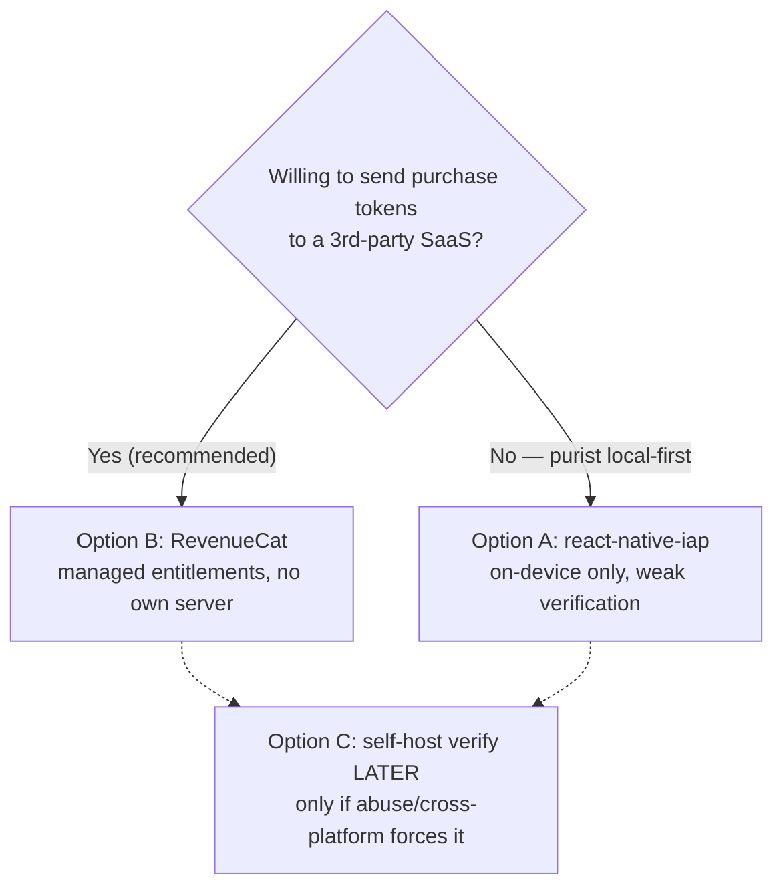
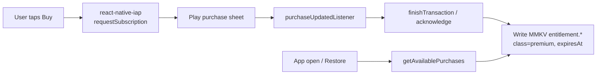
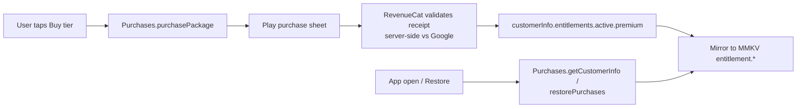
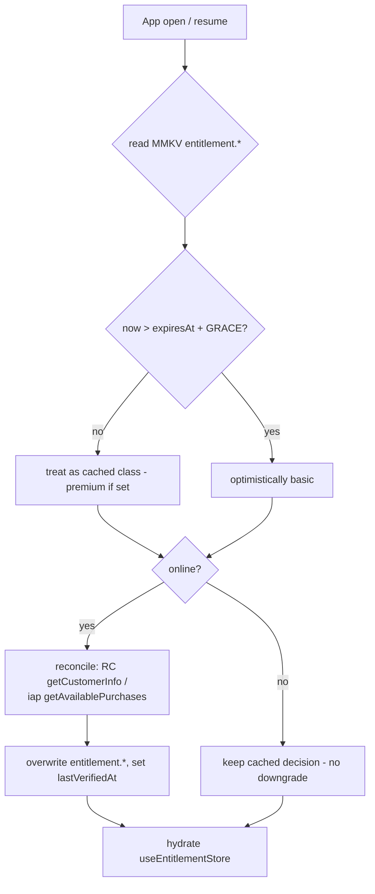

# Monetization Without a Backend — Options & Recommendation

> **Migration deep-dive.** How Pawductivity Premium gets sold and enforced once the entire Go
> server is deleted. The legacy product verified store receipts **server-side**; the rebuild has no
> server. This doc recaps exactly what legacy did (it shipped **two** parallel payment flows),
> then lays out three rebuild options with honest trade-offs, a recommendation, and the open
> `[DECIDE]` points the product owner must resolve.
>
> **Scope boundary.** This doc owns the *sourcing/verification strategy* (where does entitlement
> come from). The **entitlement cache key schema** is owned by
> [`../data-model/state-and-mmkv.md`](../data-model/state-and-mmkv.md) §3f — this doc references it,
> does not redefine it. The *feature-gating rules* (what Premium unlocks, how `basic` degrades) are
> owned by [`../../.claude/skills/premium-and-monetization/SKILL.md`](../../.claude/skills/premium-and-monetization/SKILL.md).
>
> **Provenance note.** The conventions/manifest file and the two finding JSONs named in this file's
> task brief were not on disk at authoring time (their paths resolved to `undefined`; `context/`
> and `.claude/skills/` are partial scaffolds). This document was therefore written **directly
> against the legacy source under `old/`**, with every cited constant verified in code (see
> "Sources & verification"). Change-tags follow the CLAUDE.md §5 legend
> (`[PRESERVE]`/`[CHANGE]`/`[NEW]`/`[DROP]`/`[DECIDE]`). Vocabulary follows
> [`../01-glossary.md`](../01-glossary.md). Reconcile cross-links when the manifest lands.

---

## 0. TL;DR — the recommendation

- **Default choice: RevenueCat (Option B).** It gives managed, cross-store entitlements and
  server-grade receipt validation **without us running a server**, which is the one place the
  local-first rule genuinely bites. It keeps the app-side code tiny and handles restore, grace
  periods, and renewals for us. **Caveat you must accept:** RevenueCat **is a third-party SaaS** —
  purchase tokens and an anonymous app-user id leave the device to RevenueCat's servers. That is a
  real (if narrow) exception to the "nothing leaves the device" ethos, so it is a **[DECIDE]**, not
  a silent default.
- **Privacy-purist fallback: react-native-iap, on-device only (Option A).** Zero third parties
  beyond the store itself, but **no real receipt verification** — entitlement is only as trustworthy
  as the store client on the device. Acceptable *given the stakes* (see §5A), not ideal.
- **Escape hatch: self-host verification later (Option C).** Only if abuse or cross-platform needs
  force it. Explicitly deferred — do **not** build it up front (violates HARD RULE 1 posture).
- Whatever we pick, the **resolved** entitlement (`class`, `expiresAt`) is cached in MMKV and the app
  degrades to `basic` offline — see §9 and state-and-mmkv §3f.



---

## 1. Legacy recap — Pawductivity shipped TWO payment flows

The legacy app monetized Premium via **two independent, simultaneously-shipped** payment paths that
both wrote the **same** `membership` table. This matters: the rebuild only needs to replace the
*outcome* (a `premium` membership with an expiry), not both mechanisms.

| # | Flow | Rails | Server dependency | Rebuild tag |
|---|---|---|---|---|
| 1 | **Google Play Billing** (`in_app_purchase`) | Play Store subscription | Go `subscription.controller.go` verifies via **Google Play Developer API** (`androidpublisher/v3`) using `service_account.json` | `[PRESERVE]` intent · `[CHANGE]` mechanism |
| 2 | **Midtrans Snap** (WebView) | Indonesian PSP, card/e-wallet/bank | Go `premium.controller.go` calls Midtrans Snap API; `/premium/webhook` confirms | `[DROP]` |

Product/tier constants were **inconsistent across the two flows** — a real discrepancy to resolve
(§6).

### 1a. Flow 1 — Google Play Billing + server-side receipt verification `[PRESERVE intent]`

The app used the Flutter `in_app_purchase` plugin through a `SubscriptionHandler` singleton
(legacy: `Pawductivity_App/lib/features/user/presentation/handlers/subscription_handler.dart`):

- Queried **one** product id: `pawductivity_premium` — a single subscription SKU
  (`queryProductDetails({'pawductivity_premium'})`, line 34). The three tiers (1mo/6mo/1yr) did
  **not** exist as distinct Play products in this flow.
- Purchased via `buyNonConsumable(purchaseParam)` (line 64).
- A `purchaseStream` listener caught `PurchaseStatus.purchased` **or** `PurchaseStatus.restored`
  (line 69) and forwarded the `serverVerificationData` **purchase token** + `productID` to the
  backend as `PurchaseSubscriptionEvent` (lines 70–79). The token was **not** stored on device
  ("No need to save token in storage, just send to backend", line 72).
- On app start (splash), `AutoVerifySubscriptionEvent` re-verified the current subscription
  (legacy: `main.dart` splash → `fetchProducts()` + auto-verify).

Server side (legacy: `Pawductivity_BE/internal/controllers/subscription.controller.go`):

- **`POST /api/subscription/purchase`** — loads `service_account.json`
  (`filepath.Join("../service_account.json")`, line 159), authenticates to Google with the
  `AndroidpublisherScope`, and calls
  `service.Purchases.Subscriptions.Get("com.production.pawductivity", "pawductivity_premium", purchaseToken)`
  (lines 183–187). It reads `ExpiryTimeMillis`, derives `status` (`active`/`canceled`/`expired`),
  inserts a `subscriptions` row (`InsertNewSubscription`, "never updates an existing one", line 219),
  and flips `membership` to `premium` with the store expiry (lines 111–124).
- **`GET /api/subscription/verify`** — reads the latest stored subscription; if its `expiry_date`
  has passed, it **re-queries Google Play** for fresh status, updates the row, then sets membership
  to `premium` (if still active) or `basic` (if not) (lines 47–124).

```mermaid
sequenceDiagram
  participant App as Flutter app (in_app_purchase)
  participant Play as Google Play Billing
  participant BE as Go subscription.controller
  participant G as Google Play Developer API
  participant DB as Postgres (membership/subscriptions)
  App->>Play: buyNonConsumable(pawductivity_premium)
  Play-->>App: purchaseStream → purchaseToken
  App->>BE: POST /subscription/purchase {productId, purchaseToken}
  BE->>G: Purchases.Subscriptions.Get(pkg, subId, token) [service_account.json]
  G-->>BE: expiryTimeMillis, cancelReason, autoRenewing
  BE->>DB: INSERT subscription; UPDATE membership=premium(expiry)
  BE-->>App: {status, expiry_date, auto_renewing}
```

**Why this is the crux of the whole doc:** the security value of Flow 1 lived **entirely in the
server** calling Google's Developer API with a secret service account. Delete the server and you
delete the verification. That is the trade-off every option below is navigating.

### 1b. Flow 2 — Midtrans WebView Snap `[DROP]`

A completely separate path (legacy: `Pawductivity_BE/internal/controllers/premium.controller.go`)
sold the **same** Premium via **Midtrans** (an Indonesian payment gateway), presumably in a WebView:

- **`POST /api/premium/{1-month,6-month,1-year}`** → `createOrder()` builds a Midtrans Snap
  transaction (`https://app.midtrans.com/snap/v1/transactions`, line 71) with `MIDTRANS_SERVER_KEY`,
  returns a **snap token + redirect URL**, and writes an `orders` row with status `"pending"`
  (lines 119–128). The app's `PremiumApiService` mapped these to `PremiumPayloadModel`
  (legacy: `.../premium/data/data_sources/remote/premium_api_service.dart`).
- **`POST /api/premium/webhook`** (`MidtransWebhook`) → on `transaction_status` `"capture"` or
  `"settlement"`, `updateMembershipFromOrder()` extends membership by the tier's months and
  **emails a confirmation** via Hostinger SMTP (`sendSuccessEmail`, lines 213–294).
- Product/price table (legacy: `premium.controller.go:42-46`):

  | Key | Product ID | Name | Price (IDR) |
  |---|---|---|---|
  | `1MONTH` | `M-001` | 1 Month Premium Package | 3000 |
  | `6MONTHS` | `M-006` | 6 Months Premium Package | 9000 |
  | `1YEAR` | `Y-001` | 1 Year Premium Package | 15000 |

`[DROP]` **Everything about Flow 2.** Reasons: (a) it is a **web-payment gateway** — using it inside
a Google Play app to unlock digital content violates Play's payments policy (must use Play Billing);
(b) it needs a server (Snap token minting, webhook, order table); (c) it needs SMTP + an email
identity we no longer have (no accounts). The **prices are also placeholder/test values** (3000 IDR
≈ USD 0.19) — do not treat them as real pricing (§6). The *only* thing worth carrying forward from
Flow 2 is the **tier concept** (1/6/12 months), and even that is a **[DECIDE]** (§6).

### 1c. Nightly membership-expiry routine `[CHANGE → lazy-on-open]`

A server goroutine downgraded expired members at server-local midnight
(legacy: `Pawductivity_BE/internal/routines/checkMembership.routine.go:35-37`):

```sql
UPDATE membership SET class = 'basic'
WHERE class = 'premium' AND membership_expired_date <= NOW();
```

`[CHANGE]` This becomes **lazy, timestamp-based catch-up on app open/resume** (no daemon): if
`entitlement.expiresAt <= now`, downgrade `entitlement.class → 'basic'` in MMKV. Already specified in
state-and-mmkv §3g (`maintenance.lastMembershipCheckAt`) and
[`./backend-to-local-first.md`](./backend-to-local-first.md). The same server-cron→on-open pattern
used for pet-health decay.

### 1d. Legacy data model (for reference only — mostly `[DROP]`)

| Table | Key fields | Rebuild disposition |
|---|---|---|
| `membership` | `class` enum(`basic`/`premium`), `membership_expired_date`, unique `userid` | `[CHANGE]` → MMKV `entitlement.class` / `entitlement.expiresAt` (single local user, no `userid`) |
| `subscriptions` | `product_id`, `purchase_token` (unique), `status`(active/canceled/expired), `transaction_id` (unique), `payment_method`='Google Play', `start_date`, `expiry_date`, `auto_renewing` | `[DROP]` as a table. RevenueCat/store holds the source of truth; MMKV caches the resolved result. Keep an **optional** local SQLite `purchase` audit row only if the product wants purchase history **[DECIDE]** |
| `orders` (Midtrans) | `order_id`, `product_type`, price, status | `[DROP]` entirely |
| `archivedSubscription` | history | `[DROP]` |

> Membership stacking behavior worth noting (legacy: `membership.repository.go:56-64`
> `ChangeMembership`): a renewal **extends from the current expiry if still valid, else from now**.
> The store/RevenueCat handles renewal math for us now, so this is informational, not a rule to port.

### 1e. What Premium actually unlocks (the thing being sold) `[PRESERVE]`

Legacy Premium gated four capabilities (legacy:
`.../premium_widget/premium_feature_list.dart:10-15`, plus `premium_feature_lock.dart` on Home):

- **More Pets**, **More Foods**, **More Accessories** (extended catalogs), and **Detailed Summary**
  (richer analytics).

`[PRESERVE]` the *concept* of a Premium tier that unlocks catalog breadth + detailed insights. The
exact gate list is owned by the premium skill and may change; this doc only needs to know Premium is
a **boolean entitlement with an expiry**, which every option below produces.

---

## 2. What the rebuild keeps, changes, and drops

| Legacy behavior | Rebuild disposition | Tag |
|---|---|---|
| Sell Premium via Google Play Billing | Keep — via **react-native-iap or RevenueCat** (HARD RULE 6) | `[PRESERVE]` |
| Single `pawductivity_premium` SKU | Re-model as tiers (base plans) — **[DECIDE]** §6 | `[CHANGE]` |
| Server verifies receipts via Google Play Developer API + `service_account.json` | **No own server.** RevenueCat verifies (B), or trust the store client on-device (A), or defer a server (C) | `[CHANGE]` |
| `subscriptions`/`orders` Postgres tables | Cache **resolved** entitlement in MMKV; optional local purchase log | `[CHANGE]` |
| Nightly membership-expiry cron | Lazy expiry check on app open (state-and-mmkv §3g) | `[CHANGE]` |
| Auto-verify subscription on splash | Resolve entitlement on app open (SDK query + cache) | `[CHANGE]` |
| Restore via `PurchaseStatus.restored` in stream | **Restore Purchases** button + startup restore | `[PRESERVE]` intent |
| Midtrans Snap WebView flow | Delete — Play-policy + server + SMTP | `[DROP]` |
| Confirmation email via SMTP | Delete — no accounts, no email identity | `[DROP]` |
| Placeholder IDR prices (3000/9000/15000) | Set real Play Console pricing — **[DECIDE]** §6 | `[DROP]`/`[DECIDE]` |
| `service_account.json` in repo | Never port a secret into the client | `[DROP]` |

---

## 3. The core constraint: receipt verification is the one thing that wants a server

HARD RULE 6 (CLAUDE.md): *"Store billing is the only remote touchpoint… Server-side receipt
verification is the one thing that genuinely wants a backend — document the trade-off, do not
silently build a server."*

Why verification wants a server, concretely:

1. **Signature/entitlement trust.** A purchase result read purely on-device can be spoofed on a
   rooted device or by a patched store client. Google's authoritative answer ("is this token still
   an active subscription?") comes from the **Play Developer API**, which requires a **secret
   service-account credential** that must **never** ship in the app binary.
2. **Renewal & cancellation truth over time.** Subscriptions renew, lapse, enter billing-retry, get
   refunded, or are cancelled — server-to-server notifications (Google **Real-time Developer
   Notifications**) are the reliable channel. A pure client only learns on next foreground query.
3. **Cross-device / reinstall continuity.** With no accounts, entitlement is tied to the **store
   account** (Google/Apple), which the store itself re-associates on restore — so this is *mostly*
   handled by the store, but a server makes it robust.

The three options differ **only** in *who does the verification*: a managed third party (B), nobody
but the store client (A), or a future server of ours (C).

---

## 4. Options at a glance

| Dimension | **A · react-native-iap (on-device only)** | **B · RevenueCat (recommended)** | **C · self-host verify (later)** |
|---|---|---|---|
| Own server? | No | No | **Yes (deferred)** |
| Third party beyond the store? | **No** | **Yes — RevenueCat SaaS** | No |
| Real receipt verification | **Weak** (trusts store client) | **Strong** (RC validates w/ Google/Apple) | Strong (we validate) |
| Renewal/cancel/refund truth | Poll on foreground only | Webhooks + SDK, handled for us | We must build RTDN handling |
| Restore purchases | `getAvailablePurchases()` | `restorePurchases()` (managed) | store query + our server |
| Cross-platform (future iOS) | Manual, per-store | Unified entitlement | We build both |
| Data leaves device | Only to the store (unavoidable) | Purchase token + anon app-user id → RC | Only to our server |
| App-side complexity | Medium (handle states yourself) | **Low** | Medium + **server to run** |
| Cost | Free (lib) | Free tier, then % of tracked revenue | Server hosting + build time |
| Expo compatibility | Config plugin + dev build (not Expo Go) | `react-native-purchases` config plugin + dev build | N/A app-side; server separate |
| Local-first purity | **Highest** | High (store-only data + one processor) | High (our own server) |
| Verification robustness | **Lowest** | **Highest without our own server** | Highest |

---

## 5. Options in detail

### 5A. Option A — `react-native-iap`, on-device entitlement caching (no server verification)

**Shape.** Use `react-native-iap` to fetch subscription products, launch the Play purchase sheet,
receive the purchase in a listener, **acknowledge** it, and write the resolved `{class:'premium',
expiresAt}` straight into MMKV. On app open and on a "Restore Purchases" tap, call
`getAvailablePurchases()` and recompute entitlement from what the store returns. **No network call
to anyone but the store.**



**Pros**
- **Maximal local-first purity** — the only party that sees a purchase is the store (which is
  unavoidable for any billing).
- No SaaS dependency, no per-revenue fee, no extra privacy surface.
- Full control of the flow and the cache.

**Cons / risks (be honest)**
- **No authoritative verification.** You trust the Play client on the device. On a rooted device or
  with a patched/mocked billing client, `premium` can be forged. There is **no server** asking
  Google "is this token really active?".
- **Client-side signature checks are weak.** react-native-iap can expose the purchase signature, but
  validating it needs the Play **public key embedded in the app** — extractable, and it only proves
  the payload was signed, not that the subscription is currently active/refunded.
- **Renewal/expiry drift.** You only learn about renewals, cancellations, refunds, or billing-retry
  on the next foreground `getAvailablePurchases()`. Between queries the cache can be stale (mitigated
  by the offline-grace model in §8).
- **You own all the edge cases** — pending/deferred purchases, acknowledgement deadlines (Play voids
  an unacknowledged purchase after 3 days), upgrade/downgrade proration, multi-product entitlement
  resolution. RevenueCat handles these for you.
- **Expo:** requires a config plugin and a **dev/production build** (not Expo Go).

**When A is the right call.** When the product owner will not accept **any** third-party processor
beyond the store, *and* accepts that Premium is casually forgeable. Given the **stakes** — a cheap
cosmetic/quality-of-life upgrade on a single-user offline app, no server to protect, no shared
economy to cheat — the abuse incentive is genuinely low, so A is **defensible**. It is simply less
robust than B for the same app-side effort ceiling.

### 5B. Option B — RevenueCat (managed entitlements) — **recommended default**

**Shape.** Integrate `react-native-purchases` (RevenueCat's RN SDK, first-class Expo config plugin).
Define an **entitlement** ("premium") and **Offerings** (the tiers) in the RevenueCat dashboard,
mapped to Play (and later App Store) products. The SDK returns `customerInfo` with
`entitlements.active["premium"]` and an `expirationDate`. RevenueCat **validates receipts
server-side against Google/Apple for us** and exposes the resolved entitlement. We mirror the
resolved result into MMKV for offline reads.



**Pros**
- **Server-grade verification with no server of ours.** This is the precise gap HARD RULE 6 calls
  out, solved without violating "no backend."
- **Restore, renewals, cancellations, refunds, billing-retry, grace periods** are handled by the SDK
  + RevenueCat webhooks. Far fewer edge cases in our code.
- **Cross-platform ready** — one "premium" entitlement works when/if iOS is added (open decision).
- **Minimal app code** — arguably less than A, since RC owns state machines and acknowledgement.
- Free up to a revenue threshold; generous for a small app.

**Cons / trade-offs (be honest)**
- **It IS a third party.** Purchase tokens and an anonymous **app-user id** are sent to RevenueCat's
  servers. That is data leaving the device to a processor **beyond** the store — a real, if narrow,
  departure from "nothing leaves the device." The user's privacy posture makes this a **[DECIDE]**,
  not an automatic yes. Mitigations: use an **anonymous** RC app-user id (no email/name — we have no
  accounts anyway), send no custom attributes, disable ad-attribution collection.
- **Vendor dependency + cost at scale** — a % of tracked revenue past the free tier; an outage on
  RC's side degrades *new* purchase validation (cached entitlement still works offline).
- **Expo:** config plugin + dev/production build (not Expo Go) — same as A.

**Why it is the recommended default.** It resolves the single hardest constraint (trustworthy
verification) while honoring "no server we run," and it shrinks the app-side surface area more than
any other option. The only thing that should override this recommendation is the product owner
deciding the third-party data flow is unacceptable → then fall back to A.

### 5C. Option C — self-host receipt verification later (deferred)

**Shape.** A tiny server (Cloud Function / minimal service) holding the Play service-account
credential, exposing one endpoint the app calls with a purchase token; it queries the Play Developer
API (exactly what legacy `subscription.controller.go` did) and returns a signed entitlement the app
caches. Optionally consume **Real-time Developer Notifications** for renewals.

**Pros**
- Full control, no third-party processor, strong verification.
- Reuses the legacy pattern (we already know it works).

**Cons**
- **Reintroduces a backend** — directly against the local-first posture and HARD RULE 1. It must be
  a conscious product decision, flagged in `context/02-open-decisions.md`, not a quiet default.
- Ops burden: hosting, secret management (`service_account.json`), RTDN handling, uptime — for a
  single narrow purpose that RevenueCat already does.

**When C is the right call.** Only if a concrete need forces it: measurable purchase fraud that
actually costs money, a requirement to avoid *all* third parties **and** get strong verification, or
complex entitlement logic RevenueCat can't express. **Decision: defer.** Ship A or B now; keep C
documented as the escape hatch. The MMKV entitlement cache (§9) is deliberately **source-agnostic**,
so swapping A→B→C later does not touch the rest of the app.

---

## 6. Subscription tiers & product configuration

Legacy carried **two contradictory tier models**: Google Play had a **single** SKU
(`pawductivity_premium`); Midtrans had **three** tiers (M-001 1mo, M-006 6mo, Y-001 1yr). The
rebuild should present the three durations the marketing/UI already imply (the legacy Premium page
selects among plans, defaulting to index 1), modeled cleanly on modern Play Billing.

**Recommended modeling (Google Play Billing v5+):** **one subscription product** with **three base
plans** (auto-renewing billing periods), not three separate products:

| Tier | Billing period | Legacy Midtrans ref | New Play base plan (proposed) |
|---|---|---|---|
| Monthly | P1M | `M-001` (3000 IDR) | `premium-1m` |
| 6-month | P6M | `M-006` (9000 IDR) | `premium-6m` |
| Yearly | P1Y | `Y-001` (15000 IDR) | `premium-1y` |

- In **RevenueCat (B)**: one **entitlement** `premium`, one **Offering** with three **Packages**
  (`$rc_monthly`, a 6-month package, `$rc_annual`) → base plans above.
- In **react-native-iap (A)**: `getSubscriptions([...base plan / product ids...])`; all grant the
  same `premium` boolean; the app picks expiry from whichever is active.

**[DECIDE] — tier structure.** Confirm three durations (1/6/12mo) vs a simpler monthly+annual, and
whether to model as base plans of one product (recommended) or separate products. Owner + store
config decision.

**[DECIDE] — real pricing.** The legacy 3000/9000/15000 IDR values are **placeholder/test prices**
(≈ USD 0.19–0.94) and must not ship. Set real Play Console prices per market (Play auto-localizes).
The 6-month and yearly tiers should undercut the monthly run-rate to incentivize commitment.

**[DECIDE] — free trial / intro offer.** Legacy had none. Play/RevenueCat support intro offers
(e.g., 7-day free trial). Product decision whether to offer one.

---

## 7. Restore Purchases

Because there are **no accounts**, entitlement is bound to the **store account** (Google/Apple), and
"restore" means "re-query the store for this Google account's active purchases." Required for Play
policy and for reinstall/new-device continuity.

- **Trigger points:** a **"Restore Purchases"** button on the Premium/Paywall screen (Play + Apple
  both require this to be discoverable), **and** an automatic silent restore on app open.
- **Option A:** `getAvailablePurchases()` → if an active subscription is present, write MMKV
  entitlement.
- **Option B:** `Purchases.restorePurchases()` / `getCustomerInfo()` → read
  `entitlements.active["premium"]`.
- **No-op is normal:** if the store returns nothing, stay `basic` and show a neutral "no purchases
  found" message (not an error).
- Legacy analog: the `purchaseStream` already handled `PurchaseStatus.restored`
  (subscription_handler.dart:69) and re-verified on the server — same intent, `[PRESERVE]`.

---

## 8. Offline behavior & grace period

The app **must** answer "am I premium?" instantly and offline. The rule:

- **Entitlement resolves from the MMKV cache first** (synchronous at boot), then reconciles with the
  store/RC in the background when online.
- **Grace window `[NEW]`:** treat the user as `premium` until `expiresAt + GRACE`, where `GRACE`
  absorbs (a) transient offline periods, (b) store billing-retry/account-hold states, and (c) minor
  clock skew. Only downgrade to `basic` once `now > expiresAt + GRACE` **and** a fresh online check
  has failed to renew.
  - **[DECIDE] — grace length.** Proposed default **72h** (aligns with Play's short account-hold /
    the 3-day acknowledgement window). RevenueCat can supply its own grace-period signal (B) — prefer
    it when present; the local window is the floor.
- **Never hard-gate offline.** If we cannot reach the store/RC, **do not** revoke a currently-cached
  entitlement — that would punish a paying user on a plane. Downgrade only on a *positive* signal
  that the subscription lapsed, or after grace with a failed online check.
- **Clock-tampering caveat** (same family as the timer's, state-and-mmkv §5): expiry math trusts the
  device clock. A user can extend grace by moving the clock back, but the store's own check corrects
  it on next online reconcile. Low stakes; accept. Cross-ref the timer clock-tamper `[DECIDE]`.

---

## 9. Entitlement cache design (MMKV)

The cache **schema is owned by** [`../data-model/state-and-mmkv.md`](../data-model/state-and-mmkv.md)
§3f — do not fork it. Restated here for convenience (keys under the single `pawductivity` MMKV
instance):

| Key | Type | Meaning | Tag |
|---|---|---|---|
| `entitlement.class` | `'basic' \| 'premium'` | Mirrors legacy `membership.class`; default `basic` | `[CHANGE]` |
| `entitlement.expiresAt` | epoch ms \| `null` | Resolved store/RC expiry; drives lazy expiry (§8) | `[CHANGE]` |
| `entitlement.productId` | string \| `null` | Active tier/base-plan id (informational) | `[CHANGE]` |
| `entitlement.lastVerifiedAt` | epoch ms | Last successful online reconcile; drives re-check cadence | `[CHANGE]` |

Exposed reactively via `useEntitlementStore` (Zustand), source of truth = MMKV
(state-and-mmkv §4). **Design invariants:**

- The cache is a **cache**, not the authority — the **store/RevenueCat is the source of truth**; on
  every successful online reconcile we overwrite the cache.
- The cache is **source-agnostic** — Option A, B, or C all write the *same* four keys, so the rest of
  the app (feature gates, paywall) never knows which verification strategy is behind it. This is what
  makes A→B→C swappable without app-wide churn.
- **Money-adjacent but safe in MMKV** because it is derived/re-verifiable (unlike coins/XP, which are
  authoritative in SQLite — state-and-mmkv §8). Losing this cache just forces a re-verify.



---

## 10. Recommendation

1. **Adopt RevenueCat (Option B)** as the default, pending the product owner accepting the
   third-party data flow (§0, §5B). It uniquely satisfies "trustworthy verification **and** no server
   we operate," and minimizes app-side code.
2. **If the third-party flow is rejected, ship Option A** (`react-native-iap`, on-device cache),
   accepting weaker verification for maximal privacy — defensible given the low abuse stakes.
3. **Keep Option C (self-host) documented and deferred** — build only if abuse or cross-platform
   complexity forces it; it reintroduces a backend and must be an explicit product decision.
4. **Regardless of A/B/C:** model tiers as **1/6/12-month base plans of one subscription product**,
   set **real** Play Console pricing, implement **Restore Purchases** + startup restore, cache the
   **resolved** entitlement in MMKV with a **grace window**, and replace the nightly expiry cron with
   **lazy on-open** downgrade. **Delete the entire Midtrans flow and all SMTP email.**

---

## 11. Open decisions (rolled up to `context/02-open-decisions.md`)

- **[DECIDE] Verification strategy:** RevenueCat (B, recommended) vs on-device-only react-native-iap
  (A) vs future self-host (C). Hinges on accepting RevenueCat as a third-party processor.
- **[DECIDE] Third-party data flow:** Is sending purchase tokens + an anonymous app-user id to
  RevenueCat acceptable under the project's privacy posture? (Gates the choice above.)
- **[DECIDE] Tier structure:** 1/6/12-month vs monthly+annual; base plans of one product
  (recommended) vs separate products.
- **[DECIDE] Real pricing:** replace placeholder 3000/9000/15000 IDR with real, localized Play
  Console prices.
- **[DECIDE] Free trial / intro offer:** none (legacy) vs a 7-day trial or intro price.
- **[DECIDE] Offline grace length:** proposed 72h; confirm, and prefer RevenueCat's grace signal
  when using B.
- **[DECIDE] Local purchase history:** keep an optional SQLite `purchase` audit row, or rely solely
  on the store/RC record?
- **[DECIDE] iOS scope:** if iOS is ever in scope (open product decision), RevenueCat's unified
  entitlement materially lowers the cost — factor into the A-vs-B choice.
- **[DECIDE] Premium feature set:** confirm what `premium` unlocks (legacy: More Pets/Foods/
  Accessories + Detailed Summary) — owned by the premium skill, referenced here.

---

## 12. Cross-links

- [`../data-model/state-and-mmkv.md`](../data-model/state-and-mmkv.md) — §3f entitlement cache keys,
  §3g/§6 lazy membership-expiry on open, §4 `useEntitlementStore`. **Owns the cache schema.**
- [`./backend-to-local-first.md`](./backend-to-local-first.md) — server cron → on-open computation;
  which endpoints survive as remote touchpoints (billing is the only one).
- [`../../.claude/skills/premium-and-monetization/SKILL.md`](../../.claude/skills/premium-and-monetization/SKILL.md)
  — feature-gating rules, paywall UX, `basic` degradation. **Owns what Premium unlocks.**
- [`../../.claude/skills/account-and-profile/SKILL.md`](../../.claude/skills/account-and-profile/SKILL.md)
  — single local user (no `userid`), why there is no account to bind entitlement to.
- [`../legacy/architecture-overview.md`](../legacy/architecture-overview.md) — §10 cross-cutting IAP
  summary; §7 server routines.
- [`../02-open-decisions.md`](../02-open-decisions.md) — the `[DECIDE]` items above.
- CLAUDE.md — HARD RULE 6 (store billing is the only remote touchpoint), §5 change-tag legend.

---

## Sources & verification

All constants verified in legacy source (paths under `old/`):

- **Google Play flow (app):** `Pawductivity_App/lib/features/user/presentation/handlers/subscription_handler.dart`
  — `in_app_purchase`, single product `pawductivity_premium`, `buyNonConsumable`, purchaseStream
  handling `purchased`/`restored`, forwards `serverVerificationData` token to backend.
- **Google Play verify (server):** `Pawductivity_BE/internal/controllers/subscription.controller.go`
  — `service_account.json`, `androidpublisher/v3`, `Purchases.Subscriptions.Get("com.production.pawductivity", "pawductivity_premium", token)`,
  `ExpiryTimeMillis`, status active/canceled/expired, `InsertNewSubscription`, membership premium/basic.
- **Midtrans Snap flow (server):** `Pawductivity_BE/internal/controllers/premium.controller.go`
  — `productList` `M-001`/`M-006`/`Y-001` at 3000/9000/15000 IDR, Snap API
  `https://app.midtrans.com/snap/v1/transactions`, `MIDTRANS_SERVER_KEY`, `orders` pending,
  `MidtransWebhook` on `capture`/`settlement`, `updateMembershipFromOrder`, `sendSuccessEmail` (SMTP).
- **Midtrans flow (app):** `Pawductivity_App/lib/features/premium/data/data_sources/remote/premium_api_service.dart`
  — `POST /api/premium/{1-month,6-month,1-year}` → `PremiumPayloadModel` (snap token).
- **Nightly expiry:** `Pawductivity_BE/internal/routines/checkMembership.routine.go`
  — midnight loop, `UPDATE membership SET class='basic' WHERE class='premium' AND membership_expired_date <= NOW()`.
- **Data model:** `database/migration/model/membership.model.go` (class enum basic/premium,
  `membership_expired_date`, unique `userid`), `subscription.model.go` (product_id, purchase_token
  unique, status check, transaction_id unique, payment_method 'Google Play', auto_renewing),
  `internal/repository/membership.repository.go` (`ChangeMembership` extend-or-start stacking).
- **What Premium unlocks:** `Pawductivity_App/lib/features/user/presentation/widgets/premium_widget/premium_feature_list.dart`
  (More Pets/Foods/Accessories, Detailed Summary); `premium_feature_lock.dart`.
- **Package name:** `com.production.pawductivity` (subscription.controller.go:83,183).

**Caveat:** conventions/manifest and the assigned finding JSONs were absent (resolved to
`undefined`); vocabulary and cross-link targets are best-effort and should be reconciled when those
inputs land.
